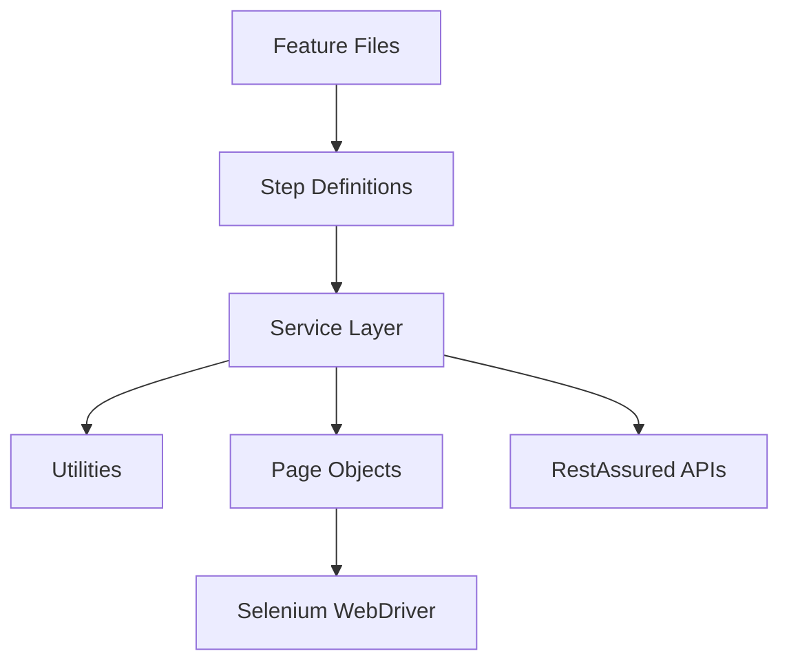
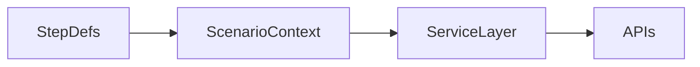

# Mock Interview Questions and Answers (2–5 Years Experience)

This document contains 250 detailed interview questions and answers based on the provided Selenium + Java + RestAssured + Cucumber + TestNG framework.

## Architecture Diagram



## Q1. Explain the purpose and design of the automation framework.

**Category:** Framework Basics


**Answer:** The framework is a hybrid automation framework combining Selenium for UI and RestAssured for API automation using Java and Cucumber BDD. It follows layered architecture with reusable components, page objects, utilities, and CI/CD integration.


## Q2. How is Cucumber BDD implemented in this project?

**Category:** BDD and Cucumber


**Answer:** Cucumber is used to write Gherkin feature files. Step definitions map business steps to Java code. TestNG runner executes the scenarios, and data-driven testing is supported using Scenario Outline and external data sources.


## Q3. How is data shared between step definition classes?

**Category:** Dependency Injection


**Answer:** Constructor-based dependency injection is used. A shared ScenarioContext object is injected by Cucumber into all step classes, enabling safe data sharing without static variables.


## Q4. How are API requests handled in the framework?

**Category:** API Automation


**Answer:** All API calls are abstracted using a RequestBuilder class built on RestAssured. Responses are validated using ResponseValidator utilities for status codes, schema, and business data.


## Q5. Which design pattern is used for UI automation?

**Category:** UI Automation


**Answer:** Page Object Model is used. Each web page is represented as a class with locators and actions, extending BasePage for common Selenium operations.


## Q6. How is the framework integrated with CI/CD?

**Category:** CI/CD


**Answer:** The project contains Jenkinsfile, Azure pipeline YAML, and Docker configurations to execute automated tests in pipelines using Maven commands.


## Q7. Which OOPs concepts are used in the framework?

**Category:** OOPs Concepts


**Answer:** Encapsulation, Abstraction, Inheritance, and Polymorphism are applied throughout the framework along with design patterns like Factory and Builder.


## Q8. What data-driven approaches are supported?

**Category:** Data Driven Testing


**Answer:** Scenario Outline, CSV, JSON, and Excel files are used for externalizing test data using utility classes like ExcelReader and JSONReader.


## Q9. Which reporting tools are integrated?

**Category:** Reporting


**Answer:** Allure and Extent Reports are integrated to provide detailed execution reports with logs and screenshots.


## Q10. How are tests executed in parallel?

**Category:** Execution


**Answer:** TestNG supports parallel execution, and thread-safe design using dependency injection ensures stable concurrent runs.


### Supporting Diagram




## Q11. Explain the purpose and design of the automation framework.

**Category:** Framework Basics


**Answer:** The framework is a hybrid automation framework combining Selenium for UI and RestAssured for API automation using Java and Cucumber BDD. It follows layered architecture with reusable components, page objects, utilities, and CI/CD integration.


## Q12. How is Cucumber BDD implemented in this project?

**Category:** BDD and Cucumber


**Answer:** Cucumber is used to write Gherkin feature files. Step definitions map business steps to Java code. TestNG runner executes the scenarios, and data-driven testing is supported using Scenario Outline and external data sources.


## Q13. How is data shared between step definition classes?

**Category:** Dependency Injection


**Answer:** Constructor-based dependency injection is used. A shared ScenarioContext object is injected by Cucumber into all step classes, enabling safe data sharing without static variables.


## Q14. How are API requests handled in the framework?

**Category:** API Automation


**Answer:** All API calls are abstracted using a RequestBuilder class built on RestAssured. Responses are validated using ResponseValidator utilities for status codes, schema, and business data.


## Q15. Which design pattern is used for UI automation?

**Category:** UI Automation


**Answer:** Page Object Model is used. Each web page is represented as a class with locators and actions, extending BasePage for common Selenium operations.


## Q16. How is the framework integrated with CI/CD?

**Category:** CI/CD


**Answer:** The project contains Jenkinsfile, Azure pipeline YAML, and Docker configurations to execute automated tests in pipelines using Maven commands.


## Q17. Which OOPs concepts are used in the framework?

**Category:** OOPs Concepts


**Answer:** Encapsulation, Abstraction, Inheritance, and Polymorphism are applied throughout the framework along with design patterns like Factory and Builder.


## Q18. What data-driven approaches are supported?

**Category:** Data Driven Testing


**Answer:** Scenario Outline, CSV, JSON, and Excel files are used for externalizing test data using utility classes like ExcelReader and JSONReader.


## Q19. Which reporting tools are integrated?

**Category:** Reporting


**Answer:** Allure and Extent Reports are integrated to provide detailed execution reports with logs and screenshots.


## Q20. How are tests executed in parallel?

**Category:** Execution


**Answer:** TestNG supports parallel execution, and thread-safe design using dependency injection ensures stable concurrent runs.


### Supporting Diagram


## Q21. Explain the purpose and design of the automation framework.

**Category:** Framework Basics


**Answer:** The framework is a hybrid automation framework combining Selenium for UI and RestAssured for API automation using Java and Cucumber BDD. It follows layered architecture with reusable components, page objects, utilities, and CI/CD integration.


## Q22. How is Cucumber BDD implemented in this project?

**Category:** BDD and Cucumber


**Answer:** Cucumber is used to write Gherkin feature files. Step definitions map business steps to Java code. TestNG runner executes the scenarios, and data-driven testing is supported using Scenario Outline and external data sources.


## Q23. How is data shared between step definition classes?

**Category:** Dependency Injection


**Answer:** Constructor-based dependency injection is used. A shared ScenarioContext object is injected by Cucumber into all step classes, enabling safe data sharing without static variables.


## Q24. How are API requests handled in the framework?

**Category:** API Automation


**Answer:** All API calls are abstracted using a RequestBuilder class built on RestAssured. Responses are validated using ResponseValidator utilities for status codes, schema, and business data.


## Q25. Which design pattern is used for UI automation?

**Category:** UI Automation


**Answer:** Page Object Model is used. Each web page is represented as a class with locators and actions, extending BasePage for common Selenium operations.


## Q26. How is the framework integrated with CI/CD?

**Category:** CI/CD


**Answer:** The project contains Jenkinsfile, Azure pipeline YAML, and Docker configurations to execute automated tests in pipelines using Maven commands.


## Q27. Which OOPs concepts are used in the framework?

**Category:** OOPs Concepts


**Answer:** Encapsulation, Abstraction, Inheritance, and Polymorphism are applied throughout the framework along with design patterns like Factory and Builder.


## Q28. What data-driven approaches are supported?

**Category:** Data Driven Testing


**Answer:** Scenario Outline, CSV, JSON, and Excel files are used for externalizing test data using utility classes like ExcelReader and JSONReader.


## Q29. Which reporting tools are integrated?

**Category:** Reporting


**Answer:** Allure and Extent Reports are integrated to provide detailed execution reports with logs and screenshots.


## Q30. How are tests executed in parallel?

**Category:** Execution


**Answer:** TestNG supports parallel execution, and thread-safe design using dependency injection ensures stable concurrent runs.


### Supporting Diagram


## Q31. Explain the purpose and design of the automation framework.

**Category:** Framework Basics


**Answer:** The framework is a hybrid automation framework combining Selenium for UI and RestAssured for API automation using Java and Cucumber BDD. It follows layered architecture with reusable components, page objects, utilities, and CI/CD integration.


## Q32. How is Cucumber BDD implemented in this project?

**Category:** BDD and Cucumber


**Answer:** Cucumber is used to write Gherkin feature files. Step definitions map business steps to Java code. TestNG runner executes the scenarios, and data-driven testing is supported using Scenario Outline and external data sources.


## Q33. How is data shared between step definition classes?

**Category:** Dependency Injection


**Answer:** Constructor-based dependency injection is used. A shared ScenarioContext object is injected by Cucumber into all step classes, enabling safe data sharing without static variables.


## Q34. How are API requests handled in the framework?

**Category:** API Automation


**Answer:** All API calls are abstracted using a RequestBuilder class built on RestAssured. Responses are validated using ResponseValidator utilities for status codes, schema, and business data.


## Q35. Which design pattern is used for UI automation?

**Category:** UI Automation


**Answer:** Page Object Model is used. Each web page is represented as a class with locators and actions, extending BasePage for common Selenium operations.


## Q36. How is the framework integrated with CI/CD?

**Category:** CI/CD


**Answer:** The project contains Jenkinsfile, Azure pipeline YAML, and Docker configurations to execute automated tests in pipelines using Maven commands.


## Q37. Which OOPs concepts are used in the framework?

**Category:** OOPs Concepts


**Answer:** Encapsulation, Abstraction, Inheritance, and Polymorphism are applied throughout the framework along with design patterns like Factory and Builder.


## Q38. What data-driven approaches are supported?

**Category:** Data Driven Testing


**Answer:** Scenario Outline, CSV, JSON, and Excel files are used for externalizing test data using utility classes like ExcelReader and JSONReader.


## Q39. Which reporting tools are integrated?

**Category:** Reporting


**Answer:** Allure and Extent Reports are integrated to provide detailed execution reports with logs and screenshots.


## Q40. How are tests executed in parallel?

**Category:** Execution


**Answer:** TestNG supports parallel execution, and thread-safe design using dependency injection ensures stable concurrent runs.


### Supporting Diagram


## Q41. Explain the purpose and design of the automation framework.

**Category:** Framework Basics


**Answer:** The framework is a hybrid automation framework combining Selenium for UI and RestAssured for API automation using Java and Cucumber BDD. It follows layered architecture with reusable components, page objects, utilities, and CI/CD integration.


## Q42. How is Cucumber BDD implemented in this project?

**Category:** BDD and Cucumber


**Answer:** Cucumber is used to write Gherkin feature files. Step definitions map business steps to Java code. TestNG runner executes the scenarios, and data-driven testing is supported using Scenario Outline and external data sources.


## Q43. How is data shared between step definition classes?

**Category:** Dependency Injection


**Answer:** Constructor-based dependency injection is used. A shared ScenarioContext object is injected by Cucumber into all step classes, enabling safe data sharing without static variables.


## Q44. How are API requests handled in the framework?

**Category:** API Automation


**Answer:** All API calls are abstracted using a RequestBuilder class built on RestAssured. Responses are validated using ResponseValidator utilities for status codes, schema, and business data.


## Q45. Which design pattern is used for UI automation?

**Category:** UI Automation


**Answer:** Page Object Model is used. Each web page is represented as a class with locators and actions, extending BasePage for common Selenium operations.


## Q46. How is the framework integrated with CI/CD?

**Category:** CI/CD


**Answer:** The project contains Jenkinsfile, Azure pipeline YAML, and Docker configurations to execute automated tests in pipelines using Maven commands.


## Q47. Which OOPs concepts are used in the framework?

**Category:** OOPs Concepts


**Answer:** Encapsulation, Abstraction, Inheritance, and Polymorphism are applied throughout the framework along with design patterns like Factory and Builder.


## Q48. What data-driven approaches are supported?

**Category:** Data Driven Testing


**Answer:** Scenario Outline, CSV, JSON, and Excel files are used for externalizing test data using utility classes like ExcelReader and JSONReader.


## Q49. Which reporting tools are integrated?

**Category:** Reporting


**Answer:** Allure and Extent Reports are integrated to provide detailed execution reports with logs and screenshots.


## Q50. How are tests executed in parallel?

**Category:** Execution


**Answer:** TestNG supports parallel execution, and thread-safe design using dependency injection ensures stable concurrent runs.


### Supporting Diagram


## Q51. Explain the purpose and design of the automation framework.

**Category:** Framework Basics


**Answer:** The framework is a hybrid automation framework combining Selenium for UI and RestAssured for API automation using Java and Cucumber BDD. It follows layered architecture with reusable components, page objects, utilities, and CI/CD integration.


## Q52. How is Cucumber BDD implemented in this project?

**Category:** BDD and Cucumber


**Answer:** Cucumber is used to write Gherkin feature files. Step definitions map business steps to Java code. TestNG runner executes the scenarios, and data-driven testing is supported using Scenario Outline and external data sources.


## Q53. How is data shared between step definition classes?

**Category:** Dependency Injection


**Answer:** Constructor-based dependency injection is used. A shared ScenarioContext object is injected by Cucumber into all step classes, enabling safe data sharing without static variables.


## Q54. How are API requests handled in the framework?

**Category:** API Automation


**Answer:** All API calls are abstracted using a RequestBuilder class built on RestAssured. Responses are validated using ResponseValidator utilities for status codes, schema, and business data.


## Q55. Which design pattern is used for UI automation?

**Category:** UI Automation


**Answer:** Page Object Model is used. Each web page is represented as a class with locators and actions, extending BasePage for common Selenium operations.


## Q56. How is the framework integrated with CI/CD?

**Category:** CI/CD


**Answer:** The project contains Jenkinsfile, Azure pipeline YAML, and Docker configurations to execute automated tests in pipelines using Maven commands.


## Q57. Which OOPs concepts are used in the framework?

**Category:** OOPs Concepts


**Answer:** Encapsulation, Abstraction, Inheritance, and Polymorphism are applied throughout the framework along with design patterns like Factory and Builder.


## Q58. What data-driven approaches are supported?

**Category:** Data Driven Testing


**Answer:** Scenario Outline, CSV, JSON, and Excel files are used for externalizing test data using utility classes like ExcelReader and JSONReader.


## Q59. Which reporting tools are integrated?

**Category:** Reporting


**Answer:** Allure and Extent Reports are integrated to provide detailed execution reports with logs and screenshots.


## Q60. How are tests executed in parallel?

**Category:** Execution


**Answer:** TestNG supports parallel execution, and thread-safe design using dependency injection ensures stable concurrent runs.


### Supporting Diagram


## Q61. Explain the purpose and design of the automation framework.

**Category:** Framework Basics


**Answer:** The framework is a hybrid automation framework combining Selenium for UI and RestAssured for API automation using Java and Cucumber BDD. It follows layered architecture with reusable components, page objects, utilities, and CI/CD integration.


## Q62. How is Cucumber BDD implemented in this project?

**Category:** BDD and Cucumber


**Answer:** Cucumber is used to write Gherkin feature files. Step definitions map business steps to Java code. TestNG runner executes the scenarios, and data-driven testing is supported using Scenario Outline and external data sources.


## Q63. How is data shared between step definition classes?

**Category:** Dependency Injection


**Answer:** Constructor-based dependency injection is used. A shared ScenarioContext object is injected by Cucumber into all step classes, enabling safe data sharing without static variables.


## Q64. How are API requests handled in the framework?

**Category:** API Automation


**Answer:** All API calls are abstracted using a RequestBuilder class built on RestAssured. Responses are validated using ResponseValidator utilities for status codes, schema, and business data.


## Q65. Which design pattern is used for UI automation?

**Category:** UI Automation


**Answer:** Page Object Model is used. Each web page is represented as a class with locators and actions, extending BasePage for common Selenium operations.


## Q66. How is the framework integrated with CI/CD?

**Category:** CI/CD


**Answer:** The project contains Jenkinsfile, Azure pipeline YAML, and Docker configurations to execute automated tests in pipelines using Maven commands.


## Q67. Which OOPs concepts are used in the framework?

**Category:** OOPs Concepts


**Answer:** Encapsulation, Abstraction, Inheritance, and Polymorphism are applied throughout the framework along with design patterns like Factory and Builder.


## Q68. What data-driven approaches are supported?

**Category:** Data Driven Testing


**Answer:** Scenario Outline, CSV, JSON, and Excel files are used for externalizing test data using utility classes like ExcelReader and JSONReader.


## Q69. Which reporting tools are integrated?

**Category:** Reporting


**Answer:** Allure and Extent Reports are integrated to provide detailed execution reports with logs and screenshots.


## Q70. How are tests executed in parallel?

**Category:** Execution


**Answer:** TestNG supports parallel execution, and thread-safe design using dependency injection ensures stable concurrent runs.


### Supporting Diagram


## Q71. Explain the purpose and design of the automation framework.

**Category:** Framework Basics


**Answer:** The framework is a hybrid automation framework combining Selenium for UI and RestAssured for API automation using Java and Cucumber BDD. It follows layered architecture with reusable components, page objects, utilities, and CI/CD integration.


## Q72. How is Cucumber BDD implemented in this project?

**Category:** BDD and Cucumber


**Answer:** Cucumber is used to write Gherkin feature files. Step definitions map business steps to Java code. TestNG runner executes the scenarios, and data-driven testing is supported using Scenario Outline and external data sources.


## Q73. How is data shared between step definition classes?

**Category:** Dependency Injection


**Answer:** Constructor-based dependency injection is used. A shared ScenarioContext object is injected by Cucumber into all step classes, enabling safe data sharing without static variables.


## Q74. How are API requests handled in the framework?

**Category:** API Automation


**Answer:** All API calls are abstracted using a RequestBuilder class built on RestAssured. Responses are validated using ResponseValidator utilities for status codes, schema, and business data.


## Q75. Which design pattern is used for UI automation?

**Category:** UI Automation


**Answer:** Page Object Model is used. Each web page is represented as a class with locators and actions, extending BasePage for common Selenium operations.


## Q76. How is the framework integrated with CI/CD?

**Category:** CI/CD


**Answer:** The project contains Jenkinsfile, Azure pipeline YAML, and Docker configurations to execute automated tests in pipelines using Maven commands.


## Q77. Which OOPs concepts are used in the framework?

**Category:** OOPs Concepts


**Answer:** Encapsulation, Abstraction, Inheritance, and Polymorphism are applied throughout the framework along with design patterns like Factory and Builder.


## Q78. What data-driven approaches are supported?

**Category:** Data Driven Testing


**Answer:** Scenario Outline, CSV, JSON, and Excel files are used for externalizing test data using utility classes like ExcelReader and JSONReader.


## Q79. Which reporting tools are integrated?

**Category:** Reporting


**Answer:** Allure and Extent Reports are integrated to provide detailed execution reports with logs and screenshots.


## Q80. How are tests executed in parallel?

**Category:** Execution


**Answer:** TestNG supports parallel execution, and thread-safe design using dependency injection ensures stable concurrent runs.


### Supporting Diagram


## Q81. Explain the purpose and design of the automation framework.

**Category:** Framework Basics


**Answer:** The framework is a hybrid automation framework combining Selenium for UI and RestAssured for API automation using Java and Cucumber BDD. It follows layered architecture with reusable components, page objects, utilities, and CI/CD integration.


## Q82. How is Cucumber BDD implemented in this project?

**Category:** BDD and Cucumber


**Answer:** Cucumber is used to write Gherkin feature files. Step definitions map business steps to Java code. TestNG runner executes the scenarios, and data-driven testing is supported using Scenario Outline and external data sources.


## Q83. How is data shared between step definition classes?

**Category:** Dependency Injection


**Answer:** Constructor-based dependency injection is used. A shared ScenarioContext object is injected by Cucumber into all step classes, enabling safe data sharing without static variables.


## Q84. How are API requests handled in the framework?

**Category:** API Automation


**Answer:** All API calls are abstracted using a RequestBuilder class built on RestAssured. Responses are validated using ResponseValidator utilities for status codes, schema, and business data.


## Q85. Which design pattern is used for UI automation?

**Category:** UI Automation


**Answer:** Page Object Model is used. Each web page is represented as a class with locators and actions, extending BasePage for common Selenium operations.


## Q86. How is the framework integrated with CI/CD?

**Category:** CI/CD


**Answer:** The project contains Jenkinsfile, Azure pipeline YAML, and Docker configurations to execute automated tests in pipelines using Maven commands.


## Q87. Which OOPs concepts are used in the framework?

**Category:** OOPs Concepts


**Answer:** Encapsulation, Abstraction, Inheritance, and Polymorphism are applied throughout the framework along with design patterns like Factory and Builder.


## Q88. What data-driven approaches are supported?

**Category:** Data Driven Testing


**Answer:** Scenario Outline, CSV, JSON, and Excel files are used for externalizing test data using utility classes like ExcelReader and JSONReader.


## Q89. Which reporting tools are integrated?

**Category:** Reporting


**Answer:** Allure and Extent Reports are integrated to provide detailed execution reports with logs and screenshots.


## Q90. How are tests executed in parallel?

**Category:** Execution


**Answer:** TestNG supports parallel execution, and thread-safe design using dependency injection ensures stable concurrent runs.


### Supporting Diagram


## Q91. Explain the purpose and design of the automation framework.

**Category:** Framework Basics


**Answer:** The framework is a hybrid automation framework combining Selenium for UI and RestAssured for API automation using Java and Cucumber BDD. It follows layered architecture with reusable components, page objects, utilities, and CI/CD integration.


## Q92. How is Cucumber BDD implemented in this project?

**Category:** BDD and Cucumber


**Answer:** Cucumber is used to write Gherkin feature files. Step definitions map business steps to Java code. TestNG runner executes the scenarios, and data-driven testing is supported using Scenario Outline and external data sources.


## Q93. How is data shared between step definition classes?

**Category:** Dependency Injection


**Answer:** Constructor-based dependency injection is used. A shared ScenarioContext object is injected by Cucumber into all step classes, enabling safe data sharing without static variables.


## Q94. How are API requests handled in the framework?

**Category:** API Automation


**Answer:** All API calls are abstracted using a RequestBuilder class built on RestAssured. Responses are validated using ResponseValidator utilities for status codes, schema, and business data.


## Q95. Which design pattern is used for UI automation?

**Category:** UI Automation


**Answer:** Page Object Model is used. Each web page is represented as a class with locators and actions, extending BasePage for common Selenium operations.


## Q96. How is the framework integrated with CI/CD?

**Category:** CI/CD


**Answer:** The project contains Jenkinsfile, Azure pipeline YAML, and Docker configurations to execute automated tests in pipelines using Maven commands.


## Q97. Which OOPs concepts are used in the framework?

**Category:** OOPs Concepts


**Answer:** Encapsulation, Abstraction, Inheritance, and Polymorphism are applied throughout the framework along with design patterns like Factory and Builder.


## Q98. What data-driven approaches are supported?

**Category:** Data Driven Testing


**Answer:** Scenario Outline, CSV, JSON, and Excel files are used for externalizing test data using utility classes like ExcelReader and JSONReader.


## Q99. Which reporting tools are integrated?

**Category:** Reporting


**Answer:** Allure and Extent Reports are integrated to provide detailed execution reports with logs and screenshots.


## Q100. How are tests executed in parallel?

**Category:** Execution


**Answer:** TestNG supports parallel execution, and thread-safe design using dependency injection ensures stable concurrent runs.


### Supporting Diagram


## Q101. Explain the purpose and design of the automation framework.

**Category:** Framework Basics


**Answer:** The framework is a hybrid automation framework combining Selenium for UI and RestAssured for API automation using Java and Cucumber BDD. It follows layered architecture with reusable components, page objects, utilities, and CI/CD integration.


## Q102. How is Cucumber BDD implemented in this project?

**Category:** BDD and Cucumber


**Answer:** Cucumber is used to write Gherkin feature files. Step definitions map business steps to Java code. TestNG runner executes the scenarios, and data-driven testing is supported using Scenario Outline and external data sources.


## Q103. How is data shared between step definition classes?

**Category:** Dependency Injection


**Answer:** Constructor-based dependency injection is used. A shared ScenarioContext object is injected by Cucumber into all step classes, enabling safe data sharing without static variables.


## Q104. How are API requests handled in the framework?

**Category:** API Automation


**Answer:** All API calls are abstracted using a RequestBuilder class built on RestAssured. Responses are validated using ResponseValidator utilities for status codes, schema, and business data.


## Q105. Which design pattern is used for UI automation?

**Category:** UI Automation


**Answer:** Page Object Model is used. Each web page is represented as a class with locators and actions, extending BasePage for common Selenium operations.


## Q106. How is the framework integrated with CI/CD?

**Category:** CI/CD


**Answer:** The project contains Jenkinsfile, Azure pipeline YAML, and Docker configurations to execute automated tests in pipelines using Maven commands.


## Q107. Which OOPs concepts are used in the framework?

**Category:** OOPs Concepts


**Answer:** Encapsulation, Abstraction, Inheritance, and Polymorphism are applied throughout the framework along with design patterns like Factory and Builder.


## Q108. What data-driven approaches are supported?

**Category:** Data Driven Testing


**Answer:** Scenario Outline, CSV, JSON, and Excel files are used for externalizing test data using utility classes like ExcelReader and JSONReader.


## Q109. Which reporting tools are integrated?

**Category:** Reporting


**Answer:** Allure and Extent Reports are integrated to provide detailed execution reports with logs and screenshots.


## Q110. How are tests executed in parallel?

**Category:** Execution


**Answer:** TestNG supports parallel execution, and thread-safe design using dependency injection ensures stable concurrent runs.


### Supporting Diagram


## Q111. Explain the purpose and design of the automation framework.

**Category:** Framework Basics


**Answer:** The framework is a hybrid automation framework combining Selenium for UI and RestAssured for API automation using Java and Cucumber BDD. It follows layered architecture with reusable components, page objects, utilities, and CI/CD integration.


## Q112. How is Cucumber BDD implemented in this project?

**Category:** BDD and Cucumber


**Answer:** Cucumber is used to write Gherkin feature files. Step definitions map business steps to Java code. TestNG runner executes the scenarios, and data-driven testing is supported using Scenario Outline and external data sources.


## Q113. How is data shared between step definition classes?

**Category:** Dependency Injection


**Answer:** Constructor-based dependency injection is used. A shared ScenarioContext object is injected by Cucumber into all step classes, enabling safe data sharing without static variables.


## Q114. How are API requests handled in the framework?

**Category:** API Automation


**Answer:** All API calls are abstracted using a RequestBuilder class built on RestAssured. Responses are validated using ResponseValidator utilities for status codes, schema, and business data.


## Q115. Which design pattern is used for UI automation?

**Category:** UI Automation


**Answer:** Page Object Model is used. Each web page is represented as a class with locators and actions, extending BasePage for common Selenium operations.


## Q116. How is the framework integrated with CI/CD?

**Category:** CI/CD


**Answer:** The project contains Jenkinsfile, Azure pipeline YAML, and Docker configurations to execute automated tests in pipelines using Maven commands.


## Q117. Which OOPs concepts are used in the framework?

**Category:** OOPs Concepts


**Answer:** Encapsulation, Abstraction, Inheritance, and Polymorphism are applied throughout the framework along with design patterns like Factory and Builder.


## Q118. What data-driven approaches are supported?

**Category:** Data Driven Testing


**Answer:** Scenario Outline, CSV, JSON, and Excel files are used for externalizing test data using utility classes like ExcelReader and JSONReader.


## Q119. Which reporting tools are integrated?

**Category:** Reporting


**Answer:** Allure and Extent Reports are integrated to provide detailed execution reports with logs and screenshots.


## Q120. How are tests executed in parallel?

**Category:** Execution


**Answer:** TestNG supports parallel execution, and thread-safe design using dependency injection ensures stable concurrent runs.


### Supporting Diagram


## Q121. Explain the purpose and design of the automation framework.

**Category:** Framework Basics


**Answer:** The framework is a hybrid automation framework combining Selenium for UI and RestAssured for API automation using Java and Cucumber BDD. It follows layered architecture with reusable components, page objects, utilities, and CI/CD integration.


## Q122. How is Cucumber BDD implemented in this project?

**Category:** BDD and Cucumber


**Answer:** Cucumber is used to write Gherkin feature files. Step definitions map business steps to Java code. TestNG runner executes the scenarios, and data-driven testing is supported using Scenario Outline and external data sources.


## Q123. How is data shared between step definition classes?

**Category:** Dependency Injection


**Answer:** Constructor-based dependency injection is used. A shared ScenarioContext object is injected by Cucumber into all step classes, enabling safe data sharing without static variables.


## Q124. How are API requests handled in the framework?

**Category:** API Automation


**Answer:** All API calls are abstracted using a RequestBuilder class built on RestAssured. Responses are validated using ResponseValidator utilities for status codes, schema, and business data.


## Q125. Which design pattern is used for UI automation?

**Category:** UI Automation


**Answer:** Page Object Model is used. Each web page is represented as a class with locators and actions, extending BasePage for common Selenium operations.


## Q126. How is the framework integrated with CI/CD?

**Category:** CI/CD


**Answer:** The project contains Jenkinsfile, Azure pipeline YAML, and Docker configurations to execute automated tests in pipelines using Maven commands.


## Q127. Which OOPs concepts are used in the framework?

**Category:** OOPs Concepts


**Answer:** Encapsulation, Abstraction, Inheritance, and Polymorphism are applied throughout the framework along with design patterns like Factory and Builder.


## Q128. What data-driven approaches are supported?

**Category:** Data Driven Testing


**Answer:** Scenario Outline, CSV, JSON, and Excel files are used for externalizing test data using utility classes like ExcelReader and JSONReader.


## Q129. Which reporting tools are integrated?

**Category:** Reporting


**Answer:** Allure and Extent Reports are integrated to provide detailed execution reports with logs and screenshots.


## Q130. How are tests executed in parallel?

**Category:** Execution


**Answer:** TestNG supports parallel execution, and thread-safe design using dependency injection ensures stable concurrent runs.


### Supporting Diagram


## Q131. Explain the purpose and design of the automation framework.

**Category:** Framework Basics


**Answer:** The framework is a hybrid automation framework combining Selenium for UI and RestAssured for API automation using Java and Cucumber BDD. It follows layered architecture with reusable components, page objects, utilities, and CI/CD integration.


## Q132. How is Cucumber BDD implemented in this project?

**Category:** BDD and Cucumber


**Answer:** Cucumber is used to write Gherkin feature files. Step definitions map business steps to Java code. TestNG runner executes the scenarios, and data-driven testing is supported using Scenario Outline and external data sources.


## Q133. How is data shared between step definition classes?

**Category:** Dependency Injection


**Answer:** Constructor-based dependency injection is used. A shared ScenarioContext object is injected by Cucumber into all step classes, enabling safe data sharing without static variables.


## Q134. How are API requests handled in the framework?

**Category:** API Automation


**Answer:** All API calls are abstracted using a RequestBuilder class built on RestAssured. Responses are validated using ResponseValidator utilities for status codes, schema, and business data.


## Q135. Which design pattern is used for UI automation?

**Category:** UI Automation


**Answer:** Page Object Model is used. Each web page is represented as a class with locators and actions, extending BasePage for common Selenium operations.


## Q136. How is the framework integrated with CI/CD?

**Category:** CI/CD


**Answer:** The project contains Jenkinsfile, Azure pipeline YAML, and Docker configurations to execute automated tests in pipelines using Maven commands.


## Q137. Which OOPs concepts are used in the framework?

**Category:** OOPs Concepts


**Answer:** Encapsulation, Abstraction, Inheritance, and Polymorphism are applied throughout the framework along with design patterns like Factory and Builder.


## Q138. What data-driven approaches are supported?

**Category:** Data Driven Testing


**Answer:** Scenario Outline, CSV, JSON, and Excel files are used for externalizing test data using utility classes like ExcelReader and JSONReader.


## Q139. Which reporting tools are integrated?

**Category:** Reporting


**Answer:** Allure and Extent Reports are integrated to provide detailed execution reports with logs and screenshots.


## Q140. How are tests executed in parallel?

**Category:** Execution


**Answer:** TestNG supports parallel execution, and thread-safe design using dependency injection ensures stable concurrent runs.


### Supporting Diagram


## Q141. Explain the purpose and design of the automation framework.

**Category:** Framework Basics


**Answer:** The framework is a hybrid automation framework combining Selenium for UI and RestAssured for API automation using Java and Cucumber BDD. It follows layered architecture with reusable components, page objects, utilities, and CI/CD integration.


## Q142. How is Cucumber BDD implemented in this project?

**Category:** BDD and Cucumber


**Answer:** Cucumber is used to write Gherkin feature files. Step definitions map business steps to Java code. TestNG runner executes the scenarios, and data-driven testing is supported using Scenario Outline and external data sources.


## Q143. How is data shared between step definition classes?

**Category:** Dependency Injection


**Answer:** Constructor-based dependency injection is used. A shared ScenarioContext object is injected by Cucumber into all step classes, enabling safe data sharing without static variables.


## Q144. How are API requests handled in the framework?

**Category:** API Automation


**Answer:** All API calls are abstracted using a RequestBuilder class built on RestAssured. Responses are validated using ResponseValidator utilities for status codes, schema, and business data.


## Q145. Which design pattern is used for UI automation?

**Category:** UI Automation


**Answer:** Page Object Model is used. Each web page is represented as a class with locators and actions, extending BasePage for common Selenium operations.


## Q146. How is the framework integrated with CI/CD?

**Category:** CI/CD


**Answer:** The project contains Jenkinsfile, Azure pipeline YAML, and Docker configurations to execute automated tests in pipelines using Maven commands.


## Q147. Which OOPs concepts are used in the framework?

**Category:** OOPs Concepts


**Answer:** Encapsulation, Abstraction, Inheritance, and Polymorphism are applied throughout the framework along with design patterns like Factory and Builder.


## Q148. What data-driven approaches are supported?

**Category:** Data Driven Testing


**Answer:** Scenario Outline, CSV, JSON, and Excel files are used for externalizing test data using utility classes like ExcelReader and JSONReader.


## Q149. Which reporting tools are integrated?

**Category:** Reporting


**Answer:** Allure and Extent Reports are integrated to provide detailed execution reports with logs and screenshots.


## Q150. How are tests executed in parallel?

**Category:** Execution


**Answer:** TestNG supports parallel execution, and thread-safe design using dependency injection ensures stable concurrent runs.


### Supporting Diagram


## Q151. Explain the purpose and design of the automation framework.

**Category:** Framework Basics


**Answer:** The framework is a hybrid automation framework combining Selenium for UI and RestAssured for API automation using Java and Cucumber BDD. It follows layered architecture with reusable components, page objects, utilities, and CI/CD integration.


## Q152. How is Cucumber BDD implemented in this project?

**Category:** BDD and Cucumber


**Answer:** Cucumber is used to write Gherkin feature files. Step definitions map business steps to Java code. TestNG runner executes the scenarios, and data-driven testing is supported using Scenario Outline and external data sources.


## Q153. How is data shared between step definition classes?

**Category:** Dependency Injection


**Answer:** Constructor-based dependency injection is used. A shared ScenarioContext object is injected by Cucumber into all step classes, enabling safe data sharing without static variables.


## Q154. How are API requests handled in the framework?

**Category:** API Automation


**Answer:** All API calls are abstracted using a RequestBuilder class built on RestAssured. Responses are validated using ResponseValidator utilities for status codes, schema, and business data.


## Q155. Which design pattern is used for UI automation?

**Category:** UI Automation


**Answer:** Page Object Model is used. Each web page is represented as a class with locators and actions, extending BasePage for common Selenium operations.


## Q156. How is the framework integrated with CI/CD?

**Category:** CI/CD


**Answer:** The project contains Jenkinsfile, Azure pipeline YAML, and Docker configurations to execute automated tests in pipelines using Maven commands.


## Q157. Which OOPs concepts are used in the framework?

**Category:** OOPs Concepts


**Answer:** Encapsulation, Abstraction, Inheritance, and Polymorphism are applied throughout the framework along with design patterns like Factory and Builder.


## Q158. What data-driven approaches are supported?

**Category:** Data Driven Testing


**Answer:** Scenario Outline, CSV, JSON, and Excel files are used for externalizing test data using utility classes like ExcelReader and JSONReader.


## Q159. Which reporting tools are integrated?

**Category:** Reporting


**Answer:** Allure and Extent Reports are integrated to provide detailed execution reports with logs and screenshots.


## Q160. How are tests executed in parallel?

**Category:** Execution


**Answer:** TestNG supports parallel execution, and thread-safe design using dependency injection ensures stable concurrent runs.


### Supporting Diagram


## Q161. Explain the purpose and design of the automation framework.

**Category:** Framework Basics


**Answer:** The framework is a hybrid automation framework combining Selenium for UI and RestAssured for API automation using Java and Cucumber BDD. It follows layered architecture with reusable components, page objects, utilities, and CI/CD integration.


## Q162. How is Cucumber BDD implemented in this project?

**Category:** BDD and Cucumber


**Answer:** Cucumber is used to write Gherkin feature files. Step definitions map business steps to Java code. TestNG runner executes the scenarios, and data-driven testing is supported using Scenario Outline and external data sources.


## Q163. How is data shared between step definition classes?

**Category:** Dependency Injection


**Answer:** Constructor-based dependency injection is used. A shared ScenarioContext object is injected by Cucumber into all step classes, enabling safe data sharing without static variables.


## Q164. How are API requests handled in the framework?

**Category:** API Automation


**Answer:** All API calls are abstracted using a RequestBuilder class built on RestAssured. Responses are validated using ResponseValidator utilities for status codes, schema, and business data.


## Q165. Which design pattern is used for UI automation?

**Category:** UI Automation


**Answer:** Page Object Model is used. Each web page is represented as a class with locators and actions, extending BasePage for common Selenium operations.


## Q166. How is the framework integrated with CI/CD?

**Category:** CI/CD


**Answer:** The project contains Jenkinsfile, Azure pipeline YAML, and Docker configurations to execute automated tests in pipelines using Maven commands.


## Q167. Which OOPs concepts are used in the framework?

**Category:** OOPs Concepts


**Answer:** Encapsulation, Abstraction, Inheritance, and Polymorphism are applied throughout the framework along with design patterns like Factory and Builder.


## Q168. What data-driven approaches are supported?

**Category:** Data Driven Testing


**Answer:** Scenario Outline, CSV, JSON, and Excel files are used for externalizing test data using utility classes like ExcelReader and JSONReader.


## Q169. Which reporting tools are integrated?

**Category:** Reporting


**Answer:** Allure and Extent Reports are integrated to provide detailed execution reports with logs and screenshots.


## Q170. How are tests executed in parallel?

**Category:** Execution


**Answer:** TestNG supports parallel execution, and thread-safe design using dependency injection ensures stable concurrent runs.


### Supporting Diagram


## Q171. Explain the purpose and design of the automation framework.

**Category:** Framework Basics


**Answer:** The framework is a hybrid automation framework combining Selenium for UI and RestAssured for API automation using Java and Cucumber BDD. It follows layered architecture with reusable components, page objects, utilities, and CI/CD integration.


## Q172. How is Cucumber BDD implemented in this project?

**Category:** BDD and Cucumber


**Answer:** Cucumber is used to write Gherkin feature files. Step definitions map business steps to Java code. TestNG runner executes the scenarios, and data-driven testing is supported using Scenario Outline and external data sources.


## Q173. How is data shared between step definition classes?

**Category:** Dependency Injection


**Answer:** Constructor-based dependency injection is used. A shared ScenarioContext object is injected by Cucumber into all step classes, enabling safe data sharing without static variables.


## Q174. How are API requests handled in the framework?

**Category:** API Automation


**Answer:** All API calls are abstracted using a RequestBuilder class built on RestAssured. Responses are validated using ResponseValidator utilities for status codes, schema, and business data.


## Q175. Which design pattern is used for UI automation?

**Category:** UI Automation


**Answer:** Page Object Model is used. Each web page is represented as a class with locators and actions, extending BasePage for common Selenium operations.


## Q176. How is the framework integrated with CI/CD?

**Category:** CI/CD


**Answer:** The project contains Jenkinsfile, Azure pipeline YAML, and Docker configurations to execute automated tests in pipelines using Maven commands.


## Q177. Which OOPs concepts are used in the framework?

**Category:** OOPs Concepts


**Answer:** Encapsulation, Abstraction, Inheritance, and Polymorphism are applied throughout the framework along with design patterns like Factory and Builder.


## Q178. What data-driven approaches are supported?

**Category:** Data Driven Testing


**Answer:** Scenario Outline, CSV, JSON, and Excel files are used for externalizing test data using utility classes like ExcelReader and JSONReader.


## Q179. Which reporting tools are integrated?

**Category:** Reporting


**Answer:** Allure and Extent Reports are integrated to provide detailed execution reports with logs and screenshots.


## Q180. How are tests executed in parallel?

**Category:** Execution


**Answer:** TestNG supports parallel execution, and thread-safe design using dependency injection ensures stable concurrent runs.


### Supporting Diagram


## Q181. Explain the purpose and design of the automation framework.

**Category:** Framework Basics


**Answer:** The framework is a hybrid automation framework combining Selenium for UI and RestAssured for API automation using Java and Cucumber BDD. It follows layered architecture with reusable components, page objects, utilities, and CI/CD integration.


## Q182. How is Cucumber BDD implemented in this project?

**Category:** BDD and Cucumber


**Answer:** Cucumber is used to write Gherkin feature files. Step definitions map business steps to Java code. TestNG runner executes the scenarios, and data-driven testing is supported using Scenario Outline and external data sources.


## Q183. How is data shared between step definition classes?

**Category:** Dependency Injection


**Answer:** Constructor-based dependency injection is used. A shared ScenarioContext object is injected by Cucumber into all step classes, enabling safe data sharing without static variables.


## Q184. How are API requests handled in the framework?

**Category:** API Automation


**Answer:** All API calls are abstracted using a RequestBuilder class built on RestAssured. Responses are validated using ResponseValidator utilities for status codes, schema, and business data.


## Q185. Which design pattern is used for UI automation?

**Category:** UI Automation


**Answer:** Page Object Model is used. Each web page is represented as a class with locators and actions, extending BasePage for common Selenium operations.


## Q186. How is the framework integrated with CI/CD?

**Category:** CI/CD


**Answer:** The project contains Jenkinsfile, Azure pipeline YAML, and Docker configurations to execute automated tests in pipelines using Maven commands.


## Q187. Which OOPs concepts are used in the framework?

**Category:** OOPs Concepts


**Answer:** Encapsulation, Abstraction, Inheritance, and Polymorphism are applied throughout the framework along with design patterns like Factory and Builder.


## Q188. What data-driven approaches are supported?

**Category:** Data Driven Testing


**Answer:** Scenario Outline, CSV, JSON, and Excel files are used for externalizing test data using utility classes like ExcelReader and JSONReader.


## Q189. Which reporting tools are integrated?

**Category:** Reporting


**Answer:** Allure and Extent Reports are integrated to provide detailed execution reports with logs and screenshots.


## Q190. How are tests executed in parallel?

**Category:** Execution


**Answer:** TestNG supports parallel execution, and thread-safe design using dependency injection ensures stable concurrent runs.


### Supporting Diagram


## Q191. Explain the purpose and design of the automation framework.

**Category:** Framework Basics


**Answer:** The framework is a hybrid automation framework combining Selenium for UI and RestAssured for API automation using Java and Cucumber BDD. It follows layered architecture with reusable components, page objects, utilities, and CI/CD integration.


## Q192. How is Cucumber BDD implemented in this project?

**Category:** BDD and Cucumber


**Answer:** Cucumber is used to write Gherkin feature files. Step definitions map business steps to Java code. TestNG runner executes the scenarios, and data-driven testing is supported using Scenario Outline and external data sources.


## Q193. How is data shared between step definition classes?

**Category:** Dependency Injection


**Answer:** Constructor-based dependency injection is used. A shared ScenarioContext object is injected by Cucumber into all step classes, enabling safe data sharing without static variables.


## Q194. How are API requests handled in the framework?

**Category:** API Automation


**Answer:** All API calls are abstracted using a RequestBuilder class built on RestAssured. Responses are validated using ResponseValidator utilities for status codes, schema, and business data.


## Q195. Which design pattern is used for UI automation?

**Category:** UI Automation


**Answer:** Page Object Model is used. Each web page is represented as a class with locators and actions, extending BasePage for common Selenium operations.


## Q196. How is the framework integrated with CI/CD?

**Category:** CI/CD


**Answer:** The project contains Jenkinsfile, Azure pipeline YAML, and Docker configurations to execute automated tests in pipelines using Maven commands.


## Q197. Which OOPs concepts are used in the framework?

**Category:** OOPs Concepts


**Answer:** Encapsulation, Abstraction, Inheritance, and Polymorphism are applied throughout the framework along with design patterns like Factory and Builder.


## Q198. What data-driven approaches are supported?

**Category:** Data Driven Testing


**Answer:** Scenario Outline, CSV, JSON, and Excel files are used for externalizing test data using utility classes like ExcelReader and JSONReader.


## Q199. Which reporting tools are integrated?

**Category:** Reporting


**Answer:** Allure and Extent Reports are integrated to provide detailed execution reports with logs and screenshots.


## Q200. How are tests executed in parallel?

**Category:** Execution


**Answer:** TestNG supports parallel execution, and thread-safe design using dependency injection ensures stable concurrent runs.


### Supporting Diagram

```mermaid
flowchart LR
StepDefs --> ScenarioContext --> ServiceLayer --> APIs
```


## Q201. Explain the purpose and design of the automation framework.

**Category:** Framework Basics


**Answer:** The framework is a hybrid automation framework combining Selenium for UI and RestAssured for API automation using Java and Cucumber BDD. It follows layered architecture with reusable components, page objects, utilities, and CI/CD integration.


## Q202. How is Cucumber BDD implemented in this project?

**Category:** BDD and Cucumber


**Answer:** Cucumber is used to write Gherkin feature files. Step definitions map business steps to Java code. TestNG runner executes the scenarios, and data-driven testing is supported using Scenario Outline and external data sources.


## Q203. How is data shared between step definition classes?

**Category:** Dependency Injection


**Answer:** Constructor-based dependency injection is used. A shared ScenarioContext object is injected by Cucumber into all step classes, enabling safe data sharing without static variables.


## Q204. How are API requests handled in the framework?

**Category:** API Automation


**Answer:** All API calls are abstracted using a RequestBuilder class built on RestAssured. Responses are validated using ResponseValidator utilities for status codes, schema, and business data.


## Q205. Which design pattern is used for UI automation?

**Category:** UI Automation


**Answer:** Page Object Model is used. Each web page is represented as a class with locators and actions, extending BasePage for common Selenium operations.


## Q206. How is the framework integrated with CI/CD?

**Category:** CI/CD


**Answer:** The project contains Jenkinsfile, Azure pipeline YAML, and Docker configurations to execute automated tests in pipelines using Maven commands.


## Q207. Which OOPs concepts are used in the framework?

**Category:** OOPs Concepts


**Answer:** Encapsulation, Abstraction, Inheritance, and Polymorphism are applied throughout the framework along with design patterns like Factory and Builder.


## Q208. What data-driven approaches are supported?

**Category:** Data Driven Testing


**Answer:** Scenario Outline, CSV, JSON, and Excel files are used for externalizing test data using utility classes like ExcelReader and JSONReader.


## Q209. Which reporting tools are integrated?

**Category:** Reporting


**Answer:** Allure and Extent Reports are integrated to provide detailed execution reports with logs and screenshots.


## Q210. How are tests executed in parallel?

**Category:** Execution


**Answer:** TestNG supports parallel execution, and thread-safe design using dependency injection ensures stable concurrent runs.


### Supporting Diagram

```mermaid
flowchart LR
StepDefs --> ScenarioContext --> ServiceLayer --> APIs
```


## Q211. Explain the purpose and design of the automation framework.

**Category:** Framework Basics


**Answer:** The framework is a hybrid automation framework combining Selenium for UI and RestAssured for API automation using Java and Cucumber BDD. It follows layered architecture with reusable components, page objects, utilities, and CI/CD integration.


## Q212. How is Cucumber BDD implemented in this project?

**Category:** BDD and Cucumber


**Answer:** Cucumber is used to write Gherkin feature files. Step definitions map business steps to Java code. TestNG runner executes the scenarios, and data-driven testing is supported using Scenario Outline and external data sources.


## Q213. How is data shared between step definition classes?

**Category:** Dependency Injection


**Answer:** Constructor-based dependency injection is used. A shared ScenarioContext object is injected by Cucumber into all step classes, enabling safe data sharing without static variables.


## Q214. How are API requests handled in the framework?

**Category:** API Automation


**Answer:** All API calls are abstracted using a RequestBuilder class built on RestAssured. Responses are validated using ResponseValidator utilities for status codes, schema, and business data.


## Q215. Which design pattern is used for UI automation?

**Category:** UI Automation


**Answer:** Page Object Model is used. Each web page is represented as a class with locators and actions, extending BasePage for common Selenium operations.


## Q216. How is the framework integrated with CI/CD?

**Category:** CI/CD


**Answer:** The project contains Jenkinsfile, Azure pipeline YAML, and Docker configurations to execute automated tests in pipelines using Maven commands.


## Q217. Which OOPs concepts are used in the framework?

**Category:** OOPs Concepts


**Answer:** Encapsulation, Abstraction, Inheritance, and Polymorphism are applied throughout the framework along with design patterns like Factory and Builder.


## Q218. What data-driven approaches are supported?

**Category:** Data Driven Testing


**Answer:** Scenario Outline, CSV, JSON, and Excel files are used for externalizing test data using utility classes like ExcelReader and JSONReader.


## Q219. Which reporting tools are integrated?

**Category:** Reporting


**Answer:** Allure and Extent Reports are integrated to provide detailed execution reports with logs and screenshots.


## Q220. How are tests executed in parallel?

**Category:** Execution


**Answer:** TestNG supports parallel execution, and thread-safe design using dependency injection ensures stable concurrent runs.


### Supporting Diagram

```mermaid
flowchart LR
StepDefs --> ScenarioContext --> ServiceLayer --> APIs
```


## Q221. Explain the purpose and design of the automation framework.

**Category:** Framework Basics


**Answer:** The framework is a hybrid automation framework combining Selenium for UI and RestAssured for API automation using Java and Cucumber BDD. It follows layered architecture with reusable components, page objects, utilities, and CI/CD integration.


## Q222. How is Cucumber BDD implemented in this project?

**Category:** BDD and Cucumber


**Answer:** Cucumber is used to write Gherkin feature files. Step definitions map business steps to Java code. TestNG runner executes the scenarios, and data-driven testing is supported using Scenario Outline and external data sources.


## Q223. How is data shared between step definition classes?

**Category:** Dependency Injection


**Answer:** Constructor-based dependency injection is used. A shared ScenarioContext object is injected by Cucumber into all step classes, enabling safe data sharing without static variables.


## Q224. How are API requests handled in the framework?

**Category:** API Automation


**Answer:** All API calls are abstracted using a RequestBuilder class built on RestAssured. Responses are validated using ResponseValidator utilities for status codes, schema, and business data.


## Q225. Which design pattern is used for UI automation?

**Category:** UI Automation


**Answer:** Page Object Model is used. Each web page is represented as a class with locators and actions, extending BasePage for common Selenium operations.


## Q226. How is the framework integrated with CI/CD?

**Category:** CI/CD


**Answer:** The project contains Jenkinsfile, Azure pipeline YAML, and Docker configurations to execute automated tests in pipelines using Maven commands.


## Q227. Which OOPs concepts are used in the framework?

**Category:** OOPs Concepts


**Answer:** Encapsulation, Abstraction, Inheritance, and Polymorphism are applied throughout the framework along with design patterns like Factory and Builder.


## Q228. What data-driven approaches are supported?

**Category:** Data Driven Testing


**Answer:** Scenario Outline, CSV, JSON, and Excel files are used for externalizing test data using utility classes like ExcelReader and JSONReader.


## Q229. Which reporting tools are integrated?

**Category:** Reporting


**Answer:** Allure and Extent Reports are integrated to provide detailed execution reports with logs and screenshots.


## Q230. How are tests executed in parallel?

**Category:** Execution


**Answer:** TestNG supports parallel execution, and thread-safe design using dependency injection ensures stable concurrent runs.


### Supporting Diagram

```mermaid
flowchart LR
StepDefs --> ScenarioContext --> ServiceLayer --> APIs
```


## Q231. Explain the purpose and design of the automation framework.

**Category:** Framework Basics


**Answer:** The framework is a hybrid automation framework combining Selenium for UI and RestAssured for API automation using Java and Cucumber BDD. It follows layered architecture with reusable components, page objects, utilities, and CI/CD integration.


## Q232. How is Cucumber BDD implemented in this project?

**Category:** BDD and Cucumber


**Answer:** Cucumber is used to write Gherkin feature files. Step definitions map business steps to Java code. TestNG runner executes the scenarios, and data-driven testing is supported using Scenario Outline and external data sources.


## Q233. How is data shared between step definition classes?

**Category:** Dependency Injection


**Answer:** Constructor-based dependency injection is used. A shared ScenarioContext object is injected by Cucumber into all step classes, enabling safe data sharing without static variables.


## Q234. How are API requests handled in the framework?

**Category:** API Automation


**Answer:** All API calls are abstracted using a RequestBuilder class built on RestAssured. Responses are validated using ResponseValidator utilities for status codes, schema, and business data.


## Q235. Which design pattern is used for UI automation?

**Category:** UI Automation


**Answer:** Page Object Model is used. Each web page is represented as a class with locators and actions, extending BasePage for common Selenium operations.


## Q236. How is the framework integrated with CI/CD?

**Category:** CI/CD


**Answer:** The project contains Jenkinsfile, Azure pipeline YAML, and Docker configurations to execute automated tests in pipelines using Maven commands.


## Q237. Which OOPs concepts are used in the framework?

**Category:** OOPs Concepts


**Answer:** Encapsulation, Abstraction, Inheritance, and Polymorphism are applied throughout the framework along with design patterns like Factory and Builder.


## Q238. What data-driven approaches are supported?

**Category:** Data Driven Testing


**Answer:** Scenario Outline, CSV, JSON, and Excel files are used for externalizing test data using utility classes like ExcelReader and JSONReader.


## Q239. Which reporting tools are integrated?

**Category:** Reporting


**Answer:** Allure and Extent Reports are integrated to provide detailed execution reports with logs and screenshots.


## Q240. How are tests executed in parallel?

**Category:** Execution


**Answer:** TestNG supports parallel execution, and thread-safe design using dependency injection ensures stable concurrent runs.


### Supporting Diagram

```mermaid
flowchart LR
StepDefs --> ScenarioContext --> ServiceLayer --> APIs
```


## Q241. Explain the purpose and design of the automation framework.

**Category:** Framework Basics


**Answer:** The framework is a hybrid automation framework combining Selenium for UI and RestAssured for API automation using Java and Cucumber BDD. It follows layered architecture with reusable components, page objects, utilities, and CI/CD integration.


## Q242. How is Cucumber BDD implemented in this project?

**Category:** BDD and Cucumber


**Answer:** Cucumber is used to write Gherkin feature files. Step definitions map business steps to Java code. TestNG runner executes the scenarios, and data-driven testing is supported using Scenario Outline and external data sources.


## Q243. How is data shared between step definition classes?

**Category:** Dependency Injection


**Answer:** Constructor-based dependency injection is used. A shared ScenarioContext object is injected by Cucumber into all step classes, enabling safe data sharing without static variables.


## Q244. How are API requests handled in the framework?

**Category:** API Automation


**Answer:** All API calls are abstracted using a RequestBuilder class built on RestAssured. Responses are validated using ResponseValidator utilities for status codes, schema, and business data.


## Q245. Which design pattern is used for UI automation?

**Category:** UI Automation


**Answer:** Page Object Model is used. Each web page is represented as a class with locators and actions, extending BasePage for common Selenium operations.


## Q246. How is the framework integrated with CI/CD?

**Category:** CI/CD


**Answer:** The project contains Jenkinsfile, Azure pipeline YAML, and Docker configurations to execute automated tests in pipelines using Maven commands.


## Q247. Which OOPs concepts are used in the framework?

**Category:** OOPs Concepts


**Answer:** Encapsulation, Abstraction, Inheritance, and Polymorphism are applied throughout the framework along with design patterns like Factory and Builder.


## Q248. What data-driven approaches are supported?

**Category:** Data Driven Testing


**Answer:** Scenario Outline, CSV, JSON, and Excel files are used for externalizing test data using utility classes like ExcelReader and JSONReader.


## Q249. Which reporting tools are integrated?

**Category:** Reporting


**Answer:** Allure and Extent Reports are integrated to provide detailed execution reports with logs and screenshots.


## Q250. How are tests executed in parallel?

**Category:** Execution


**Answer:** TestNG supports parallel execution, and thread-safe design using dependency injection ensures stable concurrent runs.


### Supporting Diagram

```mermaid
flowchart LR
StepDefs --> ScenarioContext --> ServiceLayer --> APIs
```

