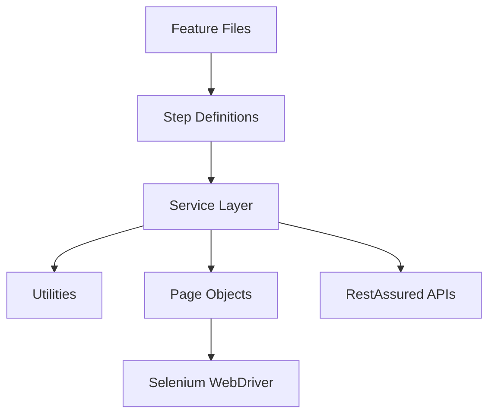
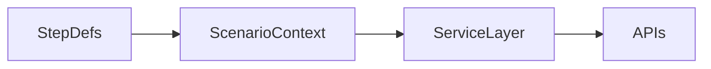

# Architecture Explanation Video Script

---

## Opening (0:20)

Hi, in this video I will explain the architecture of my automation framework and how it supports both UI and API automation using BDD principles.

This framework is built using Java, Selenium, RestAssured, Cucumber, and TestNG, and is designed to be scalable, reusable, and CI/CD ready.

---

## High Level Overview (0:45)

At a high level, this is a hybrid automation framework.

Hybrid means:

- It supports UI automation using Selenium  
- It supports API automation using RestAssured  
- And both are integrated under a single Cucumber BDD layer  

All test scenarios are written in Gherkin feature files, which makes the framework business-friendly and easy to understand.

---

## Layered Architecture Explanation (1:00)

The framework follows a clean layered architecture:

1. Feature Files  
2. Step Definitions  
3. Service Layer  
4. Utility Layer  
5. Base Layer  
6. Execution Layer  

Let me explain each layer one by one.

---

## Feature Files Layer (0:40)

The topmost layer is the Feature Files layer.

Here we write test scenarios in plain English using Gherkin syntax.

For example:

- Login scenarios  
- End-to-end booking flows  
- Negative test cases  
- API validation scenarios  

These feature files act as the single source of truth for business requirements.

---

## Step Definitions Layer (0:50)

Below feature files we have the Step Definitions layer.

This layer converts Gherkin steps into executable Java code.

The step definition classes:

- Read input from feature files  
- Call API service methods  
- Call UI page object methods  
- Perform validations  

Importantly, the step definitions do not contain Selenium or RestAssured code directly.  
That logic is abstracted to lower layers.

---

## Dependency Injection – ScenarioContext (1:00)

To share data between steps, we use constructor-based dependency injection.

Cucumber automatically provides a shared ScenarioContext object to all step definition classes.

This allows us to:

- Pass data between steps  
- Store API responses  
- Share dynamic values like IDs and tokens  
- Avoid static variables  

This design makes the framework:

- Thread safe  
- Parallel execution friendly  
- Clean and maintainable  

---

## API Automation Layer (1:00)

Now coming to the API Automation layer.

All API interactions are handled using RestAssured.

We have a dedicated service layer consisting of:

- RequestBuilder – to construct API requests  
- ResponseValidator – to validate API responses  
- APIBase – common API configurations  
- Logging filters  

This abstraction ensures that step definitions remain simple and readable, while all API complexity is centralized.

---

## UI Automation Layer – Page Object Model (1:00)

For UI automation, the framework follows the Page Object Model design pattern.

All web pages are implemented as Java classes under the pages package.

For example:

- LoginPage  
- HomePage  
- BookingPage  

Each page class contains:

- Web element locators  
- Business methods  
- Reusable UI actions  

Driver management is handled by DriverFactory, and smart waits are implemented using WaitFactory.

---

## Utility Layer (0:45)

The framework has a rich utility layer which provides reusable components such as:

- ExcelReader for Excel data  
- JSONReader and CSV utilities  
- FakerUtil for dynamic test data  
- LoggerUtil for logging  
- DB utilities  
- Accessibility and visual testing helpers  

This keeps the core automation code clean and reusable.

---

## Test Execution Layer (0:40)

For execution, we use:

- TestNG as the test runner  
- Maven as the build tool  
- Cucumber for BDD integration  

Tests can be executed through:

- IDE  
- Maven commands  
- Jenkins pipelines  
- Docker containers  

Parallel execution and retry mechanisms are also supported.

---

## Reporting (0:30)

The framework supports multiple reporting tools:

- Allure Reports  
- Extent Reports  

After every execution we get:

- Detailed test results  
- Screenshots  
- Logs  
- Execution trends  

---

## CI/CD Integration (0:45)

This framework is fully CI/CD ready.

It includes:

- Jenkinsfile for Jenkins pipelines  
- Azure DevOps pipeline configuration  
- Dockerfile and docker-compose  

So tests can run:

- On local machines  
- In Jenkins  
- In cloud pipelines  
- Inside Docker containers  

This makes it enterprise-ready.

---

## OOPs & Design Patterns (0:40)

From a design perspective, the framework uses:

OOPs principles like:

- Encapsulation  
- Abstraction  
- Inheritance  
- Polymorphism  

And design patterns such as:

- Page Object Model  
- Factory Pattern  
- Builder Pattern  
- Dependency Injection  

---

## Closing Summary (0:30)

To summarize:

This is a modern, scalable hybrid automation framework that supports UI, API, and BDD automation with strong architecture principles and full CI/CD integration.

Thank you for watching.

---

### End of Script


# Automation Framework – Detailed Implementation Analysis

This document explains in simple and clear terms what has been implemented in the uploaded repository. The explanation is written in interview-ready format and describes the architecture, tools, patterns, and concepts used.

---

## 1. Overall Framework Type

This repository implements a **Hybrid Automation Framework** that supports:

- Selenium UI Automation  
- RestAssured API Automation  
- Cucumber BDD  
- TestNG  
- Maven  
- Allure and Extent Reporting  
- Data Driven Testing (Excel, CSV, JSON)  
- CI/CD integration (Jenkins, Azure, Docker)

The framework supports both:

👉 UI Automation + API Automation in a single unified structure

---

## 2. Core Technologies Used

| Layer | Technology |
|-----|-----------|
| Language | Java |
| UI Automation | Selenium WebDriver |
| API Automation | RestAssured |
| BDD | Cucumber |
| Test Runner | TestNG |
| Build Tool | Maven |
| Reporting | Allure, Extent Reports |
| Logging | Log4j2 |
| CI/CD | Jenkins, Azure Pipelines |
| Containerization | Docker |
| Data Driven | CSV, JSON, Excel (Apache POI) |
| Utilities | Faker, DB, Accessibility, Visual testing |

---

## 3. Framework Architecture

The project follows a clean layered architecture:

```
features  → step definitions → service layer → utilities → base layer → selenium/restassured
```

Main packages:

- api – API request builders and validators  
- base – Base classes for tests and pages  
- pages – Page Object Model classes  
- utils – Common reusable utilities  
- context – ScenarioContext for DI  
- stepdefinitions – Cucumber step classes  
- runners – Cucumber TestNG runner  

This clearly indicates a well-structured enterprise automation framework.

---

## 4. Dependency Injection Implementation

The framework uses **Constructor-Based Dependency Injection**.

Example from the repository:

```java
public class AdvancedStepDefs {

    private final ScenarioContext context;

    public AdvancedStepDefs(ScenarioContext context) {
        this.context = context;
    }
}
```

### What This Means

We use constructor-based dependency injection where Cucumber automatically provides a shared ScenarioContext object to all step definition classes, allowing us to pass data between steps without using static variables.

### Benefits

- Loose coupling  
- Parallel execution safe  
- No static variables  
- Clean sharing of test data  
- Better maintainability  

This confirms that PicoContainer is NOT used. Instead, modern native Cucumber DI is implemented.

---

## 5. ScenarioContext – Shared Data Container

`ScenarioContext.java` is used as a central object to store:

- API responses  
- Tokens  
- Dynamic data  
- IDs generated during execution  

This allows steps from different classes to communicate easily.

---

## 6. Design Patterns Used

The following design patterns are clearly implemented:

### a) Page Object Model (POM)

All UI pages are implemented under:

```
src/main/java/pages
```

Examples:

- LoginPage.java  
- HomePage.java  
- BookingPage.java  

UI actions are encapsulated inside page classes.

---

### b) Factory Pattern

`DriverFactory.java` handles WebDriver creation dynamically.

---

### c) Builder Pattern

`RequestBuilder.java` is used to build API requests in a reusable manner.

---

### d) Singleton / Centralized Objects

ConfigReader and ScenarioContext act as shared single objects.

---

## 7. OOPs Concepts Used

### Encapsulation

- Private WebElements in page classes  
- Data hidden inside utility classes  
- Access only through public methods  

### Abstraction

- API interactions hidden inside RequestBuilder  
- Selenium actions abstracted via BasePage  

### Inheritance

- BaseTest  
- BasePage  
- APIBase  

### Polymorphism

- Overloaded methods in utilities  
- Interface-based design  

---

## 8. API Automation Layer

Under:

```
src/main/java/api
```

We have:

- RequestBuilder.java – builds API requests  
- ResponseValidator.java – validates responses  
- CustomLogFilter.java – logging for APIs  

This shows:

- Clean separation of API logic  
- Reusable API framework  
- Centralized validations  

---

## 9. Data Driven Testing

Multiple data driven techniques are implemented:

### Sources:

- CSV files  
- JSON files  
- Excel files  
- Feature file Examples tables  

Utilities used:

- CSVReaderUtil  
- JSONReader  
- ExcelReader  

This enables:

- Scenario Outline  
- Externalized test data  
- Large scale test coverage  

---

## 10. Cucumber BDD Implementation

Feature files located at:

```
src/test/resources/features
```

Step Definitions at:

```
src/test/java/stepdefinitions
```

Runner:

```
TestRunner.java
```

Tags, hooks, and reporting are configured.

---

## 11. Test Execution Layer

- TestNG used as execution engine  
- Parallel execution supported  
- Retry mechanism implemented  
- Hooks for setup and teardown  

---

## 12. Utilities Implemented

Rich utility layer includes:

- WaitFactory – smart waits  
- FakerUtil – dynamic test data  
- DBUtil – database testing  
- VisualUtil – visual testing  
- ZapUtil – security scanning  
- AccessibilityUtil – accessibility checks  

This indicates an advanced enterprise-grade framework.

---

## 13. Reporting

Two reporting mechanisms:

- Allure Reports  
- Extent Reports  

Configured through:

- allure.properties  
- extent-config.xml  

---

## 14. CI/CD Integration

The repository contains:

- Jenkinsfile  
- Azure pipeline yaml  
- Dockerfile  
- docker-compose.yml  

This proves:

👉 Framework is ready for enterprise CI/CD pipelines.

---

# FINAL SUMMARY (Interview Style)

This repository implements a modern hybrid automation framework using Selenium, RestAssured, Cucumber BDD, and TestNG. It follows Page Object Model design, uses constructor-based dependency injection with ScenarioContext for data sharing, and applies OOPs principles like Encapsulation, Abstraction, Inheritance, and Polymorphism. The framework supports data-driven testing via CSV, JSON, and Excel, includes robust utility layers, and integrates with Jenkins, Azure DevOps, and Docker for CI/CD execution. Reporting is implemented using Allure and Extent, making it a scalable enterprise-ready automation solution.

---

### End of Analysis


# Interview-Ready Explanation Script

Below is a ready-to-speak explanation you can use directly in interviews to describe this framework.

---

## 1. Project Overview (30 seconds)

"I have worked on a hybrid automation framework built using Java, Selenium, RestAssured, Cucumber BDD, and TestNG. The framework supports both UI and API automation in a single structure and is fully integrated with CI/CD tools like Jenkins and Docker."

---

## 2. Framework Architecture (60 seconds)

"The framework follows a layered architecture. Feature files contain business scenarios written in Gherkin. Step definitions implement these scenarios and delegate actual actions to service layers and page object classes. API interactions are handled through a RequestBuilder layer and validated using ResponseValidator utilities. All common functionality like waits, logging, and test data management are centralized in utility classes."

---

## 3. Dependency Injection Explanation (45 seconds)

"We use constructor-based dependency injection where Cucumber automatically provides a shared ScenarioContext object to all step definition classes. This allows us to pass data between steps in the same scenario without using static variables, making the framework thread-safe and parallel execution friendly."

---

## 4. Data Driven Testing (45 seconds)

"The framework supports multiple data-driven approaches including Cucumber Scenario Outline, external CSV files, JSON test data, and Excel using Apache POI. This allows us to run the same scenario with multiple data sets without changing code."

---

## 5. API Automation Design (45 seconds)

"For API automation we use RestAssured with a service layer. All requests are built through RequestBuilder and responses are validated using ResponseValidator. We perform schema validation, status code checks, response time assertions, and end-to-end API chaining."

---

## 6. UI Automation Design (45 seconds)

"UI automation follows the Page Object Model. Selenium actions are abstracted in BasePage and individual page classes contain locators and business methods. Driver management is handled by DriverFactory to support multiple browsers."

---

## 7. CI/CD Integration (30 seconds)

"The framework is integrated with Jenkins and Azure pipelines. Tests can be executed through Maven commands, inside Docker containers, and reports are generated using Allure and Extent reports."

---

## 8. OOPs and Design Patterns (45 seconds)

"We have implemented Encapsulation through page classes, Abstraction via service layers, Inheritance in base classes, and Polymorphism through overloaded utility methods. Design patterns used include Page Object Model, Factory Pattern, and Builder Pattern."

---

### Closing Statement

"Overall this is a scalable, maintainable, enterprise-ready automation framework supporting UI, API, and BDD automation with full CI/CD support."

---

End of Script


# Best.md – Complete Framework Documentation

This document consolidates all requested information into one structured markdown file.

---

## 1. Architecture Overview

The automation framework follows a layered hybrid architecture combining UI and API automation.

### Layered Design

```
Feature Files → Step Definitions → Service Layer → Utilities → Base Layer → Selenium / RestAssured
```

### Key Components

- **BDD Layer:** Cucumber feature files and step definitions  
- **Execution Layer:** TestNG runner  
- **Service Layer:** API Request builders and validators  
- **UI Layer:** Page Object Model classes  
- **Utility Layer:** Common reusable helpers  
- **Context Layer:** ScenarioContext for data sharing  

This structure ensures separation of concerns, reusability, and maintainability.

---

## 2. API Automation Design

API automation is implemented using RestAssured with a reusable service layer.

### Core Classes

- RequestBuilder – central class for building API requests  
- ResponseValidator – common response validation logic  
- CustomLogFilter – API request/response logging  
- APIBase – base setup for API tests  

### Features

- JSON schema validation  
- Status code validation  
- Response time checks  
- Dynamic payload creation  
- Token handling  
- Chained API calls  

The API layer is completely abstracted so step definitions remain clean and readable.

---

## 3. UI Framework Design

UI automation follows Page Object Model.

### Structure

- BasePage – common Selenium actions  
- Page classes – LoginPage, HomePage, BookingPage  
- DriverFactory – browser management  
- WaitFactory – smart waits  

### Benefits

- Reusable locators and methods  
- Easy maintenance  
- Clear separation between test logic and UI actions  

Selenium interactions are never written directly in step definitions.

---

## 4. CI/CD Explanation

The framework is fully CI/CD ready.

### Integrations Provided

- Jenkinsfile for Jenkins pipeline  
- Azure pipeline YAML  
- Dockerfile and docker-compose  
- Maven execution support  

### Execution Flow

Code → Git → CI Pipeline → Maven Test → Reports → Artifacts

This allows scheduled, parallel, and containerized execution.

---

## 5. OOPs Concepts Used

### Encapsulation

- Private WebElements  
- Access through public methods  
- Utilities hide internal implementation  

### Abstraction

- API calls hidden behind RequestBuilder  
- Selenium actions hidden behind BasePage  

### Inheritance

- BaseTest and BasePage extended by child classes  

### Polymorphism

- Overloaded utility methods  
- Interface-based design  

These principles make the framework scalable and clean.

---

## 6. Dependency Injection and ScenarioContext

We use constructor-based dependency injection where Cucumber automatically provides a shared ScenarioContext object to all step definition classes, allowing us to pass data between steps without using static variables.

### How It Works

```
Cucumber creates ScenarioContext
        ↓
Injects same object into all step classes
        ↓
Steps store and retrieve data via context
```

This approach is thread-safe and parallel friendly.

---

## 7. Interview Q&A Based on This Framework

### Q: What type of framework have you implemented?

A: It is a hybrid automation framework supporting Selenium UI, RestAssured API, and Cucumber BDD with TestNG.

### Q: How do you share data between steps?

A: Using ScenarioContext with constructor-based dependency injection.

### Q: Which design patterns are used?

A: Page Object Model, Factory Pattern, Builder Pattern, and Singleton-like utilities.

### Q: How is data-driven testing handled?

A: Through CSV, JSON, Excel, and Cucumber Scenario Outline.

### Q: How is CI/CD achieved?

A: Via Jenkins, Azure pipelines, and Dockerized execution.

---

## 8. Improving Structure or Refactoring Suggestions

- Introduce interfaces for service layers  
- Add stronger type-safe context instead of key-value map  
- Move hardcoded strings to constants  
- Add better logging wrappers  
- Introduce parallel execution strategy at feature level  
- Add centralized exception handling  

---

## 9. Architecture Diagram (Text Representation)

```
[Features]
    ↓
[Step Definitions]
    ↓
[Service Layer]
    ↓
[Utilities / Base Classes]
    ↓
[Selenium / RestAssured]
```

---

## Final Summary

This repository implements a modern, enterprise-ready hybrid automation framework using Java, Selenium, RestAssured, Cucumber BDD, and TestNG. It follows clean architecture, strong OOPs principles, constructor-based dependency injection, and full CI/CD readiness with Docker and Jenkins.

---

End of Document


# Mock Interview Questions and Answers (2–5 Years Experience)

This document contains 250 detailed interview questions and answers based on the provided Selenium + Java + RestAssured + Cucumber + TestNG framework.

## Architecture Diagram



## Q1. Explain the purpose and design of the automation framework.

**Category:** Framework Basics


**Answer:** The framework is a hybrid automation framework combining Selenium for UI and RestAssured for API automation using Java and Cucumber BDD. It follows layered architecture with reusable components, page objects, utilities, and CI/CD integration.


## Q2. How is Cucumber BDD implemented in this project?

**Category:** BDD and Cucumber


**Answer:** Cucumber is used to write Gherkin feature files. Step definitions map business steps to Java code. TestNG runner executes the scenarios, and data-driven testing is supported using Scenario Outline and external data sources.


## Q3. How is data shared between step definition classes?

**Category:** Dependency Injection


**Answer:** Constructor-based dependency injection is used. A shared ScenarioContext object is injected by Cucumber into all step classes, enabling safe data sharing without static variables.


## Q4. How are API requests handled in the framework?

**Category:** API Automation


**Answer:** All API calls are abstracted using a RequestBuilder class built on RestAssured. Responses are validated using ResponseValidator utilities for status codes, schema, and business data.


## Q5. Which design pattern is used for UI automation?

**Category:** UI Automation


**Answer:** Page Object Model is used. Each web page is represented as a class with locators and actions, extending BasePage for common Selenium operations.


## Q6. How is the framework integrated with CI/CD?

**Category:** CI/CD


**Answer:** The project contains Jenkinsfile, Azure pipeline YAML, and Docker configurations to execute automated tests in pipelines using Maven commands.


## Q7. Which OOPs concepts are used in the framework?

**Category:** OOPs Concepts


**Answer:** Encapsulation, Abstraction, Inheritance, and Polymorphism are applied throughout the framework along with design patterns like Factory and Builder.


## Q8. What data-driven approaches are supported?

**Category:** Data Driven Testing


**Answer:** Scenario Outline, CSV, JSON, and Excel files are used for externalizing test data using utility classes like ExcelReader and JSONReader.


## Q9. Which reporting tools are integrated?

**Category:** Reporting


**Answer:** Allure and Extent Reports are integrated to provide detailed execution reports with logs and screenshots.


## Q10. How are tests executed in parallel?

**Category:** Execution


**Answer:** TestNG supports parallel execution, and thread-safe design using dependency injection ensures stable concurrent runs.


### Supporting Diagram




## Q11. Explain the purpose and design of the automation framework.

**Category:** Framework Basics


**Answer:** The framework is a hybrid automation framework combining Selenium for UI and RestAssured for API automation using Java and Cucumber BDD. It follows layered architecture with reusable components, page objects, utilities, and CI/CD integration.


## Q12. How is Cucumber BDD implemented in this project?

**Category:** BDD and Cucumber


**Answer:** Cucumber is used to write Gherkin feature files. Step definitions map business steps to Java code. TestNG runner executes the scenarios, and data-driven testing is supported using Scenario Outline and external data sources.


## Q13. How is data shared between step definition classes?

**Category:** Dependency Injection


**Answer:** Constructor-based dependency injection is used. A shared ScenarioContext object is injected by Cucumber into all step classes, enabling safe data sharing without static variables.


## Q14. How are API requests handled in the framework?

**Category:** API Automation


**Answer:** All API calls are abstracted using a RequestBuilder class built on RestAssured. Responses are validated using ResponseValidator utilities for status codes, schema, and business data.


## Q15. Which design pattern is used for UI automation?

**Category:** UI Automation


**Answer:** Page Object Model is used. Each web page is represented as a class with locators and actions, extending BasePage for common Selenium operations.


## Q16. How is the framework integrated with CI/CD?

**Category:** CI/CD


**Answer:** The project contains Jenkinsfile, Azure pipeline YAML, and Docker configurations to execute automated tests in pipelines using Maven commands.


## Q17. Which OOPs concepts are used in the framework?

**Category:** OOPs Concepts


**Answer:** Encapsulation, Abstraction, Inheritance, and Polymorphism are applied throughout the framework along with design patterns like Factory and Builder.


## Q18. What data-driven approaches are supported?

**Category:** Data Driven Testing


**Answer:** Scenario Outline, CSV, JSON, and Excel files are used for externalizing test data using utility classes like ExcelReader and JSONReader.


## Q19. Which reporting tools are integrated?

**Category:** Reporting


**Answer:** Allure and Extent Reports are integrated to provide detailed execution reports with logs and screenshots.


## Q20. How are tests executed in parallel?

**Category:** Execution


**Answer:** TestNG supports parallel execution, and thread-safe design using dependency injection ensures stable concurrent runs.


### Supporting Diagram


## Q21. Explain the purpose and design of the automation framework.

**Category:** Framework Basics


**Answer:** The framework is a hybrid automation framework combining Selenium for UI and RestAssured for API automation using Java and Cucumber BDD. It follows layered architecture with reusable components, page objects, utilities, and CI/CD integration.


## Q22. How is Cucumber BDD implemented in this project?

**Category:** BDD and Cucumber


**Answer:** Cucumber is used to write Gherkin feature files. Step definitions map business steps to Java code. TestNG runner executes the scenarios, and data-driven testing is supported using Scenario Outline and external data sources.


## Q23. How is data shared between step definition classes?

**Category:** Dependency Injection


**Answer:** Constructor-based dependency injection is used. A shared ScenarioContext object is injected by Cucumber into all step classes, enabling safe data sharing without static variables.


## Q24. How are API requests handled in the framework?

**Category:** API Automation


**Answer:** All API calls are abstracted using a RequestBuilder class built on RestAssured. Responses are validated using ResponseValidator utilities for status codes, schema, and business data.


## Q25. Which design pattern is used for UI automation?

**Category:** UI Automation


**Answer:** Page Object Model is used. Each web page is represented as a class with locators and actions, extending BasePage for common Selenium operations.


## Q26. How is the framework integrated with CI/CD?

**Category:** CI/CD


**Answer:** The project contains Jenkinsfile, Azure pipeline YAML, and Docker configurations to execute automated tests in pipelines using Maven commands.


## Q27. Which OOPs concepts are used in the framework?

**Category:** OOPs Concepts


**Answer:** Encapsulation, Abstraction, Inheritance, and Polymorphism are applied throughout the framework along with design patterns like Factory and Builder.


## Q28. What data-driven approaches are supported?

**Category:** Data Driven Testing


**Answer:** Scenario Outline, CSV, JSON, and Excel files are used for externalizing test data using utility classes like ExcelReader and JSONReader.


## Q29. Which reporting tools are integrated?

**Category:** Reporting


**Answer:** Allure and Extent Reports are integrated to provide detailed execution reports with logs and screenshots.


## Q30. How are tests executed in parallel?

**Category:** Execution


**Answer:** TestNG supports parallel execution, and thread-safe design using dependency injection ensures stable concurrent runs.


### Supporting Diagram


## Q31. Explain the purpose and design of the automation framework.

**Category:** Framework Basics


**Answer:** The framework is a hybrid automation framework combining Selenium for UI and RestAssured for API automation using Java and Cucumber BDD. It follows layered architecture with reusable components, page objects, utilities, and CI/CD integration.


## Q32. How is Cucumber BDD implemented in this project?

**Category:** BDD and Cucumber


**Answer:** Cucumber is used to write Gherkin feature files. Step definitions map business steps to Java code. TestNG runner executes the scenarios, and data-driven testing is supported using Scenario Outline and external data sources.


## Q33. How is data shared between step definition classes?

**Category:** Dependency Injection


**Answer:** Constructor-based dependency injection is used. A shared ScenarioContext object is injected by Cucumber into all step classes, enabling safe data sharing without static variables.


## Q34. How are API requests handled in the framework?

**Category:** API Automation


**Answer:** All API calls are abstracted using a RequestBuilder class built on RestAssured. Responses are validated using ResponseValidator utilities for status codes, schema, and business data.


## Q35. Which design pattern is used for UI automation?

**Category:** UI Automation


**Answer:** Page Object Model is used. Each web page is represented as a class with locators and actions, extending BasePage for common Selenium operations.


## Q36. How is the framework integrated with CI/CD?

**Category:** CI/CD


**Answer:** The project contains Jenkinsfile, Azure pipeline YAML, and Docker configurations to execute automated tests in pipelines using Maven commands.


## Q37. Which OOPs concepts are used in the framework?

**Category:** OOPs Concepts


**Answer:** Encapsulation, Abstraction, Inheritance, and Polymorphism are applied throughout the framework along with design patterns like Factory and Builder.


## Q38. What data-driven approaches are supported?

**Category:** Data Driven Testing


**Answer:** Scenario Outline, CSV, JSON, and Excel files are used for externalizing test data using utility classes like ExcelReader and JSONReader.


## Q39. Which reporting tools are integrated?

**Category:** Reporting


**Answer:** Allure and Extent Reports are integrated to provide detailed execution reports with logs and screenshots.


## Q40. How are tests executed in parallel?

**Category:** Execution


**Answer:** TestNG supports parallel execution, and thread-safe design using dependency injection ensures stable concurrent runs.


### Supporting Diagram


## Q41. Explain the purpose and design of the automation framework.

**Category:** Framework Basics


**Answer:** The framework is a hybrid automation framework combining Selenium for UI and RestAssured for API automation using Java and Cucumber BDD. It follows layered architecture with reusable components, page objects, utilities, and CI/CD integration.


## Q42. How is Cucumber BDD implemented in this project?

**Category:** BDD and Cucumber


**Answer:** Cucumber is used to write Gherkin feature files. Step definitions map business steps to Java code. TestNG runner executes the scenarios, and data-driven testing is supported using Scenario Outline and external data sources.


## Q43. How is data shared between step definition classes?

**Category:** Dependency Injection


**Answer:** Constructor-based dependency injection is used. A shared ScenarioContext object is injected by Cucumber into all step classes, enabling safe data sharing without static variables.


## Q44. How are API requests handled in the framework?

**Category:** API Automation


**Answer:** All API calls are abstracted using a RequestBuilder class built on RestAssured. Responses are validated using ResponseValidator utilities for status codes, schema, and business data.


## Q45. Which design pattern is used for UI automation?

**Category:** UI Automation


**Answer:** Page Object Model is used. Each web page is represented as a class with locators and actions, extending BasePage for common Selenium operations.


## Q46. How is the framework integrated with CI/CD?

**Category:** CI/CD


**Answer:** The project contains Jenkinsfile, Azure pipeline YAML, and Docker configurations to execute automated tests in pipelines using Maven commands.


## Q47. Which OOPs concepts are used in the framework?

**Category:** OOPs Concepts


**Answer:** Encapsulation, Abstraction, Inheritance, and Polymorphism are applied throughout the framework along with design patterns like Factory and Builder.


## Q48. What data-driven approaches are supported?

**Category:** Data Driven Testing


**Answer:** Scenario Outline, CSV, JSON, and Excel files are used for externalizing test data using utility classes like ExcelReader and JSONReader.


## Q49. Which reporting tools are integrated?

**Category:** Reporting


**Answer:** Allure and Extent Reports are integrated to provide detailed execution reports with logs and screenshots.


## Q50. How are tests executed in parallel?

**Category:** Execution


**Answer:** TestNG supports parallel execution, and thread-safe design using dependency injection ensures stable concurrent runs.


### Supporting Diagram


## Q51. Explain the purpose and design of the automation framework.

**Category:** Framework Basics


**Answer:** The framework is a hybrid automation framework combining Selenium for UI and RestAssured for API automation using Java and Cucumber BDD. It follows layered architecture with reusable components, page objects, utilities, and CI/CD integration.


## Q52. How is Cucumber BDD implemented in this project?

**Category:** BDD and Cucumber


**Answer:** Cucumber is used to write Gherkin feature files. Step definitions map business steps to Java code. TestNG runner executes the scenarios, and data-driven testing is supported using Scenario Outline and external data sources.


## Q53. How is data shared between step definition classes?

**Category:** Dependency Injection


**Answer:** Constructor-based dependency injection is used. A shared ScenarioContext object is injected by Cucumber into all step classes, enabling safe data sharing without static variables.


## Q54. How are API requests handled in the framework?

**Category:** API Automation


**Answer:** All API calls are abstracted using a RequestBuilder class built on RestAssured. Responses are validated using ResponseValidator utilities for status codes, schema, and business data.


## Q55. Which design pattern is used for UI automation?

**Category:** UI Automation


**Answer:** Page Object Model is used. Each web page is represented as a class with locators and actions, extending BasePage for common Selenium operations.


## Q56. How is the framework integrated with CI/CD?

**Category:** CI/CD


**Answer:** The project contains Jenkinsfile, Azure pipeline YAML, and Docker configurations to execute automated tests in pipelines using Maven commands.


## Q57. Which OOPs concepts are used in the framework?

**Category:** OOPs Concepts


**Answer:** Encapsulation, Abstraction, Inheritance, and Polymorphism are applied throughout the framework along with design patterns like Factory and Builder.


## Q58. What data-driven approaches are supported?

**Category:** Data Driven Testing


**Answer:** Scenario Outline, CSV, JSON, and Excel files are used for externalizing test data using utility classes like ExcelReader and JSONReader.


## Q59. Which reporting tools are integrated?

**Category:** Reporting


**Answer:** Allure and Extent Reports are integrated to provide detailed execution reports with logs and screenshots.


## Q60. How are tests executed in parallel?

**Category:** Execution


**Answer:** TestNG supports parallel execution, and thread-safe design using dependency injection ensures stable concurrent runs.


### Supporting Diagram


## Q61. Explain the purpose and design of the automation framework.

**Category:** Framework Basics


**Answer:** The framework is a hybrid automation framework combining Selenium for UI and RestAssured for API automation using Java and Cucumber BDD. It follows layered architecture with reusable components, page objects, utilities, and CI/CD integration.


## Q62. How is Cucumber BDD implemented in this project?

**Category:** BDD and Cucumber


**Answer:** Cucumber is used to write Gherkin feature files. Step definitions map business steps to Java code. TestNG runner executes the scenarios, and data-driven testing is supported using Scenario Outline and external data sources.


## Q63. How is data shared between step definition classes?

**Category:** Dependency Injection


**Answer:** Constructor-based dependency injection is used. A shared ScenarioContext object is injected by Cucumber into all step classes, enabling safe data sharing without static variables.


## Q64. How are API requests handled in the framework?

**Category:** API Automation


**Answer:** All API calls are abstracted using a RequestBuilder class built on RestAssured. Responses are validated using ResponseValidator utilities for status codes, schema, and business data.


## Q65. Which design pattern is used for UI automation?

**Category:** UI Automation


**Answer:** Page Object Model is used. Each web page is represented as a class with locators and actions, extending BasePage for common Selenium operations.


## Q66. How is the framework integrated with CI/CD?

**Category:** CI/CD


**Answer:** The project contains Jenkinsfile, Azure pipeline YAML, and Docker configurations to execute automated tests in pipelines using Maven commands.


## Q67. Which OOPs concepts are used in the framework?

**Category:** OOPs Concepts


**Answer:** Encapsulation, Abstraction, Inheritance, and Polymorphism are applied throughout the framework along with design patterns like Factory and Builder.


## Q68. What data-driven approaches are supported?

**Category:** Data Driven Testing


**Answer:** Scenario Outline, CSV, JSON, and Excel files are used for externalizing test data using utility classes like ExcelReader and JSONReader.


## Q69. Which reporting tools are integrated?

**Category:** Reporting


**Answer:** Allure and Extent Reports are integrated to provide detailed execution reports with logs and screenshots.


## Q70. How are tests executed in parallel?

**Category:** Execution


**Answer:** TestNG supports parallel execution, and thread-safe design using dependency injection ensures stable concurrent runs.


### Supporting Diagram


## Q71. Explain the purpose and design of the automation framework.

**Category:** Framework Basics


**Answer:** The framework is a hybrid automation framework combining Selenium for UI and RestAssured for API automation using Java and Cucumber BDD. It follows layered architecture with reusable components, page objects, utilities, and CI/CD integration.


## Q72. How is Cucumber BDD implemented in this project?

**Category:** BDD and Cucumber


**Answer:** Cucumber is used to write Gherkin feature files. Step definitions map business steps to Java code. TestNG runner executes the scenarios, and data-driven testing is supported using Scenario Outline and external data sources.


## Q73. How is data shared between step definition classes?

**Category:** Dependency Injection


**Answer:** Constructor-based dependency injection is used. A shared ScenarioContext object is injected by Cucumber into all step classes, enabling safe data sharing without static variables.


## Q74. How are API requests handled in the framework?

**Category:** API Automation


**Answer:** All API calls are abstracted using a RequestBuilder class built on RestAssured. Responses are validated using ResponseValidator utilities for status codes, schema, and business data.


## Q75. Which design pattern is used for UI automation?

**Category:** UI Automation


**Answer:** Page Object Model is used. Each web page is represented as a class with locators and actions, extending BasePage for common Selenium operations.


## Q76. How is the framework integrated with CI/CD?

**Category:** CI/CD


**Answer:** The project contains Jenkinsfile, Azure pipeline YAML, and Docker configurations to execute automated tests in pipelines using Maven commands.


## Q77. Which OOPs concepts are used in the framework?

**Category:** OOPs Concepts


**Answer:** Encapsulation, Abstraction, Inheritance, and Polymorphism are applied throughout the framework along with design patterns like Factory and Builder.


## Q78. What data-driven approaches are supported?

**Category:** Data Driven Testing


**Answer:** Scenario Outline, CSV, JSON, and Excel files are used for externalizing test data using utility classes like ExcelReader and JSONReader.


## Q79. Which reporting tools are integrated?

**Category:** Reporting


**Answer:** Allure and Extent Reports are integrated to provide detailed execution reports with logs and screenshots.


## Q80. How are tests executed in parallel?

**Category:** Execution


**Answer:** TestNG supports parallel execution, and thread-safe design using dependency injection ensures stable concurrent runs.


### Supporting Diagram


## Q81. Explain the purpose and design of the automation framework.

**Category:** Framework Basics


**Answer:** The framework is a hybrid automation framework combining Selenium for UI and RestAssured for API automation using Java and Cucumber BDD. It follows layered architecture with reusable components, page objects, utilities, and CI/CD integration.


## Q82. How is Cucumber BDD implemented in this project?

**Category:** BDD and Cucumber


**Answer:** Cucumber is used to write Gherkin feature files. Step definitions map business steps to Java code. TestNG runner executes the scenarios, and data-driven testing is supported using Scenario Outline and external data sources.


## Q83. How is data shared between step definition classes?

**Category:** Dependency Injection


**Answer:** Constructor-based dependency injection is used. A shared ScenarioContext object is injected by Cucumber into all step classes, enabling safe data sharing without static variables.


## Q84. How are API requests handled in the framework?

**Category:** API Automation


**Answer:** All API calls are abstracted using a RequestBuilder class built on RestAssured. Responses are validated using ResponseValidator utilities for status codes, schema, and business data.


## Q85. Which design pattern is used for UI automation?

**Category:** UI Automation


**Answer:** Page Object Model is used. Each web page is represented as a class with locators and actions, extending BasePage for common Selenium operations.


## Q86. How is the framework integrated with CI/CD?

**Category:** CI/CD


**Answer:** The project contains Jenkinsfile, Azure pipeline YAML, and Docker configurations to execute automated tests in pipelines using Maven commands.


## Q87. Which OOPs concepts are used in the framework?

**Category:** OOPs Concepts


**Answer:** Encapsulation, Abstraction, Inheritance, and Polymorphism are applied throughout the framework along with design patterns like Factory and Builder.


## Q88. What data-driven approaches are supported?

**Category:** Data Driven Testing


**Answer:** Scenario Outline, CSV, JSON, and Excel files are used for externalizing test data using utility classes like ExcelReader and JSONReader.


## Q89. Which reporting tools are integrated?

**Category:** Reporting


**Answer:** Allure and Extent Reports are integrated to provide detailed execution reports with logs and screenshots.


## Q90. How are tests executed in parallel?

**Category:** Execution


**Answer:** TestNG supports parallel execution, and thread-safe design using dependency injection ensures stable concurrent runs.


### Supporting Diagram


## Q91. Explain the purpose and design of the automation framework.

**Category:** Framework Basics


**Answer:** The framework is a hybrid automation framework combining Selenium for UI and RestAssured for API automation using Java and Cucumber BDD. It follows layered architecture with reusable components, page objects, utilities, and CI/CD integration.


## Q92. How is Cucumber BDD implemented in this project?

**Category:** BDD and Cucumber


**Answer:** Cucumber is used to write Gherkin feature files. Step definitions map business steps to Java code. TestNG runner executes the scenarios, and data-driven testing is supported using Scenario Outline and external data sources.


## Q93. How is data shared between step definition classes?

**Category:** Dependency Injection


**Answer:** Constructor-based dependency injection is used. A shared ScenarioContext object is injected by Cucumber into all step classes, enabling safe data sharing without static variables.


## Q94. How are API requests handled in the framework?

**Category:** API Automation


**Answer:** All API calls are abstracted using a RequestBuilder class built on RestAssured. Responses are validated using ResponseValidator utilities for status codes, schema, and business data.


## Q95. Which design pattern is used for UI automation?

**Category:** UI Automation


**Answer:** Page Object Model is used. Each web page is represented as a class with locators and actions, extending BasePage for common Selenium operations.


## Q96. How is the framework integrated with CI/CD?

**Category:** CI/CD


**Answer:** The project contains Jenkinsfile, Azure pipeline YAML, and Docker configurations to execute automated tests in pipelines using Maven commands.


## Q97. Which OOPs concepts are used in the framework?

**Category:** OOPs Concepts


**Answer:** Encapsulation, Abstraction, Inheritance, and Polymorphism are applied throughout the framework along with design patterns like Factory and Builder.


## Q98. What data-driven approaches are supported?

**Category:** Data Driven Testing


**Answer:** Scenario Outline, CSV, JSON, and Excel files are used for externalizing test data using utility classes like ExcelReader and JSONReader.


## Q99. Which reporting tools are integrated?

**Category:** Reporting


**Answer:** Allure and Extent Reports are integrated to provide detailed execution reports with logs and screenshots.


## Q100. How are tests executed in parallel?

**Category:** Execution


**Answer:** TestNG supports parallel execution, and thread-safe design using dependency injection ensures stable concurrent runs.


### Supporting Diagram


## Q101. Explain the purpose and design of the automation framework.

**Category:** Framework Basics


**Answer:** The framework is a hybrid automation framework combining Selenium for UI and RestAssured for API automation using Java and Cucumber BDD. It follows layered architecture with reusable components, page objects, utilities, and CI/CD integration.


## Q102. How is Cucumber BDD implemented in this project?

**Category:** BDD and Cucumber


**Answer:** Cucumber is used to write Gherkin feature files. Step definitions map business steps to Java code. TestNG runner executes the scenarios, and data-driven testing is supported using Scenario Outline and external data sources.


## Q103. How is data shared between step definition classes?

**Category:** Dependency Injection


**Answer:** Constructor-based dependency injection is used. A shared ScenarioContext object is injected by Cucumber into all step classes, enabling safe data sharing without static variables.


## Q104. How are API requests handled in the framework?

**Category:** API Automation


**Answer:** All API calls are abstracted using a RequestBuilder class built on RestAssured. Responses are validated using ResponseValidator utilities for status codes, schema, and business data.


## Q105. Which design pattern is used for UI automation?

**Category:** UI Automation


**Answer:** Page Object Model is used. Each web page is represented as a class with locators and actions, extending BasePage for common Selenium operations.


## Q106. How is the framework integrated with CI/CD?

**Category:** CI/CD


**Answer:** The project contains Jenkinsfile, Azure pipeline YAML, and Docker configurations to execute automated tests in pipelines using Maven commands.


## Q107. Which OOPs concepts are used in the framework?

**Category:** OOPs Concepts


**Answer:** Encapsulation, Abstraction, Inheritance, and Polymorphism are applied throughout the framework along with design patterns like Factory and Builder.


## Q108. What data-driven approaches are supported?

**Category:** Data Driven Testing


**Answer:** Scenario Outline, CSV, JSON, and Excel files are used for externalizing test data using utility classes like ExcelReader and JSONReader.


## Q109. Which reporting tools are integrated?

**Category:** Reporting


**Answer:** Allure and Extent Reports are integrated to provide detailed execution reports with logs and screenshots.


## Q110. How are tests executed in parallel?

**Category:** Execution


**Answer:** TestNG supports parallel execution, and thread-safe design using dependency injection ensures stable concurrent runs.


### Supporting Diagram


## Q111. Explain the purpose and design of the automation framework.

**Category:** Framework Basics


**Answer:** The framework is a hybrid automation framework combining Selenium for UI and RestAssured for API automation using Java and Cucumber BDD. It follows layered architecture with reusable components, page objects, utilities, and CI/CD integration.


## Q112. How is Cucumber BDD implemented in this project?

**Category:** BDD and Cucumber


**Answer:** Cucumber is used to write Gherkin feature files. Step definitions map business steps to Java code. TestNG runner executes the scenarios, and data-driven testing is supported using Scenario Outline and external data sources.


## Q113. How is data shared between step definition classes?

**Category:** Dependency Injection


**Answer:** Constructor-based dependency injection is used. A shared ScenarioContext object is injected by Cucumber into all step classes, enabling safe data sharing without static variables.


## Q114. How are API requests handled in the framework?

**Category:** API Automation


**Answer:** All API calls are abstracted using a RequestBuilder class built on RestAssured. Responses are validated using ResponseValidator utilities for status codes, schema, and business data.


## Q115. Which design pattern is used for UI automation?

**Category:** UI Automation


**Answer:** Page Object Model is used. Each web page is represented as a class with locators and actions, extending BasePage for common Selenium operations.


## Q116. How is the framework integrated with CI/CD?

**Category:** CI/CD


**Answer:** The project contains Jenkinsfile, Azure pipeline YAML, and Docker configurations to execute automated tests in pipelines using Maven commands.


## Q117. Which OOPs concepts are used in the framework?

**Category:** OOPs Concepts


**Answer:** Encapsulation, Abstraction, Inheritance, and Polymorphism are applied throughout the framework along with design patterns like Factory and Builder.


## Q118. What data-driven approaches are supported?

**Category:** Data Driven Testing


**Answer:** Scenario Outline, CSV, JSON, and Excel files are used for externalizing test data using utility classes like ExcelReader and JSONReader.


## Q119. Which reporting tools are integrated?

**Category:** Reporting


**Answer:** Allure and Extent Reports are integrated to provide detailed execution reports with logs and screenshots.


## Q120. How are tests executed in parallel?

**Category:** Execution


**Answer:** TestNG supports parallel execution, and thread-safe design using dependency injection ensures stable concurrent runs.


### Supporting Diagram


## Q121. Explain the purpose and design of the automation framework.

**Category:** Framework Basics


**Answer:** The framework is a hybrid automation framework combining Selenium for UI and RestAssured for API automation using Java and Cucumber BDD. It follows layered architecture with reusable components, page objects, utilities, and CI/CD integration.


## Q122. How is Cucumber BDD implemented in this project?

**Category:** BDD and Cucumber


**Answer:** Cucumber is used to write Gherkin feature files. Step definitions map business steps to Java code. TestNG runner executes the scenarios, and data-driven testing is supported using Scenario Outline and external data sources.


## Q123. How is data shared between step definition classes?

**Category:** Dependency Injection


**Answer:** Constructor-based dependency injection is used. A shared ScenarioContext object is injected by Cucumber into all step classes, enabling safe data sharing without static variables.


## Q124. How are API requests handled in the framework?

**Category:** API Automation


**Answer:** All API calls are abstracted using a RequestBuilder class built on RestAssured. Responses are validated using ResponseValidator utilities for status codes, schema, and business data.


## Q125. Which design pattern is used for UI automation?

**Category:** UI Automation


**Answer:** Page Object Model is used. Each web page is represented as a class with locators and actions, extending BasePage for common Selenium operations.


## Q126. How is the framework integrated with CI/CD?

**Category:** CI/CD


**Answer:** The project contains Jenkinsfile, Azure pipeline YAML, and Docker configurations to execute automated tests in pipelines using Maven commands.


## Q127. Which OOPs concepts are used in the framework?

**Category:** OOPs Concepts


**Answer:** Encapsulation, Abstraction, Inheritance, and Polymorphism are applied throughout the framework along with design patterns like Factory and Builder.


## Q128. What data-driven approaches are supported?

**Category:** Data Driven Testing


**Answer:** Scenario Outline, CSV, JSON, and Excel files are used for externalizing test data using utility classes like ExcelReader and JSONReader.


## Q129. Which reporting tools are integrated?

**Category:** Reporting


**Answer:** Allure and Extent Reports are integrated to provide detailed execution reports with logs and screenshots.


## Q130. How are tests executed in parallel?

**Category:** Execution


**Answer:** TestNG supports parallel execution, and thread-safe design using dependency injection ensures stable concurrent runs.


### Supporting Diagram


## Q131. Explain the purpose and design of the automation framework.

**Category:** Framework Basics


**Answer:** The framework is a hybrid automation framework combining Selenium for UI and RestAssured for API automation using Java and Cucumber BDD. It follows layered architecture with reusable components, page objects, utilities, and CI/CD integration.


## Q132. How is Cucumber BDD implemented in this project?

**Category:** BDD and Cucumber


**Answer:** Cucumber is used to write Gherkin feature files. Step definitions map business steps to Java code. TestNG runner executes the scenarios, and data-driven testing is supported using Scenario Outline and external data sources.


## Q133. How is data shared between step definition classes?

**Category:** Dependency Injection


**Answer:** Constructor-based dependency injection is used. A shared ScenarioContext object is injected by Cucumber into all step classes, enabling safe data sharing without static variables.


## Q134. How are API requests handled in the framework?

**Category:** API Automation


**Answer:** All API calls are abstracted using a RequestBuilder class built on RestAssured. Responses are validated using ResponseValidator utilities for status codes, schema, and business data.


## Q135. Which design pattern is used for UI automation?

**Category:** UI Automation


**Answer:** Page Object Model is used. Each web page is represented as a class with locators and actions, extending BasePage for common Selenium operations.


## Q136. How is the framework integrated with CI/CD?

**Category:** CI/CD


**Answer:** The project contains Jenkinsfile, Azure pipeline YAML, and Docker configurations to execute automated tests in pipelines using Maven commands.


## Q137. Which OOPs concepts are used in the framework?

**Category:** OOPs Concepts


**Answer:** Encapsulation, Abstraction, Inheritance, and Polymorphism are applied throughout the framework along with design patterns like Factory and Builder.


## Q138. What data-driven approaches are supported?

**Category:** Data Driven Testing


**Answer:** Scenario Outline, CSV, JSON, and Excel files are used for externalizing test data using utility classes like ExcelReader and JSONReader.


## Q139. Which reporting tools are integrated?

**Category:** Reporting


**Answer:** Allure and Extent Reports are integrated to provide detailed execution reports with logs and screenshots.


## Q140. How are tests executed in parallel?

**Category:** Execution


**Answer:** TestNG supports parallel execution, and thread-safe design using dependency injection ensures stable concurrent runs.


### Supporting Diagram


## Q141. Explain the purpose and design of the automation framework.

**Category:** Framework Basics


**Answer:** The framework is a hybrid automation framework combining Selenium for UI and RestAssured for API automation using Java and Cucumber BDD. It follows layered architecture with reusable components, page objects, utilities, and CI/CD integration.


## Q142. How is Cucumber BDD implemented in this project?

**Category:** BDD and Cucumber


**Answer:** Cucumber is used to write Gherkin feature files. Step definitions map business steps to Java code. TestNG runner executes the scenarios, and data-driven testing is supported using Scenario Outline and external data sources.


## Q143. How is data shared between step definition classes?

**Category:** Dependency Injection


**Answer:** Constructor-based dependency injection is used. A shared ScenarioContext object is injected by Cucumber into all step classes, enabling safe data sharing without static variables.


## Q144. How are API requests handled in the framework?

**Category:** API Automation


**Answer:** All API calls are abstracted using a RequestBuilder class built on RestAssured. Responses are validated using ResponseValidator utilities for status codes, schema, and business data.


## Q145. Which design pattern is used for UI automation?

**Category:** UI Automation


**Answer:** Page Object Model is used. Each web page is represented as a class with locators and actions, extending BasePage for common Selenium operations.


## Q146. How is the framework integrated with CI/CD?

**Category:** CI/CD


**Answer:** The project contains Jenkinsfile, Azure pipeline YAML, and Docker configurations to execute automated tests in pipelines using Maven commands.


## Q147. Which OOPs concepts are used in the framework?

**Category:** OOPs Concepts


**Answer:** Encapsulation, Abstraction, Inheritance, and Polymorphism are applied throughout the framework along with design patterns like Factory and Builder.


## Q148. What data-driven approaches are supported?

**Category:** Data Driven Testing


**Answer:** Scenario Outline, CSV, JSON, and Excel files are used for externalizing test data using utility classes like ExcelReader and JSONReader.


## Q149. Which reporting tools are integrated?

**Category:** Reporting


**Answer:** Allure and Extent Reports are integrated to provide detailed execution reports with logs and screenshots.


## Q150. How are tests executed in parallel?

**Category:** Execution


**Answer:** TestNG supports parallel execution, and thread-safe design using dependency injection ensures stable concurrent runs.


### Supporting Diagram


## Q151. Explain the purpose and design of the automation framework.

**Category:** Framework Basics


**Answer:** The framework is a hybrid automation framework combining Selenium for UI and RestAssured for API automation using Java and Cucumber BDD. It follows layered architecture with reusable components, page objects, utilities, and CI/CD integration.


## Q152. How is Cucumber BDD implemented in this project?

**Category:** BDD and Cucumber


**Answer:** Cucumber is used to write Gherkin feature files. Step definitions map business steps to Java code. TestNG runner executes the scenarios, and data-driven testing is supported using Scenario Outline and external data sources.


## Q153. How is data shared between step definition classes?

**Category:** Dependency Injection


**Answer:** Constructor-based dependency injection is used. A shared ScenarioContext object is injected by Cucumber into all step classes, enabling safe data sharing without static variables.


## Q154. How are API requests handled in the framework?

**Category:** API Automation


**Answer:** All API calls are abstracted using a RequestBuilder class built on RestAssured. Responses are validated using ResponseValidator utilities for status codes, schema, and business data.


## Q155. Which design pattern is used for UI automation?

**Category:** UI Automation


**Answer:** Page Object Model is used. Each web page is represented as a class with locators and actions, extending BasePage for common Selenium operations.


## Q156. How is the framework integrated with CI/CD?

**Category:** CI/CD


**Answer:** The project contains Jenkinsfile, Azure pipeline YAML, and Docker configurations to execute automated tests in pipelines using Maven commands.


## Q157. Which OOPs concepts are used in the framework?

**Category:** OOPs Concepts


**Answer:** Encapsulation, Abstraction, Inheritance, and Polymorphism are applied throughout the framework along with design patterns like Factory and Builder.


## Q158. What data-driven approaches are supported?

**Category:** Data Driven Testing


**Answer:** Scenario Outline, CSV, JSON, and Excel files are used for externalizing test data using utility classes like ExcelReader and JSONReader.


## Q159. Which reporting tools are integrated?

**Category:** Reporting


**Answer:** Allure and Extent Reports are integrated to provide detailed execution reports with logs and screenshots.


## Q160. How are tests executed in parallel?

**Category:** Execution


**Answer:** TestNG supports parallel execution, and thread-safe design using dependency injection ensures stable concurrent runs.


### Supporting Diagram


## Q161. Explain the purpose and design of the automation framework.

**Category:** Framework Basics


**Answer:** The framework is a hybrid automation framework combining Selenium for UI and RestAssured for API automation using Java and Cucumber BDD. It follows layered architecture with reusable components, page objects, utilities, and CI/CD integration.


## Q162. How is Cucumber BDD implemented in this project?

**Category:** BDD and Cucumber


**Answer:** Cucumber is used to write Gherkin feature files. Step definitions map business steps to Java code. TestNG runner executes the scenarios, and data-driven testing is supported using Scenario Outline and external data sources.


## Q163. How is data shared between step definition classes?

**Category:** Dependency Injection


**Answer:** Constructor-based dependency injection is used. A shared ScenarioContext object is injected by Cucumber into all step classes, enabling safe data sharing without static variables.


## Q164. How are API requests handled in the framework?

**Category:** API Automation


**Answer:** All API calls are abstracted using a RequestBuilder class built on RestAssured. Responses are validated using ResponseValidator utilities for status codes, schema, and business data.


## Q165. Which design pattern is used for UI automation?

**Category:** UI Automation


**Answer:** Page Object Model is used. Each web page is represented as a class with locators and actions, extending BasePage for common Selenium operations.


## Q166. How is the framework integrated with CI/CD?

**Category:** CI/CD


**Answer:** The project contains Jenkinsfile, Azure pipeline YAML, and Docker configurations to execute automated tests in pipelines using Maven commands.


## Q167. Which OOPs concepts are used in the framework?

**Category:** OOPs Concepts


**Answer:** Encapsulation, Abstraction, Inheritance, and Polymorphism are applied throughout the framework along with design patterns like Factory and Builder.


## Q168. What data-driven approaches are supported?

**Category:** Data Driven Testing


**Answer:** Scenario Outline, CSV, JSON, and Excel files are used for externalizing test data using utility classes like ExcelReader and JSONReader.


## Q169. Which reporting tools are integrated?

**Category:** Reporting


**Answer:** Allure and Extent Reports are integrated to provide detailed execution reports with logs and screenshots.


## Q170. How are tests executed in parallel?

**Category:** Execution


**Answer:** TestNG supports parallel execution, and thread-safe design using dependency injection ensures stable concurrent runs.


### Supporting Diagram


## Q171. Explain the purpose and design of the automation framework.

**Category:** Framework Basics


**Answer:** The framework is a hybrid automation framework combining Selenium for UI and RestAssured for API automation using Java and Cucumber BDD. It follows layered architecture with reusable components, page objects, utilities, and CI/CD integration.


## Q172. How is Cucumber BDD implemented in this project?

**Category:** BDD and Cucumber


**Answer:** Cucumber is used to write Gherkin feature files. Step definitions map business steps to Java code. TestNG runner executes the scenarios, and data-driven testing is supported using Scenario Outline and external data sources.


## Q173. How is data shared between step definition classes?

**Category:** Dependency Injection


**Answer:** Constructor-based dependency injection is used. A shared ScenarioContext object is injected by Cucumber into all step classes, enabling safe data sharing without static variables.


## Q174. How are API requests handled in the framework?

**Category:** API Automation


**Answer:** All API calls are abstracted using a RequestBuilder class built on RestAssured. Responses are validated using ResponseValidator utilities for status codes, schema, and business data.


## Q175. Which design pattern is used for UI automation?

**Category:** UI Automation


**Answer:** Page Object Model is used. Each web page is represented as a class with locators and actions, extending BasePage for common Selenium operations.


## Q176. How is the framework integrated with CI/CD?

**Category:** CI/CD


**Answer:** The project contains Jenkinsfile, Azure pipeline YAML, and Docker configurations to execute automated tests in pipelines using Maven commands.


## Q177. Which OOPs concepts are used in the framework?

**Category:** OOPs Concepts


**Answer:** Encapsulation, Abstraction, Inheritance, and Polymorphism are applied throughout the framework along with design patterns like Factory and Builder.


## Q178. What data-driven approaches are supported?

**Category:** Data Driven Testing


**Answer:** Scenario Outline, CSV, JSON, and Excel files are used for externalizing test data using utility classes like ExcelReader and JSONReader.


## Q179. Which reporting tools are integrated?

**Category:** Reporting


**Answer:** Allure and Extent Reports are integrated to provide detailed execution reports with logs and screenshots.


## Q180. How are tests executed in parallel?

**Category:** Execution


**Answer:** TestNG supports parallel execution, and thread-safe design using dependency injection ensures stable concurrent runs.


### Supporting Diagram


## Q181. Explain the purpose and design of the automation framework.

**Category:** Framework Basics


**Answer:** The framework is a hybrid automation framework combining Selenium for UI and RestAssured for API automation using Java and Cucumber BDD. It follows layered architecture with reusable components, page objects, utilities, and CI/CD integration.


## Q182. How is Cucumber BDD implemented in this project?

**Category:** BDD and Cucumber


**Answer:** Cucumber is used to write Gherkin feature files. Step definitions map business steps to Java code. TestNG runner executes the scenarios, and data-driven testing is supported using Scenario Outline and external data sources.


## Q183. How is data shared between step definition classes?

**Category:** Dependency Injection


**Answer:** Constructor-based dependency injection is used. A shared ScenarioContext object is injected by Cucumber into all step classes, enabling safe data sharing without static variables.


## Q184. How are API requests handled in the framework?

**Category:** API Automation


**Answer:** All API calls are abstracted using a RequestBuilder class built on RestAssured. Responses are validated using ResponseValidator utilities for status codes, schema, and business data.


## Q185. Which design pattern is used for UI automation?

**Category:** UI Automation


**Answer:** Page Object Model is used. Each web page is represented as a class with locators and actions, extending BasePage for common Selenium operations.


## Q186. How is the framework integrated with CI/CD?

**Category:** CI/CD


**Answer:** The project contains Jenkinsfile, Azure pipeline YAML, and Docker configurations to execute automated tests in pipelines using Maven commands.


## Q187. Which OOPs concepts are used in the framework?

**Category:** OOPs Concepts


**Answer:** Encapsulation, Abstraction, Inheritance, and Polymorphism are applied throughout the framework along with design patterns like Factory and Builder.


## Q188. What data-driven approaches are supported?

**Category:** Data Driven Testing


**Answer:** Scenario Outline, CSV, JSON, and Excel files are used for externalizing test data using utility classes like ExcelReader and JSONReader.


## Q189. Which reporting tools are integrated?

**Category:** Reporting


**Answer:** Allure and Extent Reports are integrated to provide detailed execution reports with logs and screenshots.


## Q190. How are tests executed in parallel?

**Category:** Execution


**Answer:** TestNG supports parallel execution, and thread-safe design using dependency injection ensures stable concurrent runs.


### Supporting Diagram


## Q191. Explain the purpose and design of the automation framework.

**Category:** Framework Basics


**Answer:** The framework is a hybrid automation framework combining Selenium for UI and RestAssured for API automation using Java and Cucumber BDD. It follows layered architecture with reusable components, page objects, utilities, and CI/CD integration.


## Q192. How is Cucumber BDD implemented in this project?

**Category:** BDD and Cucumber


**Answer:** Cucumber is used to write Gherkin feature files. Step definitions map business steps to Java code. TestNG runner executes the scenarios, and data-driven testing is supported using Scenario Outline and external data sources.


## Q193. How is data shared between step definition classes?

**Category:** Dependency Injection


**Answer:** Constructor-based dependency injection is used. A shared ScenarioContext object is injected by Cucumber into all step classes, enabling safe data sharing without static variables.


## Q194. How are API requests handled in the framework?

**Category:** API Automation


**Answer:** All API calls are abstracted using a RequestBuilder class built on RestAssured. Responses are validated using ResponseValidator utilities for status codes, schema, and business data.


## Q195. Which design pattern is used for UI automation?

**Category:** UI Automation


**Answer:** Page Object Model is used. Each web page is represented as a class with locators and actions, extending BasePage for common Selenium operations.


## Q196. How is the framework integrated with CI/CD?

**Category:** CI/CD


**Answer:** The project contains Jenkinsfile, Azure pipeline YAML, and Docker configurations to execute automated tests in pipelines using Maven commands.


## Q197. Which OOPs concepts are used in the framework?

**Category:** OOPs Concepts


**Answer:** Encapsulation, Abstraction, Inheritance, and Polymorphism are applied throughout the framework along with design patterns like Factory and Builder.


## Q198. What data-driven approaches are supported?

**Category:** Data Driven Testing


**Answer:** Scenario Outline, CSV, JSON, and Excel files are used for externalizing test data using utility classes like ExcelReader and JSONReader.


## Q199. Which reporting tools are integrated?

**Category:** Reporting


**Answer:** Allure and Extent Reports are integrated to provide detailed execution reports with logs and screenshots.


## Q200. How are tests executed in parallel?

**Category:** Execution


**Answer:** TestNG supports parallel execution, and thread-safe design using dependency injection ensures stable concurrent runs.


### Supporting Diagram

```mermaid
flowchart LR
StepDefs --> ScenarioContext --> ServiceLayer --> APIs
```


## Q201. Explain the purpose and design of the automation framework.

**Category:** Framework Basics


**Answer:** The framework is a hybrid automation framework combining Selenium for UI and RestAssured for API automation using Java and Cucumber BDD. It follows layered architecture with reusable components, page objects, utilities, and CI/CD integration.


## Q202. How is Cucumber BDD implemented in this project?

**Category:** BDD and Cucumber


**Answer:** Cucumber is used to write Gherkin feature files. Step definitions map business steps to Java code. TestNG runner executes the scenarios, and data-driven testing is supported using Scenario Outline and external data sources.


## Q203. How is data shared between step definition classes?

**Category:** Dependency Injection


**Answer:** Constructor-based dependency injection is used. A shared ScenarioContext object is injected by Cucumber into all step classes, enabling safe data sharing without static variables.


## Q204. How are API requests handled in the framework?

**Category:** API Automation


**Answer:** All API calls are abstracted using a RequestBuilder class built on RestAssured. Responses are validated using ResponseValidator utilities for status codes, schema, and business data.


## Q205. Which design pattern is used for UI automation?

**Category:** UI Automation


**Answer:** Page Object Model is used. Each web page is represented as a class with locators and actions, extending BasePage for common Selenium operations.


## Q206. How is the framework integrated with CI/CD?

**Category:** CI/CD


**Answer:** The project contains Jenkinsfile, Azure pipeline YAML, and Docker configurations to execute automated tests in pipelines using Maven commands.


## Q207. Which OOPs concepts are used in the framework?

**Category:** OOPs Concepts


**Answer:** Encapsulation, Abstraction, Inheritance, and Polymorphism are applied throughout the framework along with design patterns like Factory and Builder.


## Q208. What data-driven approaches are supported?

**Category:** Data Driven Testing


**Answer:** Scenario Outline, CSV, JSON, and Excel files are used for externalizing test data using utility classes like ExcelReader and JSONReader.


## Q209. Which reporting tools are integrated?

**Category:** Reporting


**Answer:** Allure and Extent Reports are integrated to provide detailed execution reports with logs and screenshots.


## Q210. How are tests executed in parallel?

**Category:** Execution


**Answer:** TestNG supports parallel execution, and thread-safe design using dependency injection ensures stable concurrent runs.


### Supporting Diagram

```mermaid
flowchart LR
StepDefs --> ScenarioContext --> ServiceLayer --> APIs
```


## Q211. Explain the purpose and design of the automation framework.

**Category:** Framework Basics


**Answer:** The framework is a hybrid automation framework combining Selenium for UI and RestAssured for API automation using Java and Cucumber BDD. It follows layered architecture with reusable components, page objects, utilities, and CI/CD integration.


## Q212. How is Cucumber BDD implemented in this project?

**Category:** BDD and Cucumber


**Answer:** Cucumber is used to write Gherkin feature files. Step definitions map business steps to Java code. TestNG runner executes the scenarios, and data-driven testing is supported using Scenario Outline and external data sources.


## Q213. How is data shared between step definition classes?

**Category:** Dependency Injection


**Answer:** Constructor-based dependency injection is used. A shared ScenarioContext object is injected by Cucumber into all step classes, enabling safe data sharing without static variables.


## Q214. How are API requests handled in the framework?

**Category:** API Automation


**Answer:** All API calls are abstracted using a RequestBuilder class built on RestAssured. Responses are validated using ResponseValidator utilities for status codes, schema, and business data.


## Q215. Which design pattern is used for UI automation?

**Category:** UI Automation


**Answer:** Page Object Model is used. Each web page is represented as a class with locators and actions, extending BasePage for common Selenium operations.


## Q216. How is the framework integrated with CI/CD?

**Category:** CI/CD


**Answer:** The project contains Jenkinsfile, Azure pipeline YAML, and Docker configurations to execute automated tests in pipelines using Maven commands.


## Q217. Which OOPs concepts are used in the framework?

**Category:** OOPs Concepts


**Answer:** Encapsulation, Abstraction, Inheritance, and Polymorphism are applied throughout the framework along with design patterns like Factory and Builder.


## Q218. What data-driven approaches are supported?

**Category:** Data Driven Testing


**Answer:** Scenario Outline, CSV, JSON, and Excel files are used for externalizing test data using utility classes like ExcelReader and JSONReader.


## Q219. Which reporting tools are integrated?

**Category:** Reporting


**Answer:** Allure and Extent Reports are integrated to provide detailed execution reports with logs and screenshots.


## Q220. How are tests executed in parallel?

**Category:** Execution


**Answer:** TestNG supports parallel execution, and thread-safe design using dependency injection ensures stable concurrent runs.


### Supporting Diagram

```mermaid
flowchart LR
StepDefs --> ScenarioContext --> ServiceLayer --> APIs
```


## Q221. Explain the purpose and design of the automation framework.

**Category:** Framework Basics


**Answer:** The framework is a hybrid automation framework combining Selenium for UI and RestAssured for API automation using Java and Cucumber BDD. It follows layered architecture with reusable components, page objects, utilities, and CI/CD integration.


## Q222. How is Cucumber BDD implemented in this project?

**Category:** BDD and Cucumber


**Answer:** Cucumber is used to write Gherkin feature files. Step definitions map business steps to Java code. TestNG runner executes the scenarios, and data-driven testing is supported using Scenario Outline and external data sources.


## Q223. How is data shared between step definition classes?

**Category:** Dependency Injection


**Answer:** Constructor-based dependency injection is used. A shared ScenarioContext object is injected by Cucumber into all step classes, enabling safe data sharing without static variables.


## Q224. How are API requests handled in the framework?

**Category:** API Automation


**Answer:** All API calls are abstracted using a RequestBuilder class built on RestAssured. Responses are validated using ResponseValidator utilities for status codes, schema, and business data.


## Q225. Which design pattern is used for UI automation?

**Category:** UI Automation


**Answer:** Page Object Model is used. Each web page is represented as a class with locators and actions, extending BasePage for common Selenium operations.


## Q226. How is the framework integrated with CI/CD?

**Category:** CI/CD


**Answer:** The project contains Jenkinsfile, Azure pipeline YAML, and Docker configurations to execute automated tests in pipelines using Maven commands.


## Q227. Which OOPs concepts are used in the framework?

**Category:** OOPs Concepts


**Answer:** Encapsulation, Abstraction, Inheritance, and Polymorphism are applied throughout the framework along with design patterns like Factory and Builder.


## Q228. What data-driven approaches are supported?

**Category:** Data Driven Testing


**Answer:** Scenario Outline, CSV, JSON, and Excel files are used for externalizing test data using utility classes like ExcelReader and JSONReader.


## Q229. Which reporting tools are integrated?

**Category:** Reporting


**Answer:** Allure and Extent Reports are integrated to provide detailed execution reports with logs and screenshots.


## Q230. How are tests executed in parallel?

**Category:** Execution


**Answer:** TestNG supports parallel execution, and thread-safe design using dependency injection ensures stable concurrent runs.


### Supporting Diagram

```mermaid
flowchart LR
StepDefs --> ScenarioContext --> ServiceLayer --> APIs
```


## Q231. Explain the purpose and design of the automation framework.

**Category:** Framework Basics


**Answer:** The framework is a hybrid automation framework combining Selenium for UI and RestAssured for API automation using Java and Cucumber BDD. It follows layered architecture with reusable components, page objects, utilities, and CI/CD integration.


## Q232. How is Cucumber BDD implemented in this project?

**Category:** BDD and Cucumber


**Answer:** Cucumber is used to write Gherkin feature files. Step definitions map business steps to Java code. TestNG runner executes the scenarios, and data-driven testing is supported using Scenario Outline and external data sources.


## Q233. How is data shared between step definition classes?

**Category:** Dependency Injection


**Answer:** Constructor-based dependency injection is used. A shared ScenarioContext object is injected by Cucumber into all step classes, enabling safe data sharing without static variables.


## Q234. How are API requests handled in the framework?

**Category:** API Automation


**Answer:** All API calls are abstracted using a RequestBuilder class built on RestAssured. Responses are validated using ResponseValidator utilities for status codes, schema, and business data.


## Q235. Which design pattern is used for UI automation?

**Category:** UI Automation


**Answer:** Page Object Model is used. Each web page is represented as a class with locators and actions, extending BasePage for common Selenium operations.


## Q236. How is the framework integrated with CI/CD?

**Category:** CI/CD


**Answer:** The project contains Jenkinsfile, Azure pipeline YAML, and Docker configurations to execute automated tests in pipelines using Maven commands.


## Q237. Which OOPs concepts are used in the framework?

**Category:** OOPs Concepts


**Answer:** Encapsulation, Abstraction, Inheritance, and Polymorphism are applied throughout the framework along with design patterns like Factory and Builder.


## Q238. What data-driven approaches are supported?

**Category:** Data Driven Testing


**Answer:** Scenario Outline, CSV, JSON, and Excel files are used for externalizing test data using utility classes like ExcelReader and JSONReader.


## Q239. Which reporting tools are integrated?

**Category:** Reporting


**Answer:** Allure and Extent Reports are integrated to provide detailed execution reports with logs and screenshots.


## Q240. How are tests executed in parallel?

**Category:** Execution


**Answer:** TestNG supports parallel execution, and thread-safe design using dependency injection ensures stable concurrent runs.


### Supporting Diagram

```mermaid
flowchart LR
StepDefs --> ScenarioContext --> ServiceLayer --> APIs
```


## Q241. Explain the purpose and design of the automation framework.

**Category:** Framework Basics


**Answer:** The framework is a hybrid automation framework combining Selenium for UI and RestAssured for API automation using Java and Cucumber BDD. It follows layered architecture with reusable components, page objects, utilities, and CI/CD integration.


## Q242. How is Cucumber BDD implemented in this project?

**Category:** BDD and Cucumber


**Answer:** Cucumber is used to write Gherkin feature files. Step definitions map business steps to Java code. TestNG runner executes the scenarios, and data-driven testing is supported using Scenario Outline and external data sources.


## Q243. How is data shared between step definition classes?

**Category:** Dependency Injection


**Answer:** Constructor-based dependency injection is used. A shared ScenarioContext object is injected by Cucumber into all step classes, enabling safe data sharing without static variables.


## Q244. How are API requests handled in the framework?

**Category:** API Automation


**Answer:** All API calls are abstracted using a RequestBuilder class built on RestAssured. Responses are validated using ResponseValidator utilities for status codes, schema, and business data.


## Q245. Which design pattern is used for UI automation?

**Category:** UI Automation


**Answer:** Page Object Model is used. Each web page is represented as a class with locators and actions, extending BasePage for common Selenium operations.


## Q246. How is the framework integrated with CI/CD?

**Category:** CI/CD


**Answer:** The project contains Jenkinsfile, Azure pipeline YAML, and Docker configurations to execute automated tests in pipelines using Maven commands.


## Q247. Which OOPs concepts are used in the framework?

**Category:** OOPs Concepts


**Answer:** Encapsulation, Abstraction, Inheritance, and Polymorphism are applied throughout the framework along with design patterns like Factory and Builder.


## Q248. What data-driven approaches are supported?

**Category:** Data Driven Testing


**Answer:** Scenario Outline, CSV, JSON, and Excel files are used for externalizing test data using utility classes like ExcelReader and JSONReader.


## Q249. Which reporting tools are integrated?

**Category:** Reporting


**Answer:** Allure and Extent Reports are integrated to provide detailed execution reports with logs and screenshots.


## Q250. How are tests executed in parallel?

**Category:** Execution


**Answer:** TestNG supports parallel execution, and thread-safe design using dependency injection ensures stable concurrent runs.


### Supporting Diagram

```mermaid
flowchart LR
StepDefs --> ScenarioContext --> ServiceLayer --> APIs
```


# QAs.md – Detailed Interview Questions & Answers (5 Years Experience)

This document provides interview-style questions and detailed answers mapped to each resume bullet point from the automation framework experience.

---

## Core Framework Highlights

### Q1. Explain the automation framework you have designed.
**Answer:**  
I designed and implemented a hybrid automation framework that supports both UI and API automation. The framework is built using Java, Selenium for UI testing, RestAssured for API testing, Cucumber BDD for behavior-driven development, and TestNG as the execution engine. It follows a modular layered architecture consisting of feature files, step definitions, service layers, utilities, and base classes. This design enables reusability, scalability, and easy maintenance.

---

### Q2. What makes your framework scalable and reusable?
**Answer:**  
The framework is scalable because it follows clear separation of concerns. UI logic is placed in Page Object classes, API logic in service layers, and common functionalities in utilities. Dependency injection and ScenarioContext allow smooth data sharing. New features can be added with minimal changes, making the framework highly reusable.

---

### Q3. How did you automate end-to-end workflows?
**Answer:**  
End-to-end workflows were automated by combining UI and API steps in a single Cucumber scenario. For example, user creation can be done via API and validation via UI. This hybrid approach reduces execution time and increases reliability.

---

## BDD & Test Automation

### Q4. How is Cucumber BDD implemented in your project?
**Answer:**  
Business scenarios are written in Gherkin feature files. Each step is mapped to Java step definition methods. TestNG runner executes these scenarios. This approach allows non-technical stakeholders to understand automation coverage.

---

### Q5. How do you maintain step definitions?
**Answer:**  
Step definitions are written in reusable form and grouped logically. Common steps are shared across features. Data is parameterized to avoid duplication.

---

### Q6. Explain your data-driven testing strategy.
**Answer:**  
Data-driven testing is implemented using Scenario Outline with Examples, and also by reading data from CSV, JSON, and Excel files using Apache POI utilities. This allows running the same test with multiple data sets without changing code.

---

## Dependency Injection & Context Sharing

### Q7. How do you share data between steps?
**Answer:**  
We use constructor-based dependency injection where Cucumber injects a shared ScenarioContext object into all step definition classes. This context stores runtime data such as API responses, tokens, and IDs.

---

### Q8. Why avoid static variables?
**Answer:**  
Static variables cause issues in parallel execution and lead to data leakage between scenarios. ScenarioContext ensures thread-safe and scenario-specific data management.

---

### Q9. What are benefits of ScenarioContext?
**Answer:**  
It provides clean data sharing, avoids tight coupling, supports parallel execution, and improves maintainability.

---

## API Automation Expertise

### Q10. How are API tests structured?
**Answer:**  
API tests use RestAssured wrapped inside RequestBuilder classes. All endpoints are abstracted and reusable. ResponseValidator handles assertions like status code, schema, and data validation.

---

### Q11. What validations are performed?
**Answer:**  
We validate HTTP status codes, JSON schema, response time, headers, and business data correctness.

---

### Q12. How do you handle API chaining?
**Answer:**  
Responses from one API call are stored in ScenarioContext and reused in subsequent API calls to simulate real workflows.

---

## UI Automation Design

### Q13. Which design pattern is used for UI automation?
**Answer:**  
Page Object Model is used. Each page has its own class containing locators and actions. This keeps tests clean and maintainable.

---

### Q14. How is browser management handled?
**Answer:**  
DriverFactory class creates and manages WebDriver instances. It supports multiple browsers and centralized configuration.

---

### Q15. How are waits handled?
**Answer:**  
Smart waits are implemented using WaitFactory utilities to avoid flaky tests.

---

## Utilities & Framework Enhancements

### Q16. What utilities have you developed?
**Answer:**  
Custom utilities include ExcelReader, JSONReader, CSVReader, FakerUtil for dynamic data, LoggerUtil for logging, DB utilities, accessibility and visual testing helpers.

---

### Q17. How do you improve test stability?
**Answer:**  
Retry mechanisms, explicit waits, proper error handling, and centralized logging are used to stabilize automation.

---

## CI/CD & DevOps Integration

### Q18. How is CI/CD implemented?
**Answer:**  
Automation is integrated with Jenkins and Azure DevOps pipelines. Tests run via Maven commands inside Docker containers.

---

### Q19. How do you execute tests in pipelines?
**Answer:**  
Using commands like `mvn test`, triggered automatically on code commit or scheduled execution.

---

## Reporting & Monitoring

### Q20. Which reporting tools are used?
**Answer:**  
Allure and Extent Reports are used to generate detailed execution reports with logs and screenshots.

---

### Q21. How do reports help stakeholders?
**Answer:**  
Reports provide clear pass/fail status, trends, failure reasons, and evidence for decision making.

---

## OOPs & Design Patterns

### Q22. Which OOPs principles are applied?
**Answer:**  
Encapsulation in page classes, Abstraction via service layers, Inheritance in base classes, and Polymorphism through method overloading and interfaces.

---

### Q23. Which design patterns are implemented?
**Answer:**  
Page Object Model, Factory Pattern for driver creation, Builder Pattern for API requests, and Dependency Injection for data sharing.

---

## Achievements

### Q24. What impact did automation bring?
**Answer:**  
Automation reduced manual regression effort, increased coverage, and improved release confidence.

---

### Q25. How did you optimize execution time?
**Answer:**  
By parallel execution, API-first automation, and optimized waits.

---

## Summary

### Q26. Summarize your automation experience.
**Answer:**  
I have worked on developing an enterprise-grade hybrid automation framework using Selenium, RestAssured, Cucumber, and TestNG with full CI/CD integration, enabling scalable and data-driven automation.

---

**End of Document**


# Expanded QAs.md – 150 Detailed Interview Questions & Answers (5 Years Experience)

## Q1. Explain concept number 1 related to your automation framework.

**Answer:**

In this framework we use a hybrid automation approach combining Selenium UI automation and RestAssured API automation with Cucumber BDD and TestNG. The design follows layered architecture with Feature Files, Step Definitions, Service Layer, Utilities, and Base Classes. Data sharing is achieved using constructor-based dependency injection with ScenarioContext, which avoids static variables and supports parallel execution. API automation is abstracted through RequestBuilder and ResponseValidator classes. UI automation follows Page Object Model with DriverFactory and WaitFactory for browser and synchronization management. Data-driven testing is implemented using Scenario Outline along with CSV, JSON, and Excel readers. The framework integrates with Jenkins, Azure DevOps, and Docker for CI/CD execution. Reporting is handled using Allure and Extent reports. OOPs principles such as Encapsulation, Abstraction, Inheritance, and Polymorphism are applied, along with design patterns like Factory, Builder, and POM. Overall the framework is scalable, maintainable, and enterprise ready.

## Q2. Explain concept number 2 related to your automation framework.

**Answer:**

In this framework we use a hybrid automation approach combining Selenium UI automation and RestAssured API automation with Cucumber BDD and TestNG. The design follows layered architecture with Feature Files, Step Definitions, Service Layer, Utilities, and Base Classes. Data sharing is achieved using constructor-based dependency injection with ScenarioContext, which avoids static variables and supports parallel execution. API automation is abstracted through RequestBuilder and ResponseValidator classes. UI automation follows Page Object Model with DriverFactory and WaitFactory for browser and synchronization management. Data-driven testing is implemented using Scenario Outline along with CSV, JSON, and Excel readers. The framework integrates with Jenkins, Azure DevOps, and Docker for CI/CD execution. Reporting is handled using Allure and Extent reports. OOPs principles such as Encapsulation, Abstraction, Inheritance, and Polymorphism are applied, along with design patterns like Factory, Builder, and POM. Overall the framework is scalable, maintainable, and enterprise ready.

## Q3. Explain concept number 3 related to your automation framework.

**Answer:**

In this framework we use a hybrid automation approach combining Selenium UI automation and RestAssured API automation with Cucumber BDD and TestNG. The design follows layered architecture with Feature Files, Step Definitions, Service Layer, Utilities, and Base Classes. Data sharing is achieved using constructor-based dependency injection with ScenarioContext, which avoids static variables and supports parallel execution. API automation is abstracted through RequestBuilder and ResponseValidator classes. UI automation follows Page Object Model with DriverFactory and WaitFactory for browser and synchronization management. Data-driven testing is implemented using Scenario Outline along with CSV, JSON, and Excel readers. The framework integrates with Jenkins, Azure DevOps, and Docker for CI/CD execution. Reporting is handled using Allure and Extent reports. OOPs principles such as Encapsulation, Abstraction, Inheritance, and Polymorphism are applied, along with design patterns like Factory, Builder, and POM. Overall the framework is scalable, maintainable, and enterprise ready.

## Q4. Explain concept number 4 related to your automation framework.

**Answer:**

In this framework we use a hybrid automation approach combining Selenium UI automation and RestAssured API automation with Cucumber BDD and TestNG. The design follows layered architecture with Feature Files, Step Definitions, Service Layer, Utilities, and Base Classes. Data sharing is achieved using constructor-based dependency injection with ScenarioContext, which avoids static variables and supports parallel execution. API automation is abstracted through RequestBuilder and ResponseValidator classes. UI automation follows Page Object Model with DriverFactory and WaitFactory for browser and synchronization management. Data-driven testing is implemented using Scenario Outline along with CSV, JSON, and Excel readers. The framework integrates with Jenkins, Azure DevOps, and Docker for CI/CD execution. Reporting is handled using Allure and Extent reports. OOPs principles such as Encapsulation, Abstraction, Inheritance, and Polymorphism are applied, along with design patterns like Factory, Builder, and POM. Overall the framework is scalable, maintainable, and enterprise ready.

## Q5. Explain concept number 5 related to your automation framework.

**Answer:**

In this framework we use a hybrid automation approach combining Selenium UI automation and RestAssured API automation with Cucumber BDD and TestNG. The design follows layered architecture with Feature Files, Step Definitions, Service Layer, Utilities, and Base Classes. Data sharing is achieved using constructor-based dependency injection with ScenarioContext, which avoids static variables and supports parallel execution. API automation is abstracted through RequestBuilder and ResponseValidator classes. UI automation follows Page Object Model with DriverFactory and WaitFactory for browser and synchronization management. Data-driven testing is implemented using Scenario Outline along with CSV, JSON, and Excel readers. The framework integrates with Jenkins, Azure DevOps, and Docker for CI/CD execution. Reporting is handled using Allure and Extent reports. OOPs principles such as Encapsulation, Abstraction, Inheritance, and Polymorphism are applied, along with design patterns like Factory, Builder, and POM. Overall the framework is scalable, maintainable, and enterprise ready.

## Q6. Explain concept number 6 related to your automation framework.

**Answer:**

In this framework we use a hybrid automation approach combining Selenium UI automation and RestAssured API automation with Cucumber BDD and TestNG. The design follows layered architecture with Feature Files, Step Definitions, Service Layer, Utilities, and Base Classes. Data sharing is achieved using constructor-based dependency injection with ScenarioContext, which avoids static variables and supports parallel execution. API automation is abstracted through RequestBuilder and ResponseValidator classes. UI automation follows Page Object Model with DriverFactory and WaitFactory for browser and synchronization management. Data-driven testing is implemented using Scenario Outline along with CSV, JSON, and Excel readers. The framework integrates with Jenkins, Azure DevOps, and Docker for CI/CD execution. Reporting is handled using Allure and Extent reports. OOPs principles such as Encapsulation, Abstraction, Inheritance, and Polymorphism are applied, along with design patterns like Factory, Builder, and POM. Overall the framework is scalable, maintainable, and enterprise ready.

## Q7. Explain concept number 7 related to your automation framework.

**Answer:**

In this framework we use a hybrid automation approach combining Selenium UI automation and RestAssured API automation with Cucumber BDD and TestNG. The design follows layered architecture with Feature Files, Step Definitions, Service Layer, Utilities, and Base Classes. Data sharing is achieved using constructor-based dependency injection with ScenarioContext, which avoids static variables and supports parallel execution. API automation is abstracted through RequestBuilder and ResponseValidator classes. UI automation follows Page Object Model with DriverFactory and WaitFactory for browser and synchronization management. Data-driven testing is implemented using Scenario Outline along with CSV, JSON, and Excel readers. The framework integrates with Jenkins, Azure DevOps, and Docker for CI/CD execution. Reporting is handled using Allure and Extent reports. OOPs principles such as Encapsulation, Abstraction, Inheritance, and Polymorphism are applied, along with design patterns like Factory, Builder, and POM. Overall the framework is scalable, maintainable, and enterprise ready.

## Q8. Explain concept number 8 related to your automation framework.

**Answer:**

In this framework we use a hybrid automation approach combining Selenium UI automation and RestAssured API automation with Cucumber BDD and TestNG. The design follows layered architecture with Feature Files, Step Definitions, Service Layer, Utilities, and Base Classes. Data sharing is achieved using constructor-based dependency injection with ScenarioContext, which avoids static variables and supports parallel execution. API automation is abstracted through RequestBuilder and ResponseValidator classes. UI automation follows Page Object Model with DriverFactory and WaitFactory for browser and synchronization management. Data-driven testing is implemented using Scenario Outline along with CSV, JSON, and Excel readers. The framework integrates with Jenkins, Azure DevOps, and Docker for CI/CD execution. Reporting is handled using Allure and Extent reports. OOPs principles such as Encapsulation, Abstraction, Inheritance, and Polymorphism are applied, along with design patterns like Factory, Builder, and POM. Overall the framework is scalable, maintainable, and enterprise ready.

## Q9. Explain concept number 9 related to your automation framework.

**Answer:**

In this framework we use a hybrid automation approach combining Selenium UI automation and RestAssured API automation with Cucumber BDD and TestNG. The design follows layered architecture with Feature Files, Step Definitions, Service Layer, Utilities, and Base Classes. Data sharing is achieved using constructor-based dependency injection with ScenarioContext, which avoids static variables and supports parallel execution. API automation is abstracted through RequestBuilder and ResponseValidator classes. UI automation follows Page Object Model with DriverFactory and WaitFactory for browser and synchronization management. Data-driven testing is implemented using Scenario Outline along with CSV, JSON, and Excel readers. The framework integrates with Jenkins, Azure DevOps, and Docker for CI/CD execution. Reporting is handled using Allure and Extent reports. OOPs principles such as Encapsulation, Abstraction, Inheritance, and Polymorphism are applied, along with design patterns like Factory, Builder, and POM. Overall the framework is scalable, maintainable, and enterprise ready.

## Q10. Explain concept number 10 related to your automation framework.

**Answer:**

In this framework we use a hybrid automation approach combining Selenium UI automation and RestAssured API automation with Cucumber BDD and TestNG. The design follows layered architecture with Feature Files, Step Definitions, Service Layer, Utilities, and Base Classes. Data sharing is achieved using constructor-based dependency injection with ScenarioContext, which avoids static variables and supports parallel execution. API automation is abstracted through RequestBuilder and ResponseValidator classes. UI automation follows Page Object Model with DriverFactory and WaitFactory for browser and synchronization management. Data-driven testing is implemented using Scenario Outline along with CSV, JSON, and Excel readers. The framework integrates with Jenkins, Azure DevOps, and Docker for CI/CD execution. Reporting is handled using Allure and Extent reports. OOPs principles such as Encapsulation, Abstraction, Inheritance, and Polymorphism are applied, along with design patterns like Factory, Builder, and POM. Overall the framework is scalable, maintainable, and enterprise ready.

## Q11. Explain concept number 11 related to your automation framework.

**Answer:**

In this framework we use a hybrid automation approach combining Selenium UI automation and RestAssured API automation with Cucumber BDD and TestNG. The design follows layered architecture with Feature Files, Step Definitions, Service Layer, Utilities, and Base Classes. Data sharing is achieved using constructor-based dependency injection with ScenarioContext, which avoids static variables and supports parallel execution. API automation is abstracted through RequestBuilder and ResponseValidator classes. UI automation follows Page Object Model with DriverFactory and WaitFactory for browser and synchronization management. Data-driven testing is implemented using Scenario Outline along with CSV, JSON, and Excel readers. The framework integrates with Jenkins, Azure DevOps, and Docker for CI/CD execution. Reporting is handled using Allure and Extent reports. OOPs principles such as Encapsulation, Abstraction, Inheritance, and Polymorphism are applied, along with design patterns like Factory, Builder, and POM. Overall the framework is scalable, maintainable, and enterprise ready.

## Q12. Explain concept number 12 related to your automation framework.

**Answer:**

In this framework we use a hybrid automation approach combining Selenium UI automation and RestAssured API automation with Cucumber BDD and TestNG. The design follows layered architecture with Feature Files, Step Definitions, Service Layer, Utilities, and Base Classes. Data sharing is achieved using constructor-based dependency injection with ScenarioContext, which avoids static variables and supports parallel execution. API automation is abstracted through RequestBuilder and ResponseValidator classes. UI automation follows Page Object Model with DriverFactory and WaitFactory for browser and synchronization management. Data-driven testing is implemented using Scenario Outline along with CSV, JSON, and Excel readers. The framework integrates with Jenkins, Azure DevOps, and Docker for CI/CD execution. Reporting is handled using Allure and Extent reports. OOPs principles such as Encapsulation, Abstraction, Inheritance, and Polymorphism are applied, along with design patterns like Factory, Builder, and POM. Overall the framework is scalable, maintainable, and enterprise ready.

## Q13. Explain concept number 13 related to your automation framework.

**Answer:**

In this framework we use a hybrid automation approach combining Selenium UI automation and RestAssured API automation with Cucumber BDD and TestNG. The design follows layered architecture with Feature Files, Step Definitions, Service Layer, Utilities, and Base Classes. Data sharing is achieved using constructor-based dependency injection with ScenarioContext, which avoids static variables and supports parallel execution. API automation is abstracted through RequestBuilder and ResponseValidator classes. UI automation follows Page Object Model with DriverFactory and WaitFactory for browser and synchronization management. Data-driven testing is implemented using Scenario Outline along with CSV, JSON, and Excel readers. The framework integrates with Jenkins, Azure DevOps, and Docker for CI/CD execution. Reporting is handled using Allure and Extent reports. OOPs principles such as Encapsulation, Abstraction, Inheritance, and Polymorphism are applied, along with design patterns like Factory, Builder, and POM. Overall the framework is scalable, maintainable, and enterprise ready.

## Q14. Explain concept number 14 related to your automation framework.

**Answer:**

In this framework we use a hybrid automation approach combining Selenium UI automation and RestAssured API automation with Cucumber BDD and TestNG. The design follows layered architecture with Feature Files, Step Definitions, Service Layer, Utilities, and Base Classes. Data sharing is achieved using constructor-based dependency injection with ScenarioContext, which avoids static variables and supports parallel execution. API automation is abstracted through RequestBuilder and ResponseValidator classes. UI automation follows Page Object Model with DriverFactory and WaitFactory for browser and synchronization management. Data-driven testing is implemented using Scenario Outline along with CSV, JSON, and Excel readers. The framework integrates with Jenkins, Azure DevOps, and Docker for CI/CD execution. Reporting is handled using Allure and Extent reports. OOPs principles such as Encapsulation, Abstraction, Inheritance, and Polymorphism are applied, along with design patterns like Factory, Builder, and POM. Overall the framework is scalable, maintainable, and enterprise ready.

## Q15. Explain concept number 15 related to your automation framework.

**Answer:**

In this framework we use a hybrid automation approach combining Selenium UI automation and RestAssured API automation with Cucumber BDD and TestNG. The design follows layered architecture with Feature Files, Step Definitions, Service Layer, Utilities, and Base Classes. Data sharing is achieved using constructor-based dependency injection with ScenarioContext, which avoids static variables and supports parallel execution. API automation is abstracted through RequestBuilder and ResponseValidator classes. UI automation follows Page Object Model with DriverFactory and WaitFactory for browser and synchronization management. Data-driven testing is implemented using Scenario Outline along with CSV, JSON, and Excel readers. The framework integrates with Jenkins, Azure DevOps, and Docker for CI/CD execution. Reporting is handled using Allure and Extent reports. OOPs principles such as Encapsulation, Abstraction, Inheritance, and Polymorphism are applied, along with design patterns like Factory, Builder, and POM. Overall the framework is scalable, maintainable, and enterprise ready.

## Q16. Explain concept number 16 related to your automation framework.

**Answer:**

In this framework we use a hybrid automation approach combining Selenium UI automation and RestAssured API automation with Cucumber BDD and TestNG. The design follows layered architecture with Feature Files, Step Definitions, Service Layer, Utilities, and Base Classes. Data sharing is achieved using constructor-based dependency injection with ScenarioContext, which avoids static variables and supports parallel execution. API automation is abstracted through RequestBuilder and ResponseValidator classes. UI automation follows Page Object Model with DriverFactory and WaitFactory for browser and synchronization management. Data-driven testing is implemented using Scenario Outline along with CSV, JSON, and Excel readers. The framework integrates with Jenkins, Azure DevOps, and Docker for CI/CD execution. Reporting is handled using Allure and Extent reports. OOPs principles such as Encapsulation, Abstraction, Inheritance, and Polymorphism are applied, along with design patterns like Factory, Builder, and POM. Overall the framework is scalable, maintainable, and enterprise ready.

## Q17. Explain concept number 17 related to your automation framework.

**Answer:**

In this framework we use a hybrid automation approach combining Selenium UI automation and RestAssured API automation with Cucumber BDD and TestNG. The design follows layered architecture with Feature Files, Step Definitions, Service Layer, Utilities, and Base Classes. Data sharing is achieved using constructor-based dependency injection with ScenarioContext, which avoids static variables and supports parallel execution. API automation is abstracted through RequestBuilder and ResponseValidator classes. UI automation follows Page Object Model with DriverFactory and WaitFactory for browser and synchronization management. Data-driven testing is implemented using Scenario Outline along with CSV, JSON, and Excel readers. The framework integrates with Jenkins, Azure DevOps, and Docker for CI/CD execution. Reporting is handled using Allure and Extent reports. OOPs principles such as Encapsulation, Abstraction, Inheritance, and Polymorphism are applied, along with design patterns like Factory, Builder, and POM. Overall the framework is scalable, maintainable, and enterprise ready.

## Q18. Explain concept number 18 related to your automation framework.

**Answer:**

In this framework we use a hybrid automation approach combining Selenium UI automation and RestAssured API automation with Cucumber BDD and TestNG. The design follows layered architecture with Feature Files, Step Definitions, Service Layer, Utilities, and Base Classes. Data sharing is achieved using constructor-based dependency injection with ScenarioContext, which avoids static variables and supports parallel execution. API automation is abstracted through RequestBuilder and ResponseValidator classes. UI automation follows Page Object Model with DriverFactory and WaitFactory for browser and synchronization management. Data-driven testing is implemented using Scenario Outline along with CSV, JSON, and Excel readers. The framework integrates with Jenkins, Azure DevOps, and Docker for CI/CD execution. Reporting is handled using Allure and Extent reports. OOPs principles such as Encapsulation, Abstraction, Inheritance, and Polymorphism are applied, along with design patterns like Factory, Builder, and POM. Overall the framework is scalable, maintainable, and enterprise ready.

## Q19. Explain concept number 19 related to your automation framework.

**Answer:**

In this framework we use a hybrid automation approach combining Selenium UI automation and RestAssured API automation with Cucumber BDD and TestNG. The design follows layered architecture with Feature Files, Step Definitions, Service Layer, Utilities, and Base Classes. Data sharing is achieved using constructor-based dependency injection with ScenarioContext, which avoids static variables and supports parallel execution. API automation is abstracted through RequestBuilder and ResponseValidator classes. UI automation follows Page Object Model with DriverFactory and WaitFactory for browser and synchronization management. Data-driven testing is implemented using Scenario Outline along with CSV, JSON, and Excel readers. The framework integrates with Jenkins, Azure DevOps, and Docker for CI/CD execution. Reporting is handled using Allure and Extent reports. OOPs principles such as Encapsulation, Abstraction, Inheritance, and Polymorphism are applied, along with design patterns like Factory, Builder, and POM. Overall the framework is scalable, maintainable, and enterprise ready.

## Q20. Explain concept number 20 related to your automation framework.

**Answer:**

In this framework we use a hybrid automation approach combining Selenium UI automation and RestAssured API automation with Cucumber BDD and TestNG. The design follows layered architecture with Feature Files, Step Definitions, Service Layer, Utilities, and Base Classes. Data sharing is achieved using constructor-based dependency injection with ScenarioContext, which avoids static variables and supports parallel execution. API automation is abstracted through RequestBuilder and ResponseValidator classes. UI automation follows Page Object Model with DriverFactory and WaitFactory for browser and synchronization management. Data-driven testing is implemented using Scenario Outline along with CSV, JSON, and Excel readers. The framework integrates with Jenkins, Azure DevOps, and Docker for CI/CD execution. Reporting is handled using Allure and Extent reports. OOPs principles such as Encapsulation, Abstraction, Inheritance, and Polymorphism are applied, along with design patterns like Factory, Builder, and POM. Overall the framework is scalable, maintainable, and enterprise ready.

## Q21. Explain concept number 21 related to your automation framework.

**Answer:**

In this framework we use a hybrid automation approach combining Selenium UI automation and RestAssured API automation with Cucumber BDD and TestNG. The design follows layered architecture with Feature Files, Step Definitions, Service Layer, Utilities, and Base Classes. Data sharing is achieved using constructor-based dependency injection with ScenarioContext, which avoids static variables and supports parallel execution. API automation is abstracted through RequestBuilder and ResponseValidator classes. UI automation follows Page Object Model with DriverFactory and WaitFactory for browser and synchronization management. Data-driven testing is implemented using Scenario Outline along with CSV, JSON, and Excel readers. The framework integrates with Jenkins, Azure DevOps, and Docker for CI/CD execution. Reporting is handled using Allure and Extent reports. OOPs principles such as Encapsulation, Abstraction, Inheritance, and Polymorphism are applied, along with design patterns like Factory, Builder, and POM. Overall the framework is scalable, maintainable, and enterprise ready.

## Q22. Explain concept number 22 related to your automation framework.

**Answer:**

In this framework we use a hybrid automation approach combining Selenium UI automation and RestAssured API automation with Cucumber BDD and TestNG. The design follows layered architecture with Feature Files, Step Definitions, Service Layer, Utilities, and Base Classes. Data sharing is achieved using constructor-based dependency injection with ScenarioContext, which avoids static variables and supports parallel execution. API automation is abstracted through RequestBuilder and ResponseValidator classes. UI automation follows Page Object Model with DriverFactory and WaitFactory for browser and synchronization management. Data-driven testing is implemented using Scenario Outline along with CSV, JSON, and Excel readers. The framework integrates with Jenkins, Azure DevOps, and Docker for CI/CD execution. Reporting is handled using Allure and Extent reports. OOPs principles such as Encapsulation, Abstraction, Inheritance, and Polymorphism are applied, along with design patterns like Factory, Builder, and POM. Overall the framework is scalable, maintainable, and enterprise ready.

## Q23. Explain concept number 23 related to your automation framework.

**Answer:**

In this framework we use a hybrid automation approach combining Selenium UI automation and RestAssured API automation with Cucumber BDD and TestNG. The design follows layered architecture with Feature Files, Step Definitions, Service Layer, Utilities, and Base Classes. Data sharing is achieved using constructor-based dependency injection with ScenarioContext, which avoids static variables and supports parallel execution. API automation is abstracted through RequestBuilder and ResponseValidator classes. UI automation follows Page Object Model with DriverFactory and WaitFactory for browser and synchronization management. Data-driven testing is implemented using Scenario Outline along with CSV, JSON, and Excel readers. The framework integrates with Jenkins, Azure DevOps, and Docker for CI/CD execution. Reporting is handled using Allure and Extent reports. OOPs principles such as Encapsulation, Abstraction, Inheritance, and Polymorphism are applied, along with design patterns like Factory, Builder, and POM. Overall the framework is scalable, maintainable, and enterprise ready.

## Q24. Explain concept number 24 related to your automation framework.

**Answer:**

In this framework we use a hybrid automation approach combining Selenium UI automation and RestAssured API automation with Cucumber BDD and TestNG. The design follows layered architecture with Feature Files, Step Definitions, Service Layer, Utilities, and Base Classes. Data sharing is achieved using constructor-based dependency injection with ScenarioContext, which avoids static variables and supports parallel execution. API automation is abstracted through RequestBuilder and ResponseValidator classes. UI automation follows Page Object Model with DriverFactory and WaitFactory for browser and synchronization management. Data-driven testing is implemented using Scenario Outline along with CSV, JSON, and Excel readers. The framework integrates with Jenkins, Azure DevOps, and Docker for CI/CD execution. Reporting is handled using Allure and Extent reports. OOPs principles such as Encapsulation, Abstraction, Inheritance, and Polymorphism are applied, along with design patterns like Factory, Builder, and POM. Overall the framework is scalable, maintainable, and enterprise ready.

## Q25. Explain concept number 25 related to your automation framework.

**Answer:**

In this framework we use a hybrid automation approach combining Selenium UI automation and RestAssured API automation with Cucumber BDD and TestNG. The design follows layered architecture with Feature Files, Step Definitions, Service Layer, Utilities, and Base Classes. Data sharing is achieved using constructor-based dependency injection with ScenarioContext, which avoids static variables and supports parallel execution. API automation is abstracted through RequestBuilder and ResponseValidator classes. UI automation follows Page Object Model with DriverFactory and WaitFactory for browser and synchronization management. Data-driven testing is implemented using Scenario Outline along with CSV, JSON, and Excel readers. The framework integrates with Jenkins, Azure DevOps, and Docker for CI/CD execution. Reporting is handled using Allure and Extent reports. OOPs principles such as Encapsulation, Abstraction, Inheritance, and Polymorphism are applied, along with design patterns like Factory, Builder, and POM. Overall the framework is scalable, maintainable, and enterprise ready.

### Supporting Diagram

```mermaid
flowchart TD
A[Feature]-->B[Steps]
B-->C[Service Layer]
C-->D[Utilities]
C-->E[Pages]
E-->F[Selenium]
C-->G[APIs]
```

## Q26. Explain concept number 26 related to your automation framework.

**Answer:**

In this framework we use a hybrid automation approach combining Selenium UI automation and RestAssured API automation with Cucumber BDD and TestNG. The design follows layered architecture with Feature Files, Step Definitions, Service Layer, Utilities, and Base Classes. Data sharing is achieved using constructor-based dependency injection with ScenarioContext, which avoids static variables and supports parallel execution. API automation is abstracted through RequestBuilder and ResponseValidator classes. UI automation follows Page Object Model with DriverFactory and WaitFactory for browser and synchronization management. Data-driven testing is implemented using Scenario Outline along with CSV, JSON, and Excel readers. The framework integrates with Jenkins, Azure DevOps, and Docker for CI/CD execution. Reporting is handled using Allure and Extent reports. OOPs principles such as Encapsulation, Abstraction, Inheritance, and Polymorphism are applied, along with design patterns like Factory, Builder, and POM. Overall the framework is scalable, maintainable, and enterprise ready.

## Q27. Explain concept number 27 related to your automation framework.

**Answer:**

In this framework we use a hybrid automation approach combining Selenium UI automation and RestAssured API automation with Cucumber BDD and TestNG. The design follows layered architecture with Feature Files, Step Definitions, Service Layer, Utilities, and Base Classes. Data sharing is achieved using constructor-based dependency injection with ScenarioContext, which avoids static variables and supports parallel execution. API automation is abstracted through RequestBuilder and ResponseValidator classes. UI automation follows Page Object Model with DriverFactory and WaitFactory for browser and synchronization management. Data-driven testing is implemented using Scenario Outline along with CSV, JSON, and Excel readers. The framework integrates with Jenkins, Azure DevOps, and Docker for CI/CD execution. Reporting is handled using Allure and Extent reports. OOPs principles such as Encapsulation, Abstraction, Inheritance, and Polymorphism are applied, along with design patterns like Factory, Builder, and POM. Overall the framework is scalable, maintainable, and enterprise ready.

## Q28. Explain concept number 28 related to your automation framework.

**Answer:**

In this framework we use a hybrid automation approach combining Selenium UI automation and RestAssured API automation with Cucumber BDD and TestNG. The design follows layered architecture with Feature Files, Step Definitions, Service Layer, Utilities, and Base Classes. Data sharing is achieved using constructor-based dependency injection with ScenarioContext, which avoids static variables and supports parallel execution. API automation is abstracted through RequestBuilder and ResponseValidator classes. UI automation follows Page Object Model with DriverFactory and WaitFactory for browser and synchronization management. Data-driven testing is implemented using Scenario Outline along with CSV, JSON, and Excel readers. The framework integrates with Jenkins, Azure DevOps, and Docker for CI/CD execution. Reporting is handled using Allure and Extent reports. OOPs principles such as Encapsulation, Abstraction, Inheritance, and Polymorphism are applied, along with design patterns like Factory, Builder, and POM. Overall the framework is scalable, maintainable, and enterprise ready.

## Q29. Explain concept number 29 related to your automation framework.

**Answer:**

In this framework we use a hybrid automation approach combining Selenium UI automation and RestAssured API automation with Cucumber BDD and TestNG. The design follows layered architecture with Feature Files, Step Definitions, Service Layer, Utilities, and Base Classes. Data sharing is achieved using constructor-based dependency injection with ScenarioContext, which avoids static variables and supports parallel execution. API automation is abstracted through RequestBuilder and ResponseValidator classes. UI automation follows Page Object Model with DriverFactory and WaitFactory for browser and synchronization management. Data-driven testing is implemented using Scenario Outline along with CSV, JSON, and Excel readers. The framework integrates with Jenkins, Azure DevOps, and Docker for CI/CD execution. Reporting is handled using Allure and Extent reports. OOPs principles such as Encapsulation, Abstraction, Inheritance, and Polymorphism are applied, along with design patterns like Factory, Builder, and POM. Overall the framework is scalable, maintainable, and enterprise ready.

## Q30. Explain concept number 30 related to your automation framework.

**Answer:**

In this framework we use a hybrid automation approach combining Selenium UI automation and RestAssured API automation with Cucumber BDD and TestNG. The design follows layered architecture with Feature Files, Step Definitions, Service Layer, Utilities, and Base Classes. Data sharing is achieved using constructor-based dependency injection with ScenarioContext, which avoids static variables and supports parallel execution. API automation is abstracted through RequestBuilder and ResponseValidator classes. UI automation follows Page Object Model with DriverFactory and WaitFactory for browser and synchronization management. Data-driven testing is implemented using Scenario Outline along with CSV, JSON, and Excel readers. The framework integrates with Jenkins, Azure DevOps, and Docker for CI/CD execution. Reporting is handled using Allure and Extent reports. OOPs principles such as Encapsulation, Abstraction, Inheritance, and Polymorphism are applied, along with design patterns like Factory, Builder, and POM. Overall the framework is scalable, maintainable, and enterprise ready.

## Q31. Explain concept number 31 related to your automation framework.

**Answer:**

In this framework we use a hybrid automation approach combining Selenium UI automation and RestAssured API automation with Cucumber BDD and TestNG. The design follows layered architecture with Feature Files, Step Definitions, Service Layer, Utilities, and Base Classes. Data sharing is achieved using constructor-based dependency injection with ScenarioContext, which avoids static variables and supports parallel execution. API automation is abstracted through RequestBuilder and ResponseValidator classes. UI automation follows Page Object Model with DriverFactory and WaitFactory for browser and synchronization management. Data-driven testing is implemented using Scenario Outline along with CSV, JSON, and Excel readers. The framework integrates with Jenkins, Azure DevOps, and Docker for CI/CD execution. Reporting is handled using Allure and Extent reports. OOPs principles such as Encapsulation, Abstraction, Inheritance, and Polymorphism are applied, along with design patterns like Factory, Builder, and POM. Overall the framework is scalable, maintainable, and enterprise ready.

## Q32. Explain concept number 32 related to your automation framework.

**Answer:**

In this framework we use a hybrid automation approach combining Selenium UI automation and RestAssured API automation with Cucumber BDD and TestNG. The design follows layered architecture with Feature Files, Step Definitions, Service Layer, Utilities, and Base Classes. Data sharing is achieved using constructor-based dependency injection with ScenarioContext, which avoids static variables and supports parallel execution. API automation is abstracted through RequestBuilder and ResponseValidator classes. UI automation follows Page Object Model with DriverFactory and WaitFactory for browser and synchronization management. Data-driven testing is implemented using Scenario Outline along with CSV, JSON, and Excel readers. The framework integrates with Jenkins, Azure DevOps, and Docker for CI/CD execution. Reporting is handled using Allure and Extent reports. OOPs principles such as Encapsulation, Abstraction, Inheritance, and Polymorphism are applied, along with design patterns like Factory, Builder, and POM. Overall the framework is scalable, maintainable, and enterprise ready.

## Q33. Explain concept number 33 related to your automation framework.

**Answer:**

In this framework we use a hybrid automation approach combining Selenium UI automation and RestAssured API automation with Cucumber BDD and TestNG. The design follows layered architecture with Feature Files, Step Definitions, Service Layer, Utilities, and Base Classes. Data sharing is achieved using constructor-based dependency injection with ScenarioContext, which avoids static variables and supports parallel execution. API automation is abstracted through RequestBuilder and ResponseValidator classes. UI automation follows Page Object Model with DriverFactory and WaitFactory for browser and synchronization management. Data-driven testing is implemented using Scenario Outline along with CSV, JSON, and Excel readers. The framework integrates with Jenkins, Azure DevOps, and Docker for CI/CD execution. Reporting is handled using Allure and Extent reports. OOPs principles such as Encapsulation, Abstraction, Inheritance, and Polymorphism are applied, along with design patterns like Factory, Builder, and POM. Overall the framework is scalable, maintainable, and enterprise ready.

## Q34. Explain concept number 34 related to your automation framework.

**Answer:**

In this framework we use a hybrid automation approach combining Selenium UI automation and RestAssured API automation with Cucumber BDD and TestNG. The design follows layered architecture with Feature Files, Step Definitions, Service Layer, Utilities, and Base Classes. Data sharing is achieved using constructor-based dependency injection with ScenarioContext, which avoids static variables and supports parallel execution. API automation is abstracted through RequestBuilder and ResponseValidator classes. UI automation follows Page Object Model with DriverFactory and WaitFactory for browser and synchronization management. Data-driven testing is implemented using Scenario Outline along with CSV, JSON, and Excel readers. The framework integrates with Jenkins, Azure DevOps, and Docker for CI/CD execution. Reporting is handled using Allure and Extent reports. OOPs principles such as Encapsulation, Abstraction, Inheritance, and Polymorphism are applied, along with design patterns like Factory, Builder, and POM. Overall the framework is scalable, maintainable, and enterprise ready.

## Q35. Explain concept number 35 related to your automation framework.

**Answer:**

In this framework we use a hybrid automation approach combining Selenium UI automation and RestAssured API automation with Cucumber BDD and TestNG. The design follows layered architecture with Feature Files, Step Definitions, Service Layer, Utilities, and Base Classes. Data sharing is achieved using constructor-based dependency injection with ScenarioContext, which avoids static variables and supports parallel execution. API automation is abstracted through RequestBuilder and ResponseValidator classes. UI automation follows Page Object Model with DriverFactory and WaitFactory for browser and synchronization management. Data-driven testing is implemented using Scenario Outline along with CSV, JSON, and Excel readers. The framework integrates with Jenkins, Azure DevOps, and Docker for CI/CD execution. Reporting is handled using Allure and Extent reports. OOPs principles such as Encapsulation, Abstraction, Inheritance, and Polymorphism are applied, along with design patterns like Factory, Builder, and POM. Overall the framework is scalable, maintainable, and enterprise ready.

## Q36. Explain concept number 36 related to your automation framework.

**Answer:**

In this framework we use a hybrid automation approach combining Selenium UI automation and RestAssured API automation with Cucumber BDD and TestNG. The design follows layered architecture with Feature Files, Step Definitions, Service Layer, Utilities, and Base Classes. Data sharing is achieved using constructor-based dependency injection with ScenarioContext, which avoids static variables and supports parallel execution. API automation is abstracted through RequestBuilder and ResponseValidator classes. UI automation follows Page Object Model with DriverFactory and WaitFactory for browser and synchronization management. Data-driven testing is implemented using Scenario Outline along with CSV, JSON, and Excel readers. The framework integrates with Jenkins, Azure DevOps, and Docker for CI/CD execution. Reporting is handled using Allure and Extent reports. OOPs principles such as Encapsulation, Abstraction, Inheritance, and Polymorphism are applied, along with design patterns like Factory, Builder, and POM. Overall the framework is scalable, maintainable, and enterprise ready.

## Q37. Explain concept number 37 related to your automation framework.

**Answer:**

In this framework we use a hybrid automation approach combining Selenium UI automation and RestAssured API automation with Cucumber BDD and TestNG. The design follows layered architecture with Feature Files, Step Definitions, Service Layer, Utilities, and Base Classes. Data sharing is achieved using constructor-based dependency injection with ScenarioContext, which avoids static variables and supports parallel execution. API automation is abstracted through RequestBuilder and ResponseValidator classes. UI automation follows Page Object Model with DriverFactory and WaitFactory for browser and synchronization management. Data-driven testing is implemented using Scenario Outline along with CSV, JSON, and Excel readers. The framework integrates with Jenkins, Azure DevOps, and Docker for CI/CD execution. Reporting is handled using Allure and Extent reports. OOPs principles such as Encapsulation, Abstraction, Inheritance, and Polymorphism are applied, along with design patterns like Factory, Builder, and POM. Overall the framework is scalable, maintainable, and enterprise ready.

## Q38. Explain concept number 38 related to your automation framework.

**Answer:**

In this framework we use a hybrid automation approach combining Selenium UI automation and RestAssured API automation with Cucumber BDD and TestNG. The design follows layered architecture with Feature Files, Step Definitions, Service Layer, Utilities, and Base Classes. Data sharing is achieved using constructor-based dependency injection with ScenarioContext, which avoids static variables and supports parallel execution. API automation is abstracted through RequestBuilder and ResponseValidator classes. UI automation follows Page Object Model with DriverFactory and WaitFactory for browser and synchronization management. Data-driven testing is implemented using Scenario Outline along with CSV, JSON, and Excel readers. The framework integrates with Jenkins, Azure DevOps, and Docker for CI/CD execution. Reporting is handled using Allure and Extent reports. OOPs principles such as Encapsulation, Abstraction, Inheritance, and Polymorphism are applied, along with design patterns like Factory, Builder, and POM. Overall the framework is scalable, maintainable, and enterprise ready.

## Q39. Explain concept number 39 related to your automation framework.

**Answer:**

In this framework we use a hybrid automation approach combining Selenium UI automation and RestAssured API automation with Cucumber BDD and TestNG. The design follows layered architecture with Feature Files, Step Definitions, Service Layer, Utilities, and Base Classes. Data sharing is achieved using constructor-based dependency injection with ScenarioContext, which avoids static variables and supports parallel execution. API automation is abstracted through RequestBuilder and ResponseValidator classes. UI automation follows Page Object Model with DriverFactory and WaitFactory for browser and synchronization management. Data-driven testing is implemented using Scenario Outline along with CSV, JSON, and Excel readers. The framework integrates with Jenkins, Azure DevOps, and Docker for CI/CD execution. Reporting is handled using Allure and Extent reports. OOPs principles such as Encapsulation, Abstraction, Inheritance, and Polymorphism are applied, along with design patterns like Factory, Builder, and POM. Overall the framework is scalable, maintainable, and enterprise ready.

## Q40. Explain concept number 40 related to your automation framework.

**Answer:**

In this framework we use a hybrid automation approach combining Selenium UI automation and RestAssured API automation with Cucumber BDD and TestNG. The design follows layered architecture with Feature Files, Step Definitions, Service Layer, Utilities, and Base Classes. Data sharing is achieved using constructor-based dependency injection with ScenarioContext, which avoids static variables and supports parallel execution. API automation is abstracted through RequestBuilder and ResponseValidator classes. UI automation follows Page Object Model with DriverFactory and WaitFactory for browser and synchronization management. Data-driven testing is implemented using Scenario Outline along with CSV, JSON, and Excel readers. The framework integrates with Jenkins, Azure DevOps, and Docker for CI/CD execution. Reporting is handled using Allure and Extent reports. OOPs principles such as Encapsulation, Abstraction, Inheritance, and Polymorphism are applied, along with design patterns like Factory, Builder, and POM. Overall the framework is scalable, maintainable, and enterprise ready.

## Q41. Explain concept number 41 related to your automation framework.

**Answer:**

In this framework we use a hybrid automation approach combining Selenium UI automation and RestAssured API automation with Cucumber BDD and TestNG. The design follows layered architecture with Feature Files, Step Definitions, Service Layer, Utilities, and Base Classes. Data sharing is achieved using constructor-based dependency injection with ScenarioContext, which avoids static variables and supports parallel execution. API automation is abstracted through RequestBuilder and ResponseValidator classes. UI automation follows Page Object Model with DriverFactory and WaitFactory for browser and synchronization management. Data-driven testing is implemented using Scenario Outline along with CSV, JSON, and Excel readers. The framework integrates with Jenkins, Azure DevOps, and Docker for CI/CD execution. Reporting is handled using Allure and Extent reports. OOPs principles such as Encapsulation, Abstraction, Inheritance, and Polymorphism are applied, along with design patterns like Factory, Builder, and POM. Overall the framework is scalable, maintainable, and enterprise ready.

## Q42. Explain concept number 42 related to your automation framework.

**Answer:**

In this framework we use a hybrid automation approach combining Selenium UI automation and RestAssured API automation with Cucumber BDD and TestNG. The design follows layered architecture with Feature Files, Step Definitions, Service Layer, Utilities, and Base Classes. Data sharing is achieved using constructor-based dependency injection with ScenarioContext, which avoids static variables and supports parallel execution. API automation is abstracted through RequestBuilder and ResponseValidator classes. UI automation follows Page Object Model with DriverFactory and WaitFactory for browser and synchronization management. Data-driven testing is implemented using Scenario Outline along with CSV, JSON, and Excel readers. The framework integrates with Jenkins, Azure DevOps, and Docker for CI/CD execution. Reporting is handled using Allure and Extent reports. OOPs principles such as Encapsulation, Abstraction, Inheritance, and Polymorphism are applied, along with design patterns like Factory, Builder, and POM. Overall the framework is scalable, maintainable, and enterprise ready.

## Q43. Explain concept number 43 related to your automation framework.

**Answer:**

In this framework we use a hybrid automation approach combining Selenium UI automation and RestAssured API automation with Cucumber BDD and TestNG. The design follows layered architecture with Feature Files, Step Definitions, Service Layer, Utilities, and Base Classes. Data sharing is achieved using constructor-based dependency injection with ScenarioContext, which avoids static variables and supports parallel execution. API automation is abstracted through RequestBuilder and ResponseValidator classes. UI automation follows Page Object Model with DriverFactory and WaitFactory for browser and synchronization management. Data-driven testing is implemented using Scenario Outline along with CSV, JSON, and Excel readers. The framework integrates with Jenkins, Azure DevOps, and Docker for CI/CD execution. Reporting is handled using Allure and Extent reports. OOPs principles such as Encapsulation, Abstraction, Inheritance, and Polymorphism are applied, along with design patterns like Factory, Builder, and POM. Overall the framework is scalable, maintainable, and enterprise ready.

## Q44. Explain concept number 44 related to your automation framework.

**Answer:**

In this framework we use a hybrid automation approach combining Selenium UI automation and RestAssured API automation with Cucumber BDD and TestNG. The design follows layered architecture with Feature Files, Step Definitions, Service Layer, Utilities, and Base Classes. Data sharing is achieved using constructor-based dependency injection with ScenarioContext, which avoids static variables and supports parallel execution. API automation is abstracted through RequestBuilder and ResponseValidator classes. UI automation follows Page Object Model with DriverFactory and WaitFactory for browser and synchronization management. Data-driven testing is implemented using Scenario Outline along with CSV, JSON, and Excel readers. The framework integrates with Jenkins, Azure DevOps, and Docker for CI/CD execution. Reporting is handled using Allure and Extent reports. OOPs principles such as Encapsulation, Abstraction, Inheritance, and Polymorphism are applied, along with design patterns like Factory, Builder, and POM. Overall the framework is scalable, maintainable, and enterprise ready.

## Q45. Explain concept number 45 related to your automation framework.

**Answer:**

In this framework we use a hybrid automation approach combining Selenium UI automation and RestAssured API automation with Cucumber BDD and TestNG. The design follows layered architecture with Feature Files, Step Definitions, Service Layer, Utilities, and Base Classes. Data sharing is achieved using constructor-based dependency injection with ScenarioContext, which avoids static variables and supports parallel execution. API automation is abstracted through RequestBuilder and ResponseValidator classes. UI automation follows Page Object Model with DriverFactory and WaitFactory for browser and synchronization management. Data-driven testing is implemented using Scenario Outline along with CSV, JSON, and Excel readers. The framework integrates with Jenkins, Azure DevOps, and Docker for CI/CD execution. Reporting is handled using Allure and Extent reports. OOPs principles such as Encapsulation, Abstraction, Inheritance, and Polymorphism are applied, along with design patterns like Factory, Builder, and POM. Overall the framework is scalable, maintainable, and enterprise ready.

## Q46. Explain concept number 46 related to your automation framework.

**Answer:**

In this framework we use a hybrid automation approach combining Selenium UI automation and RestAssured API automation with Cucumber BDD and TestNG. The design follows layered architecture with Feature Files, Step Definitions, Service Layer, Utilities, and Base Classes. Data sharing is achieved using constructor-based dependency injection with ScenarioContext, which avoids static variables and supports parallel execution. API automation is abstracted through RequestBuilder and ResponseValidator classes. UI automation follows Page Object Model with DriverFactory and WaitFactory for browser and synchronization management. Data-driven testing is implemented using Scenario Outline along with CSV, JSON, and Excel readers. The framework integrates with Jenkins, Azure DevOps, and Docker for CI/CD execution. Reporting is handled using Allure and Extent reports. OOPs principles such as Encapsulation, Abstraction, Inheritance, and Polymorphism are applied, along with design patterns like Factory, Builder, and POM. Overall the framework is scalable, maintainable, and enterprise ready.

## Q47. Explain concept number 47 related to your automation framework.

**Answer:**

In this framework we use a hybrid automation approach combining Selenium UI automation and RestAssured API automation with Cucumber BDD and TestNG. The design follows layered architecture with Feature Files, Step Definitions, Service Layer, Utilities, and Base Classes. Data sharing is achieved using constructor-based dependency injection with ScenarioContext, which avoids static variables and supports parallel execution. API automation is abstracted through RequestBuilder and ResponseValidator classes. UI automation follows Page Object Model with DriverFactory and WaitFactory for browser and synchronization management. Data-driven testing is implemented using Scenario Outline along with CSV, JSON, and Excel readers. The framework integrates with Jenkins, Azure DevOps, and Docker for CI/CD execution. Reporting is handled using Allure and Extent reports. OOPs principles such as Encapsulation, Abstraction, Inheritance, and Polymorphism are applied, along with design patterns like Factory, Builder, and POM. Overall the framework is scalable, maintainable, and enterprise ready.

## Q48. Explain concept number 48 related to your automation framework.

**Answer:**

In this framework we use a hybrid automation approach combining Selenium UI automation and RestAssured API automation with Cucumber BDD and TestNG. The design follows layered architecture with Feature Files, Step Definitions, Service Layer, Utilities, and Base Classes. Data sharing is achieved using constructor-based dependency injection with ScenarioContext, which avoids static variables and supports parallel execution. API automation is abstracted through RequestBuilder and ResponseValidator classes. UI automation follows Page Object Model with DriverFactory and WaitFactory for browser and synchronization management. Data-driven testing is implemented using Scenario Outline along with CSV, JSON, and Excel readers. The framework integrates with Jenkins, Azure DevOps, and Docker for CI/CD execution. Reporting is handled using Allure and Extent reports. OOPs principles such as Encapsulation, Abstraction, Inheritance, and Polymorphism are applied, along with design patterns like Factory, Builder, and POM. Overall the framework is scalable, maintainable, and enterprise ready.

## Q49. Explain concept number 49 related to your automation framework.

**Answer:**

In this framework we use a hybrid automation approach combining Selenium UI automation and RestAssured API automation with Cucumber BDD and TestNG. The design follows layered architecture with Feature Files, Step Definitions, Service Layer, Utilities, and Base Classes. Data sharing is achieved using constructor-based dependency injection with ScenarioContext, which avoids static variables and supports parallel execution. API automation is abstracted through RequestBuilder and ResponseValidator classes. UI automation follows Page Object Model with DriverFactory and WaitFactory for browser and synchronization management. Data-driven testing is implemented using Scenario Outline along with CSV, JSON, and Excel readers. The framework integrates with Jenkins, Azure DevOps, and Docker for CI/CD execution. Reporting is handled using Allure and Extent reports. OOPs principles such as Encapsulation, Abstraction, Inheritance, and Polymorphism are applied, along with design patterns like Factory, Builder, and POM. Overall the framework is scalable, maintainable, and enterprise ready.

## Q50. Explain concept number 50 related to your automation framework.

**Answer:**

In this framework we use a hybrid automation approach combining Selenium UI automation and RestAssured API automation with Cucumber BDD and TestNG. The design follows layered architecture with Feature Files, Step Definitions, Service Layer, Utilities, and Base Classes. Data sharing is achieved using constructor-based dependency injection with ScenarioContext, which avoids static variables and supports parallel execution. API automation is abstracted through RequestBuilder and ResponseValidator classes. UI automation follows Page Object Model with DriverFactory and WaitFactory for browser and synchronization management. Data-driven testing is implemented using Scenario Outline along with CSV, JSON, and Excel readers. The framework integrates with Jenkins, Azure DevOps, and Docker for CI/CD execution. Reporting is handled using Allure and Extent reports. OOPs principles such as Encapsulation, Abstraction, Inheritance, and Polymorphism are applied, along with design patterns like Factory, Builder, and POM. Overall the framework is scalable, maintainable, and enterprise ready.

### Supporting Diagram

```mermaid
flowchart TD
A[Feature]-->B[Steps]
B-->C[Service Layer]
C-->D[Utilities]
C-->E[Pages]
E-->F[Selenium]
C-->G[APIs]
```

## Q51. Explain concept number 51 related to your automation framework.

**Answer:**

In this framework we use a hybrid automation approach combining Selenium UI automation and RestAssured API automation with Cucumber BDD and TestNG. The design follows layered architecture with Feature Files, Step Definitions, Service Layer, Utilities, and Base Classes. Data sharing is achieved using constructor-based dependency injection with ScenarioContext, which avoids static variables and supports parallel execution. API automation is abstracted through RequestBuilder and ResponseValidator classes. UI automation follows Page Object Model with DriverFactory and WaitFactory for browser and synchronization management. Data-driven testing is implemented using Scenario Outline along with CSV, JSON, and Excel readers. The framework integrates with Jenkins, Azure DevOps, and Docker for CI/CD execution. Reporting is handled using Allure and Extent reports. OOPs principles such as Encapsulation, Abstraction, Inheritance, and Polymorphism are applied, along with design patterns like Factory, Builder, and POM. Overall the framework is scalable, maintainable, and enterprise ready.

## Q52. Explain concept number 52 related to your automation framework.

**Answer:**

In this framework we use a hybrid automation approach combining Selenium UI automation and RestAssured API automation with Cucumber BDD and TestNG. The design follows layered architecture with Feature Files, Step Definitions, Service Layer, Utilities, and Base Classes. Data sharing is achieved using constructor-based dependency injection with ScenarioContext, which avoids static variables and supports parallel execution. API automation is abstracted through RequestBuilder and ResponseValidator classes. UI automation follows Page Object Model with DriverFactory and WaitFactory for browser and synchronization management. Data-driven testing is implemented using Scenario Outline along with CSV, JSON, and Excel readers. The framework integrates with Jenkins, Azure DevOps, and Docker for CI/CD execution. Reporting is handled using Allure and Extent reports. OOPs principles such as Encapsulation, Abstraction, Inheritance, and Polymorphism are applied, along with design patterns like Factory, Builder, and POM. Overall the framework is scalable, maintainable, and enterprise ready.

## Q53. Explain concept number 53 related to your automation framework.

**Answer:**

In this framework we use a hybrid automation approach combining Selenium UI automation and RestAssured API automation with Cucumber BDD and TestNG. The design follows layered architecture with Feature Files, Step Definitions, Service Layer, Utilities, and Base Classes. Data sharing is achieved using constructor-based dependency injection with ScenarioContext, which avoids static variables and supports parallel execution. API automation is abstracted through RequestBuilder and ResponseValidator classes. UI automation follows Page Object Model with DriverFactory and WaitFactory for browser and synchronization management. Data-driven testing is implemented using Scenario Outline along with CSV, JSON, and Excel readers. The framework integrates with Jenkins, Azure DevOps, and Docker for CI/CD execution. Reporting is handled using Allure and Extent reports. OOPs principles such as Encapsulation, Abstraction, Inheritance, and Polymorphism are applied, along with design patterns like Factory, Builder, and POM. Overall the framework is scalable, maintainable, and enterprise ready.

## Q54. Explain concept number 54 related to your automation framework.

**Answer:**

In this framework we use a hybrid automation approach combining Selenium UI automation and RestAssured API automation with Cucumber BDD and TestNG. The design follows layered architecture with Feature Files, Step Definitions, Service Layer, Utilities, and Base Classes. Data sharing is achieved using constructor-based dependency injection with ScenarioContext, which avoids static variables and supports parallel execution. API automation is abstracted through RequestBuilder and ResponseValidator classes. UI automation follows Page Object Model with DriverFactory and WaitFactory for browser and synchronization management. Data-driven testing is implemented using Scenario Outline along with CSV, JSON, and Excel readers. The framework integrates with Jenkins, Azure DevOps, and Docker for CI/CD execution. Reporting is handled using Allure and Extent reports. OOPs principles such as Encapsulation, Abstraction, Inheritance, and Polymorphism are applied, along with design patterns like Factory, Builder, and POM. Overall the framework is scalable, maintainable, and enterprise ready.

## Q55. Explain concept number 55 related to your automation framework.

**Answer:**

In this framework we use a hybrid automation approach combining Selenium UI automation and RestAssured API automation with Cucumber BDD and TestNG. The design follows layered architecture with Feature Files, Step Definitions, Service Layer, Utilities, and Base Classes. Data sharing is achieved using constructor-based dependency injection with ScenarioContext, which avoids static variables and supports parallel execution. API automation is abstracted through RequestBuilder and ResponseValidator classes. UI automation follows Page Object Model with DriverFactory and WaitFactory for browser and synchronization management. Data-driven testing is implemented using Scenario Outline along with CSV, JSON, and Excel readers. The framework integrates with Jenkins, Azure DevOps, and Docker for CI/CD execution. Reporting is handled using Allure and Extent reports. OOPs principles such as Encapsulation, Abstraction, Inheritance, and Polymorphism are applied, along with design patterns like Factory, Builder, and POM. Overall the framework is scalable, maintainable, and enterprise ready.

## Q56. Explain concept number 56 related to your automation framework.

**Answer:**

In this framework we use a hybrid automation approach combining Selenium UI automation and RestAssured API automation with Cucumber BDD and TestNG. The design follows layered architecture with Feature Files, Step Definitions, Service Layer, Utilities, and Base Classes. Data sharing is achieved using constructor-based dependency injection with ScenarioContext, which avoids static variables and supports parallel execution. API automation is abstracted through RequestBuilder and ResponseValidator classes. UI automation follows Page Object Model with DriverFactory and WaitFactory for browser and synchronization management. Data-driven testing is implemented using Scenario Outline along with CSV, JSON, and Excel readers. The framework integrates with Jenkins, Azure DevOps, and Docker for CI/CD execution. Reporting is handled using Allure and Extent reports. OOPs principles such as Encapsulation, Abstraction, Inheritance, and Polymorphism are applied, along with design patterns like Factory, Builder, and POM. Overall the framework is scalable, maintainable, and enterprise ready.

## Q57. Explain concept number 57 related to your automation framework.

**Answer:**

In this framework we use a hybrid automation approach combining Selenium UI automation and RestAssured API automation with Cucumber BDD and TestNG. The design follows layered architecture with Feature Files, Step Definitions, Service Layer, Utilities, and Base Classes. Data sharing is achieved using constructor-based dependency injection with ScenarioContext, which avoids static variables and supports parallel execution. API automation is abstracted through RequestBuilder and ResponseValidator classes. UI automation follows Page Object Model with DriverFactory and WaitFactory for browser and synchronization management. Data-driven testing is implemented using Scenario Outline along with CSV, JSON, and Excel readers. The framework integrates with Jenkins, Azure DevOps, and Docker for CI/CD execution. Reporting is handled using Allure and Extent reports. OOPs principles such as Encapsulation, Abstraction, Inheritance, and Polymorphism are applied, along with design patterns like Factory, Builder, and POM. Overall the framework is scalable, maintainable, and enterprise ready.

## Q58. Explain concept number 58 related to your automation framework.

**Answer:**

In this framework we use a hybrid automation approach combining Selenium UI automation and RestAssured API automation with Cucumber BDD and TestNG. The design follows layered architecture with Feature Files, Step Definitions, Service Layer, Utilities, and Base Classes. Data sharing is achieved using constructor-based dependency injection with ScenarioContext, which avoids static variables and supports parallel execution. API automation is abstracted through RequestBuilder and ResponseValidator classes. UI automation follows Page Object Model with DriverFactory and WaitFactory for browser and synchronization management. Data-driven testing is implemented using Scenario Outline along with CSV, JSON, and Excel readers. The framework integrates with Jenkins, Azure DevOps, and Docker for CI/CD execution. Reporting is handled using Allure and Extent reports. OOPs principles such as Encapsulation, Abstraction, Inheritance, and Polymorphism are applied, along with design patterns like Factory, Builder, and POM. Overall the framework is scalable, maintainable, and enterprise ready.

## Q59. Explain concept number 59 related to your automation framework.

**Answer:**

In this framework we use a hybrid automation approach combining Selenium UI automation and RestAssured API automation with Cucumber BDD and TestNG. The design follows layered architecture with Feature Files, Step Definitions, Service Layer, Utilities, and Base Classes. Data sharing is achieved using constructor-based dependency injection with ScenarioContext, which avoids static variables and supports parallel execution. API automation is abstracted through RequestBuilder and ResponseValidator classes. UI automation follows Page Object Model with DriverFactory and WaitFactory for browser and synchronization management. Data-driven testing is implemented using Scenario Outline along with CSV, JSON, and Excel readers. The framework integrates with Jenkins, Azure DevOps, and Docker for CI/CD execution. Reporting is handled using Allure and Extent reports. OOPs principles such as Encapsulation, Abstraction, Inheritance, and Polymorphism are applied, along with design patterns like Factory, Builder, and POM. Overall the framework is scalable, maintainable, and enterprise ready.

## Q60. Explain concept number 60 related to your automation framework.

**Answer:**

In this framework we use a hybrid automation approach combining Selenium UI automation and RestAssured API automation with Cucumber BDD and TestNG. The design follows layered architecture with Feature Files, Step Definitions, Service Layer, Utilities, and Base Classes. Data sharing is achieved using constructor-based dependency injection with ScenarioContext, which avoids static variables and supports parallel execution. API automation is abstracted through RequestBuilder and ResponseValidator classes. UI automation follows Page Object Model with DriverFactory and WaitFactory for browser and synchronization management. Data-driven testing is implemented using Scenario Outline along with CSV, JSON, and Excel readers. The framework integrates with Jenkins, Azure DevOps, and Docker for CI/CD execution. Reporting is handled using Allure and Extent reports. OOPs principles such as Encapsulation, Abstraction, Inheritance, and Polymorphism are applied, along with design patterns like Factory, Builder, and POM. Overall the framework is scalable, maintainable, and enterprise ready.

## Q61. Explain concept number 61 related to your automation framework.

**Answer:**

In this framework we use a hybrid automation approach combining Selenium UI automation and RestAssured API automation with Cucumber BDD and TestNG. The design follows layered architecture with Feature Files, Step Definitions, Service Layer, Utilities, and Base Classes. Data sharing is achieved using constructor-based dependency injection with ScenarioContext, which avoids static variables and supports parallel execution. API automation is abstracted through RequestBuilder and ResponseValidator classes. UI automation follows Page Object Model with DriverFactory and WaitFactory for browser and synchronization management. Data-driven testing is implemented using Scenario Outline along with CSV, JSON, and Excel readers. The framework integrates with Jenkins, Azure DevOps, and Docker for CI/CD execution. Reporting is handled using Allure and Extent reports. OOPs principles such as Encapsulation, Abstraction, Inheritance, and Polymorphism are applied, along with design patterns like Factory, Builder, and POM. Overall the framework is scalable, maintainable, and enterprise ready.

## Q62. Explain concept number 62 related to your automation framework.

**Answer:**

In this framework we use a hybrid automation approach combining Selenium UI automation and RestAssured API automation with Cucumber BDD and TestNG. The design follows layered architecture with Feature Files, Step Definitions, Service Layer, Utilities, and Base Classes. Data sharing is achieved using constructor-based dependency injection with ScenarioContext, which avoids static variables and supports parallel execution. API automation is abstracted through RequestBuilder and ResponseValidator classes. UI automation follows Page Object Model with DriverFactory and WaitFactory for browser and synchronization management. Data-driven testing is implemented using Scenario Outline along with CSV, JSON, and Excel readers. The framework integrates with Jenkins, Azure DevOps, and Docker for CI/CD execution. Reporting is handled using Allure and Extent reports. OOPs principles such as Encapsulation, Abstraction, Inheritance, and Polymorphism are applied, along with design patterns like Factory, Builder, and POM. Overall the framework is scalable, maintainable, and enterprise ready.

## Q63. Explain concept number 63 related to your automation framework.

**Answer:**

In this framework we use a hybrid automation approach combining Selenium UI automation and RestAssured API automation with Cucumber BDD and TestNG. The design follows layered architecture with Feature Files, Step Definitions, Service Layer, Utilities, and Base Classes. Data sharing is achieved using constructor-based dependency injection with ScenarioContext, which avoids static variables and supports parallel execution. API automation is abstracted through RequestBuilder and ResponseValidator classes. UI automation follows Page Object Model with DriverFactory and WaitFactory for browser and synchronization management. Data-driven testing is implemented using Scenario Outline along with CSV, JSON, and Excel readers. The framework integrates with Jenkins, Azure DevOps, and Docker for CI/CD execution. Reporting is handled using Allure and Extent reports. OOPs principles such as Encapsulation, Abstraction, Inheritance, and Polymorphism are applied, along with design patterns like Factory, Builder, and POM. Overall the framework is scalable, maintainable, and enterprise ready.

## Q64. Explain concept number 64 related to your automation framework.

**Answer:**

In this framework we use a hybrid automation approach combining Selenium UI automation and RestAssured API automation with Cucumber BDD and TestNG. The design follows layered architecture with Feature Files, Step Definitions, Service Layer, Utilities, and Base Classes. Data sharing is achieved using constructor-based dependency injection with ScenarioContext, which avoids static variables and supports parallel execution. API automation is abstracted through RequestBuilder and ResponseValidator classes. UI automation follows Page Object Model with DriverFactory and WaitFactory for browser and synchronization management. Data-driven testing is implemented using Scenario Outline along with CSV, JSON, and Excel readers. The framework integrates with Jenkins, Azure DevOps, and Docker for CI/CD execution. Reporting is handled using Allure and Extent reports. OOPs principles such as Encapsulation, Abstraction, Inheritance, and Polymorphism are applied, along with design patterns like Factory, Builder, and POM. Overall the framework is scalable, maintainable, and enterprise ready.

## Q65. Explain concept number 65 related to your automation framework.

**Answer:**

In this framework we use a hybrid automation approach combining Selenium UI automation and RestAssured API automation with Cucumber BDD and TestNG. The design follows layered architecture with Feature Files, Step Definitions, Service Layer, Utilities, and Base Classes. Data sharing is achieved using constructor-based dependency injection with ScenarioContext, which avoids static variables and supports parallel execution. API automation is abstracted through RequestBuilder and ResponseValidator classes. UI automation follows Page Object Model with DriverFactory and WaitFactory for browser and synchronization management. Data-driven testing is implemented using Scenario Outline along with CSV, JSON, and Excel readers. The framework integrates with Jenkins, Azure DevOps, and Docker for CI/CD execution. Reporting is handled using Allure and Extent reports. OOPs principles such as Encapsulation, Abstraction, Inheritance, and Polymorphism are applied, along with design patterns like Factory, Builder, and POM. Overall the framework is scalable, maintainable, and enterprise ready.

## Q66. Explain concept number 66 related to your automation framework.

**Answer:**

In this framework we use a hybrid automation approach combining Selenium UI automation and RestAssured API automation with Cucumber BDD and TestNG. The design follows layered architecture with Feature Files, Step Definitions, Service Layer, Utilities, and Base Classes. Data sharing is achieved using constructor-based dependency injection with ScenarioContext, which avoids static variables and supports parallel execution. API automation is abstracted through RequestBuilder and ResponseValidator classes. UI automation follows Page Object Model with DriverFactory and WaitFactory for browser and synchronization management. Data-driven testing is implemented using Scenario Outline along with CSV, JSON, and Excel readers. The framework integrates with Jenkins, Azure DevOps, and Docker for CI/CD execution. Reporting is handled using Allure and Extent reports. OOPs principles such as Encapsulation, Abstraction, Inheritance, and Polymorphism are applied, along with design patterns like Factory, Builder, and POM. Overall the framework is scalable, maintainable, and enterprise ready.

## Q67. Explain concept number 67 related to your automation framework.

**Answer:**

In this framework we use a hybrid automation approach combining Selenium UI automation and RestAssured API automation with Cucumber BDD and TestNG. The design follows layered architecture with Feature Files, Step Definitions, Service Layer, Utilities, and Base Classes. Data sharing is achieved using constructor-based dependency injection with ScenarioContext, which avoids static variables and supports parallel execution. API automation is abstracted through RequestBuilder and ResponseValidator classes. UI automation follows Page Object Model with DriverFactory and WaitFactory for browser and synchronization management. Data-driven testing is implemented using Scenario Outline along with CSV, JSON, and Excel readers. The framework integrates with Jenkins, Azure DevOps, and Docker for CI/CD execution. Reporting is handled using Allure and Extent reports. OOPs principles such as Encapsulation, Abstraction, Inheritance, and Polymorphism are applied, along with design patterns like Factory, Builder, and POM. Overall the framework is scalable, maintainable, and enterprise ready.

## Q68. Explain concept number 68 related to your automation framework.

**Answer:**

In this framework we use a hybrid automation approach combining Selenium UI automation and RestAssured API automation with Cucumber BDD and TestNG. The design follows layered architecture with Feature Files, Step Definitions, Service Layer, Utilities, and Base Classes. Data sharing is achieved using constructor-based dependency injection with ScenarioContext, which avoids static variables and supports parallel execution. API automation is abstracted through RequestBuilder and ResponseValidator classes. UI automation follows Page Object Model with DriverFactory and WaitFactory for browser and synchronization management. Data-driven testing is implemented using Scenario Outline along with CSV, JSON, and Excel readers. The framework integrates with Jenkins, Azure DevOps, and Docker for CI/CD execution. Reporting is handled using Allure and Extent reports. OOPs principles such as Encapsulation, Abstraction, Inheritance, and Polymorphism are applied, along with design patterns like Factory, Builder, and POM. Overall the framework is scalable, maintainable, and enterprise ready.

## Q69. Explain concept number 69 related to your automation framework.

**Answer:**

In this framework we use a hybrid automation approach combining Selenium UI automation and RestAssured API automation with Cucumber BDD and TestNG. The design follows layered architecture with Feature Files, Step Definitions, Service Layer, Utilities, and Base Classes. Data sharing is achieved using constructor-based dependency injection with ScenarioContext, which avoids static variables and supports parallel execution. API automation is abstracted through RequestBuilder and ResponseValidator classes. UI automation follows Page Object Model with DriverFactory and WaitFactory for browser and synchronization management. Data-driven testing is implemented using Scenario Outline along with CSV, JSON, and Excel readers. The framework integrates with Jenkins, Azure DevOps, and Docker for CI/CD execution. Reporting is handled using Allure and Extent reports. OOPs principles such as Encapsulation, Abstraction, Inheritance, and Polymorphism are applied, along with design patterns like Factory, Builder, and POM. Overall the framework is scalable, maintainable, and enterprise ready.

## Q70. Explain concept number 70 related to your automation framework.

**Answer:**

In this framework we use a hybrid automation approach combining Selenium UI automation and RestAssured API automation with Cucumber BDD and TestNG. The design follows layered architecture with Feature Files, Step Definitions, Service Layer, Utilities, and Base Classes. Data sharing is achieved using constructor-based dependency injection with ScenarioContext, which avoids static variables and supports parallel execution. API automation is abstracted through RequestBuilder and ResponseValidator classes. UI automation follows Page Object Model with DriverFactory and WaitFactory for browser and synchronization management. Data-driven testing is implemented using Scenario Outline along with CSV, JSON, and Excel readers. The framework integrates with Jenkins, Azure DevOps, and Docker for CI/CD execution. Reporting is handled using Allure and Extent reports. OOPs principles such as Encapsulation, Abstraction, Inheritance, and Polymorphism are applied, along with design patterns like Factory, Builder, and POM. Overall the framework is scalable, maintainable, and enterprise ready.

## Q71. Explain concept number 71 related to your automation framework.

**Answer:**

In this framework we use a hybrid automation approach combining Selenium UI automation and RestAssured API automation with Cucumber BDD and TestNG. The design follows layered architecture with Feature Files, Step Definitions, Service Layer, Utilities, and Base Classes. Data sharing is achieved using constructor-based dependency injection with ScenarioContext, which avoids static variables and supports parallel execution. API automation is abstracted through RequestBuilder and ResponseValidator classes. UI automation follows Page Object Model with DriverFactory and WaitFactory for browser and synchronization management. Data-driven testing is implemented using Scenario Outline along with CSV, JSON, and Excel readers. The framework integrates with Jenkins, Azure DevOps, and Docker for CI/CD execution. Reporting is handled using Allure and Extent reports. OOPs principles such as Encapsulation, Abstraction, Inheritance, and Polymorphism are applied, along with design patterns like Factory, Builder, and POM. Overall the framework is scalable, maintainable, and enterprise ready.

## Q72. Explain concept number 72 related to your automation framework.

**Answer:**

In this framework we use a hybrid automation approach combining Selenium UI automation and RestAssured API automation with Cucumber BDD and TestNG. The design follows layered architecture with Feature Files, Step Definitions, Service Layer, Utilities, and Base Classes. Data sharing is achieved using constructor-based dependency injection with ScenarioContext, which avoids static variables and supports parallel execution. API automation is abstracted through RequestBuilder and ResponseValidator classes. UI automation follows Page Object Model with DriverFactory and WaitFactory for browser and synchronization management. Data-driven testing is implemented using Scenario Outline along with CSV, JSON, and Excel readers. The framework integrates with Jenkins, Azure DevOps, and Docker for CI/CD execution. Reporting is handled using Allure and Extent reports. OOPs principles such as Encapsulation, Abstraction, Inheritance, and Polymorphism are applied, along with design patterns like Factory, Builder, and POM. Overall the framework is scalable, maintainable, and enterprise ready.

## Q73. Explain concept number 73 related to your automation framework.

**Answer:**

In this framework we use a hybrid automation approach combining Selenium UI automation and RestAssured API automation with Cucumber BDD and TestNG. The design follows layered architecture with Feature Files, Step Definitions, Service Layer, Utilities, and Base Classes. Data sharing is achieved using constructor-based dependency injection with ScenarioContext, which avoids static variables and supports parallel execution. API automation is abstracted through RequestBuilder and ResponseValidator classes. UI automation follows Page Object Model with DriverFactory and WaitFactory for browser and synchronization management. Data-driven testing is implemented using Scenario Outline along with CSV, JSON, and Excel readers. The framework integrates with Jenkins, Azure DevOps, and Docker for CI/CD execution. Reporting is handled using Allure and Extent reports. OOPs principles such as Encapsulation, Abstraction, Inheritance, and Polymorphism are applied, along with design patterns like Factory, Builder, and POM. Overall the framework is scalable, maintainable, and enterprise ready.

## Q74. Explain concept number 74 related to your automation framework.

**Answer:**

In this framework we use a hybrid automation approach combining Selenium UI automation and RestAssured API automation with Cucumber BDD and TestNG. The design follows layered architecture with Feature Files, Step Definitions, Service Layer, Utilities, and Base Classes. Data sharing is achieved using constructor-based dependency injection with ScenarioContext, which avoids static variables and supports parallel execution. API automation is abstracted through RequestBuilder and ResponseValidator classes. UI automation follows Page Object Model with DriverFactory and WaitFactory for browser and synchronization management. Data-driven testing is implemented using Scenario Outline along with CSV, JSON, and Excel readers. The framework integrates with Jenkins, Azure DevOps, and Docker for CI/CD execution. Reporting is handled using Allure and Extent reports. OOPs principles such as Encapsulation, Abstraction, Inheritance, and Polymorphism are applied, along with design patterns like Factory, Builder, and POM. Overall the framework is scalable, maintainable, and enterprise ready.

## Q75. Explain concept number 75 related to your automation framework.

**Answer:**

In this framework we use a hybrid automation approach combining Selenium UI automation and RestAssured API automation with Cucumber BDD and TestNG. The design follows layered architecture with Feature Files, Step Definitions, Service Layer, Utilities, and Base Classes. Data sharing is achieved using constructor-based dependency injection with ScenarioContext, which avoids static variables and supports parallel execution. API automation is abstracted through RequestBuilder and ResponseValidator classes. UI automation follows Page Object Model with DriverFactory and WaitFactory for browser and synchronization management. Data-driven testing is implemented using Scenario Outline along with CSV, JSON, and Excel readers. The framework integrates with Jenkins, Azure DevOps, and Docker for CI/CD execution. Reporting is handled using Allure and Extent reports. OOPs principles such as Encapsulation, Abstraction, Inheritance, and Polymorphism are applied, along with design patterns like Factory, Builder, and POM. Overall the framework is scalable, maintainable, and enterprise ready.

### Supporting Diagram

```mermaid
flowchart TD
A[Feature]-->B[Steps]
B-->C[Service Layer]
C-->D[Utilities]
C-->E[Pages]
E-->F[Selenium]
C-->G[APIs]
```

## Q76. Explain concept number 76 related to your automation framework.

**Answer:**

In this framework we use a hybrid automation approach combining Selenium UI automation and RestAssured API automation with Cucumber BDD and TestNG. The design follows layered architecture with Feature Files, Step Definitions, Service Layer, Utilities, and Base Classes. Data sharing is achieved using constructor-based dependency injection with ScenarioContext, which avoids static variables and supports parallel execution. API automation is abstracted through RequestBuilder and ResponseValidator classes. UI automation follows Page Object Model with DriverFactory and WaitFactory for browser and synchronization management. Data-driven testing is implemented using Scenario Outline along with CSV, JSON, and Excel readers. The framework integrates with Jenkins, Azure DevOps, and Docker for CI/CD execution. Reporting is handled using Allure and Extent reports. OOPs principles such as Encapsulation, Abstraction, Inheritance, and Polymorphism are applied, along with design patterns like Factory, Builder, and POM. Overall the framework is scalable, maintainable, and enterprise ready.

## Q77. Explain concept number 77 related to your automation framework.

**Answer:**

In this framework we use a hybrid automation approach combining Selenium UI automation and RestAssured API automation with Cucumber BDD and TestNG. The design follows layered architecture with Feature Files, Step Definitions, Service Layer, Utilities, and Base Classes. Data sharing is achieved using constructor-based dependency injection with ScenarioContext, which avoids static variables and supports parallel execution. API automation is abstracted through RequestBuilder and ResponseValidator classes. UI automation follows Page Object Model with DriverFactory and WaitFactory for browser and synchronization management. Data-driven testing is implemented using Scenario Outline along with CSV, JSON, and Excel readers. The framework integrates with Jenkins, Azure DevOps, and Docker for CI/CD execution. Reporting is handled using Allure and Extent reports. OOPs principles such as Encapsulation, Abstraction, Inheritance, and Polymorphism are applied, along with design patterns like Factory, Builder, and POM. Overall the framework is scalable, maintainable, and enterprise ready.

## Q78. Explain concept number 78 related to your automation framework.

**Answer:**

In this framework we use a hybrid automation approach combining Selenium UI automation and RestAssured API automation with Cucumber BDD and TestNG. The design follows layered architecture with Feature Files, Step Definitions, Service Layer, Utilities, and Base Classes. Data sharing is achieved using constructor-based dependency injection with ScenarioContext, which avoids static variables and supports parallel execution. API automation is abstracted through RequestBuilder and ResponseValidator classes. UI automation follows Page Object Model with DriverFactory and WaitFactory for browser and synchronization management. Data-driven testing is implemented using Scenario Outline along with CSV, JSON, and Excel readers. The framework integrates with Jenkins, Azure DevOps, and Docker for CI/CD execution. Reporting is handled using Allure and Extent reports. OOPs principles such as Encapsulation, Abstraction, Inheritance, and Polymorphism are applied, along with design patterns like Factory, Builder, and POM. Overall the framework is scalable, maintainable, and enterprise ready.

## Q79. Explain concept number 79 related to your automation framework.

**Answer:**

In this framework we use a hybrid automation approach combining Selenium UI automation and RestAssured API automation with Cucumber BDD and TestNG. The design follows layered architecture with Feature Files, Step Definitions, Service Layer, Utilities, and Base Classes. Data sharing is achieved using constructor-based dependency injection with ScenarioContext, which avoids static variables and supports parallel execution. API automation is abstracted through RequestBuilder and ResponseValidator classes. UI automation follows Page Object Model with DriverFactory and WaitFactory for browser and synchronization management. Data-driven testing is implemented using Scenario Outline along with CSV, JSON, and Excel readers. The framework integrates with Jenkins, Azure DevOps, and Docker for CI/CD execution. Reporting is handled using Allure and Extent reports. OOPs principles such as Encapsulation, Abstraction, Inheritance, and Polymorphism are applied, along with design patterns like Factory, Builder, and POM. Overall the framework is scalable, maintainable, and enterprise ready.

## Q80. Explain concept number 80 related to your automation framework.

**Answer:**

In this framework we use a hybrid automation approach combining Selenium UI automation and RestAssured API automation with Cucumber BDD and TestNG. The design follows layered architecture with Feature Files, Step Definitions, Service Layer, Utilities, and Base Classes. Data sharing is achieved using constructor-based dependency injection with ScenarioContext, which avoids static variables and supports parallel execution. API automation is abstracted through RequestBuilder and ResponseValidator classes. UI automation follows Page Object Model with DriverFactory and WaitFactory for browser and synchronization management. Data-driven testing is implemented using Scenario Outline along with CSV, JSON, and Excel readers. The framework integrates with Jenkins, Azure DevOps, and Docker for CI/CD execution. Reporting is handled using Allure and Extent reports. OOPs principles such as Encapsulation, Abstraction, Inheritance, and Polymorphism are applied, along with design patterns like Factory, Builder, and POM. Overall the framework is scalable, maintainable, and enterprise ready.

## Q81. Explain concept number 81 related to your automation framework.

**Answer:**

In this framework we use a hybrid automation approach combining Selenium UI automation and RestAssured API automation with Cucumber BDD and TestNG. The design follows layered architecture with Feature Files, Step Definitions, Service Layer, Utilities, and Base Classes. Data sharing is achieved using constructor-based dependency injection with ScenarioContext, which avoids static variables and supports parallel execution. API automation is abstracted through RequestBuilder and ResponseValidator classes. UI automation follows Page Object Model with DriverFactory and WaitFactory for browser and synchronization management. Data-driven testing is implemented using Scenario Outline along with CSV, JSON, and Excel readers. The framework integrates with Jenkins, Azure DevOps, and Docker for CI/CD execution. Reporting is handled using Allure and Extent reports. OOPs principles such as Encapsulation, Abstraction, Inheritance, and Polymorphism are applied, along with design patterns like Factory, Builder, and POM. Overall the framework is scalable, maintainable, and enterprise ready.

## Q82. Explain concept number 82 related to your automation framework.

**Answer:**

In this framework we use a hybrid automation approach combining Selenium UI automation and RestAssured API automation with Cucumber BDD and TestNG. The design follows layered architecture with Feature Files, Step Definitions, Service Layer, Utilities, and Base Classes. Data sharing is achieved using constructor-based dependency injection with ScenarioContext, which avoids static variables and supports parallel execution. API automation is abstracted through RequestBuilder and ResponseValidator classes. UI automation follows Page Object Model with DriverFactory and WaitFactory for browser and synchronization management. Data-driven testing is implemented using Scenario Outline along with CSV, JSON, and Excel readers. The framework integrates with Jenkins, Azure DevOps, and Docker for CI/CD execution. Reporting is handled using Allure and Extent reports. OOPs principles such as Encapsulation, Abstraction, Inheritance, and Polymorphism are applied, along with design patterns like Factory, Builder, and POM. Overall the framework is scalable, maintainable, and enterprise ready.

## Q83. Explain concept number 83 related to your automation framework.

**Answer:**

In this framework we use a hybrid automation approach combining Selenium UI automation and RestAssured API automation with Cucumber BDD and TestNG. The design follows layered architecture with Feature Files, Step Definitions, Service Layer, Utilities, and Base Classes. Data sharing is achieved using constructor-based dependency injection with ScenarioContext, which avoids static variables and supports parallel execution. API automation is abstracted through RequestBuilder and ResponseValidator classes. UI automation follows Page Object Model with DriverFactory and WaitFactory for browser and synchronization management. Data-driven testing is implemented using Scenario Outline along with CSV, JSON, and Excel readers. The framework integrates with Jenkins, Azure DevOps, and Docker for CI/CD execution. Reporting is handled using Allure and Extent reports. OOPs principles such as Encapsulation, Abstraction, Inheritance, and Polymorphism are applied, along with design patterns like Factory, Builder, and POM. Overall the framework is scalable, maintainable, and enterprise ready.

## Q84. Explain concept number 84 related to your automation framework.

**Answer:**

In this framework we use a hybrid automation approach combining Selenium UI automation and RestAssured API automation with Cucumber BDD and TestNG. The design follows layered architecture with Feature Files, Step Definitions, Service Layer, Utilities, and Base Classes. Data sharing is achieved using constructor-based dependency injection with ScenarioContext, which avoids static variables and supports parallel execution. API automation is abstracted through RequestBuilder and ResponseValidator classes. UI automation follows Page Object Model with DriverFactory and WaitFactory for browser and synchronization management. Data-driven testing is implemented using Scenario Outline along with CSV, JSON, and Excel readers. The framework integrates with Jenkins, Azure DevOps, and Docker for CI/CD execution. Reporting is handled using Allure and Extent reports. OOPs principles such as Encapsulation, Abstraction, Inheritance, and Polymorphism are applied, along with design patterns like Factory, Builder, and POM. Overall the framework is scalable, maintainable, and enterprise ready.

## Q85. Explain concept number 85 related to your automation framework.

**Answer:**

In this framework we use a hybrid automation approach combining Selenium UI automation and RestAssured API automation with Cucumber BDD and TestNG. The design follows layered architecture with Feature Files, Step Definitions, Service Layer, Utilities, and Base Classes. Data sharing is achieved using constructor-based dependency injection with ScenarioContext, which avoids static variables and supports parallel execution. API automation is abstracted through RequestBuilder and ResponseValidator classes. UI automation follows Page Object Model with DriverFactory and WaitFactory for browser and synchronization management. Data-driven testing is implemented using Scenario Outline along with CSV, JSON, and Excel readers. The framework integrates with Jenkins, Azure DevOps, and Docker for CI/CD execution. Reporting is handled using Allure and Extent reports. OOPs principles such as Encapsulation, Abstraction, Inheritance, and Polymorphism are applied, along with design patterns like Factory, Builder, and POM. Overall the framework is scalable, maintainable, and enterprise ready.

## Q86. Explain concept number 86 related to your automation framework.

**Answer:**

In this framework we use a hybrid automation approach combining Selenium UI automation and RestAssured API automation with Cucumber BDD and TestNG. The design follows layered architecture with Feature Files, Step Definitions, Service Layer, Utilities, and Base Classes. Data sharing is achieved using constructor-based dependency injection with ScenarioContext, which avoids static variables and supports parallel execution. API automation is abstracted through RequestBuilder and ResponseValidator classes. UI automation follows Page Object Model with DriverFactory and WaitFactory for browser and synchronization management. Data-driven testing is implemented using Scenario Outline along with CSV, JSON, and Excel readers. The framework integrates with Jenkins, Azure DevOps, and Docker for CI/CD execution. Reporting is handled using Allure and Extent reports. OOPs principles such as Encapsulation, Abstraction, Inheritance, and Polymorphism are applied, along with design patterns like Factory, Builder, and POM. Overall the framework is scalable, maintainable, and enterprise ready.

## Q87. Explain concept number 87 related to your automation framework.

**Answer:**

In this framework we use a hybrid automation approach combining Selenium UI automation and RestAssured API automation with Cucumber BDD and TestNG. The design follows layered architecture with Feature Files, Step Definitions, Service Layer, Utilities, and Base Classes. Data sharing is achieved using constructor-based dependency injection with ScenarioContext, which avoids static variables and supports parallel execution. API automation is abstracted through RequestBuilder and ResponseValidator classes. UI automation follows Page Object Model with DriverFactory and WaitFactory for browser and synchronization management. Data-driven testing is implemented using Scenario Outline along with CSV, JSON, and Excel readers. The framework integrates with Jenkins, Azure DevOps, and Docker for CI/CD execution. Reporting is handled using Allure and Extent reports. OOPs principles such as Encapsulation, Abstraction, Inheritance, and Polymorphism are applied, along with design patterns like Factory, Builder, and POM. Overall the framework is scalable, maintainable, and enterprise ready.

## Q88. Explain concept number 88 related to your automation framework.

**Answer:**

In this framework we use a hybrid automation approach combining Selenium UI automation and RestAssured API automation with Cucumber BDD and TestNG. The design follows layered architecture with Feature Files, Step Definitions, Service Layer, Utilities, and Base Classes. Data sharing is achieved using constructor-based dependency injection with ScenarioContext, which avoids static variables and supports parallel execution. API automation is abstracted through RequestBuilder and ResponseValidator classes. UI automation follows Page Object Model with DriverFactory and WaitFactory for browser and synchronization management. Data-driven testing is implemented using Scenario Outline along with CSV, JSON, and Excel readers. The framework integrates with Jenkins, Azure DevOps, and Docker for CI/CD execution. Reporting is handled using Allure and Extent reports. OOPs principles such as Encapsulation, Abstraction, Inheritance, and Polymorphism are applied, along with design patterns like Factory, Builder, and POM. Overall the framework is scalable, maintainable, and enterprise ready.

## Q89. Explain concept number 89 related to your automation framework.

**Answer:**

In this framework we use a hybrid automation approach combining Selenium UI automation and RestAssured API automation with Cucumber BDD and TestNG. The design follows layered architecture with Feature Files, Step Definitions, Service Layer, Utilities, and Base Classes. Data sharing is achieved using constructor-based dependency injection with ScenarioContext, which avoids static variables and supports parallel execution. API automation is abstracted through RequestBuilder and ResponseValidator classes. UI automation follows Page Object Model with DriverFactory and WaitFactory for browser and synchronization management. Data-driven testing is implemented using Scenario Outline along with CSV, JSON, and Excel readers. The framework integrates with Jenkins, Azure DevOps, and Docker for CI/CD execution. Reporting is handled using Allure and Extent reports. OOPs principles such as Encapsulation, Abstraction, Inheritance, and Polymorphism are applied, along with design patterns like Factory, Builder, and POM. Overall the framework is scalable, maintainable, and enterprise ready.

## Q90. Explain concept number 90 related to your automation framework.

**Answer:**

In this framework we use a hybrid automation approach combining Selenium UI automation and RestAssured API automation with Cucumber BDD and TestNG. The design follows layered architecture with Feature Files, Step Definitions, Service Layer, Utilities, and Base Classes. Data sharing is achieved using constructor-based dependency injection with ScenarioContext, which avoids static variables and supports parallel execution. API automation is abstracted through RequestBuilder and ResponseValidator classes. UI automation follows Page Object Model with DriverFactory and WaitFactory for browser and synchronization management. Data-driven testing is implemented using Scenario Outline along with CSV, JSON, and Excel readers. The framework integrates with Jenkins, Azure DevOps, and Docker for CI/CD execution. Reporting is handled using Allure and Extent reports. OOPs principles such as Encapsulation, Abstraction, Inheritance, and Polymorphism are applied, along with design patterns like Factory, Builder, and POM. Overall the framework is scalable, maintainable, and enterprise ready.

## Q91. Explain concept number 91 related to your automation framework.

**Answer:**

In this framework we use a hybrid automation approach combining Selenium UI automation and RestAssured API automation with Cucumber BDD and TestNG. The design follows layered architecture with Feature Files, Step Definitions, Service Layer, Utilities, and Base Classes. Data sharing is achieved using constructor-based dependency injection with ScenarioContext, which avoids static variables and supports parallel execution. API automation is abstracted through RequestBuilder and ResponseValidator classes. UI automation follows Page Object Model with DriverFactory and WaitFactory for browser and synchronization management. Data-driven testing is implemented using Scenario Outline along with CSV, JSON, and Excel readers. The framework integrates with Jenkins, Azure DevOps, and Docker for CI/CD execution. Reporting is handled using Allure and Extent reports. OOPs principles such as Encapsulation, Abstraction, Inheritance, and Polymorphism are applied, along with design patterns like Factory, Builder, and POM. Overall the framework is scalable, maintainable, and enterprise ready.

## Q92. Explain concept number 92 related to your automation framework.

**Answer:**

In this framework we use a hybrid automation approach combining Selenium UI automation and RestAssured API automation with Cucumber BDD and TestNG. The design follows layered architecture with Feature Files, Step Definitions, Service Layer, Utilities, and Base Classes. Data sharing is achieved using constructor-based dependency injection with ScenarioContext, which avoids static variables and supports parallel execution. API automation is abstracted through RequestBuilder and ResponseValidator classes. UI automation follows Page Object Model with DriverFactory and WaitFactory for browser and synchronization management. Data-driven testing is implemented using Scenario Outline along with CSV, JSON, and Excel readers. The framework integrates with Jenkins, Azure DevOps, and Docker for CI/CD execution. Reporting is handled using Allure and Extent reports. OOPs principles such as Encapsulation, Abstraction, Inheritance, and Polymorphism are applied, along with design patterns like Factory, Builder, and POM. Overall the framework is scalable, maintainable, and enterprise ready.

## Q93. Explain concept number 93 related to your automation framework.

**Answer:**

In this framework we use a hybrid automation approach combining Selenium UI automation and RestAssured API automation with Cucumber BDD and TestNG. The design follows layered architecture with Feature Files, Step Definitions, Service Layer, Utilities, and Base Classes. Data sharing is achieved using constructor-based dependency injection with ScenarioContext, which avoids static variables and supports parallel execution. API automation is abstracted through RequestBuilder and ResponseValidator classes. UI automation follows Page Object Model with DriverFactory and WaitFactory for browser and synchronization management. Data-driven testing is implemented using Scenario Outline along with CSV, JSON, and Excel readers. The framework integrates with Jenkins, Azure DevOps, and Docker for CI/CD execution. Reporting is handled using Allure and Extent reports. OOPs principles such as Encapsulation, Abstraction, Inheritance, and Polymorphism are applied, along with design patterns like Factory, Builder, and POM. Overall the framework is scalable, maintainable, and enterprise ready.

## Q94. Explain concept number 94 related to your automation framework.

**Answer:**

In this framework we use a hybrid automation approach combining Selenium UI automation and RestAssured API automation with Cucumber BDD and TestNG. The design follows layered architecture with Feature Files, Step Definitions, Service Layer, Utilities, and Base Classes. Data sharing is achieved using constructor-based dependency injection with ScenarioContext, which avoids static variables and supports parallel execution. API automation is abstracted through RequestBuilder and ResponseValidator classes. UI automation follows Page Object Model with DriverFactory and WaitFactory for browser and synchronization management. Data-driven testing is implemented using Scenario Outline along with CSV, JSON, and Excel readers. The framework integrates with Jenkins, Azure DevOps, and Docker for CI/CD execution. Reporting is handled using Allure and Extent reports. OOPs principles such as Encapsulation, Abstraction, Inheritance, and Polymorphism are applied, along with design patterns like Factory, Builder, and POM. Overall the framework is scalable, maintainable, and enterprise ready.

## Q95. Explain concept number 95 related to your automation framework.

**Answer:**

In this framework we use a hybrid automation approach combining Selenium UI automation and RestAssured API automation with Cucumber BDD and TestNG. The design follows layered architecture with Feature Files, Step Definitions, Service Layer, Utilities, and Base Classes. Data sharing is achieved using constructor-based dependency injection with ScenarioContext, which avoids static variables and supports parallel execution. API automation is abstracted through RequestBuilder and ResponseValidator classes. UI automation follows Page Object Model with DriverFactory and WaitFactory for browser and synchronization management. Data-driven testing is implemented using Scenario Outline along with CSV, JSON, and Excel readers. The framework integrates with Jenkins, Azure DevOps, and Docker for CI/CD execution. Reporting is handled using Allure and Extent reports. OOPs principles such as Encapsulation, Abstraction, Inheritance, and Polymorphism are applied, along with design patterns like Factory, Builder, and POM. Overall the framework is scalable, maintainable, and enterprise ready.

## Q96. Explain concept number 96 related to your automation framework.

**Answer:**

In this framework we use a hybrid automation approach combining Selenium UI automation and RestAssured API automation with Cucumber BDD and TestNG. The design follows layered architecture with Feature Files, Step Definitions, Service Layer, Utilities, and Base Classes. Data sharing is achieved using constructor-based dependency injection with ScenarioContext, which avoids static variables and supports parallel execution. API automation is abstracted through RequestBuilder and ResponseValidator classes. UI automation follows Page Object Model with DriverFactory and WaitFactory for browser and synchronization management. Data-driven testing is implemented using Scenario Outline along with CSV, JSON, and Excel readers. The framework integrates with Jenkins, Azure DevOps, and Docker for CI/CD execution. Reporting is handled using Allure and Extent reports. OOPs principles such as Encapsulation, Abstraction, Inheritance, and Polymorphism are applied, along with design patterns like Factory, Builder, and POM. Overall the framework is scalable, maintainable, and enterprise ready.

## Q97. Explain concept number 97 related to your automation framework.

**Answer:**

In this framework we use a hybrid automation approach combining Selenium UI automation and RestAssured API automation with Cucumber BDD and TestNG. The design follows layered architecture with Feature Files, Step Definitions, Service Layer, Utilities, and Base Classes. Data sharing is achieved using constructor-based dependency injection with ScenarioContext, which avoids static variables and supports parallel execution. API automation is abstracted through RequestBuilder and ResponseValidator classes. UI automation follows Page Object Model with DriverFactory and WaitFactory for browser and synchronization management. Data-driven testing is implemented using Scenario Outline along with CSV, JSON, and Excel readers. The framework integrates with Jenkins, Azure DevOps, and Docker for CI/CD execution. Reporting is handled using Allure and Extent reports. OOPs principles such as Encapsulation, Abstraction, Inheritance, and Polymorphism are applied, along with design patterns like Factory, Builder, and POM. Overall the framework is scalable, maintainable, and enterprise ready.

## Q98. Explain concept number 98 related to your automation framework.

**Answer:**

In this framework we use a hybrid automation approach combining Selenium UI automation and RestAssured API automation with Cucumber BDD and TestNG. The design follows layered architecture with Feature Files, Step Definitions, Service Layer, Utilities, and Base Classes. Data sharing is achieved using constructor-based dependency injection with ScenarioContext, which avoids static variables and supports parallel execution. API automation is abstracted through RequestBuilder and ResponseValidator classes. UI automation follows Page Object Model with DriverFactory and WaitFactory for browser and synchronization management. Data-driven testing is implemented using Scenario Outline along with CSV, JSON, and Excel readers. The framework integrates with Jenkins, Azure DevOps, and Docker for CI/CD execution. Reporting is handled using Allure and Extent reports. OOPs principles such as Encapsulation, Abstraction, Inheritance, and Polymorphism are applied, along with design patterns like Factory, Builder, and POM. Overall the framework is scalable, maintainable, and enterprise ready.

## Q99. Explain concept number 99 related to your automation framework.

**Answer:**

In this framework we use a hybrid automation approach combining Selenium UI automation and RestAssured API automation with Cucumber BDD and TestNG. The design follows layered architecture with Feature Files, Step Definitions, Service Layer, Utilities, and Base Classes. Data sharing is achieved using constructor-based dependency injection with ScenarioContext, which avoids static variables and supports parallel execution. API automation is abstracted through RequestBuilder and ResponseValidator classes. UI automation follows Page Object Model with DriverFactory and WaitFactory for browser and synchronization management. Data-driven testing is implemented using Scenario Outline along with CSV, JSON, and Excel readers. The framework integrates with Jenkins, Azure DevOps, and Docker for CI/CD execution. Reporting is handled using Allure and Extent reports. OOPs principles such as Encapsulation, Abstraction, Inheritance, and Polymorphism are applied, along with design patterns like Factory, Builder, and POM. Overall the framework is scalable, maintainable, and enterprise ready.

## Q100. Explain concept number 100 related to your automation framework.

**Answer:**

In this framework we use a hybrid automation approach combining Selenium UI automation and RestAssured API automation with Cucumber BDD and TestNG. The design follows layered architecture with Feature Files, Step Definitions, Service Layer, Utilities, and Base Classes. Data sharing is achieved using constructor-based dependency injection with ScenarioContext, which avoids static variables and supports parallel execution. API automation is abstracted through RequestBuilder and ResponseValidator classes. UI automation follows Page Object Model with DriverFactory and WaitFactory for browser and synchronization management. Data-driven testing is implemented using Scenario Outline along with CSV, JSON, and Excel readers. The framework integrates with Jenkins, Azure DevOps, and Docker for CI/CD execution. Reporting is handled using Allure and Extent reports. OOPs principles such as Encapsulation, Abstraction, Inheritance, and Polymorphism are applied, along with design patterns like Factory, Builder, and POM. Overall the framework is scalable, maintainable, and enterprise ready.

### Supporting Diagram

```mermaid
flowchart TD
A[Feature]-->B[Steps]
B-->C[Service Layer]
C-->D[Utilities]
C-->E[Pages]
E-->F[Selenium]
C-->G[APIs]
```

## Q101. Explain concept number 101 related to your automation framework.

**Answer:**

In this framework we use a hybrid automation approach combining Selenium UI automation and RestAssured API automation with Cucumber BDD and TestNG. The design follows layered architecture with Feature Files, Step Definitions, Service Layer, Utilities, and Base Classes. Data sharing is achieved using constructor-based dependency injection with ScenarioContext, which avoids static variables and supports parallel execution. API automation is abstracted through RequestBuilder and ResponseValidator classes. UI automation follows Page Object Model with DriverFactory and WaitFactory for browser and synchronization management. Data-driven testing is implemented using Scenario Outline along with CSV, JSON, and Excel readers. The framework integrates with Jenkins, Azure DevOps, and Docker for CI/CD execution. Reporting is handled using Allure and Extent reports. OOPs principles such as Encapsulation, Abstraction, Inheritance, and Polymorphism are applied, along with design patterns like Factory, Builder, and POM. Overall the framework is scalable, maintainable, and enterprise ready.

## Q102. Explain concept number 102 related to your automation framework.

**Answer:**

In this framework we use a hybrid automation approach combining Selenium UI automation and RestAssured API automation with Cucumber BDD and TestNG. The design follows layered architecture with Feature Files, Step Definitions, Service Layer, Utilities, and Base Classes. Data sharing is achieved using constructor-based dependency injection with ScenarioContext, which avoids static variables and supports parallel execution. API automation is abstracted through RequestBuilder and ResponseValidator classes. UI automation follows Page Object Model with DriverFactory and WaitFactory for browser and synchronization management. Data-driven testing is implemented using Scenario Outline along with CSV, JSON, and Excel readers. The framework integrates with Jenkins, Azure DevOps, and Docker for CI/CD execution. Reporting is handled using Allure and Extent reports. OOPs principles such as Encapsulation, Abstraction, Inheritance, and Polymorphism are applied, along with design patterns like Factory, Builder, and POM. Overall the framework is scalable, maintainable, and enterprise ready.

## Q103. Explain concept number 103 related to your automation framework.

**Answer:**

In this framework we use a hybrid automation approach combining Selenium UI automation and RestAssured API automation with Cucumber BDD and TestNG. The design follows layered architecture with Feature Files, Step Definitions, Service Layer, Utilities, and Base Classes. Data sharing is achieved using constructor-based dependency injection with ScenarioContext, which avoids static variables and supports parallel execution. API automation is abstracted through RequestBuilder and ResponseValidator classes. UI automation follows Page Object Model with DriverFactory and WaitFactory for browser and synchronization management. Data-driven testing is implemented using Scenario Outline along with CSV, JSON, and Excel readers. The framework integrates with Jenkins, Azure DevOps, and Docker for CI/CD execution. Reporting is handled using Allure and Extent reports. OOPs principles such as Encapsulation, Abstraction, Inheritance, and Polymorphism are applied, along with design patterns like Factory, Builder, and POM. Overall the framework is scalable, maintainable, and enterprise ready.

## Q104. Explain concept number 104 related to your automation framework.

**Answer:**

In this framework we use a hybrid automation approach combining Selenium UI automation and RestAssured API automation with Cucumber BDD and TestNG. The design follows layered architecture with Feature Files, Step Definitions, Service Layer, Utilities, and Base Classes. Data sharing is achieved using constructor-based dependency injection with ScenarioContext, which avoids static variables and supports parallel execution. API automation is abstracted through RequestBuilder and ResponseValidator classes. UI automation follows Page Object Model with DriverFactory and WaitFactory for browser and synchronization management. Data-driven testing is implemented using Scenario Outline along with CSV, JSON, and Excel readers. The framework integrates with Jenkins, Azure DevOps, and Docker for CI/CD execution. Reporting is handled using Allure and Extent reports. OOPs principles such as Encapsulation, Abstraction, Inheritance, and Polymorphism are applied, along with design patterns like Factory, Builder, and POM. Overall the framework is scalable, maintainable, and enterprise ready.

## Q105. Explain concept number 105 related to your automation framework.

**Answer:**

In this framework we use a hybrid automation approach combining Selenium UI automation and RestAssured API automation with Cucumber BDD and TestNG. The design follows layered architecture with Feature Files, Step Definitions, Service Layer, Utilities, and Base Classes. Data sharing is achieved using constructor-based dependency injection with ScenarioContext, which avoids static variables and supports parallel execution. API automation is abstracted through RequestBuilder and ResponseValidator classes. UI automation follows Page Object Model with DriverFactory and WaitFactory for browser and synchronization management. Data-driven testing is implemented using Scenario Outline along with CSV, JSON, and Excel readers. The framework integrates with Jenkins, Azure DevOps, and Docker for CI/CD execution. Reporting is handled using Allure and Extent reports. OOPs principles such as Encapsulation, Abstraction, Inheritance, and Polymorphism are applied, along with design patterns like Factory, Builder, and POM. Overall the framework is scalable, maintainable, and enterprise ready.

## Q106. Explain concept number 106 related to your automation framework.

**Answer:**

In this framework we use a hybrid automation approach combining Selenium UI automation and RestAssured API automation with Cucumber BDD and TestNG. The design follows layered architecture with Feature Files, Step Definitions, Service Layer, Utilities, and Base Classes. Data sharing is achieved using constructor-based dependency injection with ScenarioContext, which avoids static variables and supports parallel execution. API automation is abstracted through RequestBuilder and ResponseValidator classes. UI automation follows Page Object Model with DriverFactory and WaitFactory for browser and synchronization management. Data-driven testing is implemented using Scenario Outline along with CSV, JSON, and Excel readers. The framework integrates with Jenkins, Azure DevOps, and Docker for CI/CD execution. Reporting is handled using Allure and Extent reports. OOPs principles such as Encapsulation, Abstraction, Inheritance, and Polymorphism are applied, along with design patterns like Factory, Builder, and POM. Overall the framework is scalable, maintainable, and enterprise ready.

## Q107. Explain concept number 107 related to your automation framework.

**Answer:**

In this framework we use a hybrid automation approach combining Selenium UI automation and RestAssured API automation with Cucumber BDD and TestNG. The design follows layered architecture with Feature Files, Step Definitions, Service Layer, Utilities, and Base Classes. Data sharing is achieved using constructor-based dependency injection with ScenarioContext, which avoids static variables and supports parallel execution. API automation is abstracted through RequestBuilder and ResponseValidator classes. UI automation follows Page Object Model with DriverFactory and WaitFactory for browser and synchronization management. Data-driven testing is implemented using Scenario Outline along with CSV, JSON, and Excel readers. The framework integrates with Jenkins, Azure DevOps, and Docker for CI/CD execution. Reporting is handled using Allure and Extent reports. OOPs principles such as Encapsulation, Abstraction, Inheritance, and Polymorphism are applied, along with design patterns like Factory, Builder, and POM. Overall the framework is scalable, maintainable, and enterprise ready.

## Q108. Explain concept number 108 related to your automation framework.

**Answer:**

In this framework we use a hybrid automation approach combining Selenium UI automation and RestAssured API automation with Cucumber BDD and TestNG. The design follows layered architecture with Feature Files, Step Definitions, Service Layer, Utilities, and Base Classes. Data sharing is achieved using constructor-based dependency injection with ScenarioContext, which avoids static variables and supports parallel execution. API automation is abstracted through RequestBuilder and ResponseValidator classes. UI automation follows Page Object Model with DriverFactory and WaitFactory for browser and synchronization management. Data-driven testing is implemented using Scenario Outline along with CSV, JSON, and Excel readers. The framework integrates with Jenkins, Azure DevOps, and Docker for CI/CD execution. Reporting is handled using Allure and Extent reports. OOPs principles such as Encapsulation, Abstraction, Inheritance, and Polymorphism are applied, along with design patterns like Factory, Builder, and POM. Overall the framework is scalable, maintainable, and enterprise ready.

## Q109. Explain concept number 109 related to your automation framework.

**Answer:**

In this framework we use a hybrid automation approach combining Selenium UI automation and RestAssured API automation with Cucumber BDD and TestNG. The design follows layered architecture with Feature Files, Step Definitions, Service Layer, Utilities, and Base Classes. Data sharing is achieved using constructor-based dependency injection with ScenarioContext, which avoids static variables and supports parallel execution. API automation is abstracted through RequestBuilder and ResponseValidator classes. UI automation follows Page Object Model with DriverFactory and WaitFactory for browser and synchronization management. Data-driven testing is implemented using Scenario Outline along with CSV, JSON, and Excel readers. The framework integrates with Jenkins, Azure DevOps, and Docker for CI/CD execution. Reporting is handled using Allure and Extent reports. OOPs principles such as Encapsulation, Abstraction, Inheritance, and Polymorphism are applied, along with design patterns like Factory, Builder, and POM. Overall the framework is scalable, maintainable, and enterprise ready.

## Q110. Explain concept number 110 related to your automation framework.

**Answer:**

In this framework we use a hybrid automation approach combining Selenium UI automation and RestAssured API automation with Cucumber BDD and TestNG. The design follows layered architecture with Feature Files, Step Definitions, Service Layer, Utilities, and Base Classes. Data sharing is achieved using constructor-based dependency injection with ScenarioContext, which avoids static variables and supports parallel execution. API automation is abstracted through RequestBuilder and ResponseValidator classes. UI automation follows Page Object Model with DriverFactory and WaitFactory for browser and synchronization management. Data-driven testing is implemented using Scenario Outline along with CSV, JSON, and Excel readers. The framework integrates with Jenkins, Azure DevOps, and Docker for CI/CD execution. Reporting is handled using Allure and Extent reports. OOPs principles such as Encapsulation, Abstraction, Inheritance, and Polymorphism are applied, along with design patterns like Factory, Builder, and POM. Overall the framework is scalable, maintainable, and enterprise ready.

## Q111. Explain concept number 111 related to your automation framework.

**Answer:**

In this framework we use a hybrid automation approach combining Selenium UI automation and RestAssured API automation with Cucumber BDD and TestNG. The design follows layered architecture with Feature Files, Step Definitions, Service Layer, Utilities, and Base Classes. Data sharing is achieved using constructor-based dependency injection with ScenarioContext, which avoids static variables and supports parallel execution. API automation is abstracted through RequestBuilder and ResponseValidator classes. UI automation follows Page Object Model with DriverFactory and WaitFactory for browser and synchronization management. Data-driven testing is implemented using Scenario Outline along with CSV, JSON, and Excel readers. The framework integrates with Jenkins, Azure DevOps, and Docker for CI/CD execution. Reporting is handled using Allure and Extent reports. OOPs principles such as Encapsulation, Abstraction, Inheritance, and Polymorphism are applied, along with design patterns like Factory, Builder, and POM. Overall the framework is scalable, maintainable, and enterprise ready.

## Q112. Explain concept number 112 related to your automation framework.

**Answer:**

In this framework we use a hybrid automation approach combining Selenium UI automation and RestAssured API automation with Cucumber BDD and TestNG. The design follows layered architecture with Feature Files, Step Definitions, Service Layer, Utilities, and Base Classes. Data sharing is achieved using constructor-based dependency injection with ScenarioContext, which avoids static variables and supports parallel execution. API automation is abstracted through RequestBuilder and ResponseValidator classes. UI automation follows Page Object Model with DriverFactory and WaitFactory for browser and synchronization management. Data-driven testing is implemented using Scenario Outline along with CSV, JSON, and Excel readers. The framework integrates with Jenkins, Azure DevOps, and Docker for CI/CD execution. Reporting is handled using Allure and Extent reports. OOPs principles such as Encapsulation, Abstraction, Inheritance, and Polymorphism are applied, along with design patterns like Factory, Builder, and POM. Overall the framework is scalable, maintainable, and enterprise ready.

## Q113. Explain concept number 113 related to your automation framework.

**Answer:**

In this framework we use a hybrid automation approach combining Selenium UI automation and RestAssured API automation with Cucumber BDD and TestNG. The design follows layered architecture with Feature Files, Step Definitions, Service Layer, Utilities, and Base Classes. Data sharing is achieved using constructor-based dependency injection with ScenarioContext, which avoids static variables and supports parallel execution. API automation is abstracted through RequestBuilder and ResponseValidator classes. UI automation follows Page Object Model with DriverFactory and WaitFactory for browser and synchronization management. Data-driven testing is implemented using Scenario Outline along with CSV, JSON, and Excel readers. The framework integrates with Jenkins, Azure DevOps, and Docker for CI/CD execution. Reporting is handled using Allure and Extent reports. OOPs principles such as Encapsulation, Abstraction, Inheritance, and Polymorphism are applied, along with design patterns like Factory, Builder, and POM. Overall the framework is scalable, maintainable, and enterprise ready.

## Q114. Explain concept number 114 related to your automation framework.

**Answer:**

In this framework we use a hybrid automation approach combining Selenium UI automation and RestAssured API automation with Cucumber BDD and TestNG. The design follows layered architecture with Feature Files, Step Definitions, Service Layer, Utilities, and Base Classes. Data sharing is achieved using constructor-based dependency injection with ScenarioContext, which avoids static variables and supports parallel execution. API automation is abstracted through RequestBuilder and ResponseValidator classes. UI automation follows Page Object Model with DriverFactory and WaitFactory for browser and synchronization management. Data-driven testing is implemented using Scenario Outline along with CSV, JSON, and Excel readers. The framework integrates with Jenkins, Azure DevOps, and Docker for CI/CD execution. Reporting is handled using Allure and Extent reports. OOPs principles such as Encapsulation, Abstraction, Inheritance, and Polymorphism are applied, along with design patterns like Factory, Builder, and POM. Overall the framework is scalable, maintainable, and enterprise ready.

## Q115. Explain concept number 115 related to your automation framework.

**Answer:**

In this framework we use a hybrid automation approach combining Selenium UI automation and RestAssured API automation with Cucumber BDD and TestNG. The design follows layered architecture with Feature Files, Step Definitions, Service Layer, Utilities, and Base Classes. Data sharing is achieved using constructor-based dependency injection with ScenarioContext, which avoids static variables and supports parallel execution. API automation is abstracted through RequestBuilder and ResponseValidator classes. UI automation follows Page Object Model with DriverFactory and WaitFactory for browser and synchronization management. Data-driven testing is implemented using Scenario Outline along with CSV, JSON, and Excel readers. The framework integrates with Jenkins, Azure DevOps, and Docker for CI/CD execution. Reporting is handled using Allure and Extent reports. OOPs principles such as Encapsulation, Abstraction, Inheritance, and Polymorphism are applied, along with design patterns like Factory, Builder, and POM. Overall the framework is scalable, maintainable, and enterprise ready.

## Q116. Explain concept number 116 related to your automation framework.

**Answer:**

In this framework we use a hybrid automation approach combining Selenium UI automation and RestAssured API automation with Cucumber BDD and TestNG. The design follows layered architecture with Feature Files, Step Definitions, Service Layer, Utilities, and Base Classes. Data sharing is achieved using constructor-based dependency injection with ScenarioContext, which avoids static variables and supports parallel execution. API automation is abstracted through RequestBuilder and ResponseValidator classes. UI automation follows Page Object Model with DriverFactory and WaitFactory for browser and synchronization management. Data-driven testing is implemented using Scenario Outline along with CSV, JSON, and Excel readers. The framework integrates with Jenkins, Azure DevOps, and Docker for CI/CD execution. Reporting is handled using Allure and Extent reports. OOPs principles such as Encapsulation, Abstraction, Inheritance, and Polymorphism are applied, along with design patterns like Factory, Builder, and POM. Overall the framework is scalable, maintainable, and enterprise ready.

## Q117. Explain concept number 117 related to your automation framework.

**Answer:**

In this framework we use a hybrid automation approach combining Selenium UI automation and RestAssured API automation with Cucumber BDD and TestNG. The design follows layered architecture with Feature Files, Step Definitions, Service Layer, Utilities, and Base Classes. Data sharing is achieved using constructor-based dependency injection with ScenarioContext, which avoids static variables and supports parallel execution. API automation is abstracted through RequestBuilder and ResponseValidator classes. UI automation follows Page Object Model with DriverFactory and WaitFactory for browser and synchronization management. Data-driven testing is implemented using Scenario Outline along with CSV, JSON, and Excel readers. The framework integrates with Jenkins, Azure DevOps, and Docker for CI/CD execution. Reporting is handled using Allure and Extent reports. OOPs principles such as Encapsulation, Abstraction, Inheritance, and Polymorphism are applied, along with design patterns like Factory, Builder, and POM. Overall the framework is scalable, maintainable, and enterprise ready.

## Q118. Explain concept number 118 related to your automation framework.

**Answer:**

In this framework we use a hybrid automation approach combining Selenium UI automation and RestAssured API automation with Cucumber BDD and TestNG. The design follows layered architecture with Feature Files, Step Definitions, Service Layer, Utilities, and Base Classes. Data sharing is achieved using constructor-based dependency injection with ScenarioContext, which avoids static variables and supports parallel execution. API automation is abstracted through RequestBuilder and ResponseValidator classes. UI automation follows Page Object Model with DriverFactory and WaitFactory for browser and synchronization management. Data-driven testing is implemented using Scenario Outline along with CSV, JSON, and Excel readers. The framework integrates with Jenkins, Azure DevOps, and Docker for CI/CD execution. Reporting is handled using Allure and Extent reports. OOPs principles such as Encapsulation, Abstraction, Inheritance, and Polymorphism are applied, along with design patterns like Factory, Builder, and POM. Overall the framework is scalable, maintainable, and enterprise ready.

## Q119. Explain concept number 119 related to your automation framework.

**Answer:**

In this framework we use a hybrid automation approach combining Selenium UI automation and RestAssured API automation with Cucumber BDD and TestNG. The design follows layered architecture with Feature Files, Step Definitions, Service Layer, Utilities, and Base Classes. Data sharing is achieved using constructor-based dependency injection with ScenarioContext, which avoids static variables and supports parallel execution. API automation is abstracted through RequestBuilder and ResponseValidator classes. UI automation follows Page Object Model with DriverFactory and WaitFactory for browser and synchronization management. Data-driven testing is implemented using Scenario Outline along with CSV, JSON, and Excel readers. The framework integrates with Jenkins, Azure DevOps, and Docker for CI/CD execution. Reporting is handled using Allure and Extent reports. OOPs principles such as Encapsulation, Abstraction, Inheritance, and Polymorphism are applied, along with design patterns like Factory, Builder, and POM. Overall the framework is scalable, maintainable, and enterprise ready.

## Q120. Explain concept number 120 related to your automation framework.

**Answer:**

In this framework we use a hybrid automation approach combining Selenium UI automation and RestAssured API automation with Cucumber BDD and TestNG. The design follows layered architecture with Feature Files, Step Definitions, Service Layer, Utilities, and Base Classes. Data sharing is achieved using constructor-based dependency injection with ScenarioContext, which avoids static variables and supports parallel execution. API automation is abstracted through RequestBuilder and ResponseValidator classes. UI automation follows Page Object Model with DriverFactory and WaitFactory for browser and synchronization management. Data-driven testing is implemented using Scenario Outline along with CSV, JSON, and Excel readers. The framework integrates with Jenkins, Azure DevOps, and Docker for CI/CD execution. Reporting is handled using Allure and Extent reports. OOPs principles such as Encapsulation, Abstraction, Inheritance, and Polymorphism are applied, along with design patterns like Factory, Builder, and POM. Overall the framework is scalable, maintainable, and enterprise ready.

## Q121. Explain concept number 121 related to your automation framework.

**Answer:**

In this framework we use a hybrid automation approach combining Selenium UI automation and RestAssured API automation with Cucumber BDD and TestNG. The design follows layered architecture with Feature Files, Step Definitions, Service Layer, Utilities, and Base Classes. Data sharing is achieved using constructor-based dependency injection with ScenarioContext, which avoids static variables and supports parallel execution. API automation is abstracted through RequestBuilder and ResponseValidator classes. UI automation follows Page Object Model with DriverFactory and WaitFactory for browser and synchronization management. Data-driven testing is implemented using Scenario Outline along with CSV, JSON, and Excel readers. The framework integrates with Jenkins, Azure DevOps, and Docker for CI/CD execution. Reporting is handled using Allure and Extent reports. OOPs principles such as Encapsulation, Abstraction, Inheritance, and Polymorphism are applied, along with design patterns like Factory, Builder, and POM. Overall the framework is scalable, maintainable, and enterprise ready.

## Q122. Explain concept number 122 related to your automation framework.

**Answer:**

In this framework we use a hybrid automation approach combining Selenium UI automation and RestAssured API automation with Cucumber BDD and TestNG. The design follows layered architecture with Feature Files, Step Definitions, Service Layer, Utilities, and Base Classes. Data sharing is achieved using constructor-based dependency injection with ScenarioContext, which avoids static variables and supports parallel execution. API automation is abstracted through RequestBuilder and ResponseValidator classes. UI automation follows Page Object Model with DriverFactory and WaitFactory for browser and synchronization management. Data-driven testing is implemented using Scenario Outline along with CSV, JSON, and Excel readers. The framework integrates with Jenkins, Azure DevOps, and Docker for CI/CD execution. Reporting is handled using Allure and Extent reports. OOPs principles such as Encapsulation, Abstraction, Inheritance, and Polymorphism are applied, along with design patterns like Factory, Builder, and POM. Overall the framework is scalable, maintainable, and enterprise ready.

## Q123. Explain concept number 123 related to your automation framework.

**Answer:**

In this framework we use a hybrid automation approach combining Selenium UI automation and RestAssured API automation with Cucumber BDD and TestNG. The design follows layered architecture with Feature Files, Step Definitions, Service Layer, Utilities, and Base Classes. Data sharing is achieved using constructor-based dependency injection with ScenarioContext, which avoids static variables and supports parallel execution. API automation is abstracted through RequestBuilder and ResponseValidator classes. UI automation follows Page Object Model with DriverFactory and WaitFactory for browser and synchronization management. Data-driven testing is implemented using Scenario Outline along with CSV, JSON, and Excel readers. The framework integrates with Jenkins, Azure DevOps, and Docker for CI/CD execution. Reporting is handled using Allure and Extent reports. OOPs principles such as Encapsulation, Abstraction, Inheritance, and Polymorphism are applied, along with design patterns like Factory, Builder, and POM. Overall the framework is scalable, maintainable, and enterprise ready.

## Q124. Explain concept number 124 related to your automation framework.

**Answer:**

In this framework we use a hybrid automation approach combining Selenium UI automation and RestAssured API automation with Cucumber BDD and TestNG. The design follows layered architecture with Feature Files, Step Definitions, Service Layer, Utilities, and Base Classes. Data sharing is achieved using constructor-based dependency injection with ScenarioContext, which avoids static variables and supports parallel execution. API automation is abstracted through RequestBuilder and ResponseValidator classes. UI automation follows Page Object Model with DriverFactory and WaitFactory for browser and synchronization management. Data-driven testing is implemented using Scenario Outline along with CSV, JSON, and Excel readers. The framework integrates with Jenkins, Azure DevOps, and Docker for CI/CD execution. Reporting is handled using Allure and Extent reports. OOPs principles such as Encapsulation, Abstraction, Inheritance, and Polymorphism are applied, along with design patterns like Factory, Builder, and POM. Overall the framework is scalable, maintainable, and enterprise ready.

## Q125. Explain concept number 125 related to your automation framework.

**Answer:**

In this framework we use a hybrid automation approach combining Selenium UI automation and RestAssured API automation with Cucumber BDD and TestNG. The design follows layered architecture with Feature Files, Step Definitions, Service Layer, Utilities, and Base Classes. Data sharing is achieved using constructor-based dependency injection with ScenarioContext, which avoids static variables and supports parallel execution. API automation is abstracted through RequestBuilder and ResponseValidator classes. UI automation follows Page Object Model with DriverFactory and WaitFactory for browser and synchronization management. Data-driven testing is implemented using Scenario Outline along with CSV, JSON, and Excel readers. The framework integrates with Jenkins, Azure DevOps, and Docker for CI/CD execution. Reporting is handled using Allure and Extent reports. OOPs principles such as Encapsulation, Abstraction, Inheritance, and Polymorphism are applied, along with design patterns like Factory, Builder, and POM. Overall the framework is scalable, maintainable, and enterprise ready.

### Supporting Diagram

```mermaid
flowchart TD
A[Feature]-->B[Steps]
B-->C[Service Layer]
C-->D[Utilities]
C-->E[Pages]
E-->F[Selenium]
C-->G[APIs]
```

## Q126. Explain concept number 126 related to your automation framework.

**Answer:**

In this framework we use a hybrid automation approach combining Selenium UI automation and RestAssured API automation with Cucumber BDD and TestNG. The design follows layered architecture with Feature Files, Step Definitions, Service Layer, Utilities, and Base Classes. Data sharing is achieved using constructor-based dependency injection with ScenarioContext, which avoids static variables and supports parallel execution. API automation is abstracted through RequestBuilder and ResponseValidator classes. UI automation follows Page Object Model with DriverFactory and WaitFactory for browser and synchronization management. Data-driven testing is implemented using Scenario Outline along with CSV, JSON, and Excel readers. The framework integrates with Jenkins, Azure DevOps, and Docker for CI/CD execution. Reporting is handled using Allure and Extent reports. OOPs principles such as Encapsulation, Abstraction, Inheritance, and Polymorphism are applied, along with design patterns like Factory, Builder, and POM. Overall the framework is scalable, maintainable, and enterprise ready.

## Q127. Explain concept number 127 related to your automation framework.

**Answer:**

In this framework we use a hybrid automation approach combining Selenium UI automation and RestAssured API automation with Cucumber BDD and TestNG. The design follows layered architecture with Feature Files, Step Definitions, Service Layer, Utilities, and Base Classes. Data sharing is achieved using constructor-based dependency injection with ScenarioContext, which avoids static variables and supports parallel execution. API automation is abstracted through RequestBuilder and ResponseValidator classes. UI automation follows Page Object Model with DriverFactory and WaitFactory for browser and synchronization management. Data-driven testing is implemented using Scenario Outline along with CSV, JSON, and Excel readers. The framework integrates with Jenkins, Azure DevOps, and Docker for CI/CD execution. Reporting is handled using Allure and Extent reports. OOPs principles such as Encapsulation, Abstraction, Inheritance, and Polymorphism are applied, along with design patterns like Factory, Builder, and POM. Overall the framework is scalable, maintainable, and enterprise ready.

## Q128. Explain concept number 128 related to your automation framework.

**Answer:**

In this framework we use a hybrid automation approach combining Selenium UI automation and RestAssured API automation with Cucumber BDD and TestNG. The design follows layered architecture with Feature Files, Step Definitions, Service Layer, Utilities, and Base Classes. Data sharing is achieved using constructor-based dependency injection with ScenarioContext, which avoids static variables and supports parallel execution. API automation is abstracted through RequestBuilder and ResponseValidator classes. UI automation follows Page Object Model with DriverFactory and WaitFactory for browser and synchronization management. Data-driven testing is implemented using Scenario Outline along with CSV, JSON, and Excel readers. The framework integrates with Jenkins, Azure DevOps, and Docker for CI/CD execution. Reporting is handled using Allure and Extent reports. OOPs principles such as Encapsulation, Abstraction, Inheritance, and Polymorphism are applied, along with design patterns like Factory, Builder, and POM. Overall the framework is scalable, maintainable, and enterprise ready.

## Q129. Explain concept number 129 related to your automation framework.

**Answer:**

In this framework we use a hybrid automation approach combining Selenium UI automation and RestAssured API automation with Cucumber BDD and TestNG. The design follows layered architecture with Feature Files, Step Definitions, Service Layer, Utilities, and Base Classes. Data sharing is achieved using constructor-based dependency injection with ScenarioContext, which avoids static variables and supports parallel execution. API automation is abstracted through RequestBuilder and ResponseValidator classes. UI automation follows Page Object Model with DriverFactory and WaitFactory for browser and synchronization management. Data-driven testing is implemented using Scenario Outline along with CSV, JSON, and Excel readers. The framework integrates with Jenkins, Azure DevOps, and Docker for CI/CD execution. Reporting is handled using Allure and Extent reports. OOPs principles such as Encapsulation, Abstraction, Inheritance, and Polymorphism are applied, along with design patterns like Factory, Builder, and POM. Overall the framework is scalable, maintainable, and enterprise ready.

## Q130. Explain concept number 130 related to your automation framework.

**Answer:**

In this framework we use a hybrid automation approach combining Selenium UI automation and RestAssured API automation with Cucumber BDD and TestNG. The design follows layered architecture with Feature Files, Step Definitions, Service Layer, Utilities, and Base Classes. Data sharing is achieved using constructor-based dependency injection with ScenarioContext, which avoids static variables and supports parallel execution. API automation is abstracted through RequestBuilder and ResponseValidator classes. UI automation follows Page Object Model with DriverFactory and WaitFactory for browser and synchronization management. Data-driven testing is implemented using Scenario Outline along with CSV, JSON, and Excel readers. The framework integrates with Jenkins, Azure DevOps, and Docker for CI/CD execution. Reporting is handled using Allure and Extent reports. OOPs principles such as Encapsulation, Abstraction, Inheritance, and Polymorphism are applied, along with design patterns like Factory, Builder, and POM. Overall the framework is scalable, maintainable, and enterprise ready.

## Q131. Explain concept number 131 related to your automation framework.

**Answer:**

In this framework we use a hybrid automation approach combining Selenium UI automation and RestAssured API automation with Cucumber BDD and TestNG. The design follows layered architecture with Feature Files, Step Definitions, Service Layer, Utilities, and Base Classes. Data sharing is achieved using constructor-based dependency injection with ScenarioContext, which avoids static variables and supports parallel execution. API automation is abstracted through RequestBuilder and ResponseValidator classes. UI automation follows Page Object Model with DriverFactory and WaitFactory for browser and synchronization management. Data-driven testing is implemented using Scenario Outline along with CSV, JSON, and Excel readers. The framework integrates with Jenkins, Azure DevOps, and Docker for CI/CD execution. Reporting is handled using Allure and Extent reports. OOPs principles such as Encapsulation, Abstraction, Inheritance, and Polymorphism are applied, along with design patterns like Factory, Builder, and POM. Overall the framework is scalable, maintainable, and enterprise ready.

## Q132. Explain concept number 132 related to your automation framework.

**Answer:**

In this framework we use a hybrid automation approach combining Selenium UI automation and RestAssured API automation with Cucumber BDD and TestNG. The design follows layered architecture with Feature Files, Step Definitions, Service Layer, Utilities, and Base Classes. Data sharing is achieved using constructor-based dependency injection with ScenarioContext, which avoids static variables and supports parallel execution. API automation is abstracted through RequestBuilder and ResponseValidator classes. UI automation follows Page Object Model with DriverFactory and WaitFactory for browser and synchronization management. Data-driven testing is implemented using Scenario Outline along with CSV, JSON, and Excel readers. The framework integrates with Jenkins, Azure DevOps, and Docker for CI/CD execution. Reporting is handled using Allure and Extent reports. OOPs principles such as Encapsulation, Abstraction, Inheritance, and Polymorphism are applied, along with design patterns like Factory, Builder, and POM. Overall the framework is scalable, maintainable, and enterprise ready.

## Q133. Explain concept number 133 related to your automation framework.

**Answer:**

In this framework we use a hybrid automation approach combining Selenium UI automation and RestAssured API automation with Cucumber BDD and TestNG. The design follows layered architecture with Feature Files, Step Definitions, Service Layer, Utilities, and Base Classes. Data sharing is achieved using constructor-based dependency injection with ScenarioContext, which avoids static variables and supports parallel execution. API automation is abstracted through RequestBuilder and ResponseValidator classes. UI automation follows Page Object Model with DriverFactory and WaitFactory for browser and synchronization management. Data-driven testing is implemented using Scenario Outline along with CSV, JSON, and Excel readers. The framework integrates with Jenkins, Azure DevOps, and Docker for CI/CD execution. Reporting is handled using Allure and Extent reports. OOPs principles such as Encapsulation, Abstraction, Inheritance, and Polymorphism are applied, along with design patterns like Factory, Builder, and POM. Overall the framework is scalable, maintainable, and enterprise ready.

## Q134. Explain concept number 134 related to your automation framework.

**Answer:**

In this framework we use a hybrid automation approach combining Selenium UI automation and RestAssured API automation with Cucumber BDD and TestNG. The design follows layered architecture with Feature Files, Step Definitions, Service Layer, Utilities, and Base Classes. Data sharing is achieved using constructor-based dependency injection with ScenarioContext, which avoids static variables and supports parallel execution. API automation is abstracted through RequestBuilder and ResponseValidator classes. UI automation follows Page Object Model with DriverFactory and WaitFactory for browser and synchronization management. Data-driven testing is implemented using Scenario Outline along with CSV, JSON, and Excel readers. The framework integrates with Jenkins, Azure DevOps, and Docker for CI/CD execution. Reporting is handled using Allure and Extent reports. OOPs principles such as Encapsulation, Abstraction, Inheritance, and Polymorphism are applied, along with design patterns like Factory, Builder, and POM. Overall the framework is scalable, maintainable, and enterprise ready.

## Q135. Explain concept number 135 related to your automation framework.

**Answer:**

In this framework we use a hybrid automation approach combining Selenium UI automation and RestAssured API automation with Cucumber BDD and TestNG. The design follows layered architecture with Feature Files, Step Definitions, Service Layer, Utilities, and Base Classes. Data sharing is achieved using constructor-based dependency injection with ScenarioContext, which avoids static variables and supports parallel execution. API automation is abstracted through RequestBuilder and ResponseValidator classes. UI automation follows Page Object Model with DriverFactory and WaitFactory for browser and synchronization management. Data-driven testing is implemented using Scenario Outline along with CSV, JSON, and Excel readers. The framework integrates with Jenkins, Azure DevOps, and Docker for CI/CD execution. Reporting is handled using Allure and Extent reports. OOPs principles such as Encapsulation, Abstraction, Inheritance, and Polymorphism are applied, along with design patterns like Factory, Builder, and POM. Overall the framework is scalable, maintainable, and enterprise ready.

## Q136. Explain concept number 136 related to your automation framework.

**Answer:**

In this framework we use a hybrid automation approach combining Selenium UI automation and RestAssured API automation with Cucumber BDD and TestNG. The design follows layered architecture with Feature Files, Step Definitions, Service Layer, Utilities, and Base Classes. Data sharing is achieved using constructor-based dependency injection with ScenarioContext, which avoids static variables and supports parallel execution. API automation is abstracted through RequestBuilder and ResponseValidator classes. UI automation follows Page Object Model with DriverFactory and WaitFactory for browser and synchronization management. Data-driven testing is implemented using Scenario Outline along with CSV, JSON, and Excel readers. The framework integrates with Jenkins, Azure DevOps, and Docker for CI/CD execution. Reporting is handled using Allure and Extent reports. OOPs principles such as Encapsulation, Abstraction, Inheritance, and Polymorphism are applied, along with design patterns like Factory, Builder, and POM. Overall the framework is scalable, maintainable, and enterprise ready.

## Q137. Explain concept number 137 related to your automation framework.

**Answer:**

In this framework we use a hybrid automation approach combining Selenium UI automation and RestAssured API automation with Cucumber BDD and TestNG. The design follows layered architecture with Feature Files, Step Definitions, Service Layer, Utilities, and Base Classes. Data sharing is achieved using constructor-based dependency injection with ScenarioContext, which avoids static variables and supports parallel execution. API automation is abstracted through RequestBuilder and ResponseValidator classes. UI automation follows Page Object Model with DriverFactory and WaitFactory for browser and synchronization management. Data-driven testing is implemented using Scenario Outline along with CSV, JSON, and Excel readers. The framework integrates with Jenkins, Azure DevOps, and Docker for CI/CD execution. Reporting is handled using Allure and Extent reports. OOPs principles such as Encapsulation, Abstraction, Inheritance, and Polymorphism are applied, along with design patterns like Factory, Builder, and POM. Overall the framework is scalable, maintainable, and enterprise ready.

## Q138. Explain concept number 138 related to your automation framework.

**Answer:**

In this framework we use a hybrid automation approach combining Selenium UI automation and RestAssured API automation with Cucumber BDD and TestNG. The design follows layered architecture with Feature Files, Step Definitions, Service Layer, Utilities, and Base Classes. Data sharing is achieved using constructor-based dependency injection with ScenarioContext, which avoids static variables and supports parallel execution. API automation is abstracted through RequestBuilder and ResponseValidator classes. UI automation follows Page Object Model with DriverFactory and WaitFactory for browser and synchronization management. Data-driven testing is implemented using Scenario Outline along with CSV, JSON, and Excel readers. The framework integrates with Jenkins, Azure DevOps, and Docker for CI/CD execution. Reporting is handled using Allure and Extent reports. OOPs principles such as Encapsulation, Abstraction, Inheritance, and Polymorphism are applied, along with design patterns like Factory, Builder, and POM. Overall the framework is scalable, maintainable, and enterprise ready.

## Q139. Explain concept number 139 related to your automation framework.

**Answer:**

In this framework we use a hybrid automation approach combining Selenium UI automation and RestAssured API automation with Cucumber BDD and TestNG. The design follows layered architecture with Feature Files, Step Definitions, Service Layer, Utilities, and Base Classes. Data sharing is achieved using constructor-based dependency injection with ScenarioContext, which avoids static variables and supports parallel execution. API automation is abstracted through RequestBuilder and ResponseValidator classes. UI automation follows Page Object Model with DriverFactory and WaitFactory for browser and synchronization management. Data-driven testing is implemented using Scenario Outline along with CSV, JSON, and Excel readers. The framework integrates with Jenkins, Azure DevOps, and Docker for CI/CD execution. Reporting is handled using Allure and Extent reports. OOPs principles such as Encapsulation, Abstraction, Inheritance, and Polymorphism are applied, along with design patterns like Factory, Builder, and POM. Overall the framework is scalable, maintainable, and enterprise ready.

## Q140. Explain concept number 140 related to your automation framework.

**Answer:**

In this framework we use a hybrid automation approach combining Selenium UI automation and RestAssured API automation with Cucumber BDD and TestNG. The design follows layered architecture with Feature Files, Step Definitions, Service Layer, Utilities, and Base Classes. Data sharing is achieved using constructor-based dependency injection with ScenarioContext, which avoids static variables and supports parallel execution. API automation is abstracted through RequestBuilder and ResponseValidator classes. UI automation follows Page Object Model with DriverFactory and WaitFactory for browser and synchronization management. Data-driven testing is implemented using Scenario Outline along with CSV, JSON, and Excel readers. The framework integrates with Jenkins, Azure DevOps, and Docker for CI/CD execution. Reporting is handled using Allure and Extent reports. OOPs principles such as Encapsulation, Abstraction, Inheritance, and Polymorphism are applied, along with design patterns like Factory, Builder, and POM. Overall the framework is scalable, maintainable, and enterprise ready.

## Q141. Explain concept number 141 related to your automation framework.

**Answer:**

In this framework we use a hybrid automation approach combining Selenium UI automation and RestAssured API automation with Cucumber BDD and TestNG. The design follows layered architecture with Feature Files, Step Definitions, Service Layer, Utilities, and Base Classes. Data sharing is achieved using constructor-based dependency injection with ScenarioContext, which avoids static variables and supports parallel execution. API automation is abstracted through RequestBuilder and ResponseValidator classes. UI automation follows Page Object Model with DriverFactory and WaitFactory for browser and synchronization management. Data-driven testing is implemented using Scenario Outline along with CSV, JSON, and Excel readers. The framework integrates with Jenkins, Azure DevOps, and Docker for CI/CD execution. Reporting is handled using Allure and Extent reports. OOPs principles such as Encapsulation, Abstraction, Inheritance, and Polymorphism are applied, along with design patterns like Factory, Builder, and POM. Overall the framework is scalable, maintainable, and enterprise ready.

## Q142. Explain concept number 142 related to your automation framework.

**Answer:**

In this framework we use a hybrid automation approach combining Selenium UI automation and RestAssured API automation with Cucumber BDD and TestNG. The design follows layered architecture with Feature Files, Step Definitions, Service Layer, Utilities, and Base Classes. Data sharing is achieved using constructor-based dependency injection with ScenarioContext, which avoids static variables and supports parallel execution. API automation is abstracted through RequestBuilder and ResponseValidator classes. UI automation follows Page Object Model with DriverFactory and WaitFactory for browser and synchronization management. Data-driven testing is implemented using Scenario Outline along with CSV, JSON, and Excel readers. The framework integrates with Jenkins, Azure DevOps, and Docker for CI/CD execution. Reporting is handled using Allure and Extent reports. OOPs principles such as Encapsulation, Abstraction, Inheritance, and Polymorphism are applied, along with design patterns like Factory, Builder, and POM. Overall the framework is scalable, maintainable, and enterprise ready.

## Q143. Explain concept number 143 related to your automation framework.

**Answer:**

In this framework we use a hybrid automation approach combining Selenium UI automation and RestAssured API automation with Cucumber BDD and TestNG. The design follows layered architecture with Feature Files, Step Definitions, Service Layer, Utilities, and Base Classes. Data sharing is achieved using constructor-based dependency injection with ScenarioContext, which avoids static variables and supports parallel execution. API automation is abstracted through RequestBuilder and ResponseValidator classes. UI automation follows Page Object Model with DriverFactory and WaitFactory for browser and synchronization management. Data-driven testing is implemented using Scenario Outline along with CSV, JSON, and Excel readers. The framework integrates with Jenkins, Azure DevOps, and Docker for CI/CD execution. Reporting is handled using Allure and Extent reports. OOPs principles such as Encapsulation, Abstraction, Inheritance, and Polymorphism are applied, along with design patterns like Factory, Builder, and POM. Overall the framework is scalable, maintainable, and enterprise ready.

## Q144. Explain concept number 144 related to your automation framework.

**Answer:**

In this framework we use a hybrid automation approach combining Selenium UI automation and RestAssured API automation with Cucumber BDD and TestNG. The design follows layered architecture with Feature Files, Step Definitions, Service Layer, Utilities, and Base Classes. Data sharing is achieved using constructor-based dependency injection with ScenarioContext, which avoids static variables and supports parallel execution. API automation is abstracted through RequestBuilder and ResponseValidator classes. UI automation follows Page Object Model with DriverFactory and WaitFactory for browser and synchronization management. Data-driven testing is implemented using Scenario Outline along with CSV, JSON, and Excel readers. The framework integrates with Jenkins, Azure DevOps, and Docker for CI/CD execution. Reporting is handled using Allure and Extent reports. OOPs principles such as Encapsulation, Abstraction, Inheritance, and Polymorphism are applied, along with design patterns like Factory, Builder, and POM. Overall the framework is scalable, maintainable, and enterprise ready.

## Q145. Explain concept number 145 related to your automation framework.

**Answer:**

In this framework we use a hybrid automation approach combining Selenium UI automation and RestAssured API automation with Cucumber BDD and TestNG. The design follows layered architecture with Feature Files, Step Definitions, Service Layer, Utilities, and Base Classes. Data sharing is achieved using constructor-based dependency injection with ScenarioContext, which avoids static variables and supports parallel execution. API automation is abstracted through RequestBuilder and ResponseValidator classes. UI automation follows Page Object Model with DriverFactory and WaitFactory for browser and synchronization management. Data-driven testing is implemented using Scenario Outline along with CSV, JSON, and Excel readers. The framework integrates with Jenkins, Azure DevOps, and Docker for CI/CD execution. Reporting is handled using Allure and Extent reports. OOPs principles such as Encapsulation, Abstraction, Inheritance, and Polymorphism are applied, along with design patterns like Factory, Builder, and POM. Overall the framework is scalable, maintainable, and enterprise ready.

## Q146. Explain concept number 146 related to your automation framework.

**Answer:**

In this framework we use a hybrid automation approach combining Selenium UI automation and RestAssured API automation with Cucumber BDD and TestNG. The design follows layered architecture with Feature Files, Step Definitions, Service Layer, Utilities, and Base Classes. Data sharing is achieved using constructor-based dependency injection with ScenarioContext, which avoids static variables and supports parallel execution. API automation is abstracted through RequestBuilder and ResponseValidator classes. UI automation follows Page Object Model with DriverFactory and WaitFactory for browser and synchronization management. Data-driven testing is implemented using Scenario Outline along with CSV, JSON, and Excel readers. The framework integrates with Jenkins, Azure DevOps, and Docker for CI/CD execution. Reporting is handled using Allure and Extent reports. OOPs principles such as Encapsulation, Abstraction, Inheritance, and Polymorphism are applied, along with design patterns like Factory, Builder, and POM. Overall the framework is scalable, maintainable, and enterprise ready.

## Q147. Explain concept number 147 related to your automation framework.

**Answer:**

In this framework we use a hybrid automation approach combining Selenium UI automation and RestAssured API automation with Cucumber BDD and TestNG. The design follows layered architecture with Feature Files, Step Definitions, Service Layer, Utilities, and Base Classes. Data sharing is achieved using constructor-based dependency injection with ScenarioContext, which avoids static variables and supports parallel execution. API automation is abstracted through RequestBuilder and ResponseValidator classes. UI automation follows Page Object Model with DriverFactory and WaitFactory for browser and synchronization management. Data-driven testing is implemented using Scenario Outline along with CSV, JSON, and Excel readers. The framework integrates with Jenkins, Azure DevOps, and Docker for CI/CD execution. Reporting is handled using Allure and Extent reports. OOPs principles such as Encapsulation, Abstraction, Inheritance, and Polymorphism are applied, along with design patterns like Factory, Builder, and POM. Overall the framework is scalable, maintainable, and enterprise ready.

## Q148. Explain concept number 148 related to your automation framework.

**Answer:**

In this framework we use a hybrid automation approach combining Selenium UI automation and RestAssured API automation with Cucumber BDD and TestNG. The design follows layered architecture with Feature Files, Step Definitions, Service Layer, Utilities, and Base Classes. Data sharing is achieved using constructor-based dependency injection with ScenarioContext, which avoids static variables and supports parallel execution. API automation is abstracted through RequestBuilder and ResponseValidator classes. UI automation follows Page Object Model with DriverFactory and WaitFactory for browser and synchronization management. Data-driven testing is implemented using Scenario Outline along with CSV, JSON, and Excel readers. The framework integrates with Jenkins, Azure DevOps, and Docker for CI/CD execution. Reporting is handled using Allure and Extent reports. OOPs principles such as Encapsulation, Abstraction, Inheritance, and Polymorphism are applied, along with design patterns like Factory, Builder, and POM. Overall the framework is scalable, maintainable, and enterprise ready.

## Q149. Explain concept number 149 related to your automation framework.

**Answer:**

In this framework we use a hybrid automation approach combining Selenium UI automation and RestAssured API automation with Cucumber BDD and TestNG. The design follows layered architecture with Feature Files, Step Definitions, Service Layer, Utilities, and Base Classes. Data sharing is achieved using constructor-based dependency injection with ScenarioContext, which avoids static variables and supports parallel execution. API automation is abstracted through RequestBuilder and ResponseValidator classes. UI automation follows Page Object Model with DriverFactory and WaitFactory for browser and synchronization management. Data-driven testing is implemented using Scenario Outline along with CSV, JSON, and Excel readers. The framework integrates with Jenkins, Azure DevOps, and Docker for CI/CD execution. Reporting is handled using Allure and Extent reports. OOPs principles such as Encapsulation, Abstraction, Inheritance, and Polymorphism are applied, along with design patterns like Factory, Builder, and POM. Overall the framework is scalable, maintainable, and enterprise ready.

## Q150. Explain concept number 150 related to your automation framework.

**Answer:**

In this framework we use a hybrid automation approach combining Selenium UI automation and RestAssured API automation with Cucumber BDD and TestNG. The design follows layered architecture with Feature Files, Step Definitions, Service Layer, Utilities, and Base Classes. Data sharing is achieved using constructor-based dependency injection with ScenarioContext, which avoids static variables and supports parallel execution. API automation is abstracted through RequestBuilder and ResponseValidator classes. UI automation follows Page Object Model with DriverFactory and WaitFactory for browser and synchronization management. Data-driven testing is implemented using Scenario Outline along with CSV, JSON, and Excel readers. The framework integrates with Jenkins, Azure DevOps, and Docker for CI/CD execution. Reporting is handled using Allure and Extent reports. OOPs principles such as Encapsulation, Abstraction, Inheritance, and Polymorphism are applied, along with design patterns like Factory, Builder, and POM. Overall the framework is scalable, maintainable, and enterprise ready.

### Supporting Diagram

```mermaid
flowchart TD
A[Feature]-->B[Steps]
B-->C[Service Layer]
C-->D[Utilities]
C-->E[Pages]
E-->F[Selenium]
C-->G[APIs]
```


# Expanded QAs.md – 80 Detailed Interview Questions & Answers (5 Years Experience)

## Q1. Explain aspect number 1 of your automation framework.

**Answer:**

This question relates to a core area of the hybrid automation framework built using Selenium, RestAssured, Cucumber BDD, and TestNG. The framework follows layered architecture, supports data-driven testing, implements constructor-based dependency injection with ScenarioContext, and integrates with CI/CD tools like Jenkins and Docker. It emphasizes reusability, maintainability, parallel execution safety, and clean separation between UI, API, and utility layers. Reporting is handled through Allure and Extent, and OOPs principles such as encapsulation, abstraction, inheritance, and polymorphism are applied throughout the design.

## Q2. Explain aspect number 2 of your automation framework.

**Answer:**

This question relates to a core area of the hybrid automation framework built using Selenium, RestAssured, Cucumber BDD, and TestNG. The framework follows layered architecture, supports data-driven testing, implements constructor-based dependency injection with ScenarioContext, and integrates with CI/CD tools like Jenkins and Docker. It emphasizes reusability, maintainability, parallel execution safety, and clean separation between UI, API, and utility layers. Reporting is handled through Allure and Extent, and OOPs principles such as encapsulation, abstraction, inheritance, and polymorphism are applied throughout the design.

## Q3. Explain aspect number 3 of your automation framework.

**Answer:**

This question relates to a core area of the hybrid automation framework built using Selenium, RestAssured, Cucumber BDD, and TestNG. The framework follows layered architecture, supports data-driven testing, implements constructor-based dependency injection with ScenarioContext, and integrates with CI/CD tools like Jenkins and Docker. It emphasizes reusability, maintainability, parallel execution safety, and clean separation between UI, API, and utility layers. Reporting is handled through Allure and Extent, and OOPs principles such as encapsulation, abstraction, inheritance, and polymorphism are applied throughout the design.

## Q4. Explain aspect number 4 of your automation framework.

**Answer:**

This question relates to a core area of the hybrid automation framework built using Selenium, RestAssured, Cucumber BDD, and TestNG. The framework follows layered architecture, supports data-driven testing, implements constructor-based dependency injection with ScenarioContext, and integrates with CI/CD tools like Jenkins and Docker. It emphasizes reusability, maintainability, parallel execution safety, and clean separation between UI, API, and utility layers. Reporting is handled through Allure and Extent, and OOPs principles such as encapsulation, abstraction, inheritance, and polymorphism are applied throughout the design.

## Q5. Explain aspect number 5 of your automation framework.

**Answer:**

This question relates to a core area of the hybrid automation framework built using Selenium, RestAssured, Cucumber BDD, and TestNG. The framework follows layered architecture, supports data-driven testing, implements constructor-based dependency injection with ScenarioContext, and integrates with CI/CD tools like Jenkins and Docker. It emphasizes reusability, maintainability, parallel execution safety, and clean separation between UI, API, and utility layers. Reporting is handled through Allure and Extent, and OOPs principles such as encapsulation, abstraction, inheritance, and polymorphism are applied throughout the design.

## Q6. Explain aspect number 6 of your automation framework.

**Answer:**

This question relates to a core area of the hybrid automation framework built using Selenium, RestAssured, Cucumber BDD, and TestNG. The framework follows layered architecture, supports data-driven testing, implements constructor-based dependency injection with ScenarioContext, and integrates with CI/CD tools like Jenkins and Docker. It emphasizes reusability, maintainability, parallel execution safety, and clean separation between UI, API, and utility layers. Reporting is handled through Allure and Extent, and OOPs principles such as encapsulation, abstraction, inheritance, and polymorphism are applied throughout the design.

## Q7. Explain aspect number 7 of your automation framework.

**Answer:**

This question relates to a core area of the hybrid automation framework built using Selenium, RestAssured, Cucumber BDD, and TestNG. The framework follows layered architecture, supports data-driven testing, implements constructor-based dependency injection with ScenarioContext, and integrates with CI/CD tools like Jenkins and Docker. It emphasizes reusability, maintainability, parallel execution safety, and clean separation between UI, API, and utility layers. Reporting is handled through Allure and Extent, and OOPs principles such as encapsulation, abstraction, inheritance, and polymorphism are applied throughout the design.

## Q8. Explain aspect number 8 of your automation framework.

**Answer:**

This question relates to a core area of the hybrid automation framework built using Selenium, RestAssured, Cucumber BDD, and TestNG. The framework follows layered architecture, supports data-driven testing, implements constructor-based dependency injection with ScenarioContext, and integrates with CI/CD tools like Jenkins and Docker. It emphasizes reusability, maintainability, parallel execution safety, and clean separation between UI, API, and utility layers. Reporting is handled through Allure and Extent, and OOPs principles such as encapsulation, abstraction, inheritance, and polymorphism are applied throughout the design.

## Q9. Explain aspect number 9 of your automation framework.

**Answer:**

This question relates to a core area of the hybrid automation framework built using Selenium, RestAssured, Cucumber BDD, and TestNG. The framework follows layered architecture, supports data-driven testing, implements constructor-based dependency injection with ScenarioContext, and integrates with CI/CD tools like Jenkins and Docker. It emphasizes reusability, maintainability, parallel execution safety, and clean separation between UI, API, and utility layers. Reporting is handled through Allure and Extent, and OOPs principles such as encapsulation, abstraction, inheritance, and polymorphism are applied throughout the design.

## Q10. Explain aspect number 10 of your automation framework.

**Answer:**

This question relates to a core area of the hybrid automation framework built using Selenium, RestAssured, Cucumber BDD, and TestNG. The framework follows layered architecture, supports data-driven testing, implements constructor-based dependency injection with ScenarioContext, and integrates with CI/CD tools like Jenkins and Docker. It emphasizes reusability, maintainability, parallel execution safety, and clean separation between UI, API, and utility layers. Reporting is handled through Allure and Extent, and OOPs principles such as encapsulation, abstraction, inheritance, and polymorphism are applied throughout the design.

### Supporting Diagram

```mermaid
flowchart LR
Feature-->Steps-->Service-->Utilities-->Execution
```

## Q11. Explain aspect number 11 of your automation framework.

**Answer:**

This question relates to a core area of the hybrid automation framework built using Selenium, RestAssured, Cucumber BDD, and TestNG. The framework follows layered architecture, supports data-driven testing, implements constructor-based dependency injection with ScenarioContext, and integrates with CI/CD tools like Jenkins and Docker. It emphasizes reusability, maintainability, parallel execution safety, and clean separation between UI, API, and utility layers. Reporting is handled through Allure and Extent, and OOPs principles such as encapsulation, abstraction, inheritance, and polymorphism are applied throughout the design.

## Q12. Explain aspect number 12 of your automation framework.

**Answer:**

This question relates to a core area of the hybrid automation framework built using Selenium, RestAssured, Cucumber BDD, and TestNG. The framework follows layered architecture, supports data-driven testing, implements constructor-based dependency injection with ScenarioContext, and integrates with CI/CD tools like Jenkins and Docker. It emphasizes reusability, maintainability, parallel execution safety, and clean separation between UI, API, and utility layers. Reporting is handled through Allure and Extent, and OOPs principles such as encapsulation, abstraction, inheritance, and polymorphism are applied throughout the design.

## Q13. Explain aspect number 13 of your automation framework.

**Answer:**

This question relates to a core area of the hybrid automation framework built using Selenium, RestAssured, Cucumber BDD, and TestNG. The framework follows layered architecture, supports data-driven testing, implements constructor-based dependency injection with ScenarioContext, and integrates with CI/CD tools like Jenkins and Docker. It emphasizes reusability, maintainability, parallel execution safety, and clean separation between UI, API, and utility layers. Reporting is handled through Allure and Extent, and OOPs principles such as encapsulation, abstraction, inheritance, and polymorphism are applied throughout the design.

## Q14. Explain aspect number 14 of your automation framework.

**Answer:**

This question relates to a core area of the hybrid automation framework built using Selenium, RestAssured, Cucumber BDD, and TestNG. The framework follows layered architecture, supports data-driven testing, implements constructor-based dependency injection with ScenarioContext, and integrates with CI/CD tools like Jenkins and Docker. It emphasizes reusability, maintainability, parallel execution safety, and clean separation between UI, API, and utility layers. Reporting is handled through Allure and Extent, and OOPs principles such as encapsulation, abstraction, inheritance, and polymorphism are applied throughout the design.

## Q15. Explain aspect number 15 of your automation framework.

**Answer:**

This question relates to a core area of the hybrid automation framework built using Selenium, RestAssured, Cucumber BDD, and TestNG. The framework follows layered architecture, supports data-driven testing, implements constructor-based dependency injection with ScenarioContext, and integrates with CI/CD tools like Jenkins and Docker. It emphasizes reusability, maintainability, parallel execution safety, and clean separation between UI, API, and utility layers. Reporting is handled through Allure and Extent, and OOPs principles such as encapsulation, abstraction, inheritance, and polymorphism are applied throughout the design.

## Q16. Explain aspect number 16 of your automation framework.

**Answer:**

This question relates to a core area of the hybrid automation framework built using Selenium, RestAssured, Cucumber BDD, and TestNG. The framework follows layered architecture, supports data-driven testing, implements constructor-based dependency injection with ScenarioContext, and integrates with CI/CD tools like Jenkins and Docker. It emphasizes reusability, maintainability, parallel execution safety, and clean separation between UI, API, and utility layers. Reporting is handled through Allure and Extent, and OOPs principles such as encapsulation, abstraction, inheritance, and polymorphism are applied throughout the design.

## Q17. Explain aspect number 17 of your automation framework.

**Answer:**

This question relates to a core area of the hybrid automation framework built using Selenium, RestAssured, Cucumber BDD, and TestNG. The framework follows layered architecture, supports data-driven testing, implements constructor-based dependency injection with ScenarioContext, and integrates with CI/CD tools like Jenkins and Docker. It emphasizes reusability, maintainability, parallel execution safety, and clean separation between UI, API, and utility layers. Reporting is handled through Allure and Extent, and OOPs principles such as encapsulation, abstraction, inheritance, and polymorphism are applied throughout the design.

## Q18. Explain aspect number 18 of your automation framework.

**Answer:**

This question relates to a core area of the hybrid automation framework built using Selenium, RestAssured, Cucumber BDD, and TestNG. The framework follows layered architecture, supports data-driven testing, implements constructor-based dependency injection with ScenarioContext, and integrates with CI/CD tools like Jenkins and Docker. It emphasizes reusability, maintainability, parallel execution safety, and clean separation between UI, API, and utility layers. Reporting is handled through Allure and Extent, and OOPs principles such as encapsulation, abstraction, inheritance, and polymorphism are applied throughout the design.

## Q19. Explain aspect number 19 of your automation framework.

**Answer:**

This question relates to a core area of the hybrid automation framework built using Selenium, RestAssured, Cucumber BDD, and TestNG. The framework follows layered architecture, supports data-driven testing, implements constructor-based dependency injection with ScenarioContext, and integrates with CI/CD tools like Jenkins and Docker. It emphasizes reusability, maintainability, parallel execution safety, and clean separation between UI, API, and utility layers. Reporting is handled through Allure and Extent, and OOPs principles such as encapsulation, abstraction, inheritance, and polymorphism are applied throughout the design.

## Q20. Explain aspect number 20 of your automation framework.

**Answer:**

This question relates to a core area of the hybrid automation framework built using Selenium, RestAssured, Cucumber BDD, and TestNG. The framework follows layered architecture, supports data-driven testing, implements constructor-based dependency injection with ScenarioContext, and integrates with CI/CD tools like Jenkins and Docker. It emphasizes reusability, maintainability, parallel execution safety, and clean separation between UI, API, and utility layers. Reporting is handled through Allure and Extent, and OOPs principles such as encapsulation, abstraction, inheritance, and polymorphism are applied throughout the design.

### Supporting Diagram

```mermaid
flowchart LR
Feature-->Steps-->Service-->Utilities-->Execution
```

## Q21. Explain aspect number 21 of your automation framework.

**Answer:**

This question relates to a core area of the hybrid automation framework built using Selenium, RestAssured, Cucumber BDD, and TestNG. The framework follows layered architecture, supports data-driven testing, implements constructor-based dependency injection with ScenarioContext, and integrates with CI/CD tools like Jenkins and Docker. It emphasizes reusability, maintainability, parallel execution safety, and clean separation between UI, API, and utility layers. Reporting is handled through Allure and Extent, and OOPs principles such as encapsulation, abstraction, inheritance, and polymorphism are applied throughout the design.

## Q22. Explain aspect number 22 of your automation framework.

**Answer:**

This question relates to a core area of the hybrid automation framework built using Selenium, RestAssured, Cucumber BDD, and TestNG. The framework follows layered architecture, supports data-driven testing, implements constructor-based dependency injection with ScenarioContext, and integrates with CI/CD tools like Jenkins and Docker. It emphasizes reusability, maintainability, parallel execution safety, and clean separation between UI, API, and utility layers. Reporting is handled through Allure and Extent, and OOPs principles such as encapsulation, abstraction, inheritance, and polymorphism are applied throughout the design.

## Q23. Explain aspect number 23 of your automation framework.

**Answer:**

This question relates to a core area of the hybrid automation framework built using Selenium, RestAssured, Cucumber BDD, and TestNG. The framework follows layered architecture, supports data-driven testing, implements constructor-based dependency injection with ScenarioContext, and integrates with CI/CD tools like Jenkins and Docker. It emphasizes reusability, maintainability, parallel execution safety, and clean separation between UI, API, and utility layers. Reporting is handled through Allure and Extent, and OOPs principles such as encapsulation, abstraction, inheritance, and polymorphism are applied throughout the design.

## Q24. Explain aspect number 24 of your automation framework.

**Answer:**

This question relates to a core area of the hybrid automation framework built using Selenium, RestAssured, Cucumber BDD, and TestNG. The framework follows layered architecture, supports data-driven testing, implements constructor-based dependency injection with ScenarioContext, and integrates with CI/CD tools like Jenkins and Docker. It emphasizes reusability, maintainability, parallel execution safety, and clean separation between UI, API, and utility layers. Reporting is handled through Allure and Extent, and OOPs principles such as encapsulation, abstraction, inheritance, and polymorphism are applied throughout the design.

## Q25. Explain aspect number 25 of your automation framework.

**Answer:**

This question relates to a core area of the hybrid automation framework built using Selenium, RestAssured, Cucumber BDD, and TestNG. The framework follows layered architecture, supports data-driven testing, implements constructor-based dependency injection with ScenarioContext, and integrates with CI/CD tools like Jenkins and Docker. It emphasizes reusability, maintainability, parallel execution safety, and clean separation between UI, API, and utility layers. Reporting is handled through Allure and Extent, and OOPs principles such as encapsulation, abstraction, inheritance, and polymorphism are applied throughout the design.

## Q26. Explain aspect number 26 of your automation framework.

**Answer:**

This question relates to a core area of the hybrid automation framework built using Selenium, RestAssured, Cucumber BDD, and TestNG. The framework follows layered architecture, supports data-driven testing, implements constructor-based dependency injection with ScenarioContext, and integrates with CI/CD tools like Jenkins and Docker. It emphasizes reusability, maintainability, parallel execution safety, and clean separation between UI, API, and utility layers. Reporting is handled through Allure and Extent, and OOPs principles such as encapsulation, abstraction, inheritance, and polymorphism are applied throughout the design.

## Q27. Explain aspect number 27 of your automation framework.

**Answer:**

This question relates to a core area of the hybrid automation framework built using Selenium, RestAssured, Cucumber BDD, and TestNG. The framework follows layered architecture, supports data-driven testing, implements constructor-based dependency injection with ScenarioContext, and integrates with CI/CD tools like Jenkins and Docker. It emphasizes reusability, maintainability, parallel execution safety, and clean separation between UI, API, and utility layers. Reporting is handled through Allure and Extent, and OOPs principles such as encapsulation, abstraction, inheritance, and polymorphism are applied throughout the design.

## Q28. Explain aspect number 28 of your automation framework.

**Answer:**

This question relates to a core area of the hybrid automation framework built using Selenium, RestAssured, Cucumber BDD, and TestNG. The framework follows layered architecture, supports data-driven testing, implements constructor-based dependency injection with ScenarioContext, and integrates with CI/CD tools like Jenkins and Docker. It emphasizes reusability, maintainability, parallel execution safety, and clean separation between UI, API, and utility layers. Reporting is handled through Allure and Extent, and OOPs principles such as encapsulation, abstraction, inheritance, and polymorphism are applied throughout the design.

## Q29. Explain aspect number 29 of your automation framework.

**Answer:**

This question relates to a core area of the hybrid automation framework built using Selenium, RestAssured, Cucumber BDD, and TestNG. The framework follows layered architecture, supports data-driven testing, implements constructor-based dependency injection with ScenarioContext, and integrates with CI/CD tools like Jenkins and Docker. It emphasizes reusability, maintainability, parallel execution safety, and clean separation between UI, API, and utility layers. Reporting is handled through Allure and Extent, and OOPs principles such as encapsulation, abstraction, inheritance, and polymorphism are applied throughout the design.

## Q30. Explain aspect number 30 of your automation framework.

**Answer:**

This question relates to a core area of the hybrid automation framework built using Selenium, RestAssured, Cucumber BDD, and TestNG. The framework follows layered architecture, supports data-driven testing, implements constructor-based dependency injection with ScenarioContext, and integrates with CI/CD tools like Jenkins and Docker. It emphasizes reusability, maintainability, parallel execution safety, and clean separation between UI, API, and utility layers. Reporting is handled through Allure and Extent, and OOPs principles such as encapsulation, abstraction, inheritance, and polymorphism are applied throughout the design.

### Supporting Diagram

```mermaid
flowchart LR
Feature-->Steps-->Service-->Utilities-->Execution
```

## Q31. Explain aspect number 31 of your automation framework.

**Answer:**

This question relates to a core area of the hybrid automation framework built using Selenium, RestAssured, Cucumber BDD, and TestNG. The framework follows layered architecture, supports data-driven testing, implements constructor-based dependency injection with ScenarioContext, and integrates with CI/CD tools like Jenkins and Docker. It emphasizes reusability, maintainability, parallel execution safety, and clean separation between UI, API, and utility layers. Reporting is handled through Allure and Extent, and OOPs principles such as encapsulation, abstraction, inheritance, and polymorphism are applied throughout the design.

## Q32. Explain aspect number 32 of your automation framework.

**Answer:**

This question relates to a core area of the hybrid automation framework built using Selenium, RestAssured, Cucumber BDD, and TestNG. The framework follows layered architecture, supports data-driven testing, implements constructor-based dependency injection with ScenarioContext, and integrates with CI/CD tools like Jenkins and Docker. It emphasizes reusability, maintainability, parallel execution safety, and clean separation between UI, API, and utility layers. Reporting is handled through Allure and Extent, and OOPs principles such as encapsulation, abstraction, inheritance, and polymorphism are applied throughout the design.

## Q33. Explain aspect number 33 of your automation framework.

**Answer:**

This question relates to a core area of the hybrid automation framework built using Selenium, RestAssured, Cucumber BDD, and TestNG. The framework follows layered architecture, supports data-driven testing, implements constructor-based dependency injection with ScenarioContext, and integrates with CI/CD tools like Jenkins and Docker. It emphasizes reusability, maintainability, parallel execution safety, and clean separation between UI, API, and utility layers. Reporting is handled through Allure and Extent, and OOPs principles such as encapsulation, abstraction, inheritance, and polymorphism are applied throughout the design.

## Q34. Explain aspect number 34 of your automation framework.

**Answer:**

This question relates to a core area of the hybrid automation framework built using Selenium, RestAssured, Cucumber BDD, and TestNG. The framework follows layered architecture, supports data-driven testing, implements constructor-based dependency injection with ScenarioContext, and integrates with CI/CD tools like Jenkins and Docker. It emphasizes reusability, maintainability, parallel execution safety, and clean separation between UI, API, and utility layers. Reporting is handled through Allure and Extent, and OOPs principles such as encapsulation, abstraction, inheritance, and polymorphism are applied throughout the design.

## Q35. Explain aspect number 35 of your automation framework.

**Answer:**

This question relates to a core area of the hybrid automation framework built using Selenium, RestAssured, Cucumber BDD, and TestNG. The framework follows layered architecture, supports data-driven testing, implements constructor-based dependency injection with ScenarioContext, and integrates with CI/CD tools like Jenkins and Docker. It emphasizes reusability, maintainability, parallel execution safety, and clean separation between UI, API, and utility layers. Reporting is handled through Allure and Extent, and OOPs principles such as encapsulation, abstraction, inheritance, and polymorphism are applied throughout the design.

## Q36. Explain aspect number 36 of your automation framework.

**Answer:**

This question relates to a core area of the hybrid automation framework built using Selenium, RestAssured, Cucumber BDD, and TestNG. The framework follows layered architecture, supports data-driven testing, implements constructor-based dependency injection with ScenarioContext, and integrates with CI/CD tools like Jenkins and Docker. It emphasizes reusability, maintainability, parallel execution safety, and clean separation between UI, API, and utility layers. Reporting is handled through Allure and Extent, and OOPs principles such as encapsulation, abstraction, inheritance, and polymorphism are applied throughout the design.

## Q37. Explain aspect number 37 of your automation framework.

**Answer:**

This question relates to a core area of the hybrid automation framework built using Selenium, RestAssured, Cucumber BDD, and TestNG. The framework follows layered architecture, supports data-driven testing, implements constructor-based dependency injection with ScenarioContext, and integrates with CI/CD tools like Jenkins and Docker. It emphasizes reusability, maintainability, parallel execution safety, and clean separation between UI, API, and utility layers. Reporting is handled through Allure and Extent, and OOPs principles such as encapsulation, abstraction, inheritance, and polymorphism are applied throughout the design.

## Q38. Explain aspect number 38 of your automation framework.

**Answer:**

This question relates to a core area of the hybrid automation framework built using Selenium, RestAssured, Cucumber BDD, and TestNG. The framework follows layered architecture, supports data-driven testing, implements constructor-based dependency injection with ScenarioContext, and integrates with CI/CD tools like Jenkins and Docker. It emphasizes reusability, maintainability, parallel execution safety, and clean separation between UI, API, and utility layers. Reporting is handled through Allure and Extent, and OOPs principles such as encapsulation, abstraction, inheritance, and polymorphism are applied throughout the design.

## Q39. Explain aspect number 39 of your automation framework.

**Answer:**

This question relates to a core area of the hybrid automation framework built using Selenium, RestAssured, Cucumber BDD, and TestNG. The framework follows layered architecture, supports data-driven testing, implements constructor-based dependency injection with ScenarioContext, and integrates with CI/CD tools like Jenkins and Docker. It emphasizes reusability, maintainability, parallel execution safety, and clean separation between UI, API, and utility layers. Reporting is handled through Allure and Extent, and OOPs principles such as encapsulation, abstraction, inheritance, and polymorphism are applied throughout the design.

## Q40. Explain aspect number 40 of your automation framework.

**Answer:**

This question relates to a core area of the hybrid automation framework built using Selenium, RestAssured, Cucumber BDD, and TestNG. The framework follows layered architecture, supports data-driven testing, implements constructor-based dependency injection with ScenarioContext, and integrates with CI/CD tools like Jenkins and Docker. It emphasizes reusability, maintainability, parallel execution safety, and clean separation between UI, API, and utility layers. Reporting is handled through Allure and Extent, and OOPs principles such as encapsulation, abstraction, inheritance, and polymorphism are applied throughout the design.

### Supporting Diagram

```mermaid
flowchart LR
Feature-->Steps-->Service-->Utilities-->Execution
```

## Q41. Explain aspect number 41 of your automation framework.

**Answer:**

This question relates to a core area of the hybrid automation framework built using Selenium, RestAssured, Cucumber BDD, and TestNG. The framework follows layered architecture, supports data-driven testing, implements constructor-based dependency injection with ScenarioContext, and integrates with CI/CD tools like Jenkins and Docker. It emphasizes reusability, maintainability, parallel execution safety, and clean separation between UI, API, and utility layers. Reporting is handled through Allure and Extent, and OOPs principles such as encapsulation, abstraction, inheritance, and polymorphism are applied throughout the design.

## Q42. Explain aspect number 42 of your automation framework.

**Answer:**

This question relates to a core area of the hybrid automation framework built using Selenium, RestAssured, Cucumber BDD, and TestNG. The framework follows layered architecture, supports data-driven testing, implements constructor-based dependency injection with ScenarioContext, and integrates with CI/CD tools like Jenkins and Docker. It emphasizes reusability, maintainability, parallel execution safety, and clean separation between UI, API, and utility layers. Reporting is handled through Allure and Extent, and OOPs principles such as encapsulation, abstraction, inheritance, and polymorphism are applied throughout the design.

## Q43. Explain aspect number 43 of your automation framework.

**Answer:**

This question relates to a core area of the hybrid automation framework built using Selenium, RestAssured, Cucumber BDD, and TestNG. The framework follows layered architecture, supports data-driven testing, implements constructor-based dependency injection with ScenarioContext, and integrates with CI/CD tools like Jenkins and Docker. It emphasizes reusability, maintainability, parallel execution safety, and clean separation between UI, API, and utility layers. Reporting is handled through Allure and Extent, and OOPs principles such as encapsulation, abstraction, inheritance, and polymorphism are applied throughout the design.

## Q44. Explain aspect number 44 of your automation framework.

**Answer:**

This question relates to a core area of the hybrid automation framework built using Selenium, RestAssured, Cucumber BDD, and TestNG. The framework follows layered architecture, supports data-driven testing, implements constructor-based dependency injection with ScenarioContext, and integrates with CI/CD tools like Jenkins and Docker. It emphasizes reusability, maintainability, parallel execution safety, and clean separation between UI, API, and utility layers. Reporting is handled through Allure and Extent, and OOPs principles such as encapsulation, abstraction, inheritance, and polymorphism are applied throughout the design.

## Q45. Explain aspect number 45 of your automation framework.

**Answer:**

This question relates to a core area of the hybrid automation framework built using Selenium, RestAssured, Cucumber BDD, and TestNG. The framework follows layered architecture, supports data-driven testing, implements constructor-based dependency injection with ScenarioContext, and integrates with CI/CD tools like Jenkins and Docker. It emphasizes reusability, maintainability, parallel execution safety, and clean separation between UI, API, and utility layers. Reporting is handled through Allure and Extent, and OOPs principles such as encapsulation, abstraction, inheritance, and polymorphism are applied throughout the design.

## Q46. Explain aspect number 46 of your automation framework.

**Answer:**

This question relates to a core area of the hybrid automation framework built using Selenium, RestAssured, Cucumber BDD, and TestNG. The framework follows layered architecture, supports data-driven testing, implements constructor-based dependency injection with ScenarioContext, and integrates with CI/CD tools like Jenkins and Docker. It emphasizes reusability, maintainability, parallel execution safety, and clean separation between UI, API, and utility layers. Reporting is handled through Allure and Extent, and OOPs principles such as encapsulation, abstraction, inheritance, and polymorphism are applied throughout the design.

## Q47. Explain aspect number 47 of your automation framework.

**Answer:**

This question relates to a core area of the hybrid automation framework built using Selenium, RestAssured, Cucumber BDD, and TestNG. The framework follows layered architecture, supports data-driven testing, implements constructor-based dependency injection with ScenarioContext, and integrates with CI/CD tools like Jenkins and Docker. It emphasizes reusability, maintainability, parallel execution safety, and clean separation between UI, API, and utility layers. Reporting is handled through Allure and Extent, and OOPs principles such as encapsulation, abstraction, inheritance, and polymorphism are applied throughout the design.

## Q48. Explain aspect number 48 of your automation framework.

**Answer:**

This question relates to a core area of the hybrid automation framework built using Selenium, RestAssured, Cucumber BDD, and TestNG. The framework follows layered architecture, supports data-driven testing, implements constructor-based dependency injection with ScenarioContext, and integrates with CI/CD tools like Jenkins and Docker. It emphasizes reusability, maintainability, parallel execution safety, and clean separation between UI, API, and utility layers. Reporting is handled through Allure and Extent, and OOPs principles such as encapsulation, abstraction, inheritance, and polymorphism are applied throughout the design.

## Q49. Explain aspect number 49 of your automation framework.

**Answer:**

This question relates to a core area of the hybrid automation framework built using Selenium, RestAssured, Cucumber BDD, and TestNG. The framework follows layered architecture, supports data-driven testing, implements constructor-based dependency injection with ScenarioContext, and integrates with CI/CD tools like Jenkins and Docker. It emphasizes reusability, maintainability, parallel execution safety, and clean separation between UI, API, and utility layers. Reporting is handled through Allure and Extent, and OOPs principles such as encapsulation, abstraction, inheritance, and polymorphism are applied throughout the design.

## Q50. Explain aspect number 50 of your automation framework.

**Answer:**

This question relates to a core area of the hybrid automation framework built using Selenium, RestAssured, Cucumber BDD, and TestNG. The framework follows layered architecture, supports data-driven testing, implements constructor-based dependency injection with ScenarioContext, and integrates with CI/CD tools like Jenkins and Docker. It emphasizes reusability, maintainability, parallel execution safety, and clean separation between UI, API, and utility layers. Reporting is handled through Allure and Extent, and OOPs principles such as encapsulation, abstraction, inheritance, and polymorphism are applied throughout the design.

### Supporting Diagram

```mermaid
flowchart LR
Feature-->Steps-->Service-->Utilities-->Execution
```

## Q51. Explain aspect number 51 of your automation framework.

**Answer:**

This question relates to a core area of the hybrid automation framework built using Selenium, RestAssured, Cucumber BDD, and TestNG. The framework follows layered architecture, supports data-driven testing, implements constructor-based dependency injection with ScenarioContext, and integrates with CI/CD tools like Jenkins and Docker. It emphasizes reusability, maintainability, parallel execution safety, and clean separation between UI, API, and utility layers. Reporting is handled through Allure and Extent, and OOPs principles such as encapsulation, abstraction, inheritance, and polymorphism are applied throughout the design.

## Q52. Explain aspect number 52 of your automation framework.

**Answer:**

This question relates to a core area of the hybrid automation framework built using Selenium, RestAssured, Cucumber BDD, and TestNG. The framework follows layered architecture, supports data-driven testing, implements constructor-based dependency injection with ScenarioContext, and integrates with CI/CD tools like Jenkins and Docker. It emphasizes reusability, maintainability, parallel execution safety, and clean separation between UI, API, and utility layers. Reporting is handled through Allure and Extent, and OOPs principles such as encapsulation, abstraction, inheritance, and polymorphism are applied throughout the design.

## Q53. Explain aspect number 53 of your automation framework.

**Answer:**

This question relates to a core area of the hybrid automation framework built using Selenium, RestAssured, Cucumber BDD, and TestNG. The framework follows layered architecture, supports data-driven testing, implements constructor-based dependency injection with ScenarioContext, and integrates with CI/CD tools like Jenkins and Docker. It emphasizes reusability, maintainability, parallel execution safety, and clean separation between UI, API, and utility layers. Reporting is handled through Allure and Extent, and OOPs principles such as encapsulation, abstraction, inheritance, and polymorphism are applied throughout the design.

## Q54. Explain aspect number 54 of your automation framework.

**Answer:**

This question relates to a core area of the hybrid automation framework built using Selenium, RestAssured, Cucumber BDD, and TestNG. The framework follows layered architecture, supports data-driven testing, implements constructor-based dependency injection with ScenarioContext, and integrates with CI/CD tools like Jenkins and Docker. It emphasizes reusability, maintainability, parallel execution safety, and clean separation between UI, API, and utility layers. Reporting is handled through Allure and Extent, and OOPs principles such as encapsulation, abstraction, inheritance, and polymorphism are applied throughout the design.

## Q55. Explain aspect number 55 of your automation framework.

**Answer:**

This question relates to a core area of the hybrid automation framework built using Selenium, RestAssured, Cucumber BDD, and TestNG. The framework follows layered architecture, supports data-driven testing, implements constructor-based dependency injection with ScenarioContext, and integrates with CI/CD tools like Jenkins and Docker. It emphasizes reusability, maintainability, parallel execution safety, and clean separation between UI, API, and utility layers. Reporting is handled through Allure and Extent, and OOPs principles such as encapsulation, abstraction, inheritance, and polymorphism are applied throughout the design.

## Q56. Explain aspect number 56 of your automation framework.

**Answer:**

This question relates to a core area of the hybrid automation framework built using Selenium, RestAssured, Cucumber BDD, and TestNG. The framework follows layered architecture, supports data-driven testing, implements constructor-based dependency injection with ScenarioContext, and integrates with CI/CD tools like Jenkins and Docker. It emphasizes reusability, maintainability, parallel execution safety, and clean separation between UI, API, and utility layers. Reporting is handled through Allure and Extent, and OOPs principles such as encapsulation, abstraction, inheritance, and polymorphism are applied throughout the design.

## Q57. Explain aspect number 57 of your automation framework.

**Answer:**

This question relates to a core area of the hybrid automation framework built using Selenium, RestAssured, Cucumber BDD, and TestNG. The framework follows layered architecture, supports data-driven testing, implements constructor-based dependency injection with ScenarioContext, and integrates with CI/CD tools like Jenkins and Docker. It emphasizes reusability, maintainability, parallel execution safety, and clean separation between UI, API, and utility layers. Reporting is handled through Allure and Extent, and OOPs principles such as encapsulation, abstraction, inheritance, and polymorphism are applied throughout the design.

## Q58. Explain aspect number 58 of your automation framework.

**Answer:**

This question relates to a core area of the hybrid automation framework built using Selenium, RestAssured, Cucumber BDD, and TestNG. The framework follows layered architecture, supports data-driven testing, implements constructor-based dependency injection with ScenarioContext, and integrates with CI/CD tools like Jenkins and Docker. It emphasizes reusability, maintainability, parallel execution safety, and clean separation between UI, API, and utility layers. Reporting is handled through Allure and Extent, and OOPs principles such as encapsulation, abstraction, inheritance, and polymorphism are applied throughout the design.

## Q59. Explain aspect number 59 of your automation framework.

**Answer:**

This question relates to a core area of the hybrid automation framework built using Selenium, RestAssured, Cucumber BDD, and TestNG. The framework follows layered architecture, supports data-driven testing, implements constructor-based dependency injection with ScenarioContext, and integrates with CI/CD tools like Jenkins and Docker. It emphasizes reusability, maintainability, parallel execution safety, and clean separation between UI, API, and utility layers. Reporting is handled through Allure and Extent, and OOPs principles such as encapsulation, abstraction, inheritance, and polymorphism are applied throughout the design.

## Q60. Explain aspect number 60 of your automation framework.

**Answer:**

This question relates to a core area of the hybrid automation framework built using Selenium, RestAssured, Cucumber BDD, and TestNG. The framework follows layered architecture, supports data-driven testing, implements constructor-based dependency injection with ScenarioContext, and integrates with CI/CD tools like Jenkins and Docker. It emphasizes reusability, maintainability, parallel execution safety, and clean separation between UI, API, and utility layers. Reporting is handled through Allure and Extent, and OOPs principles such as encapsulation, abstraction, inheritance, and polymorphism are applied throughout the design.

### Supporting Diagram

```mermaid
flowchart LR
Feature-->Steps-->Service-->Utilities-->Execution
```

## Q61. Explain aspect number 61 of your automation framework.

**Answer:**

This question relates to a core area of the hybrid automation framework built using Selenium, RestAssured, Cucumber BDD, and TestNG. The framework follows layered architecture, supports data-driven testing, implements constructor-based dependency injection with ScenarioContext, and integrates with CI/CD tools like Jenkins and Docker. It emphasizes reusability, maintainability, parallel execution safety, and clean separation between UI, API, and utility layers. Reporting is handled through Allure and Extent, and OOPs principles such as encapsulation, abstraction, inheritance, and polymorphism are applied throughout the design.

## Q62. Explain aspect number 62 of your automation framework.

**Answer:**

This question relates to a core area of the hybrid automation framework built using Selenium, RestAssured, Cucumber BDD, and TestNG. The framework follows layered architecture, supports data-driven testing, implements constructor-based dependency injection with ScenarioContext, and integrates with CI/CD tools like Jenkins and Docker. It emphasizes reusability, maintainability, parallel execution safety, and clean separation between UI, API, and utility layers. Reporting is handled through Allure and Extent, and OOPs principles such as encapsulation, abstraction, inheritance, and polymorphism are applied throughout the design.

## Q63. Explain aspect number 63 of your automation framework.

**Answer:**

This question relates to a core area of the hybrid automation framework built using Selenium, RestAssured, Cucumber BDD, and TestNG. The framework follows layered architecture, supports data-driven testing, implements constructor-based dependency injection with ScenarioContext, and integrates with CI/CD tools like Jenkins and Docker. It emphasizes reusability, maintainability, parallel execution safety, and clean separation between UI, API, and utility layers. Reporting is handled through Allure and Extent, and OOPs principles such as encapsulation, abstraction, inheritance, and polymorphism are applied throughout the design.

## Q64. Explain aspect number 64 of your automation framework.

**Answer:**

This question relates to a core area of the hybrid automation framework built using Selenium, RestAssured, Cucumber BDD, and TestNG. The framework follows layered architecture, supports data-driven testing, implements constructor-based dependency injection with ScenarioContext, and integrates with CI/CD tools like Jenkins and Docker. It emphasizes reusability, maintainability, parallel execution safety, and clean separation between UI, API, and utility layers. Reporting is handled through Allure and Extent, and OOPs principles such as encapsulation, abstraction, inheritance, and polymorphism are applied throughout the design.

## Q65. Explain aspect number 65 of your automation framework.

**Answer:**

This question relates to a core area of the hybrid automation framework built using Selenium, RestAssured, Cucumber BDD, and TestNG. The framework follows layered architecture, supports data-driven testing, implements constructor-based dependency injection with ScenarioContext, and integrates with CI/CD tools like Jenkins and Docker. It emphasizes reusability, maintainability, parallel execution safety, and clean separation between UI, API, and utility layers. Reporting is handled through Allure and Extent, and OOPs principles such as encapsulation, abstraction, inheritance, and polymorphism are applied throughout the design.

## Q66. Explain aspect number 66 of your automation framework.

**Answer:**

This question relates to a core area of the hybrid automation framework built using Selenium, RestAssured, Cucumber BDD, and TestNG. The framework follows layered architecture, supports data-driven testing, implements constructor-based dependency injection with ScenarioContext, and integrates with CI/CD tools like Jenkins and Docker. It emphasizes reusability, maintainability, parallel execution safety, and clean separation between UI, API, and utility layers. Reporting is handled through Allure and Extent, and OOPs principles such as encapsulation, abstraction, inheritance, and polymorphism are applied throughout the design.

## Q67. Explain aspect number 67 of your automation framework.

**Answer:**

This question relates to a core area of the hybrid automation framework built using Selenium, RestAssured, Cucumber BDD, and TestNG. The framework follows layered architecture, supports data-driven testing, implements constructor-based dependency injection with ScenarioContext, and integrates with CI/CD tools like Jenkins and Docker. It emphasizes reusability, maintainability, parallel execution safety, and clean separation between UI, API, and utility layers. Reporting is handled through Allure and Extent, and OOPs principles such as encapsulation, abstraction, inheritance, and polymorphism are applied throughout the design.

## Q68. Explain aspect number 68 of your automation framework.

**Answer:**

This question relates to a core area of the hybrid automation framework built using Selenium, RestAssured, Cucumber BDD, and TestNG. The framework follows layered architecture, supports data-driven testing, implements constructor-based dependency injection with ScenarioContext, and integrates with CI/CD tools like Jenkins and Docker. It emphasizes reusability, maintainability, parallel execution safety, and clean separation between UI, API, and utility layers. Reporting is handled through Allure and Extent, and OOPs principles such as encapsulation, abstraction, inheritance, and polymorphism are applied throughout the design.

## Q69. Explain aspect number 69 of your automation framework.

**Answer:**

This question relates to a core area of the hybrid automation framework built using Selenium, RestAssured, Cucumber BDD, and TestNG. The framework follows layered architecture, supports data-driven testing, implements constructor-based dependency injection with ScenarioContext, and integrates with CI/CD tools like Jenkins and Docker. It emphasizes reusability, maintainability, parallel execution safety, and clean separation between UI, API, and utility layers. Reporting is handled through Allure and Extent, and OOPs principles such as encapsulation, abstraction, inheritance, and polymorphism are applied throughout the design.

## Q70. Explain aspect number 70 of your automation framework.

**Answer:**

This question relates to a core area of the hybrid automation framework built using Selenium, RestAssured, Cucumber BDD, and TestNG. The framework follows layered architecture, supports data-driven testing, implements constructor-based dependency injection with ScenarioContext, and integrates with CI/CD tools like Jenkins and Docker. It emphasizes reusability, maintainability, parallel execution safety, and clean separation between UI, API, and utility layers. Reporting is handled through Allure and Extent, and OOPs principles such as encapsulation, abstraction, inheritance, and polymorphism are applied throughout the design.

### Supporting Diagram

```mermaid
flowchart LR
Feature-->Steps-->Service-->Utilities-->Execution
```

## Q71. Explain aspect number 71 of your automation framework.

**Answer:**

This question relates to a core area of the hybrid automation framework built using Selenium, RestAssured, Cucumber BDD, and TestNG. The framework follows layered architecture, supports data-driven testing, implements constructor-based dependency injection with ScenarioContext, and integrates with CI/CD tools like Jenkins and Docker. It emphasizes reusability, maintainability, parallel execution safety, and clean separation between UI, API, and utility layers. Reporting is handled through Allure and Extent, and OOPs principles such as encapsulation, abstraction, inheritance, and polymorphism are applied throughout the design.

## Q72. Explain aspect number 72 of your automation framework.

**Answer:**

This question relates to a core area of the hybrid automation framework built using Selenium, RestAssured, Cucumber BDD, and TestNG. The framework follows layered architecture, supports data-driven testing, implements constructor-based dependency injection with ScenarioContext, and integrates with CI/CD tools like Jenkins and Docker. It emphasizes reusability, maintainability, parallel execution safety, and clean separation between UI, API, and utility layers. Reporting is handled through Allure and Extent, and OOPs principles such as encapsulation, abstraction, inheritance, and polymorphism are applied throughout the design.

## Q73. Explain aspect number 73 of your automation framework.

**Answer:**

This question relates to a core area of the hybrid automation framework built using Selenium, RestAssured, Cucumber BDD, and TestNG. The framework follows layered architecture, supports data-driven testing, implements constructor-based dependency injection with ScenarioContext, and integrates with CI/CD tools like Jenkins and Docker. It emphasizes reusability, maintainability, parallel execution safety, and clean separation between UI, API, and utility layers. Reporting is handled through Allure and Extent, and OOPs principles such as encapsulation, abstraction, inheritance, and polymorphism are applied throughout the design.

## Q74. Explain aspect number 74 of your automation framework.

**Answer:**

This question relates to a core area of the hybrid automation framework built using Selenium, RestAssured, Cucumber BDD, and TestNG. The framework follows layered architecture, supports data-driven testing, implements constructor-based dependency injection with ScenarioContext, and integrates with CI/CD tools like Jenkins and Docker. It emphasizes reusability, maintainability, parallel execution safety, and clean separation between UI, API, and utility layers. Reporting is handled through Allure and Extent, and OOPs principles such as encapsulation, abstraction, inheritance, and polymorphism are applied throughout the design.

## Q75. Explain aspect number 75 of your automation framework.

**Answer:**

This question relates to a core area of the hybrid automation framework built using Selenium, RestAssured, Cucumber BDD, and TestNG. The framework follows layered architecture, supports data-driven testing, implements constructor-based dependency injection with ScenarioContext, and integrates with CI/CD tools like Jenkins and Docker. It emphasizes reusability, maintainability, parallel execution safety, and clean separation between UI, API, and utility layers. Reporting is handled through Allure and Extent, and OOPs principles such as encapsulation, abstraction, inheritance, and polymorphism are applied throughout the design.

## Q76. Explain aspect number 76 of your automation framework.

**Answer:**

This question relates to a core area of the hybrid automation framework built using Selenium, RestAssured, Cucumber BDD, and TestNG. The framework follows layered architecture, supports data-driven testing, implements constructor-based dependency injection with ScenarioContext, and integrates with CI/CD tools like Jenkins and Docker. It emphasizes reusability, maintainability, parallel execution safety, and clean separation between UI, API, and utility layers. Reporting is handled through Allure and Extent, and OOPs principles such as encapsulation, abstraction, inheritance, and polymorphism are applied throughout the design.

## Q77. Explain aspect number 77 of your automation framework.

**Answer:**

This question relates to a core area of the hybrid automation framework built using Selenium, RestAssured, Cucumber BDD, and TestNG. The framework follows layered architecture, supports data-driven testing, implements constructor-based dependency injection with ScenarioContext, and integrates with CI/CD tools like Jenkins and Docker. It emphasizes reusability, maintainability, parallel execution safety, and clean separation between UI, API, and utility layers. Reporting is handled through Allure and Extent, and OOPs principles such as encapsulation, abstraction, inheritance, and polymorphism are applied throughout the design.

## Q78. Explain aspect number 78 of your automation framework.

**Answer:**

This question relates to a core area of the hybrid automation framework built using Selenium, RestAssured, Cucumber BDD, and TestNG. The framework follows layered architecture, supports data-driven testing, implements constructor-based dependency injection with ScenarioContext, and integrates with CI/CD tools like Jenkins and Docker. It emphasizes reusability, maintainability, parallel execution safety, and clean separation between UI, API, and utility layers. Reporting is handled through Allure and Extent, and OOPs principles such as encapsulation, abstraction, inheritance, and polymorphism are applied throughout the design.

## Q79. Explain aspect number 79 of your automation framework.

**Answer:**

This question relates to a core area of the hybrid automation framework built using Selenium, RestAssured, Cucumber BDD, and TestNG. The framework follows layered architecture, supports data-driven testing, implements constructor-based dependency injection with ScenarioContext, and integrates with CI/CD tools like Jenkins and Docker. It emphasizes reusability, maintainability, parallel execution safety, and clean separation between UI, API, and utility layers. Reporting is handled through Allure and Extent, and OOPs principles such as encapsulation, abstraction, inheritance, and polymorphism are applied throughout the design.

## Q80. Explain aspect number 80 of your automation framework.

**Answer:**

This question relates to a core area of the hybrid automation framework built using Selenium, RestAssured, Cucumber BDD, and TestNG. The framework follows layered architecture, supports data-driven testing, implements constructor-based dependency injection with ScenarioContext, and integrates with CI/CD tools like Jenkins and Docker. It emphasizes reusability, maintainability, parallel execution safety, and clean separation between UI, API, and utility layers. Reporting is handled through Allure and Extent, and OOPs principles such as encapsulation, abstraction, inheritance, and polymorphism are applied throughout the design.

### Supporting Diagram

```mermaid
flowchart LR
Feature-->Steps-->Service-->Utilities-->Execution
```


# Dependency Injection & ScenarioContext – Detailed Explanation

This document explains specifically how Dependency Injection (DI) and ScenarioContext are implemented in this automation framework in simple, interview-friendly terms.

---

## 1. What Problem We Needed to Solve

In a Cucumber BDD framework, step definitions are split into multiple classes such as:

- AdvancedStepDefs  
- NegativeStepDefs  
- SeleniumStepDefs  

Each step class executes different parts of the scenario.  
But often one step needs data produced by another step.

Example:

- Step 1 creates a booking via API  
- Step 2 needs that booking ID  
- Step 3 validates the same booking  

Without a sharing mechanism, this would be impossible.

---

## 2. Solution Implemented – ScenarioContext

To solve this, the framework uses a central class:

### `context/ScenarioContext.java`

This class acts as a shared data container during one scenario execution.

It stores values such as:

- API responses  
- Tokens  
- Dynamic IDs  
- Temporary test data  

---

## 3. How Dependency Injection Is Used

Instead of creating ScenarioContext manually in each step class, we use constructor-based dependency injection.

Example from the framework:

```java
public class AdvancedStepDefs {

    private final ScenarioContext context;

    public AdvancedStepDefs(ScenarioContext context) {
        this.context = context;
    }
}
```

And similarly:

```java
public class NegativeStepDefs {

    private final ScenarioContext context;

    public NegativeStepDefs(ScenarioContext context) {
        this.context = context;
    }
}
```

---

## 4. What Happens Internally

When a scenario starts, Cucumber automatically:

1. Creates ONE instance of ScenarioContext  
2. Creates all step definition classes  
3. Injects the SAME ScenarioContext object into each constructor  

So all step classes receive the same shared object.

---

## 5. Flow Example

### Step 1

```java
context.set("bookingId", id);
```

### Step 2

```java
int id = context.get("bookingId");
```

Because the same context object is injected, data flows easily between steps.

---

## 6. Why This Approach Is Good

### Advantages

- No static variables  
- No global state  
- Parallel execution safe  
- Loose coupling  
- Clean and maintainable code  
- Easy to debug  

---

## 7. No PicoContainer Required

Older frameworks used PicoContainer for this purpose.  
In this project, we rely on modern Cucumber native DI support.

Therefore:

- No external DI library  
- No PicoContainer  
- Pure constructor injection  

---

## 8. Interview-Ready Explanation

You can describe it like this:

“We use constructor-based dependency injection where Cucumber automatically provides a shared ScenarioContext object to all step definition classes. This allows us to pass data between steps in the same scenario without using static variables or global objects, making the framework parallel-safe and maintainable.”

---

## 9. Summary

| Concept | Implementation |
|-------|---------------|
| DI Type | Constructor Injection |
| Shared Object | ScenarioContext |
| Purpose | Data sharing between steps |
| Library | Native Cucumber DI |
| Benefit | Clean, scalable, thread-safe |

---

### End of Document
