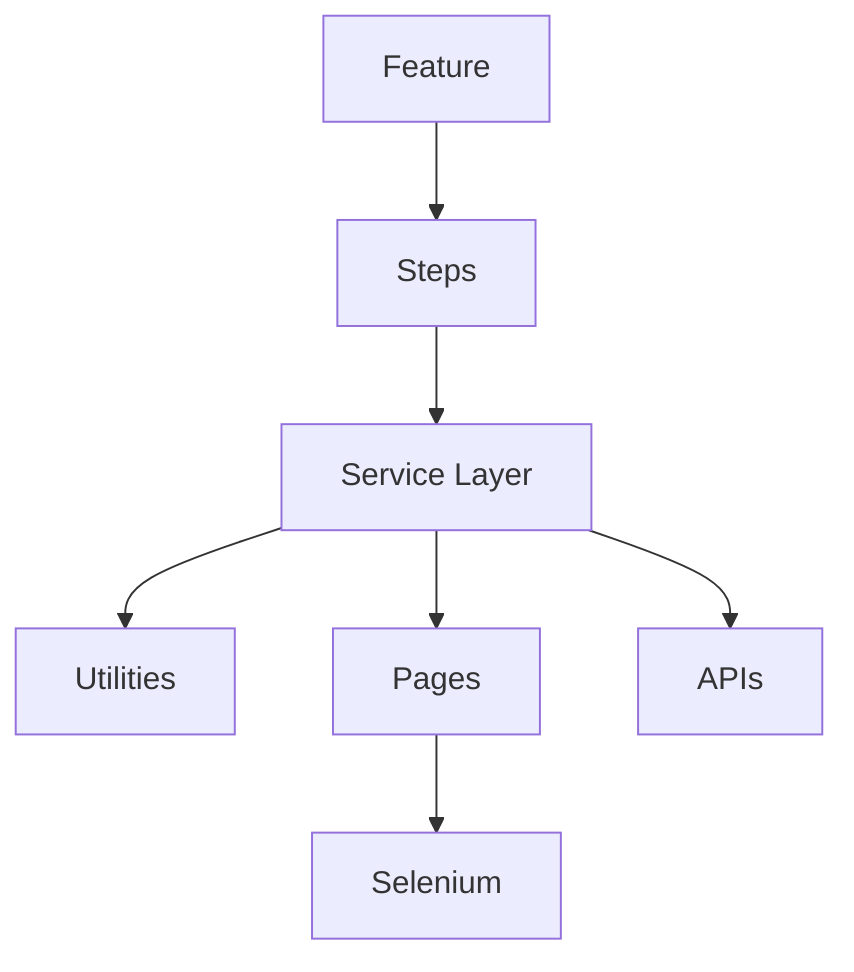

# Expanded QAs.md – 150 Detailed Interview Questions & Answers (5 Years Experience)

## Q1. Explain concept number 1 related to your automation framework.

**Answer:**

In this framework we use a hybrid automation approach combining Selenium UI automation and RestAssured API automation with Cucumber BDD and TestNG. The design follows layered architecture with Feature Files, Step Definitions, Service Layer, Utilities, and Base Classes. Data sharing is achieved using constructor-based dependency injection with ScenarioContext, which avoids static variables and supports parallel execution. API automation is abstracted through RequestBuilder and ResponseValidator classes. UI automation follows Page Object Model with DriverFactory and WaitFactory for browser and synchronization management. Data-driven testing is implemented using Scenario Outline along with CSV, JSON, and Excel readers. The framework integrates with Jenkins, Azure DevOps, and Docker for CI/CD execution. Reporting is handled using Allure and Extent reports. OOPs principles such as Encapsulation, Abstraction, Inheritance, and Polymorphism are applied, along with design patterns like Factory, Builder, and POM. Overall the framework is scalable, maintainable, and enterprise ready.

## Q2. Explain concept number 2 related to your automation framework.

**Answer:**

In this framework we use a hybrid automation approach combining Selenium UI automation and RestAssured API automation with Cucumber BDD and TestNG. The design follows layered architecture with Feature Files, Step Definitions, Service Layer, Utilities, and Base Classes. Data sharing is achieved using constructor-based dependency injection with ScenarioContext, which avoids static variables and supports parallel execution. API automation is abstracted through RequestBuilder and ResponseValidator classes. UI automation follows Page Object Model with DriverFactory and WaitFactory for browser and synchronization management. Data-driven testing is implemented using Scenario Outline along with CSV, JSON, and Excel readers. The framework integrates with Jenkins, Azure DevOps, and Docker for CI/CD execution. Reporting is handled using Allure and Extent reports. OOPs principles such as Encapsulation, Abstraction, Inheritance, and Polymorphism are applied, along with design patterns like Factory, Builder, and POM. Overall the framework is scalable, maintainable, and enterprise ready.

## Q3. Explain concept number 3 related to your automation framework.

**Answer:**

In this framework we use a hybrid automation approach combining Selenium UI automation and RestAssured API automation with Cucumber BDD and TestNG. The design follows layered architecture with Feature Files, Step Definitions, Service Layer, Utilities, and Base Classes. Data sharing is achieved using constructor-based dependency injection with ScenarioContext, which avoids static variables and supports parallel execution. API automation is abstracted through RequestBuilder and ResponseValidator classes. UI automation follows Page Object Model with DriverFactory and WaitFactory for browser and synchronization management. Data-driven testing is implemented using Scenario Outline along with CSV, JSON, and Excel readers. The framework integrates with Jenkins, Azure DevOps, and Docker for CI/CD execution. Reporting is handled using Allure and Extent reports. OOPs principles such as Encapsulation, Abstraction, Inheritance, and Polymorphism are applied, along with design patterns like Factory, Builder, and POM. Overall the framework is scalable, maintainable, and enterprise ready.

## Q4. Explain concept number 4 related to your automation framework.

**Answer:**

In this framework we use a hybrid automation approach combining Selenium UI automation and RestAssured API automation with Cucumber BDD and TestNG. The design follows layered architecture with Feature Files, Step Definitions, Service Layer, Utilities, and Base Classes. Data sharing is achieved using constructor-based dependency injection with ScenarioContext, which avoids static variables and supports parallel execution. API automation is abstracted through RequestBuilder and ResponseValidator classes. UI automation follows Page Object Model with DriverFactory and WaitFactory for browser and synchronization management. Data-driven testing is implemented using Scenario Outline along with CSV, JSON, and Excel readers. The framework integrates with Jenkins, Azure DevOps, and Docker for CI/CD execution. Reporting is handled using Allure and Extent reports. OOPs principles such as Encapsulation, Abstraction, Inheritance, and Polymorphism are applied, along with design patterns like Factory, Builder, and POM. Overall the framework is scalable, maintainable, and enterprise ready.

## Q5. Explain concept number 5 related to your automation framework.

**Answer:**

In this framework we use a hybrid automation approach combining Selenium UI automation and RestAssured API automation with Cucumber BDD and TestNG. The design follows layered architecture with Feature Files, Step Definitions, Service Layer, Utilities, and Base Classes. Data sharing is achieved using constructor-based dependency injection with ScenarioContext, which avoids static variables and supports parallel execution. API automation is abstracted through RequestBuilder and ResponseValidator classes. UI automation follows Page Object Model with DriverFactory and WaitFactory for browser and synchronization management. Data-driven testing is implemented using Scenario Outline along with CSV, JSON, and Excel readers. The framework integrates with Jenkins, Azure DevOps, and Docker for CI/CD execution. Reporting is handled using Allure and Extent reports. OOPs principles such as Encapsulation, Abstraction, Inheritance, and Polymorphism are applied, along with design patterns like Factory, Builder, and POM. Overall the framework is scalable, maintainable, and enterprise ready.

## Q6. Explain concept number 6 related to your automation framework.

**Answer:**

In this framework we use a hybrid automation approach combining Selenium UI automation and RestAssured API automation with Cucumber BDD and TestNG. The design follows layered architecture with Feature Files, Step Definitions, Service Layer, Utilities, and Base Classes. Data sharing is achieved using constructor-based dependency injection with ScenarioContext, which avoids static variables and supports parallel execution. API automation is abstracted through RequestBuilder and ResponseValidator classes. UI automation follows Page Object Model with DriverFactory and WaitFactory for browser and synchronization management. Data-driven testing is implemented using Scenario Outline along with CSV, JSON, and Excel readers. The framework integrates with Jenkins, Azure DevOps, and Docker for CI/CD execution. Reporting is handled using Allure and Extent reports. OOPs principles such as Encapsulation, Abstraction, Inheritance, and Polymorphism are applied, along with design patterns like Factory, Builder, and POM. Overall the framework is scalable, maintainable, and enterprise ready.

## Q7. Explain concept number 7 related to your automation framework.

**Answer:**

In this framework we use a hybrid automation approach combining Selenium UI automation and RestAssured API automation with Cucumber BDD and TestNG. The design follows layered architecture with Feature Files, Step Definitions, Service Layer, Utilities, and Base Classes. Data sharing is achieved using constructor-based dependency injection with ScenarioContext, which avoids static variables and supports parallel execution. API automation is abstracted through RequestBuilder and ResponseValidator classes. UI automation follows Page Object Model with DriverFactory and WaitFactory for browser and synchronization management. Data-driven testing is implemented using Scenario Outline along with CSV, JSON, and Excel readers. The framework integrates with Jenkins, Azure DevOps, and Docker for CI/CD execution. Reporting is handled using Allure and Extent reports. OOPs principles such as Encapsulation, Abstraction, Inheritance, and Polymorphism are applied, along with design patterns like Factory, Builder, and POM. Overall the framework is scalable, maintainable, and enterprise ready.

## Q8. Explain concept number 8 related to your automation framework.

**Answer:**

In this framework we use a hybrid automation approach combining Selenium UI automation and RestAssured API automation with Cucumber BDD and TestNG. The design follows layered architecture with Feature Files, Step Definitions, Service Layer, Utilities, and Base Classes. Data sharing is achieved using constructor-based dependency injection with ScenarioContext, which avoids static variables and supports parallel execution. API automation is abstracted through RequestBuilder and ResponseValidator classes. UI automation follows Page Object Model with DriverFactory and WaitFactory for browser and synchronization management. Data-driven testing is implemented using Scenario Outline along with CSV, JSON, and Excel readers. The framework integrates with Jenkins, Azure DevOps, and Docker for CI/CD execution. Reporting is handled using Allure and Extent reports. OOPs principles such as Encapsulation, Abstraction, Inheritance, and Polymorphism are applied, along with design patterns like Factory, Builder, and POM. Overall the framework is scalable, maintainable, and enterprise ready.

## Q9. Explain concept number 9 related to your automation framework.

**Answer:**

In this framework we use a hybrid automation approach combining Selenium UI automation and RestAssured API automation with Cucumber BDD and TestNG. The design follows layered architecture with Feature Files, Step Definitions, Service Layer, Utilities, and Base Classes. Data sharing is achieved using constructor-based dependency injection with ScenarioContext, which avoids static variables and supports parallel execution. API automation is abstracted through RequestBuilder and ResponseValidator classes. UI automation follows Page Object Model with DriverFactory and WaitFactory for browser and synchronization management. Data-driven testing is implemented using Scenario Outline along with CSV, JSON, and Excel readers. The framework integrates with Jenkins, Azure DevOps, and Docker for CI/CD execution. Reporting is handled using Allure and Extent reports. OOPs principles such as Encapsulation, Abstraction, Inheritance, and Polymorphism are applied, along with design patterns like Factory, Builder, and POM. Overall the framework is scalable, maintainable, and enterprise ready.

## Q10. Explain concept number 10 related to your automation framework.

**Answer:**

In this framework we use a hybrid automation approach combining Selenium UI automation and RestAssured API automation with Cucumber BDD and TestNG. The design follows layered architecture with Feature Files, Step Definitions, Service Layer, Utilities, and Base Classes. Data sharing is achieved using constructor-based dependency injection with ScenarioContext, which avoids static variables and supports parallel execution. API automation is abstracted through RequestBuilder and ResponseValidator classes. UI automation follows Page Object Model with DriverFactory and WaitFactory for browser and synchronization management. Data-driven testing is implemented using Scenario Outline along with CSV, JSON, and Excel readers. The framework integrates with Jenkins, Azure DevOps, and Docker for CI/CD execution. Reporting is handled using Allure and Extent reports. OOPs principles such as Encapsulation, Abstraction, Inheritance, and Polymorphism are applied, along with design patterns like Factory, Builder, and POM. Overall the framework is scalable, maintainable, and enterprise ready.

## Q11. Explain concept number 11 related to your automation framework.

**Answer:**

In this framework we use a hybrid automation approach combining Selenium UI automation and RestAssured API automation with Cucumber BDD and TestNG. The design follows layered architecture with Feature Files, Step Definitions, Service Layer, Utilities, and Base Classes. Data sharing is achieved using constructor-based dependency injection with ScenarioContext, which avoids static variables and supports parallel execution. API automation is abstracted through RequestBuilder and ResponseValidator classes. UI automation follows Page Object Model with DriverFactory and WaitFactory for browser and synchronization management. Data-driven testing is implemented using Scenario Outline along with CSV, JSON, and Excel readers. The framework integrates with Jenkins, Azure DevOps, and Docker for CI/CD execution. Reporting is handled using Allure and Extent reports. OOPs principles such as Encapsulation, Abstraction, Inheritance, and Polymorphism are applied, along with design patterns like Factory, Builder, and POM. Overall the framework is scalable, maintainable, and enterprise ready.

## Q12. Explain concept number 12 related to your automation framework.

**Answer:**

In this framework we use a hybrid automation approach combining Selenium UI automation and RestAssured API automation with Cucumber BDD and TestNG. The design follows layered architecture with Feature Files, Step Definitions, Service Layer, Utilities, and Base Classes. Data sharing is achieved using constructor-based dependency injection with ScenarioContext, which avoids static variables and supports parallel execution. API automation is abstracted through RequestBuilder and ResponseValidator classes. UI automation follows Page Object Model with DriverFactory and WaitFactory for browser and synchronization management. Data-driven testing is implemented using Scenario Outline along with CSV, JSON, and Excel readers. The framework integrates with Jenkins, Azure DevOps, and Docker for CI/CD execution. Reporting is handled using Allure and Extent reports. OOPs principles such as Encapsulation, Abstraction, Inheritance, and Polymorphism are applied, along with design patterns like Factory, Builder, and POM. Overall the framework is scalable, maintainable, and enterprise ready.

## Q13. Explain concept number 13 related to your automation framework.

**Answer:**

In this framework we use a hybrid automation approach combining Selenium UI automation and RestAssured API automation with Cucumber BDD and TestNG. The design follows layered architecture with Feature Files, Step Definitions, Service Layer, Utilities, and Base Classes. Data sharing is achieved using constructor-based dependency injection with ScenarioContext, which avoids static variables and supports parallel execution. API automation is abstracted through RequestBuilder and ResponseValidator classes. UI automation follows Page Object Model with DriverFactory and WaitFactory for browser and synchronization management. Data-driven testing is implemented using Scenario Outline along with CSV, JSON, and Excel readers. The framework integrates with Jenkins, Azure DevOps, and Docker for CI/CD execution. Reporting is handled using Allure and Extent reports. OOPs principles such as Encapsulation, Abstraction, Inheritance, and Polymorphism are applied, along with design patterns like Factory, Builder, and POM. Overall the framework is scalable, maintainable, and enterprise ready.

## Q14. Explain concept number 14 related to your automation framework.

**Answer:**

In this framework we use a hybrid automation approach combining Selenium UI automation and RestAssured API automation with Cucumber BDD and TestNG. The design follows layered architecture with Feature Files, Step Definitions, Service Layer, Utilities, and Base Classes. Data sharing is achieved using constructor-based dependency injection with ScenarioContext, which avoids static variables and supports parallel execution. API automation is abstracted through RequestBuilder and ResponseValidator classes. UI automation follows Page Object Model with DriverFactory and WaitFactory for browser and synchronization management. Data-driven testing is implemented using Scenario Outline along with CSV, JSON, and Excel readers. The framework integrates with Jenkins, Azure DevOps, and Docker for CI/CD execution. Reporting is handled using Allure and Extent reports. OOPs principles such as Encapsulation, Abstraction, Inheritance, and Polymorphism are applied, along with design patterns like Factory, Builder, and POM. Overall the framework is scalable, maintainable, and enterprise ready.

## Q15. Explain concept number 15 related to your automation framework.

**Answer:**

In this framework we use a hybrid automation approach combining Selenium UI automation and RestAssured API automation with Cucumber BDD and TestNG. The design follows layered architecture with Feature Files, Step Definitions, Service Layer, Utilities, and Base Classes. Data sharing is achieved using constructor-based dependency injection with ScenarioContext, which avoids static variables and supports parallel execution. API automation is abstracted through RequestBuilder and ResponseValidator classes. UI automation follows Page Object Model with DriverFactory and WaitFactory for browser and synchronization management. Data-driven testing is implemented using Scenario Outline along with CSV, JSON, and Excel readers. The framework integrates with Jenkins, Azure DevOps, and Docker for CI/CD execution. Reporting is handled using Allure and Extent reports. OOPs principles such as Encapsulation, Abstraction, Inheritance, and Polymorphism are applied, along with design patterns like Factory, Builder, and POM. Overall the framework is scalable, maintainable, and enterprise ready.

## Q16. Explain concept number 16 related to your automation framework.

**Answer:**

In this framework we use a hybrid automation approach combining Selenium UI automation and RestAssured API automation with Cucumber BDD and TestNG. The design follows layered architecture with Feature Files, Step Definitions, Service Layer, Utilities, and Base Classes. Data sharing is achieved using constructor-based dependency injection with ScenarioContext, which avoids static variables and supports parallel execution. API automation is abstracted through RequestBuilder and ResponseValidator classes. UI automation follows Page Object Model with DriverFactory and WaitFactory for browser and synchronization management. Data-driven testing is implemented using Scenario Outline along with CSV, JSON, and Excel readers. The framework integrates with Jenkins, Azure DevOps, and Docker for CI/CD execution. Reporting is handled using Allure and Extent reports. OOPs principles such as Encapsulation, Abstraction, Inheritance, and Polymorphism are applied, along with design patterns like Factory, Builder, and POM. Overall the framework is scalable, maintainable, and enterprise ready.

## Q17. Explain concept number 17 related to your automation framework.

**Answer:**

In this framework we use a hybrid automation approach combining Selenium UI automation and RestAssured API automation with Cucumber BDD and TestNG. The design follows layered architecture with Feature Files, Step Definitions, Service Layer, Utilities, and Base Classes. Data sharing is achieved using constructor-based dependency injection with ScenarioContext, which avoids static variables and supports parallel execution. API automation is abstracted through RequestBuilder and ResponseValidator classes. UI automation follows Page Object Model with DriverFactory and WaitFactory for browser and synchronization management. Data-driven testing is implemented using Scenario Outline along with CSV, JSON, and Excel readers. The framework integrates with Jenkins, Azure DevOps, and Docker for CI/CD execution. Reporting is handled using Allure and Extent reports. OOPs principles such as Encapsulation, Abstraction, Inheritance, and Polymorphism are applied, along with design patterns like Factory, Builder, and POM. Overall the framework is scalable, maintainable, and enterprise ready.

## Q18. Explain concept number 18 related to your automation framework.

**Answer:**

In this framework we use a hybrid automation approach combining Selenium UI automation and RestAssured API automation with Cucumber BDD and TestNG. The design follows layered architecture with Feature Files, Step Definitions, Service Layer, Utilities, and Base Classes. Data sharing is achieved using constructor-based dependency injection with ScenarioContext, which avoids static variables and supports parallel execution. API automation is abstracted through RequestBuilder and ResponseValidator classes. UI automation follows Page Object Model with DriverFactory and WaitFactory for browser and synchronization management. Data-driven testing is implemented using Scenario Outline along with CSV, JSON, and Excel readers. The framework integrates with Jenkins, Azure DevOps, and Docker for CI/CD execution. Reporting is handled using Allure and Extent reports. OOPs principles such as Encapsulation, Abstraction, Inheritance, and Polymorphism are applied, along with design patterns like Factory, Builder, and POM. Overall the framework is scalable, maintainable, and enterprise ready.

## Q19. Explain concept number 19 related to your automation framework.

**Answer:**

In this framework we use a hybrid automation approach combining Selenium UI automation and RestAssured API automation with Cucumber BDD and TestNG. The design follows layered architecture with Feature Files, Step Definitions, Service Layer, Utilities, and Base Classes. Data sharing is achieved using constructor-based dependency injection with ScenarioContext, which avoids static variables and supports parallel execution. API automation is abstracted through RequestBuilder and ResponseValidator classes. UI automation follows Page Object Model with DriverFactory and WaitFactory for browser and synchronization management. Data-driven testing is implemented using Scenario Outline along with CSV, JSON, and Excel readers. The framework integrates with Jenkins, Azure DevOps, and Docker for CI/CD execution. Reporting is handled using Allure and Extent reports. OOPs principles such as Encapsulation, Abstraction, Inheritance, and Polymorphism are applied, along with design patterns like Factory, Builder, and POM. Overall the framework is scalable, maintainable, and enterprise ready.

## Q20. Explain concept number 20 related to your automation framework.

**Answer:**

In this framework we use a hybrid automation approach combining Selenium UI automation and RestAssured API automation with Cucumber BDD and TestNG. The design follows layered architecture with Feature Files, Step Definitions, Service Layer, Utilities, and Base Classes. Data sharing is achieved using constructor-based dependency injection with ScenarioContext, which avoids static variables and supports parallel execution. API automation is abstracted through RequestBuilder and ResponseValidator classes. UI automation follows Page Object Model with DriverFactory and WaitFactory for browser and synchronization management. Data-driven testing is implemented using Scenario Outline along with CSV, JSON, and Excel readers. The framework integrates with Jenkins, Azure DevOps, and Docker for CI/CD execution. Reporting is handled using Allure and Extent reports. OOPs principles such as Encapsulation, Abstraction, Inheritance, and Polymorphism are applied, along with design patterns like Factory, Builder, and POM. Overall the framework is scalable, maintainable, and enterprise ready.

## Q21. Explain concept number 21 related to your automation framework.

**Answer:**

In this framework we use a hybrid automation approach combining Selenium UI automation and RestAssured API automation with Cucumber BDD and TestNG. The design follows layered architecture with Feature Files, Step Definitions, Service Layer, Utilities, and Base Classes. Data sharing is achieved using constructor-based dependency injection with ScenarioContext, which avoids static variables and supports parallel execution. API automation is abstracted through RequestBuilder and ResponseValidator classes. UI automation follows Page Object Model with DriverFactory and WaitFactory for browser and synchronization management. Data-driven testing is implemented using Scenario Outline along with CSV, JSON, and Excel readers. The framework integrates with Jenkins, Azure DevOps, and Docker for CI/CD execution. Reporting is handled using Allure and Extent reports. OOPs principles such as Encapsulation, Abstraction, Inheritance, and Polymorphism are applied, along with design patterns like Factory, Builder, and POM. Overall the framework is scalable, maintainable, and enterprise ready.

## Q22. Explain concept number 22 related to your automation framework.

**Answer:**

In this framework we use a hybrid automation approach combining Selenium UI automation and RestAssured API automation with Cucumber BDD and TestNG. The design follows layered architecture with Feature Files, Step Definitions, Service Layer, Utilities, and Base Classes. Data sharing is achieved using constructor-based dependency injection with ScenarioContext, which avoids static variables and supports parallel execution. API automation is abstracted through RequestBuilder and ResponseValidator classes. UI automation follows Page Object Model with DriverFactory and WaitFactory for browser and synchronization management. Data-driven testing is implemented using Scenario Outline along with CSV, JSON, and Excel readers. The framework integrates with Jenkins, Azure DevOps, and Docker for CI/CD execution. Reporting is handled using Allure and Extent reports. OOPs principles such as Encapsulation, Abstraction, Inheritance, and Polymorphism are applied, along with design patterns like Factory, Builder, and POM. Overall the framework is scalable, maintainable, and enterprise ready.

## Q23. Explain concept number 23 related to your automation framework.

**Answer:**

In this framework we use a hybrid automation approach combining Selenium UI automation and RestAssured API automation with Cucumber BDD and TestNG. The design follows layered architecture with Feature Files, Step Definitions, Service Layer, Utilities, and Base Classes. Data sharing is achieved using constructor-based dependency injection with ScenarioContext, which avoids static variables and supports parallel execution. API automation is abstracted through RequestBuilder and ResponseValidator classes. UI automation follows Page Object Model with DriverFactory and WaitFactory for browser and synchronization management. Data-driven testing is implemented using Scenario Outline along with CSV, JSON, and Excel readers. The framework integrates with Jenkins, Azure DevOps, and Docker for CI/CD execution. Reporting is handled using Allure and Extent reports. OOPs principles such as Encapsulation, Abstraction, Inheritance, and Polymorphism are applied, along with design patterns like Factory, Builder, and POM. Overall the framework is scalable, maintainable, and enterprise ready.

## Q24. Explain concept number 24 related to your automation framework.

**Answer:**

In this framework we use a hybrid automation approach combining Selenium UI automation and RestAssured API automation with Cucumber BDD and TestNG. The design follows layered architecture with Feature Files, Step Definitions, Service Layer, Utilities, and Base Classes. Data sharing is achieved using constructor-based dependency injection with ScenarioContext, which avoids static variables and supports parallel execution. API automation is abstracted through RequestBuilder and ResponseValidator classes. UI automation follows Page Object Model with DriverFactory and WaitFactory for browser and synchronization management. Data-driven testing is implemented using Scenario Outline along with CSV, JSON, and Excel readers. The framework integrates with Jenkins, Azure DevOps, and Docker for CI/CD execution. Reporting is handled using Allure and Extent reports. OOPs principles such as Encapsulation, Abstraction, Inheritance, and Polymorphism are applied, along with design patterns like Factory, Builder, and POM. Overall the framework is scalable, maintainable, and enterprise ready.

## Q25. Explain concept number 25 related to your automation framework.

**Answer:**

In this framework we use a hybrid automation approach combining Selenium UI automation and RestAssured API automation with Cucumber BDD and TestNG. The design follows layered architecture with Feature Files, Step Definitions, Service Layer, Utilities, and Base Classes. Data sharing is achieved using constructor-based dependency injection with ScenarioContext, which avoids static variables and supports parallel execution. API automation is abstracted through RequestBuilder and ResponseValidator classes. UI automation follows Page Object Model with DriverFactory and WaitFactory for browser and synchronization management. Data-driven testing is implemented using Scenario Outline along with CSV, JSON, and Excel readers. The framework integrates with Jenkins, Azure DevOps, and Docker for CI/CD execution. Reporting is handled using Allure and Extent reports. OOPs principles such as Encapsulation, Abstraction, Inheritance, and Polymorphism are applied, along with design patterns like Factory, Builder, and POM. Overall the framework is scalable, maintainable, and enterprise ready.

### Supporting Diagram

## Q26. Explain concept number 26 related to your automation framework.

**Answer:**

In this framework we use a hybrid automation approach combining Selenium UI automation and RestAssured API automation with Cucumber BDD and TestNG. The design follows layered architecture with Feature Files, Step Definitions, Service Layer, Utilities, and Base Classes. Data sharing is achieved using constructor-based dependency injection with ScenarioContext, which avoids static variables and supports parallel execution. API automation is abstracted through RequestBuilder and ResponseValidator classes. UI automation follows Page Object Model with DriverFactory and WaitFactory for browser and synchronization management. Data-driven testing is implemented using Scenario Outline along with CSV, JSON, and Excel readers. The framework integrates with Jenkins, Azure DevOps, and Docker for CI/CD execution. Reporting is handled using Allure and Extent reports. OOPs principles such as Encapsulation, Abstraction, Inheritance, and Polymorphism are applied, along with design patterns like Factory, Builder, and POM. Overall the framework is scalable, maintainable, and enterprise ready.

## Q27. Explain concept number 27 related to your automation framework.

**Answer:**

In this framework we use a hybrid automation approach combining Selenium UI automation and RestAssured API automation with Cucumber BDD and TestNG. The design follows layered architecture with Feature Files, Step Definitions, Service Layer, Utilities, and Base Classes. Data sharing is achieved using constructor-based dependency injection with ScenarioContext, which avoids static variables and supports parallel execution. API automation is abstracted through RequestBuilder and ResponseValidator classes. UI automation follows Page Object Model with DriverFactory and WaitFactory for browser and synchronization management. Data-driven testing is implemented using Scenario Outline along with CSV, JSON, and Excel readers. The framework integrates with Jenkins, Azure DevOps, and Docker for CI/CD execution. Reporting is handled using Allure and Extent reports. OOPs principles such as Encapsulation, Abstraction, Inheritance, and Polymorphism are applied, along with design patterns like Factory, Builder, and POM. Overall the framework is scalable, maintainable, and enterprise ready.

## Q28. Explain concept number 28 related to your automation framework.

**Answer:**

In this framework we use a hybrid automation approach combining Selenium UI automation and RestAssured API automation with Cucumber BDD and TestNG. The design follows layered architecture with Feature Files, Step Definitions, Service Layer, Utilities, and Base Classes. Data sharing is achieved using constructor-based dependency injection with ScenarioContext, which avoids static variables and supports parallel execution. API automation is abstracted through RequestBuilder and ResponseValidator classes. UI automation follows Page Object Model with DriverFactory and WaitFactory for browser and synchronization management. Data-driven testing is implemented using Scenario Outline along with CSV, JSON, and Excel readers. The framework integrates with Jenkins, Azure DevOps, and Docker for CI/CD execution. Reporting is handled using Allure and Extent reports. OOPs principles such as Encapsulation, Abstraction, Inheritance, and Polymorphism are applied, along with design patterns like Factory, Builder, and POM. Overall the framework is scalable, maintainable, and enterprise ready.

## Q29. Explain concept number 29 related to your automation framework.

**Answer:**

In this framework we use a hybrid automation approach combining Selenium UI automation and RestAssured API automation with Cucumber BDD and TestNG. The design follows layered architecture with Feature Files, Step Definitions, Service Layer, Utilities, and Base Classes. Data sharing is achieved using constructor-based dependency injection with ScenarioContext, which avoids static variables and supports parallel execution. API automation is abstracted through RequestBuilder and ResponseValidator classes. UI automation follows Page Object Model with DriverFactory and WaitFactory for browser and synchronization management. Data-driven testing is implemented using Scenario Outline along with CSV, JSON, and Excel readers. The framework integrates with Jenkins, Azure DevOps, and Docker for CI/CD execution. Reporting is handled using Allure and Extent reports. OOPs principles such as Encapsulation, Abstraction, Inheritance, and Polymorphism are applied, along with design patterns like Factory, Builder, and POM. Overall the framework is scalable, maintainable, and enterprise ready.

## Q30. Explain concept number 30 related to your automation framework.

**Answer:**

In this framework we use a hybrid automation approach combining Selenium UI automation and RestAssured API automation with Cucumber BDD and TestNG. The design follows layered architecture with Feature Files, Step Definitions, Service Layer, Utilities, and Base Classes. Data sharing is achieved using constructor-based dependency injection with ScenarioContext, which avoids static variables and supports parallel execution. API automation is abstracted through RequestBuilder and ResponseValidator classes. UI automation follows Page Object Model with DriverFactory and WaitFactory for browser and synchronization management. Data-driven testing is implemented using Scenario Outline along with CSV, JSON, and Excel readers. The framework integrates with Jenkins, Azure DevOps, and Docker for CI/CD execution. Reporting is handled using Allure and Extent reports. OOPs principles such as Encapsulation, Abstraction, Inheritance, and Polymorphism are applied, along with design patterns like Factory, Builder, and POM. Overall the framework is scalable, maintainable, and enterprise ready.

## Q31. Explain concept number 31 related to your automation framework.

**Answer:**

In this framework we use a hybrid automation approach combining Selenium UI automation and RestAssured API automation with Cucumber BDD and TestNG. The design follows layered architecture with Feature Files, Step Definitions, Service Layer, Utilities, and Base Classes. Data sharing is achieved using constructor-based dependency injection with ScenarioContext, which avoids static variables and supports parallel execution. API automation is abstracted through RequestBuilder and ResponseValidator classes. UI automation follows Page Object Model with DriverFactory and WaitFactory for browser and synchronization management. Data-driven testing is implemented using Scenario Outline along with CSV, JSON, and Excel readers. The framework integrates with Jenkins, Azure DevOps, and Docker for CI/CD execution. Reporting is handled using Allure and Extent reports. OOPs principles such as Encapsulation, Abstraction, Inheritance, and Polymorphism are applied, along with design patterns like Factory, Builder, and POM. Overall the framework is scalable, maintainable, and enterprise ready.

## Q32. Explain concept number 32 related to your automation framework.

**Answer:**

In this framework we use a hybrid automation approach combining Selenium UI automation and RestAssured API automation with Cucumber BDD and TestNG. The design follows layered architecture with Feature Files, Step Definitions, Service Layer, Utilities, and Base Classes. Data sharing is achieved using constructor-based dependency injection with ScenarioContext, which avoids static variables and supports parallel execution. API automation is abstracted through RequestBuilder and ResponseValidator classes. UI automation follows Page Object Model with DriverFactory and WaitFactory for browser and synchronization management. Data-driven testing is implemented using Scenario Outline along with CSV, JSON, and Excel readers. The framework integrates with Jenkins, Azure DevOps, and Docker for CI/CD execution. Reporting is handled using Allure and Extent reports. OOPs principles such as Encapsulation, Abstraction, Inheritance, and Polymorphism are applied, along with design patterns like Factory, Builder, and POM. Overall the framework is scalable, maintainable, and enterprise ready.

## Q33. Explain concept number 33 related to your automation framework.

**Answer:**

In this framework we use a hybrid automation approach combining Selenium UI automation and RestAssured API automation with Cucumber BDD and TestNG. The design follows layered architecture with Feature Files, Step Definitions, Service Layer, Utilities, and Base Classes. Data sharing is achieved using constructor-based dependency injection with ScenarioContext, which avoids static variables and supports parallel execution. API automation is abstracted through RequestBuilder and ResponseValidator classes. UI automation follows Page Object Model with DriverFactory and WaitFactory for browser and synchronization management. Data-driven testing is implemented using Scenario Outline along with CSV, JSON, and Excel readers. The framework integrates with Jenkins, Azure DevOps, and Docker for CI/CD execution. Reporting is handled using Allure and Extent reports. OOPs principles such as Encapsulation, Abstraction, Inheritance, and Polymorphism are applied, along with design patterns like Factory, Builder, and POM. Overall the framework is scalable, maintainable, and enterprise ready.

## Q34. Explain concept number 34 related to your automation framework.

**Answer:**

In this framework we use a hybrid automation approach combining Selenium UI automation and RestAssured API automation with Cucumber BDD and TestNG. The design follows layered architecture with Feature Files, Step Definitions, Service Layer, Utilities, and Base Classes. Data sharing is achieved using constructor-based dependency injection with ScenarioContext, which avoids static variables and supports parallel execution. API automation is abstracted through RequestBuilder and ResponseValidator classes. UI automation follows Page Object Model with DriverFactory and WaitFactory for browser and synchronization management. Data-driven testing is implemented using Scenario Outline along with CSV, JSON, and Excel readers. The framework integrates with Jenkins, Azure DevOps, and Docker for CI/CD execution. Reporting is handled using Allure and Extent reports. OOPs principles such as Encapsulation, Abstraction, Inheritance, and Polymorphism are applied, along with design patterns like Factory, Builder, and POM. Overall the framework is scalable, maintainable, and enterprise ready.

## Q35. Explain concept number 35 related to your automation framework.

**Answer:**

In this framework we use a hybrid automation approach combining Selenium UI automation and RestAssured API automation with Cucumber BDD and TestNG. The design follows layered architecture with Feature Files, Step Definitions, Service Layer, Utilities, and Base Classes. Data sharing is achieved using constructor-based dependency injection with ScenarioContext, which avoids static variables and supports parallel execution. API automation is abstracted through RequestBuilder and ResponseValidator classes. UI automation follows Page Object Model with DriverFactory and WaitFactory for browser and synchronization management. Data-driven testing is implemented using Scenario Outline along with CSV, JSON, and Excel readers. The framework integrates with Jenkins, Azure DevOps, and Docker for CI/CD execution. Reporting is handled using Allure and Extent reports. OOPs principles such as Encapsulation, Abstraction, Inheritance, and Polymorphism are applied, along with design patterns like Factory, Builder, and POM. Overall the framework is scalable, maintainable, and enterprise ready.

## Q36. Explain concept number 36 related to your automation framework.

**Answer:**

In this framework we use a hybrid automation approach combining Selenium UI automation and RestAssured API automation with Cucumber BDD and TestNG. The design follows layered architecture with Feature Files, Step Definitions, Service Layer, Utilities, and Base Classes. Data sharing is achieved using constructor-based dependency injection with ScenarioContext, which avoids static variables and supports parallel execution. API automation is abstracted through RequestBuilder and ResponseValidator classes. UI automation follows Page Object Model with DriverFactory and WaitFactory for browser and synchronization management. Data-driven testing is implemented using Scenario Outline along with CSV, JSON, and Excel readers. The framework integrates with Jenkins, Azure DevOps, and Docker for CI/CD execution. Reporting is handled using Allure and Extent reports. OOPs principles such as Encapsulation, Abstraction, Inheritance, and Polymorphism are applied, along with design patterns like Factory, Builder, and POM. Overall the framework is scalable, maintainable, and enterprise ready.

## Q37. Explain concept number 37 related to your automation framework.

**Answer:**

In this framework we use a hybrid automation approach combining Selenium UI automation and RestAssured API automation with Cucumber BDD and TestNG. The design follows layered architecture with Feature Files, Step Definitions, Service Layer, Utilities, and Base Classes. Data sharing is achieved using constructor-based dependency injection with ScenarioContext, which avoids static variables and supports parallel execution. API automation is abstracted through RequestBuilder and ResponseValidator classes. UI automation follows Page Object Model with DriverFactory and WaitFactory for browser and synchronization management. Data-driven testing is implemented using Scenario Outline along with CSV, JSON, and Excel readers. The framework integrates with Jenkins, Azure DevOps, and Docker for CI/CD execution. Reporting is handled using Allure and Extent reports. OOPs principles such as Encapsulation, Abstraction, Inheritance, and Polymorphism are applied, along with design patterns like Factory, Builder, and POM. Overall the framework is scalable, maintainable, and enterprise ready.

## Q38. Explain concept number 38 related to your automation framework.

**Answer:**

In this framework we use a hybrid automation approach combining Selenium UI automation and RestAssured API automation with Cucumber BDD and TestNG. The design follows layered architecture with Feature Files, Step Definitions, Service Layer, Utilities, and Base Classes. Data sharing is achieved using constructor-based dependency injection with ScenarioContext, which avoids static variables and supports parallel execution. API automation is abstracted through RequestBuilder and ResponseValidator classes. UI automation follows Page Object Model with DriverFactory and WaitFactory for browser and synchronization management. Data-driven testing is implemented using Scenario Outline along with CSV, JSON, and Excel readers. The framework integrates with Jenkins, Azure DevOps, and Docker for CI/CD execution. Reporting is handled using Allure and Extent reports. OOPs principles such as Encapsulation, Abstraction, Inheritance, and Polymorphism are applied, along with design patterns like Factory, Builder, and POM. Overall the framework is scalable, maintainable, and enterprise ready.

## Q39. Explain concept number 39 related to your automation framework.

**Answer:**

In this framework we use a hybrid automation approach combining Selenium UI automation and RestAssured API automation with Cucumber BDD and TestNG. The design follows layered architecture with Feature Files, Step Definitions, Service Layer, Utilities, and Base Classes. Data sharing is achieved using constructor-based dependency injection with ScenarioContext, which avoids static variables and supports parallel execution. API automation is abstracted through RequestBuilder and ResponseValidator classes. UI automation follows Page Object Model with DriverFactory and WaitFactory for browser and synchronization management. Data-driven testing is implemented using Scenario Outline along with CSV, JSON, and Excel readers. The framework integrates with Jenkins, Azure DevOps, and Docker for CI/CD execution. Reporting is handled using Allure and Extent reports. OOPs principles such as Encapsulation, Abstraction, Inheritance, and Polymorphism are applied, along with design patterns like Factory, Builder, and POM. Overall the framework is scalable, maintainable, and enterprise ready.

## Q40. Explain concept number 40 related to your automation framework.

**Answer:**

In this framework we use a hybrid automation approach combining Selenium UI automation and RestAssured API automation with Cucumber BDD and TestNG. The design follows layered architecture with Feature Files, Step Definitions, Service Layer, Utilities, and Base Classes. Data sharing is achieved using constructor-based dependency injection with ScenarioContext, which avoids static variables and supports parallel execution. API automation is abstracted through RequestBuilder and ResponseValidator classes. UI automation follows Page Object Model with DriverFactory and WaitFactory for browser and synchronization management. Data-driven testing is implemented using Scenario Outline along with CSV, JSON, and Excel readers. The framework integrates with Jenkins, Azure DevOps, and Docker for CI/CD execution. Reporting is handled using Allure and Extent reports. OOPs principles such as Encapsulation, Abstraction, Inheritance, and Polymorphism are applied, along with design patterns like Factory, Builder, and POM. Overall the framework is scalable, maintainable, and enterprise ready.

## Q41. Explain concept number 41 related to your automation framework.

**Answer:**

In this framework we use a hybrid automation approach combining Selenium UI automation and RestAssured API automation with Cucumber BDD and TestNG. The design follows layered architecture with Feature Files, Step Definitions, Service Layer, Utilities, and Base Classes. Data sharing is achieved using constructor-based dependency injection with ScenarioContext, which avoids static variables and supports parallel execution. API automation is abstracted through RequestBuilder and ResponseValidator classes. UI automation follows Page Object Model with DriverFactory and WaitFactory for browser and synchronization management. Data-driven testing is implemented using Scenario Outline along with CSV, JSON, and Excel readers. The framework integrates with Jenkins, Azure DevOps, and Docker for CI/CD execution. Reporting is handled using Allure and Extent reports. OOPs principles such as Encapsulation, Abstraction, Inheritance, and Polymorphism are applied, along with design patterns like Factory, Builder, and POM. Overall the framework is scalable, maintainable, and enterprise ready.

## Q42. Explain concept number 42 related to your automation framework.

**Answer:**

In this framework we use a hybrid automation approach combining Selenium UI automation and RestAssured API automation with Cucumber BDD and TestNG. The design follows layered architecture with Feature Files, Step Definitions, Service Layer, Utilities, and Base Classes. Data sharing is achieved using constructor-based dependency injection with ScenarioContext, which avoids static variables and supports parallel execution. API automation is abstracted through RequestBuilder and ResponseValidator classes. UI automation follows Page Object Model with DriverFactory and WaitFactory for browser and synchronization management. Data-driven testing is implemented using Scenario Outline along with CSV, JSON, and Excel readers. The framework integrates with Jenkins, Azure DevOps, and Docker for CI/CD execution. Reporting is handled using Allure and Extent reports. OOPs principles such as Encapsulation, Abstraction, Inheritance, and Polymorphism are applied, along with design patterns like Factory, Builder, and POM. Overall the framework is scalable, maintainable, and enterprise ready.

## Q43. Explain concept number 43 related to your automation framework.

**Answer:**

In this framework we use a hybrid automation approach combining Selenium UI automation and RestAssured API automation with Cucumber BDD and TestNG. The design follows layered architecture with Feature Files, Step Definitions, Service Layer, Utilities, and Base Classes. Data sharing is achieved using constructor-based dependency injection with ScenarioContext, which avoids static variables and supports parallel execution. API automation is abstracted through RequestBuilder and ResponseValidator classes. UI automation follows Page Object Model with DriverFactory and WaitFactory for browser and synchronization management. Data-driven testing is implemented using Scenario Outline along with CSV, JSON, and Excel readers. The framework integrates with Jenkins, Azure DevOps, and Docker for CI/CD execution. Reporting is handled using Allure and Extent reports. OOPs principles such as Encapsulation, Abstraction, Inheritance, and Polymorphism are applied, along with design patterns like Factory, Builder, and POM. Overall the framework is scalable, maintainable, and enterprise ready.

## Q44. Explain concept number 44 related to your automation framework.

**Answer:**

In this framework we use a hybrid automation approach combining Selenium UI automation and RestAssured API automation with Cucumber BDD and TestNG. The design follows layered architecture with Feature Files, Step Definitions, Service Layer, Utilities, and Base Classes. Data sharing is achieved using constructor-based dependency injection with ScenarioContext, which avoids static variables and supports parallel execution. API automation is abstracted through RequestBuilder and ResponseValidator classes. UI automation follows Page Object Model with DriverFactory and WaitFactory for browser and synchronization management. Data-driven testing is implemented using Scenario Outline along with CSV, JSON, and Excel readers. The framework integrates with Jenkins, Azure DevOps, and Docker for CI/CD execution. Reporting is handled using Allure and Extent reports. OOPs principles such as Encapsulation, Abstraction, Inheritance, and Polymorphism are applied, along with design patterns like Factory, Builder, and POM. Overall the framework is scalable, maintainable, and enterprise ready.

## Q45. Explain concept number 45 related to your automation framework.

**Answer:**

In this framework we use a hybrid automation approach combining Selenium UI automation and RestAssured API automation with Cucumber BDD and TestNG. The design follows layered architecture with Feature Files, Step Definitions, Service Layer, Utilities, and Base Classes. Data sharing is achieved using constructor-based dependency injection with ScenarioContext, which avoids static variables and supports parallel execution. API automation is abstracted through RequestBuilder and ResponseValidator classes. UI automation follows Page Object Model with DriverFactory and WaitFactory for browser and synchronization management. Data-driven testing is implemented using Scenario Outline along with CSV, JSON, and Excel readers. The framework integrates with Jenkins, Azure DevOps, and Docker for CI/CD execution. Reporting is handled using Allure and Extent reports. OOPs principles such as Encapsulation, Abstraction, Inheritance, and Polymorphism are applied, along with design patterns like Factory, Builder, and POM. Overall the framework is scalable, maintainable, and enterprise ready.

## Q46. Explain concept number 46 related to your automation framework.

**Answer:**

In this framework we use a hybrid automation approach combining Selenium UI automation and RestAssured API automation with Cucumber BDD and TestNG. The design follows layered architecture with Feature Files, Step Definitions, Service Layer, Utilities, and Base Classes. Data sharing is achieved using constructor-based dependency injection with ScenarioContext, which avoids static variables and supports parallel execution. API automation is abstracted through RequestBuilder and ResponseValidator classes. UI automation follows Page Object Model with DriverFactory and WaitFactory for browser and synchronization management. Data-driven testing is implemented using Scenario Outline along with CSV, JSON, and Excel readers. The framework integrates with Jenkins, Azure DevOps, and Docker for CI/CD execution. Reporting is handled using Allure and Extent reports. OOPs principles such as Encapsulation, Abstraction, Inheritance, and Polymorphism are applied, along with design patterns like Factory, Builder, and POM. Overall the framework is scalable, maintainable, and enterprise ready.

## Q47. Explain concept number 47 related to your automation framework.

**Answer:**

In this framework we use a hybrid automation approach combining Selenium UI automation and RestAssured API automation with Cucumber BDD and TestNG. The design follows layered architecture with Feature Files, Step Definitions, Service Layer, Utilities, and Base Classes. Data sharing is achieved using constructor-based dependency injection with ScenarioContext, which avoids static variables and supports parallel execution. API automation is abstracted through RequestBuilder and ResponseValidator classes. UI automation follows Page Object Model with DriverFactory and WaitFactory for browser and synchronization management. Data-driven testing is implemented using Scenario Outline along with CSV, JSON, and Excel readers. The framework integrates with Jenkins, Azure DevOps, and Docker for CI/CD execution. Reporting is handled using Allure and Extent reports. OOPs principles such as Encapsulation, Abstraction, Inheritance, and Polymorphism are applied, along with design patterns like Factory, Builder, and POM. Overall the framework is scalable, maintainable, and enterprise ready.

## Q48. Explain concept number 48 related to your automation framework.

**Answer:**

In this framework we use a hybrid automation approach combining Selenium UI automation and RestAssured API automation with Cucumber BDD and TestNG. The design follows layered architecture with Feature Files, Step Definitions, Service Layer, Utilities, and Base Classes. Data sharing is achieved using constructor-based dependency injection with ScenarioContext, which avoids static variables and supports parallel execution. API automation is abstracted through RequestBuilder and ResponseValidator classes. UI automation follows Page Object Model with DriverFactory and WaitFactory for browser and synchronization management. Data-driven testing is implemented using Scenario Outline along with CSV, JSON, and Excel readers. The framework integrates with Jenkins, Azure DevOps, and Docker for CI/CD execution. Reporting is handled using Allure and Extent reports. OOPs principles such as Encapsulation, Abstraction, Inheritance, and Polymorphism are applied, along with design patterns like Factory, Builder, and POM. Overall the framework is scalable, maintainable, and enterprise ready.

## Q49. Explain concept number 49 related to your automation framework.

**Answer:**

In this framework we use a hybrid automation approach combining Selenium UI automation and RestAssured API automation with Cucumber BDD and TestNG. The design follows layered architecture with Feature Files, Step Definitions, Service Layer, Utilities, and Base Classes. Data sharing is achieved using constructor-based dependency injection with ScenarioContext, which avoids static variables and supports parallel execution. API automation is abstracted through RequestBuilder and ResponseValidator classes. UI automation follows Page Object Model with DriverFactory and WaitFactory for browser and synchronization management. Data-driven testing is implemented using Scenario Outline along with CSV, JSON, and Excel readers. The framework integrates with Jenkins, Azure DevOps, and Docker for CI/CD execution. Reporting is handled using Allure and Extent reports. OOPs principles such as Encapsulation, Abstraction, Inheritance, and Polymorphism are applied, along with design patterns like Factory, Builder, and POM. Overall the framework is scalable, maintainable, and enterprise ready.

## Q50. Explain concept number 50 related to your automation framework.

**Answer:**

In this framework we use a hybrid automation approach combining Selenium UI automation and RestAssured API automation with Cucumber BDD and TestNG. The design follows layered architecture with Feature Files, Step Definitions, Service Layer, Utilities, and Base Classes. Data sharing is achieved using constructor-based dependency injection with ScenarioContext, which avoids static variables and supports parallel execution. API automation is abstracted through RequestBuilder and ResponseValidator classes. UI automation follows Page Object Model with DriverFactory and WaitFactory for browser and synchronization management. Data-driven testing is implemented using Scenario Outline along with CSV, JSON, and Excel readers. The framework integrates with Jenkins, Azure DevOps, and Docker for CI/CD execution. Reporting is handled using Allure and Extent reports. OOPs principles such as Encapsulation, Abstraction, Inheritance, and Polymorphism are applied, along with design patterns like Factory, Builder, and POM. Overall the framework is scalable, maintainable, and enterprise ready.

### Supporting Diagram

## Q51. Explain concept number 51 related to your automation framework.

**Answer:**

In this framework we use a hybrid automation approach combining Selenium UI automation and RestAssured API automation with Cucumber BDD and TestNG. The design follows layered architecture with Feature Files, Step Definitions, Service Layer, Utilities, and Base Classes. Data sharing is achieved using constructor-based dependency injection with ScenarioContext, which avoids static variables and supports parallel execution. API automation is abstracted through RequestBuilder and ResponseValidator classes. UI automation follows Page Object Model with DriverFactory and WaitFactory for browser and synchronization management. Data-driven testing is implemented using Scenario Outline along with CSV, JSON, and Excel readers. The framework integrates with Jenkins, Azure DevOps, and Docker for CI/CD execution. Reporting is handled using Allure and Extent reports. OOPs principles such as Encapsulation, Abstraction, Inheritance, and Polymorphism are applied, along with design patterns like Factory, Builder, and POM. Overall the framework is scalable, maintainable, and enterprise ready.

## Q52. Explain concept number 52 related to your automation framework.

**Answer:**

In this framework we use a hybrid automation approach combining Selenium UI automation and RestAssured API automation with Cucumber BDD and TestNG. The design follows layered architecture with Feature Files, Step Definitions, Service Layer, Utilities, and Base Classes. Data sharing is achieved using constructor-based dependency injection with ScenarioContext, which avoids static variables and supports parallel execution. API automation is abstracted through RequestBuilder and ResponseValidator classes. UI automation follows Page Object Model with DriverFactory and WaitFactory for browser and synchronization management. Data-driven testing is implemented using Scenario Outline along with CSV, JSON, and Excel readers. The framework integrates with Jenkins, Azure DevOps, and Docker for CI/CD execution. Reporting is handled using Allure and Extent reports. OOPs principles such as Encapsulation, Abstraction, Inheritance, and Polymorphism are applied, along with design patterns like Factory, Builder, and POM. Overall the framework is scalable, maintainable, and enterprise ready.

## Q53. Explain concept number 53 related to your automation framework.

**Answer:**

In this framework we use a hybrid automation approach combining Selenium UI automation and RestAssured API automation with Cucumber BDD and TestNG. The design follows layered architecture with Feature Files, Step Definitions, Service Layer, Utilities, and Base Classes. Data sharing is achieved using constructor-based dependency injection with ScenarioContext, which avoids static variables and supports parallel execution. API automation is abstracted through RequestBuilder and ResponseValidator classes. UI automation follows Page Object Model with DriverFactory and WaitFactory for browser and synchronization management. Data-driven testing is implemented using Scenario Outline along with CSV, JSON, and Excel readers. The framework integrates with Jenkins, Azure DevOps, and Docker for CI/CD execution. Reporting is handled using Allure and Extent reports. OOPs principles such as Encapsulation, Abstraction, Inheritance, and Polymorphism are applied, along with design patterns like Factory, Builder, and POM. Overall the framework is scalable, maintainable, and enterprise ready.

## Q54. Explain concept number 54 related to your automation framework.

**Answer:**

In this framework we use a hybrid automation approach combining Selenium UI automation and RestAssured API automation with Cucumber BDD and TestNG. The design follows layered architecture with Feature Files, Step Definitions, Service Layer, Utilities, and Base Classes. Data sharing is achieved using constructor-based dependency injection with ScenarioContext, which avoids static variables and supports parallel execution. API automation is abstracted through RequestBuilder and ResponseValidator classes. UI automation follows Page Object Model with DriverFactory and WaitFactory for browser and synchronization management. Data-driven testing is implemented using Scenario Outline along with CSV, JSON, and Excel readers. The framework integrates with Jenkins, Azure DevOps, and Docker for CI/CD execution. Reporting is handled using Allure and Extent reports. OOPs principles such as Encapsulation, Abstraction, Inheritance, and Polymorphism are applied, along with design patterns like Factory, Builder, and POM. Overall the framework is scalable, maintainable, and enterprise ready.

## Q55. Explain concept number 55 related to your automation framework.

**Answer:**

In this framework we use a hybrid automation approach combining Selenium UI automation and RestAssured API automation with Cucumber BDD and TestNG. The design follows layered architecture with Feature Files, Step Definitions, Service Layer, Utilities, and Base Classes. Data sharing is achieved using constructor-based dependency injection with ScenarioContext, which avoids static variables and supports parallel execution. API automation is abstracted through RequestBuilder and ResponseValidator classes. UI automation follows Page Object Model with DriverFactory and WaitFactory for browser and synchronization management. Data-driven testing is implemented using Scenario Outline along with CSV, JSON, and Excel readers. The framework integrates with Jenkins, Azure DevOps, and Docker for CI/CD execution. Reporting is handled using Allure and Extent reports. OOPs principles such as Encapsulation, Abstraction, Inheritance, and Polymorphism are applied, along with design patterns like Factory, Builder, and POM. Overall the framework is scalable, maintainable, and enterprise ready.

## Q56. Explain concept number 56 related to your automation framework.

**Answer:**

In this framework we use a hybrid automation approach combining Selenium UI automation and RestAssured API automation with Cucumber BDD and TestNG. The design follows layered architecture with Feature Files, Step Definitions, Service Layer, Utilities, and Base Classes. Data sharing is achieved using constructor-based dependency injection with ScenarioContext, which avoids static variables and supports parallel execution. API automation is abstracted through RequestBuilder and ResponseValidator classes. UI automation follows Page Object Model with DriverFactory and WaitFactory for browser and synchronization management. Data-driven testing is implemented using Scenario Outline along with CSV, JSON, and Excel readers. The framework integrates with Jenkins, Azure DevOps, and Docker for CI/CD execution. Reporting is handled using Allure and Extent reports. OOPs principles such as Encapsulation, Abstraction, Inheritance, and Polymorphism are applied, along with design patterns like Factory, Builder, and POM. Overall the framework is scalable, maintainable, and enterprise ready.

## Q57. Explain concept number 57 related to your automation framework.

**Answer:**

In this framework we use a hybrid automation approach combining Selenium UI automation and RestAssured API automation with Cucumber BDD and TestNG. The design follows layered architecture with Feature Files, Step Definitions, Service Layer, Utilities, and Base Classes. Data sharing is achieved using constructor-based dependency injection with ScenarioContext, which avoids static variables and supports parallel execution. API automation is abstracted through RequestBuilder and ResponseValidator classes. UI automation follows Page Object Model with DriverFactory and WaitFactory for browser and synchronization management. Data-driven testing is implemented using Scenario Outline along with CSV, JSON, and Excel readers. The framework integrates with Jenkins, Azure DevOps, and Docker for CI/CD execution. Reporting is handled using Allure and Extent reports. OOPs principles such as Encapsulation, Abstraction, Inheritance, and Polymorphism are applied, along with design patterns like Factory, Builder, and POM. Overall the framework is scalable, maintainable, and enterprise ready.

## Q58. Explain concept number 58 related to your automation framework.

**Answer:**

In this framework we use a hybrid automation approach combining Selenium UI automation and RestAssured API automation with Cucumber BDD and TestNG. The design follows layered architecture with Feature Files, Step Definitions, Service Layer, Utilities, and Base Classes. Data sharing is achieved using constructor-based dependency injection with ScenarioContext, which avoids static variables and supports parallel execution. API automation is abstracted through RequestBuilder and ResponseValidator classes. UI automation follows Page Object Model with DriverFactory and WaitFactory for browser and synchronization management. Data-driven testing is implemented using Scenario Outline along with CSV, JSON, and Excel readers. The framework integrates with Jenkins, Azure DevOps, and Docker for CI/CD execution. Reporting is handled using Allure and Extent reports. OOPs principles such as Encapsulation, Abstraction, Inheritance, and Polymorphism are applied, along with design patterns like Factory, Builder, and POM. Overall the framework is scalable, maintainable, and enterprise ready.

## Q59. Explain concept number 59 related to your automation framework.

**Answer:**

In this framework we use a hybrid automation approach combining Selenium UI automation and RestAssured API automation with Cucumber BDD and TestNG. The design follows layered architecture with Feature Files, Step Definitions, Service Layer, Utilities, and Base Classes. Data sharing is achieved using constructor-based dependency injection with ScenarioContext, which avoids static variables and supports parallel execution. API automation is abstracted through RequestBuilder and ResponseValidator classes. UI automation follows Page Object Model with DriverFactory and WaitFactory for browser and synchronization management. Data-driven testing is implemented using Scenario Outline along with CSV, JSON, and Excel readers. The framework integrates with Jenkins, Azure DevOps, and Docker for CI/CD execution. Reporting is handled using Allure and Extent reports. OOPs principles such as Encapsulation, Abstraction, Inheritance, and Polymorphism are applied, along with design patterns like Factory, Builder, and POM. Overall the framework is scalable, maintainable, and enterprise ready.

## Q60. Explain concept number 60 related to your automation framework.

**Answer:**

In this framework we use a hybrid automation approach combining Selenium UI automation and RestAssured API automation with Cucumber BDD and TestNG. The design follows layered architecture with Feature Files, Step Definitions, Service Layer, Utilities, and Base Classes. Data sharing is achieved using constructor-based dependency injection with ScenarioContext, which avoids static variables and supports parallel execution. API automation is abstracted through RequestBuilder and ResponseValidator classes. UI automation follows Page Object Model with DriverFactory and WaitFactory for browser and synchronization management. Data-driven testing is implemented using Scenario Outline along with CSV, JSON, and Excel readers. The framework integrates with Jenkins, Azure DevOps, and Docker for CI/CD execution. Reporting is handled using Allure and Extent reports. OOPs principles such as Encapsulation, Abstraction, Inheritance, and Polymorphism are applied, along with design patterns like Factory, Builder, and POM. Overall the framework is scalable, maintainable, and enterprise ready.

## Q61. Explain concept number 61 related to your automation framework.

**Answer:**

In this framework we use a hybrid automation approach combining Selenium UI automation and RestAssured API automation with Cucumber BDD and TestNG. The design follows layered architecture with Feature Files, Step Definitions, Service Layer, Utilities, and Base Classes. Data sharing is achieved using constructor-based dependency injection with ScenarioContext, which avoids static variables and supports parallel execution. API automation is abstracted through RequestBuilder and ResponseValidator classes. UI automation follows Page Object Model with DriverFactory and WaitFactory for browser and synchronization management. Data-driven testing is implemented using Scenario Outline along with CSV, JSON, and Excel readers. The framework integrates with Jenkins, Azure DevOps, and Docker for CI/CD execution. Reporting is handled using Allure and Extent reports. OOPs principles such as Encapsulation, Abstraction, Inheritance, and Polymorphism are applied, along with design patterns like Factory, Builder, and POM. Overall the framework is scalable, maintainable, and enterprise ready.

## Q62. Explain concept number 62 related to your automation framework.

**Answer:**

In this framework we use a hybrid automation approach combining Selenium UI automation and RestAssured API automation with Cucumber BDD and TestNG. The design follows layered architecture with Feature Files, Step Definitions, Service Layer, Utilities, and Base Classes. Data sharing is achieved using constructor-based dependency injection with ScenarioContext, which avoids static variables and supports parallel execution. API automation is abstracted through RequestBuilder and ResponseValidator classes. UI automation follows Page Object Model with DriverFactory and WaitFactory for browser and synchronization management. Data-driven testing is implemented using Scenario Outline along with CSV, JSON, and Excel readers. The framework integrates with Jenkins, Azure DevOps, and Docker for CI/CD execution. Reporting is handled using Allure and Extent reports. OOPs principles such as Encapsulation, Abstraction, Inheritance, and Polymorphism are applied, along with design patterns like Factory, Builder, and POM. Overall the framework is scalable, maintainable, and enterprise ready.

## Q63. Explain concept number 63 related to your automation framework.

**Answer:**

In this framework we use a hybrid automation approach combining Selenium UI automation and RestAssured API automation with Cucumber BDD and TestNG. The design follows layered architecture with Feature Files, Step Definitions, Service Layer, Utilities, and Base Classes. Data sharing is achieved using constructor-based dependency injection with ScenarioContext, which avoids static variables and supports parallel execution. API automation is abstracted through RequestBuilder and ResponseValidator classes. UI automation follows Page Object Model with DriverFactory and WaitFactory for browser and synchronization management. Data-driven testing is implemented using Scenario Outline along with CSV, JSON, and Excel readers. The framework integrates with Jenkins, Azure DevOps, and Docker for CI/CD execution. Reporting is handled using Allure and Extent reports. OOPs principles such as Encapsulation, Abstraction, Inheritance, and Polymorphism are applied, along with design patterns like Factory, Builder, and POM. Overall the framework is scalable, maintainable, and enterprise ready.

## Q64. Explain concept number 64 related to your automation framework.

**Answer:**

In this framework we use a hybrid automation approach combining Selenium UI automation and RestAssured API automation with Cucumber BDD and TestNG. The design follows layered architecture with Feature Files, Step Definitions, Service Layer, Utilities, and Base Classes. Data sharing is achieved using constructor-based dependency injection with ScenarioContext, which avoids static variables and supports parallel execution. API automation is abstracted through RequestBuilder and ResponseValidator classes. UI automation follows Page Object Model with DriverFactory and WaitFactory for browser and synchronization management. Data-driven testing is implemented using Scenario Outline along with CSV, JSON, and Excel readers. The framework integrates with Jenkins, Azure DevOps, and Docker for CI/CD execution. Reporting is handled using Allure and Extent reports. OOPs principles such as Encapsulation, Abstraction, Inheritance, and Polymorphism are applied, along with design patterns like Factory, Builder, and POM. Overall the framework is scalable, maintainable, and enterprise ready.

## Q65. Explain concept number 65 related to your automation framework.

**Answer:**

In this framework we use a hybrid automation approach combining Selenium UI automation and RestAssured API automation with Cucumber BDD and TestNG. The design follows layered architecture with Feature Files, Step Definitions, Service Layer, Utilities, and Base Classes. Data sharing is achieved using constructor-based dependency injection with ScenarioContext, which avoids static variables and supports parallel execution. API automation is abstracted through RequestBuilder and ResponseValidator classes. UI automation follows Page Object Model with DriverFactory and WaitFactory for browser and synchronization management. Data-driven testing is implemented using Scenario Outline along with CSV, JSON, and Excel readers. The framework integrates with Jenkins, Azure DevOps, and Docker for CI/CD execution. Reporting is handled using Allure and Extent reports. OOPs principles such as Encapsulation, Abstraction, Inheritance, and Polymorphism are applied, along with design patterns like Factory, Builder, and POM. Overall the framework is scalable, maintainable, and enterprise ready.

## Q66. Explain concept number 66 related to your automation framework.

**Answer:**

In this framework we use a hybrid automation approach combining Selenium UI automation and RestAssured API automation with Cucumber BDD and TestNG. The design follows layered architecture with Feature Files, Step Definitions, Service Layer, Utilities, and Base Classes. Data sharing is achieved using constructor-based dependency injection with ScenarioContext, which avoids static variables and supports parallel execution. API automation is abstracted through RequestBuilder and ResponseValidator classes. UI automation follows Page Object Model with DriverFactory and WaitFactory for browser and synchronization management. Data-driven testing is implemented using Scenario Outline along with CSV, JSON, and Excel readers. The framework integrates with Jenkins, Azure DevOps, and Docker for CI/CD execution. Reporting is handled using Allure and Extent reports. OOPs principles such as Encapsulation, Abstraction, Inheritance, and Polymorphism are applied, along with design patterns like Factory, Builder, and POM. Overall the framework is scalable, maintainable, and enterprise ready.

## Q67. Explain concept number 67 related to your automation framework.

**Answer:**

In this framework we use a hybrid automation approach combining Selenium UI automation and RestAssured API automation with Cucumber BDD and TestNG. The design follows layered architecture with Feature Files, Step Definitions, Service Layer, Utilities, and Base Classes. Data sharing is achieved using constructor-based dependency injection with ScenarioContext, which avoids static variables and supports parallel execution. API automation is abstracted through RequestBuilder and ResponseValidator classes. UI automation follows Page Object Model with DriverFactory and WaitFactory for browser and synchronization management. Data-driven testing is implemented using Scenario Outline along with CSV, JSON, and Excel readers. The framework integrates with Jenkins, Azure DevOps, and Docker for CI/CD execution. Reporting is handled using Allure and Extent reports. OOPs principles such as Encapsulation, Abstraction, Inheritance, and Polymorphism are applied, along with design patterns like Factory, Builder, and POM. Overall the framework is scalable, maintainable, and enterprise ready.

## Q68. Explain concept number 68 related to your automation framework.

**Answer:**

In this framework we use a hybrid automation approach combining Selenium UI automation and RestAssured API automation with Cucumber BDD and TestNG. The design follows layered architecture with Feature Files, Step Definitions, Service Layer, Utilities, and Base Classes. Data sharing is achieved using constructor-based dependency injection with ScenarioContext, which avoids static variables and supports parallel execution. API automation is abstracted through RequestBuilder and ResponseValidator classes. UI automation follows Page Object Model with DriverFactory and WaitFactory for browser and synchronization management. Data-driven testing is implemented using Scenario Outline along with CSV, JSON, and Excel readers. The framework integrates with Jenkins, Azure DevOps, and Docker for CI/CD execution. Reporting is handled using Allure and Extent reports. OOPs principles such as Encapsulation, Abstraction, Inheritance, and Polymorphism are applied, along with design patterns like Factory, Builder, and POM. Overall the framework is scalable, maintainable, and enterprise ready.

## Q69. Explain concept number 69 related to your automation framework.

**Answer:**

In this framework we use a hybrid automation approach combining Selenium UI automation and RestAssured API automation with Cucumber BDD and TestNG. The design follows layered architecture with Feature Files, Step Definitions, Service Layer, Utilities, and Base Classes. Data sharing is achieved using constructor-based dependency injection with ScenarioContext, which avoids static variables and supports parallel execution. API automation is abstracted through RequestBuilder and ResponseValidator classes. UI automation follows Page Object Model with DriverFactory and WaitFactory for browser and synchronization management. Data-driven testing is implemented using Scenario Outline along with CSV, JSON, and Excel readers. The framework integrates with Jenkins, Azure DevOps, and Docker for CI/CD execution. Reporting is handled using Allure and Extent reports. OOPs principles such as Encapsulation, Abstraction, Inheritance, and Polymorphism are applied, along with design patterns like Factory, Builder, and POM. Overall the framework is scalable, maintainable, and enterprise ready.

## Q70. Explain concept number 70 related to your automation framework.

**Answer:**

In this framework we use a hybrid automation approach combining Selenium UI automation and RestAssured API automation with Cucumber BDD and TestNG. The design follows layered architecture with Feature Files, Step Definitions, Service Layer, Utilities, and Base Classes. Data sharing is achieved using constructor-based dependency injection with ScenarioContext, which avoids static variables and supports parallel execution. API automation is abstracted through RequestBuilder and ResponseValidator classes. UI automation follows Page Object Model with DriverFactory and WaitFactory for browser and synchronization management. Data-driven testing is implemented using Scenario Outline along with CSV, JSON, and Excel readers. The framework integrates with Jenkins, Azure DevOps, and Docker for CI/CD execution. Reporting is handled using Allure and Extent reports. OOPs principles such as Encapsulation, Abstraction, Inheritance, and Polymorphism are applied, along with design patterns like Factory, Builder, and POM. Overall the framework is scalable, maintainable, and enterprise ready.

## Q71. Explain concept number 71 related to your automation framework.

**Answer:**

In this framework we use a hybrid automation approach combining Selenium UI automation and RestAssured API automation with Cucumber BDD and TestNG. The design follows layered architecture with Feature Files, Step Definitions, Service Layer, Utilities, and Base Classes. Data sharing is achieved using constructor-based dependency injection with ScenarioContext, which avoids static variables and supports parallel execution. API automation is abstracted through RequestBuilder and ResponseValidator classes. UI automation follows Page Object Model with DriverFactory and WaitFactory for browser and synchronization management. Data-driven testing is implemented using Scenario Outline along with CSV, JSON, and Excel readers. The framework integrates with Jenkins, Azure DevOps, and Docker for CI/CD execution. Reporting is handled using Allure and Extent reports. OOPs principles such as Encapsulation, Abstraction, Inheritance, and Polymorphism are applied, along with design patterns like Factory, Builder, and POM. Overall the framework is scalable, maintainable, and enterprise ready.

## Q72. Explain concept number 72 related to your automation framework.

**Answer:**

In this framework we use a hybrid automation approach combining Selenium UI automation and RestAssured API automation with Cucumber BDD and TestNG. The design follows layered architecture with Feature Files, Step Definitions, Service Layer, Utilities, and Base Classes. Data sharing is achieved using constructor-based dependency injection with ScenarioContext, which avoids static variables and supports parallel execution. API automation is abstracted through RequestBuilder and ResponseValidator classes. UI automation follows Page Object Model with DriverFactory and WaitFactory for browser and synchronization management. Data-driven testing is implemented using Scenario Outline along with CSV, JSON, and Excel readers. The framework integrates with Jenkins, Azure DevOps, and Docker for CI/CD execution. Reporting is handled using Allure and Extent reports. OOPs principles such as Encapsulation, Abstraction, Inheritance, and Polymorphism are applied, along with design patterns like Factory, Builder, and POM. Overall the framework is scalable, maintainable, and enterprise ready.

## Q73. Explain concept number 73 related to your automation framework.

**Answer:**

In this framework we use a hybrid automation approach combining Selenium UI automation and RestAssured API automation with Cucumber BDD and TestNG. The design follows layered architecture with Feature Files, Step Definitions, Service Layer, Utilities, and Base Classes. Data sharing is achieved using constructor-based dependency injection with ScenarioContext, which avoids static variables and supports parallel execution. API automation is abstracted through RequestBuilder and ResponseValidator classes. UI automation follows Page Object Model with DriverFactory and WaitFactory for browser and synchronization management. Data-driven testing is implemented using Scenario Outline along with CSV, JSON, and Excel readers. The framework integrates with Jenkins, Azure DevOps, and Docker for CI/CD execution. Reporting is handled using Allure and Extent reports. OOPs principles such as Encapsulation, Abstraction, Inheritance, and Polymorphism are applied, along with design patterns like Factory, Builder, and POM. Overall the framework is scalable, maintainable, and enterprise ready.

## Q74. Explain concept number 74 related to your automation framework.

**Answer:**

In this framework we use a hybrid automation approach combining Selenium UI automation and RestAssured API automation with Cucumber BDD and TestNG. The design follows layered architecture with Feature Files, Step Definitions, Service Layer, Utilities, and Base Classes. Data sharing is achieved using constructor-based dependency injection with ScenarioContext, which avoids static variables and supports parallel execution. API automation is abstracted through RequestBuilder and ResponseValidator classes. UI automation follows Page Object Model with DriverFactory and WaitFactory for browser and synchronization management. Data-driven testing is implemented using Scenario Outline along with CSV, JSON, and Excel readers. The framework integrates with Jenkins, Azure DevOps, and Docker for CI/CD execution. Reporting is handled using Allure and Extent reports. OOPs principles such as Encapsulation, Abstraction, Inheritance, and Polymorphism are applied, along with design patterns like Factory, Builder, and POM. Overall the framework is scalable, maintainable, and enterprise ready.

## Q75. Explain concept number 75 related to your automation framework.

**Answer:**

In this framework we use a hybrid automation approach combining Selenium UI automation and RestAssured API automation with Cucumber BDD and TestNG. The design follows layered architecture with Feature Files, Step Definitions, Service Layer, Utilities, and Base Classes. Data sharing is achieved using constructor-based dependency injection with ScenarioContext, which avoids static variables and supports parallel execution. API automation is abstracted through RequestBuilder and ResponseValidator classes. UI automation follows Page Object Model with DriverFactory and WaitFactory for browser and synchronization management. Data-driven testing is implemented using Scenario Outline along with CSV, JSON, and Excel readers. The framework integrates with Jenkins, Azure DevOps, and Docker for CI/CD execution. Reporting is handled using Allure and Extent reports. OOPs principles such as Encapsulation, Abstraction, Inheritance, and Polymorphism are applied, along with design patterns like Factory, Builder, and POM. Overall the framework is scalable, maintainable, and enterprise ready.

### Supporting Diagram

## Q76. Explain concept number 76 related to your automation framework.

**Answer:**

In this framework we use a hybrid automation approach combining Selenium UI automation and RestAssured API automation with Cucumber BDD and TestNG. The design follows layered architecture with Feature Files, Step Definitions, Service Layer, Utilities, and Base Classes. Data sharing is achieved using constructor-based dependency injection with ScenarioContext, which avoids static variables and supports parallel execution. API automation is abstracted through RequestBuilder and ResponseValidator classes. UI automation follows Page Object Model with DriverFactory and WaitFactory for browser and synchronization management. Data-driven testing is implemented using Scenario Outline along with CSV, JSON, and Excel readers. The framework integrates with Jenkins, Azure DevOps, and Docker for CI/CD execution. Reporting is handled using Allure and Extent reports. OOPs principles such as Encapsulation, Abstraction, Inheritance, and Polymorphism are applied, along with design patterns like Factory, Builder, and POM. Overall the framework is scalable, maintainable, and enterprise ready.

## Q77. Explain concept number 77 related to your automation framework.

**Answer:**

In this framework we use a hybrid automation approach combining Selenium UI automation and RestAssured API automation with Cucumber BDD and TestNG. The design follows layered architecture with Feature Files, Step Definitions, Service Layer, Utilities, and Base Classes. Data sharing is achieved using constructor-based dependency injection with ScenarioContext, which avoids static variables and supports parallel execution. API automation is abstracted through RequestBuilder and ResponseValidator classes. UI automation follows Page Object Model with DriverFactory and WaitFactory for browser and synchronization management. Data-driven testing is implemented using Scenario Outline along with CSV, JSON, and Excel readers. The framework integrates with Jenkins, Azure DevOps, and Docker for CI/CD execution. Reporting is handled using Allure and Extent reports. OOPs principles such as Encapsulation, Abstraction, Inheritance, and Polymorphism are applied, along with design patterns like Factory, Builder, and POM. Overall the framework is scalable, maintainable, and enterprise ready.

## Q78. Explain concept number 78 related to your automation framework.

**Answer:**

In this framework we use a hybrid automation approach combining Selenium UI automation and RestAssured API automation with Cucumber BDD and TestNG. The design follows layered architecture with Feature Files, Step Definitions, Service Layer, Utilities, and Base Classes. Data sharing is achieved using constructor-based dependency injection with ScenarioContext, which avoids static variables and supports parallel execution. API automation is abstracted through RequestBuilder and ResponseValidator classes. UI automation follows Page Object Model with DriverFactory and WaitFactory for browser and synchronization management. Data-driven testing is implemented using Scenario Outline along with CSV, JSON, and Excel readers. The framework integrates with Jenkins, Azure DevOps, and Docker for CI/CD execution. Reporting is handled using Allure and Extent reports. OOPs principles such as Encapsulation, Abstraction, Inheritance, and Polymorphism are applied, along with design patterns like Factory, Builder, and POM. Overall the framework is scalable, maintainable, and enterprise ready.

## Q79. Explain concept number 79 related to your automation framework.

**Answer:**

In this framework we use a hybrid automation approach combining Selenium UI automation and RestAssured API automation with Cucumber BDD and TestNG. The design follows layered architecture with Feature Files, Step Definitions, Service Layer, Utilities, and Base Classes. Data sharing is achieved using constructor-based dependency injection with ScenarioContext, which avoids static variables and supports parallel execution. API automation is abstracted through RequestBuilder and ResponseValidator classes. UI automation follows Page Object Model with DriverFactory and WaitFactory for browser and synchronization management. Data-driven testing is implemented using Scenario Outline along with CSV, JSON, and Excel readers. The framework integrates with Jenkins, Azure DevOps, and Docker for CI/CD execution. Reporting is handled using Allure and Extent reports. OOPs principles such as Encapsulation, Abstraction, Inheritance, and Polymorphism are applied, along with design patterns like Factory, Builder, and POM. Overall the framework is scalable, maintainable, and enterprise ready.

## Q80. Explain concept number 80 related to your automation framework.

**Answer:**

In this framework we use a hybrid automation approach combining Selenium UI automation and RestAssured API automation with Cucumber BDD and TestNG. The design follows layered architecture with Feature Files, Step Definitions, Service Layer, Utilities, and Base Classes. Data sharing is achieved using constructor-based dependency injection with ScenarioContext, which avoids static variables and supports parallel execution. API automation is abstracted through RequestBuilder and ResponseValidator classes. UI automation follows Page Object Model with DriverFactory and WaitFactory for browser and synchronization management. Data-driven testing is implemented using Scenario Outline along with CSV, JSON, and Excel readers. The framework integrates with Jenkins, Azure DevOps, and Docker for CI/CD execution. Reporting is handled using Allure and Extent reports. OOPs principles such as Encapsulation, Abstraction, Inheritance, and Polymorphism are applied, along with design patterns like Factory, Builder, and POM. Overall the framework is scalable, maintainable, and enterprise ready.

## Q81. Explain concept number 81 related to your automation framework.

**Answer:**

In this framework we use a hybrid automation approach combining Selenium UI automation and RestAssured API automation with Cucumber BDD and TestNG. The design follows layered architecture with Feature Files, Step Definitions, Service Layer, Utilities, and Base Classes. Data sharing is achieved using constructor-based dependency injection with ScenarioContext, which avoids static variables and supports parallel execution. API automation is abstracted through RequestBuilder and ResponseValidator classes. UI automation follows Page Object Model with DriverFactory and WaitFactory for browser and synchronization management. Data-driven testing is implemented using Scenario Outline along with CSV, JSON, and Excel readers. The framework integrates with Jenkins, Azure DevOps, and Docker for CI/CD execution. Reporting is handled using Allure and Extent reports. OOPs principles such as Encapsulation, Abstraction, Inheritance, and Polymorphism are applied, along with design patterns like Factory, Builder, and POM. Overall the framework is scalable, maintainable, and enterprise ready.

## Q82. Explain concept number 82 related to your automation framework.

**Answer:**

In this framework we use a hybrid automation approach combining Selenium UI automation and RestAssured API automation with Cucumber BDD and TestNG. The design follows layered architecture with Feature Files, Step Definitions, Service Layer, Utilities, and Base Classes. Data sharing is achieved using constructor-based dependency injection with ScenarioContext, which avoids static variables and supports parallel execution. API automation is abstracted through RequestBuilder and ResponseValidator classes. UI automation follows Page Object Model with DriverFactory and WaitFactory for browser and synchronization management. Data-driven testing is implemented using Scenario Outline along with CSV, JSON, and Excel readers. The framework integrates with Jenkins, Azure DevOps, and Docker for CI/CD execution. Reporting is handled using Allure and Extent reports. OOPs principles such as Encapsulation, Abstraction, Inheritance, and Polymorphism are applied, along with design patterns like Factory, Builder, and POM. Overall the framework is scalable, maintainable, and enterprise ready.

## Q83. Explain concept number 83 related to your automation framework.

**Answer:**

In this framework we use a hybrid automation approach combining Selenium UI automation and RestAssured API automation with Cucumber BDD and TestNG. The design follows layered architecture with Feature Files, Step Definitions, Service Layer, Utilities, and Base Classes. Data sharing is achieved using constructor-based dependency injection with ScenarioContext, which avoids static variables and supports parallel execution. API automation is abstracted through RequestBuilder and ResponseValidator classes. UI automation follows Page Object Model with DriverFactory and WaitFactory for browser and synchronization management. Data-driven testing is implemented using Scenario Outline along with CSV, JSON, and Excel readers. The framework integrates with Jenkins, Azure DevOps, and Docker for CI/CD execution. Reporting is handled using Allure and Extent reports. OOPs principles such as Encapsulation, Abstraction, Inheritance, and Polymorphism are applied, along with design patterns like Factory, Builder, and POM. Overall the framework is scalable, maintainable, and enterprise ready.

## Q84. Explain concept number 84 related to your automation framework.

**Answer:**

In this framework we use a hybrid automation approach combining Selenium UI automation and RestAssured API automation with Cucumber BDD and TestNG. The design follows layered architecture with Feature Files, Step Definitions, Service Layer, Utilities, and Base Classes. Data sharing is achieved using constructor-based dependency injection with ScenarioContext, which avoids static variables and supports parallel execution. API automation is abstracted through RequestBuilder and ResponseValidator classes. UI automation follows Page Object Model with DriverFactory and WaitFactory for browser and synchronization management. Data-driven testing is implemented using Scenario Outline along with CSV, JSON, and Excel readers. The framework integrates with Jenkins, Azure DevOps, and Docker for CI/CD execution. Reporting is handled using Allure and Extent reports. OOPs principles such as Encapsulation, Abstraction, Inheritance, and Polymorphism are applied, along with design patterns like Factory, Builder, and POM. Overall the framework is scalable, maintainable, and enterprise ready.

## Q85. Explain concept number 85 related to your automation framework.

**Answer:**

In this framework we use a hybrid automation approach combining Selenium UI automation and RestAssured API automation with Cucumber BDD and TestNG. The design follows layered architecture with Feature Files, Step Definitions, Service Layer, Utilities, and Base Classes. Data sharing is achieved using constructor-based dependency injection with ScenarioContext, which avoids static variables and supports parallel execution. API automation is abstracted through RequestBuilder and ResponseValidator classes. UI automation follows Page Object Model with DriverFactory and WaitFactory for browser and synchronization management. Data-driven testing is implemented using Scenario Outline along with CSV, JSON, and Excel readers. The framework integrates with Jenkins, Azure DevOps, and Docker for CI/CD execution. Reporting is handled using Allure and Extent reports. OOPs principles such as Encapsulation, Abstraction, Inheritance, and Polymorphism are applied, along with design patterns like Factory, Builder, and POM. Overall the framework is scalable, maintainable, and enterprise ready.

## Q86. Explain concept number 86 related to your automation framework.

**Answer:**

In this framework we use a hybrid automation approach combining Selenium UI automation and RestAssured API automation with Cucumber BDD and TestNG. The design follows layered architecture with Feature Files, Step Definitions, Service Layer, Utilities, and Base Classes. Data sharing is achieved using constructor-based dependency injection with ScenarioContext, which avoids static variables and supports parallel execution. API automation is abstracted through RequestBuilder and ResponseValidator classes. UI automation follows Page Object Model with DriverFactory and WaitFactory for browser and synchronization management. Data-driven testing is implemented using Scenario Outline along with CSV, JSON, and Excel readers. The framework integrates with Jenkins, Azure DevOps, and Docker for CI/CD execution. Reporting is handled using Allure and Extent reports. OOPs principles such as Encapsulation, Abstraction, Inheritance, and Polymorphism are applied, along with design patterns like Factory, Builder, and POM. Overall the framework is scalable, maintainable, and enterprise ready.

## Q87. Explain concept number 87 related to your automation framework.

**Answer:**

In this framework we use a hybrid automation approach combining Selenium UI automation and RestAssured API automation with Cucumber BDD and TestNG. The design follows layered architecture with Feature Files, Step Definitions, Service Layer, Utilities, and Base Classes. Data sharing is achieved using constructor-based dependency injection with ScenarioContext, which avoids static variables and supports parallel execution. API automation is abstracted through RequestBuilder and ResponseValidator classes. UI automation follows Page Object Model with DriverFactory and WaitFactory for browser and synchronization management. Data-driven testing is implemented using Scenario Outline along with CSV, JSON, and Excel readers. The framework integrates with Jenkins, Azure DevOps, and Docker for CI/CD execution. Reporting is handled using Allure and Extent reports. OOPs principles such as Encapsulation, Abstraction, Inheritance, and Polymorphism are applied, along with design patterns like Factory, Builder, and POM. Overall the framework is scalable, maintainable, and enterprise ready.

## Q88. Explain concept number 88 related to your automation framework.

**Answer:**

In this framework we use a hybrid automation approach combining Selenium UI automation and RestAssured API automation with Cucumber BDD and TestNG. The design follows layered architecture with Feature Files, Step Definitions, Service Layer, Utilities, and Base Classes. Data sharing is achieved using constructor-based dependency injection with ScenarioContext, which avoids static variables and supports parallel execution. API automation is abstracted through RequestBuilder and ResponseValidator classes. UI automation follows Page Object Model with DriverFactory and WaitFactory for browser and synchronization management. Data-driven testing is implemented using Scenario Outline along with CSV, JSON, and Excel readers. The framework integrates with Jenkins, Azure DevOps, and Docker for CI/CD execution. Reporting is handled using Allure and Extent reports. OOPs principles such as Encapsulation, Abstraction, Inheritance, and Polymorphism are applied, along with design patterns like Factory, Builder, and POM. Overall the framework is scalable, maintainable, and enterprise ready.

## Q89. Explain concept number 89 related to your automation framework.

**Answer:**

In this framework we use a hybrid automation approach combining Selenium UI automation and RestAssured API automation with Cucumber BDD and TestNG. The design follows layered architecture with Feature Files, Step Definitions, Service Layer, Utilities, and Base Classes. Data sharing is achieved using constructor-based dependency injection with ScenarioContext, which avoids static variables and supports parallel execution. API automation is abstracted through RequestBuilder and ResponseValidator classes. UI automation follows Page Object Model with DriverFactory and WaitFactory for browser and synchronization management. Data-driven testing is implemented using Scenario Outline along with CSV, JSON, and Excel readers. The framework integrates with Jenkins, Azure DevOps, and Docker for CI/CD execution. Reporting is handled using Allure and Extent reports. OOPs principles such as Encapsulation, Abstraction, Inheritance, and Polymorphism are applied, along with design patterns like Factory, Builder, and POM. Overall the framework is scalable, maintainable, and enterprise ready.

## Q90. Explain concept number 90 related to your automation framework.

**Answer:**

In this framework we use a hybrid automation approach combining Selenium UI automation and RestAssured API automation with Cucumber BDD and TestNG. The design follows layered architecture with Feature Files, Step Definitions, Service Layer, Utilities, and Base Classes. Data sharing is achieved using constructor-based dependency injection with ScenarioContext, which avoids static variables and supports parallel execution. API automation is abstracted through RequestBuilder and ResponseValidator classes. UI automation follows Page Object Model with DriverFactory and WaitFactory for browser and synchronization management. Data-driven testing is implemented using Scenario Outline along with CSV, JSON, and Excel readers. The framework integrates with Jenkins, Azure DevOps, and Docker for CI/CD execution. Reporting is handled using Allure and Extent reports. OOPs principles such as Encapsulation, Abstraction, Inheritance, and Polymorphism are applied, along with design patterns like Factory, Builder, and POM. Overall the framework is scalable, maintainable, and enterprise ready.

## Q91. Explain concept number 91 related to your automation framework.

**Answer:**

In this framework we use a hybrid automation approach combining Selenium UI automation and RestAssured API automation with Cucumber BDD and TestNG. The design follows layered architecture with Feature Files, Step Definitions, Service Layer, Utilities, and Base Classes. Data sharing is achieved using constructor-based dependency injection with ScenarioContext, which avoids static variables and supports parallel execution. API automation is abstracted through RequestBuilder and ResponseValidator classes. UI automation follows Page Object Model with DriverFactory and WaitFactory for browser and synchronization management. Data-driven testing is implemented using Scenario Outline along with CSV, JSON, and Excel readers. The framework integrates with Jenkins, Azure DevOps, and Docker for CI/CD execution. Reporting is handled using Allure and Extent reports. OOPs principles such as Encapsulation, Abstraction, Inheritance, and Polymorphism are applied, along with design patterns like Factory, Builder, and POM. Overall the framework is scalable, maintainable, and enterprise ready.

## Q92. Explain concept number 92 related to your automation framework.

**Answer:**

In this framework we use a hybrid automation approach combining Selenium UI automation and RestAssured API automation with Cucumber BDD and TestNG. The design follows layered architecture with Feature Files, Step Definitions, Service Layer, Utilities, and Base Classes. Data sharing is achieved using constructor-based dependency injection with ScenarioContext, which avoids static variables and supports parallel execution. API automation is abstracted through RequestBuilder and ResponseValidator classes. UI automation follows Page Object Model with DriverFactory and WaitFactory for browser and synchronization management. Data-driven testing is implemented using Scenario Outline along with CSV, JSON, and Excel readers. The framework integrates with Jenkins, Azure DevOps, and Docker for CI/CD execution. Reporting is handled using Allure and Extent reports. OOPs principles such as Encapsulation, Abstraction, Inheritance, and Polymorphism are applied, along with design patterns like Factory, Builder, and POM. Overall the framework is scalable, maintainable, and enterprise ready.

## Q93. Explain concept number 93 related to your automation framework.

**Answer:**

In this framework we use a hybrid automation approach combining Selenium UI automation and RestAssured API automation with Cucumber BDD and TestNG. The design follows layered architecture with Feature Files, Step Definitions, Service Layer, Utilities, and Base Classes. Data sharing is achieved using constructor-based dependency injection with ScenarioContext, which avoids static variables and supports parallel execution. API automation is abstracted through RequestBuilder and ResponseValidator classes. UI automation follows Page Object Model with DriverFactory and WaitFactory for browser and synchronization management. Data-driven testing is implemented using Scenario Outline along with CSV, JSON, and Excel readers. The framework integrates with Jenkins, Azure DevOps, and Docker for CI/CD execution. Reporting is handled using Allure and Extent reports. OOPs principles such as Encapsulation, Abstraction, Inheritance, and Polymorphism are applied, along with design patterns like Factory, Builder, and POM. Overall the framework is scalable, maintainable, and enterprise ready.

## Q94. Explain concept number 94 related to your automation framework.

**Answer:**

In this framework we use a hybrid automation approach combining Selenium UI automation and RestAssured API automation with Cucumber BDD and TestNG. The design follows layered architecture with Feature Files, Step Definitions, Service Layer, Utilities, and Base Classes. Data sharing is achieved using constructor-based dependency injection with ScenarioContext, which avoids static variables and supports parallel execution. API automation is abstracted through RequestBuilder and ResponseValidator classes. UI automation follows Page Object Model with DriverFactory and WaitFactory for browser and synchronization management. Data-driven testing is implemented using Scenario Outline along with CSV, JSON, and Excel readers. The framework integrates with Jenkins, Azure DevOps, and Docker for CI/CD execution. Reporting is handled using Allure and Extent reports. OOPs principles such as Encapsulation, Abstraction, Inheritance, and Polymorphism are applied, along with design patterns like Factory, Builder, and POM. Overall the framework is scalable, maintainable, and enterprise ready.

## Q95. Explain concept number 95 related to your automation framework.

**Answer:**

In this framework we use a hybrid automation approach combining Selenium UI automation and RestAssured API automation with Cucumber BDD and TestNG. The design follows layered architecture with Feature Files, Step Definitions, Service Layer, Utilities, and Base Classes. Data sharing is achieved using constructor-based dependency injection with ScenarioContext, which avoids static variables and supports parallel execution. API automation is abstracted through RequestBuilder and ResponseValidator classes. UI automation follows Page Object Model with DriverFactory and WaitFactory for browser and synchronization management. Data-driven testing is implemented using Scenario Outline along with CSV, JSON, and Excel readers. The framework integrates with Jenkins, Azure DevOps, and Docker for CI/CD execution. Reporting is handled using Allure and Extent reports. OOPs principles such as Encapsulation, Abstraction, Inheritance, and Polymorphism are applied, along with design patterns like Factory, Builder, and POM. Overall the framework is scalable, maintainable, and enterprise ready.

## Q96. Explain concept number 96 related to your automation framework.

**Answer:**

In this framework we use a hybrid automation approach combining Selenium UI automation and RestAssured API automation with Cucumber BDD and TestNG. The design follows layered architecture with Feature Files, Step Definitions, Service Layer, Utilities, and Base Classes. Data sharing is achieved using constructor-based dependency injection with ScenarioContext, which avoids static variables and supports parallel execution. API automation is abstracted through RequestBuilder and ResponseValidator classes. UI automation follows Page Object Model with DriverFactory and WaitFactory for browser and synchronization management. Data-driven testing is implemented using Scenario Outline along with CSV, JSON, and Excel readers. The framework integrates with Jenkins, Azure DevOps, and Docker for CI/CD execution. Reporting is handled using Allure and Extent reports. OOPs principles such as Encapsulation, Abstraction, Inheritance, and Polymorphism are applied, along with design patterns like Factory, Builder, and POM. Overall the framework is scalable, maintainable, and enterprise ready.

## Q97. Explain concept number 97 related to your automation framework.

**Answer:**

In this framework we use a hybrid automation approach combining Selenium UI automation and RestAssured API automation with Cucumber BDD and TestNG. The design follows layered architecture with Feature Files, Step Definitions, Service Layer, Utilities, and Base Classes. Data sharing is achieved using constructor-based dependency injection with ScenarioContext, which avoids static variables and supports parallel execution. API automation is abstracted through RequestBuilder and ResponseValidator classes. UI automation follows Page Object Model with DriverFactory and WaitFactory for browser and synchronization management. Data-driven testing is implemented using Scenario Outline along with CSV, JSON, and Excel readers. The framework integrates with Jenkins, Azure DevOps, and Docker for CI/CD execution. Reporting is handled using Allure and Extent reports. OOPs principles such as Encapsulation, Abstraction, Inheritance, and Polymorphism are applied, along with design patterns like Factory, Builder, and POM. Overall the framework is scalable, maintainable, and enterprise ready.

## Q98. Explain concept number 98 related to your automation framework.

**Answer:**

In this framework we use a hybrid automation approach combining Selenium UI automation and RestAssured API automation with Cucumber BDD and TestNG. The design follows layered architecture with Feature Files, Step Definitions, Service Layer, Utilities, and Base Classes. Data sharing is achieved using constructor-based dependency injection with ScenarioContext, which avoids static variables and supports parallel execution. API automation is abstracted through RequestBuilder and ResponseValidator classes. UI automation follows Page Object Model with DriverFactory and WaitFactory for browser and synchronization management. Data-driven testing is implemented using Scenario Outline along with CSV, JSON, and Excel readers. The framework integrates with Jenkins, Azure DevOps, and Docker for CI/CD execution. Reporting is handled using Allure and Extent reports. OOPs principles such as Encapsulation, Abstraction, Inheritance, and Polymorphism are applied, along with design patterns like Factory, Builder, and POM. Overall the framework is scalable, maintainable, and enterprise ready.

## Q99. Explain concept number 99 related to your automation framework.

**Answer:**

In this framework we use a hybrid automation approach combining Selenium UI automation and RestAssured API automation with Cucumber BDD and TestNG. The design follows layered architecture with Feature Files, Step Definitions, Service Layer, Utilities, and Base Classes. Data sharing is achieved using constructor-based dependency injection with ScenarioContext, which avoids static variables and supports parallel execution. API automation is abstracted through RequestBuilder and ResponseValidator classes. UI automation follows Page Object Model with DriverFactory and WaitFactory for browser and synchronization management. Data-driven testing is implemented using Scenario Outline along with CSV, JSON, and Excel readers. The framework integrates with Jenkins, Azure DevOps, and Docker for CI/CD execution. Reporting is handled using Allure and Extent reports. OOPs principles such as Encapsulation, Abstraction, Inheritance, and Polymorphism are applied, along with design patterns like Factory, Builder, and POM. Overall the framework is scalable, maintainable, and enterprise ready.

## Q100. Explain concept number 100 related to your automation framework.

**Answer:**

In this framework we use a hybrid automation approach combining Selenium UI automation and RestAssured API automation with Cucumber BDD and TestNG. The design follows layered architecture with Feature Files, Step Definitions, Service Layer, Utilities, and Base Classes. Data sharing is achieved using constructor-based dependency injection with ScenarioContext, which avoids static variables and supports parallel execution. API automation is abstracted through RequestBuilder and ResponseValidator classes. UI automation follows Page Object Model with DriverFactory and WaitFactory for browser and synchronization management. Data-driven testing is implemented using Scenario Outline along with CSV, JSON, and Excel readers. The framework integrates with Jenkins, Azure DevOps, and Docker for CI/CD execution. Reporting is handled using Allure and Extent reports. OOPs principles such as Encapsulation, Abstraction, Inheritance, and Polymorphism are applied, along with design patterns like Factory, Builder, and POM. Overall the framework is scalable, maintainable, and enterprise ready.

### Supporting Diagram

## Q101. Explain concept number 101 related to your automation framework.

**Answer:**

In this framework we use a hybrid automation approach combining Selenium UI automation and RestAssured API automation with Cucumber BDD and TestNG. The design follows layered architecture with Feature Files, Step Definitions, Service Layer, Utilities, and Base Classes. Data sharing is achieved using constructor-based dependency injection with ScenarioContext, which avoids static variables and supports parallel execution. API automation is abstracted through RequestBuilder and ResponseValidator classes. UI automation follows Page Object Model with DriverFactory and WaitFactory for browser and synchronization management. Data-driven testing is implemented using Scenario Outline along with CSV, JSON, and Excel readers. The framework integrates with Jenkins, Azure DevOps, and Docker for CI/CD execution. Reporting is handled using Allure and Extent reports. OOPs principles such as Encapsulation, Abstraction, Inheritance, and Polymorphism are applied, along with design patterns like Factory, Builder, and POM. Overall the framework is scalable, maintainable, and enterprise ready.

## Q102. Explain concept number 102 related to your automation framework.

**Answer:**

In this framework we use a hybrid automation approach combining Selenium UI automation and RestAssured API automation with Cucumber BDD and TestNG. The design follows layered architecture with Feature Files, Step Definitions, Service Layer, Utilities, and Base Classes. Data sharing is achieved using constructor-based dependency injection with ScenarioContext, which avoids static variables and supports parallel execution. API automation is abstracted through RequestBuilder and ResponseValidator classes. UI automation follows Page Object Model with DriverFactory and WaitFactory for browser and synchronization management. Data-driven testing is implemented using Scenario Outline along with CSV, JSON, and Excel readers. The framework integrates with Jenkins, Azure DevOps, and Docker for CI/CD execution. Reporting is handled using Allure and Extent reports. OOPs principles such as Encapsulation, Abstraction, Inheritance, and Polymorphism are applied, along with design patterns like Factory, Builder, and POM. Overall the framework is scalable, maintainable, and enterprise ready.

## Q103. Explain concept number 103 related to your automation framework.

**Answer:**

In this framework we use a hybrid automation approach combining Selenium UI automation and RestAssured API automation with Cucumber BDD and TestNG. The design follows layered architecture with Feature Files, Step Definitions, Service Layer, Utilities, and Base Classes. Data sharing is achieved using constructor-based dependency injection with ScenarioContext, which avoids static variables and supports parallel execution. API automation is abstracted through RequestBuilder and ResponseValidator classes. UI automation follows Page Object Model with DriverFactory and WaitFactory for browser and synchronization management. Data-driven testing is implemented using Scenario Outline along with CSV, JSON, and Excel readers. The framework integrates with Jenkins, Azure DevOps, and Docker for CI/CD execution. Reporting is handled using Allure and Extent reports. OOPs principles such as Encapsulation, Abstraction, Inheritance, and Polymorphism are applied, along with design patterns like Factory, Builder, and POM. Overall the framework is scalable, maintainable, and enterprise ready.

## Q104. Explain concept number 104 related to your automation framework.

**Answer:**

In this framework we use a hybrid automation approach combining Selenium UI automation and RestAssured API automation with Cucumber BDD and TestNG. The design follows layered architecture with Feature Files, Step Definitions, Service Layer, Utilities, and Base Classes. Data sharing is achieved using constructor-based dependency injection with ScenarioContext, which avoids static variables and supports parallel execution. API automation is abstracted through RequestBuilder and ResponseValidator classes. UI automation follows Page Object Model with DriverFactory and WaitFactory for browser and synchronization management. Data-driven testing is implemented using Scenario Outline along with CSV, JSON, and Excel readers. The framework integrates with Jenkins, Azure DevOps, and Docker for CI/CD execution. Reporting is handled using Allure and Extent reports. OOPs principles such as Encapsulation, Abstraction, Inheritance, and Polymorphism are applied, along with design patterns like Factory, Builder, and POM. Overall the framework is scalable, maintainable, and enterprise ready.

## Q105. Explain concept number 105 related to your automation framework.

**Answer:**

In this framework we use a hybrid automation approach combining Selenium UI automation and RestAssured API automation with Cucumber BDD and TestNG. The design follows layered architecture with Feature Files, Step Definitions, Service Layer, Utilities, and Base Classes. Data sharing is achieved using constructor-based dependency injection with ScenarioContext, which avoids static variables and supports parallel execution. API automation is abstracted through RequestBuilder and ResponseValidator classes. UI automation follows Page Object Model with DriverFactory and WaitFactory for browser and synchronization management. Data-driven testing is implemented using Scenario Outline along with CSV, JSON, and Excel readers. The framework integrates with Jenkins, Azure DevOps, and Docker for CI/CD execution. Reporting is handled using Allure and Extent reports. OOPs principles such as Encapsulation, Abstraction, Inheritance, and Polymorphism are applied, along with design patterns like Factory, Builder, and POM. Overall the framework is scalable, maintainable, and enterprise ready.

## Q106. Explain concept number 106 related to your automation framework.

**Answer:**

In this framework we use a hybrid automation approach combining Selenium UI automation and RestAssured API automation with Cucumber BDD and TestNG. The design follows layered architecture with Feature Files, Step Definitions, Service Layer, Utilities, and Base Classes. Data sharing is achieved using constructor-based dependency injection with ScenarioContext, which avoids static variables and supports parallel execution. API automation is abstracted through RequestBuilder and ResponseValidator classes. UI automation follows Page Object Model with DriverFactory and WaitFactory for browser and synchronization management. Data-driven testing is implemented using Scenario Outline along with CSV, JSON, and Excel readers. The framework integrates with Jenkins, Azure DevOps, and Docker for CI/CD execution. Reporting is handled using Allure and Extent reports. OOPs principles such as Encapsulation, Abstraction, Inheritance, and Polymorphism are applied, along with design patterns like Factory, Builder, and POM. Overall the framework is scalable, maintainable, and enterprise ready.

## Q107. Explain concept number 107 related to your automation framework.

**Answer:**

In this framework we use a hybrid automation approach combining Selenium UI automation and RestAssured API automation with Cucumber BDD and TestNG. The design follows layered architecture with Feature Files, Step Definitions, Service Layer, Utilities, and Base Classes. Data sharing is achieved using constructor-based dependency injection with ScenarioContext, which avoids static variables and supports parallel execution. API automation is abstracted through RequestBuilder and ResponseValidator classes. UI automation follows Page Object Model with DriverFactory and WaitFactory for browser and synchronization management. Data-driven testing is implemented using Scenario Outline along with CSV, JSON, and Excel readers. The framework integrates with Jenkins, Azure DevOps, and Docker for CI/CD execution. Reporting is handled using Allure and Extent reports. OOPs principles such as Encapsulation, Abstraction, Inheritance, and Polymorphism are applied, along with design patterns like Factory, Builder, and POM. Overall the framework is scalable, maintainable, and enterprise ready.

## Q108. Explain concept number 108 related to your automation framework.

**Answer:**

In this framework we use a hybrid automation approach combining Selenium UI automation and RestAssured API automation with Cucumber BDD and TestNG. The design follows layered architecture with Feature Files, Step Definitions, Service Layer, Utilities, and Base Classes. Data sharing is achieved using constructor-based dependency injection with ScenarioContext, which avoids static variables and supports parallel execution. API automation is abstracted through RequestBuilder and ResponseValidator classes. UI automation follows Page Object Model with DriverFactory and WaitFactory for browser and synchronization management. Data-driven testing is implemented using Scenario Outline along with CSV, JSON, and Excel readers. The framework integrates with Jenkins, Azure DevOps, and Docker for CI/CD execution. Reporting is handled using Allure and Extent reports. OOPs principles such as Encapsulation, Abstraction, Inheritance, and Polymorphism are applied, along with design patterns like Factory, Builder, and POM. Overall the framework is scalable, maintainable, and enterprise ready.

## Q109. Explain concept number 109 related to your automation framework.

**Answer:**

In this framework we use a hybrid automation approach combining Selenium UI automation and RestAssured API automation with Cucumber BDD and TestNG. The design follows layered architecture with Feature Files, Step Definitions, Service Layer, Utilities, and Base Classes. Data sharing is achieved using constructor-based dependency injection with ScenarioContext, which avoids static variables and supports parallel execution. API automation is abstracted through RequestBuilder and ResponseValidator classes. UI automation follows Page Object Model with DriverFactory and WaitFactory for browser and synchronization management. Data-driven testing is implemented using Scenario Outline along with CSV, JSON, and Excel readers. The framework integrates with Jenkins, Azure DevOps, and Docker for CI/CD execution. Reporting is handled using Allure and Extent reports. OOPs principles such as Encapsulation, Abstraction, Inheritance, and Polymorphism are applied, along with design patterns like Factory, Builder, and POM. Overall the framework is scalable, maintainable, and enterprise ready.

## Q110. Explain concept number 110 related to your automation framework.

**Answer:**

In this framework we use a hybrid automation approach combining Selenium UI automation and RestAssured API automation with Cucumber BDD and TestNG. The design follows layered architecture with Feature Files, Step Definitions, Service Layer, Utilities, and Base Classes. Data sharing is achieved using constructor-based dependency injection with ScenarioContext, which avoids static variables and supports parallel execution. API automation is abstracted through RequestBuilder and ResponseValidator classes. UI automation follows Page Object Model with DriverFactory and WaitFactory for browser and synchronization management. Data-driven testing is implemented using Scenario Outline along with CSV, JSON, and Excel readers. The framework integrates with Jenkins, Azure DevOps, and Docker for CI/CD execution. Reporting is handled using Allure and Extent reports. OOPs principles such as Encapsulation, Abstraction, Inheritance, and Polymorphism are applied, along with design patterns like Factory, Builder, and POM. Overall the framework is scalable, maintainable, and enterprise ready.

## Q111. Explain concept number 111 related to your automation framework.

**Answer:**

In this framework we use a hybrid automation approach combining Selenium UI automation and RestAssured API automation with Cucumber BDD and TestNG. The design follows layered architecture with Feature Files, Step Definitions, Service Layer, Utilities, and Base Classes. Data sharing is achieved using constructor-based dependency injection with ScenarioContext, which avoids static variables and supports parallel execution. API automation is abstracted through RequestBuilder and ResponseValidator classes. UI automation follows Page Object Model with DriverFactory and WaitFactory for browser and synchronization management. Data-driven testing is implemented using Scenario Outline along with CSV, JSON, and Excel readers. The framework integrates with Jenkins, Azure DevOps, and Docker for CI/CD execution. Reporting is handled using Allure and Extent reports. OOPs principles such as Encapsulation, Abstraction, Inheritance, and Polymorphism are applied, along with design patterns like Factory, Builder, and POM. Overall the framework is scalable, maintainable, and enterprise ready.

## Q112. Explain concept number 112 related to your automation framework.

**Answer:**

In this framework we use a hybrid automation approach combining Selenium UI automation and RestAssured API automation with Cucumber BDD and TestNG. The design follows layered architecture with Feature Files, Step Definitions, Service Layer, Utilities, and Base Classes. Data sharing is achieved using constructor-based dependency injection with ScenarioContext, which avoids static variables and supports parallel execution. API automation is abstracted through RequestBuilder and ResponseValidator classes. UI automation follows Page Object Model with DriverFactory and WaitFactory for browser and synchronization management. Data-driven testing is implemented using Scenario Outline along with CSV, JSON, and Excel readers. The framework integrates with Jenkins, Azure DevOps, and Docker for CI/CD execution. Reporting is handled using Allure and Extent reports. OOPs principles such as Encapsulation, Abstraction, Inheritance, and Polymorphism are applied, along with design patterns like Factory, Builder, and POM. Overall the framework is scalable, maintainable, and enterprise ready.

## Q113. Explain concept number 113 related to your automation framework.

**Answer:**

In this framework we use a hybrid automation approach combining Selenium UI automation and RestAssured API automation with Cucumber BDD and TestNG. The design follows layered architecture with Feature Files, Step Definitions, Service Layer, Utilities, and Base Classes. Data sharing is achieved using constructor-based dependency injection with ScenarioContext, which avoids static variables and supports parallel execution. API automation is abstracted through RequestBuilder and ResponseValidator classes. UI automation follows Page Object Model with DriverFactory and WaitFactory for browser and synchronization management. Data-driven testing is implemented using Scenario Outline along with CSV, JSON, and Excel readers. The framework integrates with Jenkins, Azure DevOps, and Docker for CI/CD execution. Reporting is handled using Allure and Extent reports. OOPs principles such as Encapsulation, Abstraction, Inheritance, and Polymorphism are applied, along with design patterns like Factory, Builder, and POM. Overall the framework is scalable, maintainable, and enterprise ready.

## Q114. Explain concept number 114 related to your automation framework.

**Answer:**

In this framework we use a hybrid automation approach combining Selenium UI automation and RestAssured API automation with Cucumber BDD and TestNG. The design follows layered architecture with Feature Files, Step Definitions, Service Layer, Utilities, and Base Classes. Data sharing is achieved using constructor-based dependency injection with ScenarioContext, which avoids static variables and supports parallel execution. API automation is abstracted through RequestBuilder and ResponseValidator classes. UI automation follows Page Object Model with DriverFactory and WaitFactory for browser and synchronization management. Data-driven testing is implemented using Scenario Outline along with CSV, JSON, and Excel readers. The framework integrates with Jenkins, Azure DevOps, and Docker for CI/CD execution. Reporting is handled using Allure and Extent reports. OOPs principles such as Encapsulation, Abstraction, Inheritance, and Polymorphism are applied, along with design patterns like Factory, Builder, and POM. Overall the framework is scalable, maintainable, and enterprise ready.

## Q115. Explain concept number 115 related to your automation framework.

**Answer:**

In this framework we use a hybrid automation approach combining Selenium UI automation and RestAssured API automation with Cucumber BDD and TestNG. The design follows layered architecture with Feature Files, Step Definitions, Service Layer, Utilities, and Base Classes. Data sharing is achieved using constructor-based dependency injection with ScenarioContext, which avoids static variables and supports parallel execution. API automation is abstracted through RequestBuilder and ResponseValidator classes. UI automation follows Page Object Model with DriverFactory and WaitFactory for browser and synchronization management. Data-driven testing is implemented using Scenario Outline along with CSV, JSON, and Excel readers. The framework integrates with Jenkins, Azure DevOps, and Docker for CI/CD execution. Reporting is handled using Allure and Extent reports. OOPs principles such as Encapsulation, Abstraction, Inheritance, and Polymorphism are applied, along with design patterns like Factory, Builder, and POM. Overall the framework is scalable, maintainable, and enterprise ready.

## Q116. Explain concept number 116 related to your automation framework.

**Answer:**

In this framework we use a hybrid automation approach combining Selenium UI automation and RestAssured API automation with Cucumber BDD and TestNG. The design follows layered architecture with Feature Files, Step Definitions, Service Layer, Utilities, and Base Classes. Data sharing is achieved using constructor-based dependency injection with ScenarioContext, which avoids static variables and supports parallel execution. API automation is abstracted through RequestBuilder and ResponseValidator classes. UI automation follows Page Object Model with DriverFactory and WaitFactory for browser and synchronization management. Data-driven testing is implemented using Scenario Outline along with CSV, JSON, and Excel readers. The framework integrates with Jenkins, Azure DevOps, and Docker for CI/CD execution. Reporting is handled using Allure and Extent reports. OOPs principles such as Encapsulation, Abstraction, Inheritance, and Polymorphism are applied, along with design patterns like Factory, Builder, and POM. Overall the framework is scalable, maintainable, and enterprise ready.

## Q117. Explain concept number 117 related to your automation framework.

**Answer:**

In this framework we use a hybrid automation approach combining Selenium UI automation and RestAssured API automation with Cucumber BDD and TestNG. The design follows layered architecture with Feature Files, Step Definitions, Service Layer, Utilities, and Base Classes. Data sharing is achieved using constructor-based dependency injection with ScenarioContext, which avoids static variables and supports parallel execution. API automation is abstracted through RequestBuilder and ResponseValidator classes. UI automation follows Page Object Model with DriverFactory and WaitFactory for browser and synchronization management. Data-driven testing is implemented using Scenario Outline along with CSV, JSON, and Excel readers. The framework integrates with Jenkins, Azure DevOps, and Docker for CI/CD execution. Reporting is handled using Allure and Extent reports. OOPs principles such as Encapsulation, Abstraction, Inheritance, and Polymorphism are applied, along with design patterns like Factory, Builder, and POM. Overall the framework is scalable, maintainable, and enterprise ready.

## Q118. Explain concept number 118 related to your automation framework.

**Answer:**

In this framework we use a hybrid automation approach combining Selenium UI automation and RestAssured API automation with Cucumber BDD and TestNG. The design follows layered architecture with Feature Files, Step Definitions, Service Layer, Utilities, and Base Classes. Data sharing is achieved using constructor-based dependency injection with ScenarioContext, which avoids static variables and supports parallel execution. API automation is abstracted through RequestBuilder and ResponseValidator classes. UI automation follows Page Object Model with DriverFactory and WaitFactory for browser and synchronization management. Data-driven testing is implemented using Scenario Outline along with CSV, JSON, and Excel readers. The framework integrates with Jenkins, Azure DevOps, and Docker for CI/CD execution. Reporting is handled using Allure and Extent reports. OOPs principles such as Encapsulation, Abstraction, Inheritance, and Polymorphism are applied, along with design patterns like Factory, Builder, and POM. Overall the framework is scalable, maintainable, and enterprise ready.

## Q119. Explain concept number 119 related to your automation framework.

**Answer:**

In this framework we use a hybrid automation approach combining Selenium UI automation and RestAssured API automation with Cucumber BDD and TestNG. The design follows layered architecture with Feature Files, Step Definitions, Service Layer, Utilities, and Base Classes. Data sharing is achieved using constructor-based dependency injection with ScenarioContext, which avoids static variables and supports parallel execution. API automation is abstracted through RequestBuilder and ResponseValidator classes. UI automation follows Page Object Model with DriverFactory and WaitFactory for browser and synchronization management. Data-driven testing is implemented using Scenario Outline along with CSV, JSON, and Excel readers. The framework integrates with Jenkins, Azure DevOps, and Docker for CI/CD execution. Reporting is handled using Allure and Extent reports. OOPs principles such as Encapsulation, Abstraction, Inheritance, and Polymorphism are applied, along with design patterns like Factory, Builder, and POM. Overall the framework is scalable, maintainable, and enterprise ready.

## Q120. Explain concept number 120 related to your automation framework.

**Answer:**

In this framework we use a hybrid automation approach combining Selenium UI automation and RestAssured API automation with Cucumber BDD and TestNG. The design follows layered architecture with Feature Files, Step Definitions, Service Layer, Utilities, and Base Classes. Data sharing is achieved using constructor-based dependency injection with ScenarioContext, which avoids static variables and supports parallel execution. API automation is abstracted through RequestBuilder and ResponseValidator classes. UI automation follows Page Object Model with DriverFactory and WaitFactory for browser and synchronization management. Data-driven testing is implemented using Scenario Outline along with CSV, JSON, and Excel readers. The framework integrates with Jenkins, Azure DevOps, and Docker for CI/CD execution. Reporting is handled using Allure and Extent reports. OOPs principles such as Encapsulation, Abstraction, Inheritance, and Polymorphism are applied, along with design patterns like Factory, Builder, and POM. Overall the framework is scalable, maintainable, and enterprise ready.

## Q121. Explain concept number 121 related to your automation framework.

**Answer:**

In this framework we use a hybrid automation approach combining Selenium UI automation and RestAssured API automation with Cucumber BDD and TestNG. The design follows layered architecture with Feature Files, Step Definitions, Service Layer, Utilities, and Base Classes. Data sharing is achieved using constructor-based dependency injection with ScenarioContext, which avoids static variables and supports parallel execution. API automation is abstracted through RequestBuilder and ResponseValidator classes. UI automation follows Page Object Model with DriverFactory and WaitFactory for browser and synchronization management. Data-driven testing is implemented using Scenario Outline along with CSV, JSON, and Excel readers. The framework integrates with Jenkins, Azure DevOps, and Docker for CI/CD execution. Reporting is handled using Allure and Extent reports. OOPs principles such as Encapsulation, Abstraction, Inheritance, and Polymorphism are applied, along with design patterns like Factory, Builder, and POM. Overall the framework is scalable, maintainable, and enterprise ready.

## Q122. Explain concept number 122 related to your automation framework.

**Answer:**

In this framework we use a hybrid automation approach combining Selenium UI automation and RestAssured API automation with Cucumber BDD and TestNG. The design follows layered architecture with Feature Files, Step Definitions, Service Layer, Utilities, and Base Classes. Data sharing is achieved using constructor-based dependency injection with ScenarioContext, which avoids static variables and supports parallel execution. API automation is abstracted through RequestBuilder and ResponseValidator classes. UI automation follows Page Object Model with DriverFactory and WaitFactory for browser and synchronization management. Data-driven testing is implemented using Scenario Outline along with CSV, JSON, and Excel readers. The framework integrates with Jenkins, Azure DevOps, and Docker for CI/CD execution. Reporting is handled using Allure and Extent reports. OOPs principles such as Encapsulation, Abstraction, Inheritance, and Polymorphism are applied, along with design patterns like Factory, Builder, and POM. Overall the framework is scalable, maintainable, and enterprise ready.

## Q123. Explain concept number 123 related to your automation framework.

**Answer:**

In this framework we use a hybrid automation approach combining Selenium UI automation and RestAssured API automation with Cucumber BDD and TestNG. The design follows layered architecture with Feature Files, Step Definitions, Service Layer, Utilities, and Base Classes. Data sharing is achieved using constructor-based dependency injection with ScenarioContext, which avoids static variables and supports parallel execution. API automation is abstracted through RequestBuilder and ResponseValidator classes. UI automation follows Page Object Model with DriverFactory and WaitFactory for browser and synchronization management. Data-driven testing is implemented using Scenario Outline along with CSV, JSON, and Excel readers. The framework integrates with Jenkins, Azure DevOps, and Docker for CI/CD execution. Reporting is handled using Allure and Extent reports. OOPs principles such as Encapsulation, Abstraction, Inheritance, and Polymorphism are applied, along with design patterns like Factory, Builder, and POM. Overall the framework is scalable, maintainable, and enterprise ready.

## Q124. Explain concept number 124 related to your automation framework.

**Answer:**

In this framework we use a hybrid automation approach combining Selenium UI automation and RestAssured API automation with Cucumber BDD and TestNG. The design follows layered architecture with Feature Files, Step Definitions, Service Layer, Utilities, and Base Classes. Data sharing is achieved using constructor-based dependency injection with ScenarioContext, which avoids static variables and supports parallel execution. API automation is abstracted through RequestBuilder and ResponseValidator classes. UI automation follows Page Object Model with DriverFactory and WaitFactory for browser and synchronization management. Data-driven testing is implemented using Scenario Outline along with CSV, JSON, and Excel readers. The framework integrates with Jenkins, Azure DevOps, and Docker for CI/CD execution. Reporting is handled using Allure and Extent reports. OOPs principles such as Encapsulation, Abstraction, Inheritance, and Polymorphism are applied, along with design patterns like Factory, Builder, and POM. Overall the framework is scalable, maintainable, and enterprise ready.

## Q125. Explain concept number 125 related to your automation framework.

**Answer:**

In this framework we use a hybrid automation approach combining Selenium UI automation and RestAssured API automation with Cucumber BDD and TestNG. The design follows layered architecture with Feature Files, Step Definitions, Service Layer, Utilities, and Base Classes. Data sharing is achieved using constructor-based dependency injection with ScenarioContext, which avoids static variables and supports parallel execution. API automation is abstracted through RequestBuilder and ResponseValidator classes. UI automation follows Page Object Model with DriverFactory and WaitFactory for browser and synchronization management. Data-driven testing is implemented using Scenario Outline along with CSV, JSON, and Excel readers. The framework integrates with Jenkins, Azure DevOps, and Docker for CI/CD execution. Reporting is handled using Allure and Extent reports. OOPs principles such as Encapsulation, Abstraction, Inheritance, and Polymorphism are applied, along with design patterns like Factory, Builder, and POM. Overall the framework is scalable, maintainable, and enterprise ready.

### Supporting Diagram

## Q126. Explain concept number 126 related to your automation framework.

**Answer:**

In this framework we use a hybrid automation approach combining Selenium UI automation and RestAssured API automation with Cucumber BDD and TestNG. The design follows layered architecture with Feature Files, Step Definitions, Service Layer, Utilities, and Base Classes. Data sharing is achieved using constructor-based dependency injection with ScenarioContext, which avoids static variables and supports parallel execution. API automation is abstracted through RequestBuilder and ResponseValidator classes. UI automation follows Page Object Model with DriverFactory and WaitFactory for browser and synchronization management. Data-driven testing is implemented using Scenario Outline along with CSV, JSON, and Excel readers. The framework integrates with Jenkins, Azure DevOps, and Docker for CI/CD execution. Reporting is handled using Allure and Extent reports. OOPs principles such as Encapsulation, Abstraction, Inheritance, and Polymorphism are applied, along with design patterns like Factory, Builder, and POM. Overall the framework is scalable, maintainable, and enterprise ready.

## Q127. Explain concept number 127 related to your automation framework.

**Answer:**

In this framework we use a hybrid automation approach combining Selenium UI automation and RestAssured API automation with Cucumber BDD and TestNG. The design follows layered architecture with Feature Files, Step Definitions, Service Layer, Utilities, and Base Classes. Data sharing is achieved using constructor-based dependency injection with ScenarioContext, which avoids static variables and supports parallel execution. API automation is abstracted through RequestBuilder and ResponseValidator classes. UI automation follows Page Object Model with DriverFactory and WaitFactory for browser and synchronization management. Data-driven testing is implemented using Scenario Outline along with CSV, JSON, and Excel readers. The framework integrates with Jenkins, Azure DevOps, and Docker for CI/CD execution. Reporting is handled using Allure and Extent reports. OOPs principles such as Encapsulation, Abstraction, Inheritance, and Polymorphism are applied, along with design patterns like Factory, Builder, and POM. Overall the framework is scalable, maintainable, and enterprise ready.

## Q128. Explain concept number 128 related to your automation framework.

**Answer:**

In this framework we use a hybrid automation approach combining Selenium UI automation and RestAssured API automation with Cucumber BDD and TestNG. The design follows layered architecture with Feature Files, Step Definitions, Service Layer, Utilities, and Base Classes. Data sharing is achieved using constructor-based dependency injection with ScenarioContext, which avoids static variables and supports parallel execution. API automation is abstracted through RequestBuilder and ResponseValidator classes. UI automation follows Page Object Model with DriverFactory and WaitFactory for browser and synchronization management. Data-driven testing is implemented using Scenario Outline along with CSV, JSON, and Excel readers. The framework integrates with Jenkins, Azure DevOps, and Docker for CI/CD execution. Reporting is handled using Allure and Extent reports. OOPs principles such as Encapsulation, Abstraction, Inheritance, and Polymorphism are applied, along with design patterns like Factory, Builder, and POM. Overall the framework is scalable, maintainable, and enterprise ready.

## Q129. Explain concept number 129 related to your automation framework.

**Answer:**

In this framework we use a hybrid automation approach combining Selenium UI automation and RestAssured API automation with Cucumber BDD and TestNG. The design follows layered architecture with Feature Files, Step Definitions, Service Layer, Utilities, and Base Classes. Data sharing is achieved using constructor-based dependency injection with ScenarioContext, which avoids static variables and supports parallel execution. API automation is abstracted through RequestBuilder and ResponseValidator classes. UI automation follows Page Object Model with DriverFactory and WaitFactory for browser and synchronization management. Data-driven testing is implemented using Scenario Outline along with CSV, JSON, and Excel readers. The framework integrates with Jenkins, Azure DevOps, and Docker for CI/CD execution. Reporting is handled using Allure and Extent reports. OOPs principles such as Encapsulation, Abstraction, Inheritance, and Polymorphism are applied, along with design patterns like Factory, Builder, and POM. Overall the framework is scalable, maintainable, and enterprise ready.

## Q130. Explain concept number 130 related to your automation framework.

**Answer:**

In this framework we use a hybrid automation approach combining Selenium UI automation and RestAssured API automation with Cucumber BDD and TestNG. The design follows layered architecture with Feature Files, Step Definitions, Service Layer, Utilities, and Base Classes. Data sharing is achieved using constructor-based dependency injection with ScenarioContext, which avoids static variables and supports parallel execution. API automation is abstracted through RequestBuilder and ResponseValidator classes. UI automation follows Page Object Model with DriverFactory and WaitFactory for browser and synchronization management. Data-driven testing is implemented using Scenario Outline along with CSV, JSON, and Excel readers. The framework integrates with Jenkins, Azure DevOps, and Docker for CI/CD execution. Reporting is handled using Allure and Extent reports. OOPs principles such as Encapsulation, Abstraction, Inheritance, and Polymorphism are applied, along with design patterns like Factory, Builder, and POM. Overall the framework is scalable, maintainable, and enterprise ready.

## Q131. Explain concept number 131 related to your automation framework.

**Answer:**

In this framework we use a hybrid automation approach combining Selenium UI automation and RestAssured API automation with Cucumber BDD and TestNG. The design follows layered architecture with Feature Files, Step Definitions, Service Layer, Utilities, and Base Classes. Data sharing is achieved using constructor-based dependency injection with ScenarioContext, which avoids static variables and supports parallel execution. API automation is abstracted through RequestBuilder and ResponseValidator classes. UI automation follows Page Object Model with DriverFactory and WaitFactory for browser and synchronization management. Data-driven testing is implemented using Scenario Outline along with CSV, JSON, and Excel readers. The framework integrates with Jenkins, Azure DevOps, and Docker for CI/CD execution. Reporting is handled using Allure and Extent reports. OOPs principles such as Encapsulation, Abstraction, Inheritance, and Polymorphism are applied, along with design patterns like Factory, Builder, and POM. Overall the framework is scalable, maintainable, and enterprise ready.

## Q132. Explain concept number 132 related to your automation framework.

**Answer:**

In this framework we use a hybrid automation approach combining Selenium UI automation and RestAssured API automation with Cucumber BDD and TestNG. The design follows layered architecture with Feature Files, Step Definitions, Service Layer, Utilities, and Base Classes. Data sharing is achieved using constructor-based dependency injection with ScenarioContext, which avoids static variables and supports parallel execution. API automation is abstracted through RequestBuilder and ResponseValidator classes. UI automation follows Page Object Model with DriverFactory and WaitFactory for browser and synchronization management. Data-driven testing is implemented using Scenario Outline along with CSV, JSON, and Excel readers. The framework integrates with Jenkins, Azure DevOps, and Docker for CI/CD execution. Reporting is handled using Allure and Extent reports. OOPs principles such as Encapsulation, Abstraction, Inheritance, and Polymorphism are applied, along with design patterns like Factory, Builder, and POM. Overall the framework is scalable, maintainable, and enterprise ready.

## Q133. Explain concept number 133 related to your automation framework.

**Answer:**

In this framework we use a hybrid automation approach combining Selenium UI automation and RestAssured API automation with Cucumber BDD and TestNG. The design follows layered architecture with Feature Files, Step Definitions, Service Layer, Utilities, and Base Classes. Data sharing is achieved using constructor-based dependency injection with ScenarioContext, which avoids static variables and supports parallel execution. API automation is abstracted through RequestBuilder and ResponseValidator classes. UI automation follows Page Object Model with DriverFactory and WaitFactory for browser and synchronization management. Data-driven testing is implemented using Scenario Outline along with CSV, JSON, and Excel readers. The framework integrates with Jenkins, Azure DevOps, and Docker for CI/CD execution. Reporting is handled using Allure and Extent reports. OOPs principles such as Encapsulation, Abstraction, Inheritance, and Polymorphism are applied, along with design patterns like Factory, Builder, and POM. Overall the framework is scalable, maintainable, and enterprise ready.

## Q134. Explain concept number 134 related to your automation framework.

**Answer:**

In this framework we use a hybrid automation approach combining Selenium UI automation and RestAssured API automation with Cucumber BDD and TestNG. The design follows layered architecture with Feature Files, Step Definitions, Service Layer, Utilities, and Base Classes. Data sharing is achieved using constructor-based dependency injection with ScenarioContext, which avoids static variables and supports parallel execution. API automation is abstracted through RequestBuilder and ResponseValidator classes. UI automation follows Page Object Model with DriverFactory and WaitFactory for browser and synchronization management. Data-driven testing is implemented using Scenario Outline along with CSV, JSON, and Excel readers. The framework integrates with Jenkins, Azure DevOps, and Docker for CI/CD execution. Reporting is handled using Allure and Extent reports. OOPs principles such as Encapsulation, Abstraction, Inheritance, and Polymorphism are applied, along with design patterns like Factory, Builder, and POM. Overall the framework is scalable, maintainable, and enterprise ready.

## Q135. Explain concept number 135 related to your automation framework.

**Answer:**

In this framework we use a hybrid automation approach combining Selenium UI automation and RestAssured API automation with Cucumber BDD and TestNG. The design follows layered architecture with Feature Files, Step Definitions, Service Layer, Utilities, and Base Classes. Data sharing is achieved using constructor-based dependency injection with ScenarioContext, which avoids static variables and supports parallel execution. API automation is abstracted through RequestBuilder and ResponseValidator classes. UI automation follows Page Object Model with DriverFactory and WaitFactory for browser and synchronization management. Data-driven testing is implemented using Scenario Outline along with CSV, JSON, and Excel readers. The framework integrates with Jenkins, Azure DevOps, and Docker for CI/CD execution. Reporting is handled using Allure and Extent reports. OOPs principles such as Encapsulation, Abstraction, Inheritance, and Polymorphism are applied, along with design patterns like Factory, Builder, and POM. Overall the framework is scalable, maintainable, and enterprise ready.

## Q136. Explain concept number 136 related to your automation framework.

**Answer:**

In this framework we use a hybrid automation approach combining Selenium UI automation and RestAssured API automation with Cucumber BDD and TestNG. The design follows layered architecture with Feature Files, Step Definitions, Service Layer, Utilities, and Base Classes. Data sharing is achieved using constructor-based dependency injection with ScenarioContext, which avoids static variables and supports parallel execution. API automation is abstracted through RequestBuilder and ResponseValidator classes. UI automation follows Page Object Model with DriverFactory and WaitFactory for browser and synchronization management. Data-driven testing is implemented using Scenario Outline along with CSV, JSON, and Excel readers. The framework integrates with Jenkins, Azure DevOps, and Docker for CI/CD execution. Reporting is handled using Allure and Extent reports. OOPs principles such as Encapsulation, Abstraction, Inheritance, and Polymorphism are applied, along with design patterns like Factory, Builder, and POM. Overall the framework is scalable, maintainable, and enterprise ready.

## Q137. Explain concept number 137 related to your automation framework.

**Answer:**

In this framework we use a hybrid automation approach combining Selenium UI automation and RestAssured API automation with Cucumber BDD and TestNG. The design follows layered architecture with Feature Files, Step Definitions, Service Layer, Utilities, and Base Classes. Data sharing is achieved using constructor-based dependency injection with ScenarioContext, which avoids static variables and supports parallel execution. API automation is abstracted through RequestBuilder and ResponseValidator classes. UI automation follows Page Object Model with DriverFactory and WaitFactory for browser and synchronization management. Data-driven testing is implemented using Scenario Outline along with CSV, JSON, and Excel readers. The framework integrates with Jenkins, Azure DevOps, and Docker for CI/CD execution. Reporting is handled using Allure and Extent reports. OOPs principles such as Encapsulation, Abstraction, Inheritance, and Polymorphism are applied, along with design patterns like Factory, Builder, and POM. Overall the framework is scalable, maintainable, and enterprise ready.

## Q138. Explain concept number 138 related to your automation framework.

**Answer:**

In this framework we use a hybrid automation approach combining Selenium UI automation and RestAssured API automation with Cucumber BDD and TestNG. The design follows layered architecture with Feature Files, Step Definitions, Service Layer, Utilities, and Base Classes. Data sharing is achieved using constructor-based dependency injection with ScenarioContext, which avoids static variables and supports parallel execution. API automation is abstracted through RequestBuilder and ResponseValidator classes. UI automation follows Page Object Model with DriverFactory and WaitFactory for browser and synchronization management. Data-driven testing is implemented using Scenario Outline along with CSV, JSON, and Excel readers. The framework integrates with Jenkins, Azure DevOps, and Docker for CI/CD execution. Reporting is handled using Allure and Extent reports. OOPs principles such as Encapsulation, Abstraction, Inheritance, and Polymorphism are applied, along with design patterns like Factory, Builder, and POM. Overall the framework is scalable, maintainable, and enterprise ready.

## Q139. Explain concept number 139 related to your automation framework.

**Answer:**

In this framework we use a hybrid automation approach combining Selenium UI automation and RestAssured API automation with Cucumber BDD and TestNG. The design follows layered architecture with Feature Files, Step Definitions, Service Layer, Utilities, and Base Classes. Data sharing is achieved using constructor-based dependency injection with ScenarioContext, which avoids static variables and supports parallel execution. API automation is abstracted through RequestBuilder and ResponseValidator classes. UI automation follows Page Object Model with DriverFactory and WaitFactory for browser and synchronization management. Data-driven testing is implemented using Scenario Outline along with CSV, JSON, and Excel readers. The framework integrates with Jenkins, Azure DevOps, and Docker for CI/CD execution. Reporting is handled using Allure and Extent reports. OOPs principles such as Encapsulation, Abstraction, Inheritance, and Polymorphism are applied, along with design patterns like Factory, Builder, and POM. Overall the framework is scalable, maintainable, and enterprise ready.

## Q140. Explain concept number 140 related to your automation framework.

**Answer:**

In this framework we use a hybrid automation approach combining Selenium UI automation and RestAssured API automation with Cucumber BDD and TestNG. The design follows layered architecture with Feature Files, Step Definitions, Service Layer, Utilities, and Base Classes. Data sharing is achieved using constructor-based dependency injection with ScenarioContext, which avoids static variables and supports parallel execution. API automation is abstracted through RequestBuilder and ResponseValidator classes. UI automation follows Page Object Model with DriverFactory and WaitFactory for browser and synchronization management. Data-driven testing is implemented using Scenario Outline along with CSV, JSON, and Excel readers. The framework integrates with Jenkins, Azure DevOps, and Docker for CI/CD execution. Reporting is handled using Allure and Extent reports. OOPs principles such as Encapsulation, Abstraction, Inheritance, and Polymorphism are applied, along with design patterns like Factory, Builder, and POM. Overall the framework is scalable, maintainable, and enterprise ready.

## Q141. Explain concept number 141 related to your automation framework.

**Answer:**

In this framework we use a hybrid automation approach combining Selenium UI automation and RestAssured API automation with Cucumber BDD and TestNG. The design follows layered architecture with Feature Files, Step Definitions, Service Layer, Utilities, and Base Classes. Data sharing is achieved using constructor-based dependency injection with ScenarioContext, which avoids static variables and supports parallel execution. API automation is abstracted through RequestBuilder and ResponseValidator classes. UI automation follows Page Object Model with DriverFactory and WaitFactory for browser and synchronization management. Data-driven testing is implemented using Scenario Outline along with CSV, JSON, and Excel readers. The framework integrates with Jenkins, Azure DevOps, and Docker for CI/CD execution. Reporting is handled using Allure and Extent reports. OOPs principles such as Encapsulation, Abstraction, Inheritance, and Polymorphism are applied, along with design patterns like Factory, Builder, and POM. Overall the framework is scalable, maintainable, and enterprise ready.

## Q142. Explain concept number 142 related to your automation framework.

**Answer:**

In this framework we use a hybrid automation approach combining Selenium UI automation and RestAssured API automation with Cucumber BDD and TestNG. The design follows layered architecture with Feature Files, Step Definitions, Service Layer, Utilities, and Base Classes. Data sharing is achieved using constructor-based dependency injection with ScenarioContext, which avoids static variables and supports parallel execution. API automation is abstracted through RequestBuilder and ResponseValidator classes. UI automation follows Page Object Model with DriverFactory and WaitFactory for browser and synchronization management. Data-driven testing is implemented using Scenario Outline along with CSV, JSON, and Excel readers. The framework integrates with Jenkins, Azure DevOps, and Docker for CI/CD execution. Reporting is handled using Allure and Extent reports. OOPs principles such as Encapsulation, Abstraction, Inheritance, and Polymorphism are applied, along with design patterns like Factory, Builder, and POM. Overall the framework is scalable, maintainable, and enterprise ready.

## Q143. Explain concept number 143 related to your automation framework.

**Answer:**

In this framework we use a hybrid automation approach combining Selenium UI automation and RestAssured API automation with Cucumber BDD and TestNG. The design follows layered architecture with Feature Files, Step Definitions, Service Layer, Utilities, and Base Classes. Data sharing is achieved using constructor-based dependency injection with ScenarioContext, which avoids static variables and supports parallel execution. API automation is abstracted through RequestBuilder and ResponseValidator classes. UI automation follows Page Object Model with DriverFactory and WaitFactory for browser and synchronization management. Data-driven testing is implemented using Scenario Outline along with CSV, JSON, and Excel readers. The framework integrates with Jenkins, Azure DevOps, and Docker for CI/CD execution. Reporting is handled using Allure and Extent reports. OOPs principles such as Encapsulation, Abstraction, Inheritance, and Polymorphism are applied, along with design patterns like Factory, Builder, and POM. Overall the framework is scalable, maintainable, and enterprise ready.

## Q144. Explain concept number 144 related to your automation framework.

**Answer:**

In this framework we use a hybrid automation approach combining Selenium UI automation and RestAssured API automation with Cucumber BDD and TestNG. The design follows layered architecture with Feature Files, Step Definitions, Service Layer, Utilities, and Base Classes. Data sharing is achieved using constructor-based dependency injection with ScenarioContext, which avoids static variables and supports parallel execution. API automation is abstracted through RequestBuilder and ResponseValidator classes. UI automation follows Page Object Model with DriverFactory and WaitFactory for browser and synchronization management. Data-driven testing is implemented using Scenario Outline along with CSV, JSON, and Excel readers. The framework integrates with Jenkins, Azure DevOps, and Docker for CI/CD execution. Reporting is handled using Allure and Extent reports. OOPs principles such as Encapsulation, Abstraction, Inheritance, and Polymorphism are applied, along with design patterns like Factory, Builder, and POM. Overall the framework is scalable, maintainable, and enterprise ready.

## Q145. Explain concept number 145 related to your automation framework.

**Answer:**

In this framework we use a hybrid automation approach combining Selenium UI automation and RestAssured API automation with Cucumber BDD and TestNG. The design follows layered architecture with Feature Files, Step Definitions, Service Layer, Utilities, and Base Classes. Data sharing is achieved using constructor-based dependency injection with ScenarioContext, which avoids static variables and supports parallel execution. API automation is abstracted through RequestBuilder and ResponseValidator classes. UI automation follows Page Object Model with DriverFactory and WaitFactory for browser and synchronization management. Data-driven testing is implemented using Scenario Outline along with CSV, JSON, and Excel readers. The framework integrates with Jenkins, Azure DevOps, and Docker for CI/CD execution. Reporting is handled using Allure and Extent reports. OOPs principles such as Encapsulation, Abstraction, Inheritance, and Polymorphism are applied, along with design patterns like Factory, Builder, and POM. Overall the framework is scalable, maintainable, and enterprise ready.

## Q146. Explain concept number 146 related to your automation framework.

**Answer:**

In this framework we use a hybrid automation approach combining Selenium UI automation and RestAssured API automation with Cucumber BDD and TestNG. The design follows layered architecture with Feature Files, Step Definitions, Service Layer, Utilities, and Base Classes. Data sharing is achieved using constructor-based dependency injection with ScenarioContext, which avoids static variables and supports parallel execution. API automation is abstracted through RequestBuilder and ResponseValidator classes. UI automation follows Page Object Model with DriverFactory and WaitFactory for browser and synchronization management. Data-driven testing is implemented using Scenario Outline along with CSV, JSON, and Excel readers. The framework integrates with Jenkins, Azure DevOps, and Docker for CI/CD execution. Reporting is handled using Allure and Extent reports. OOPs principles such as Encapsulation, Abstraction, Inheritance, and Polymorphism are applied, along with design patterns like Factory, Builder, and POM. Overall the framework is scalable, maintainable, and enterprise ready.

## Q147. Explain concept number 147 related to your automation framework.

**Answer:**

In this framework we use a hybrid automation approach combining Selenium UI automation and RestAssured API automation with Cucumber BDD and TestNG. The design follows layered architecture with Feature Files, Step Definitions, Service Layer, Utilities, and Base Classes. Data sharing is achieved using constructor-based dependency injection with ScenarioContext, which avoids static variables and supports parallel execution. API automation is abstracted through RequestBuilder and ResponseValidator classes. UI automation follows Page Object Model with DriverFactory and WaitFactory for browser and synchronization management. Data-driven testing is implemented using Scenario Outline along with CSV, JSON, and Excel readers. The framework integrates with Jenkins, Azure DevOps, and Docker for CI/CD execution. Reporting is handled using Allure and Extent reports. OOPs principles such as Encapsulation, Abstraction, Inheritance, and Polymorphism are applied, along with design patterns like Factory, Builder, and POM. Overall the framework is scalable, maintainable, and enterprise ready.

## Q148. Explain concept number 148 related to your automation framework.

**Answer:**

In this framework we use a hybrid automation approach combining Selenium UI automation and RestAssured API automation with Cucumber BDD and TestNG. The design follows layered architecture with Feature Files, Step Definitions, Service Layer, Utilities, and Base Classes. Data sharing is achieved using constructor-based dependency injection with ScenarioContext, which avoids static variables and supports parallel execution. API automation is abstracted through RequestBuilder and ResponseValidator classes. UI automation follows Page Object Model with DriverFactory and WaitFactory for browser and synchronization management. Data-driven testing is implemented using Scenario Outline along with CSV, JSON, and Excel readers. The framework integrates with Jenkins, Azure DevOps, and Docker for CI/CD execution. Reporting is handled using Allure and Extent reports. OOPs principles such as Encapsulation, Abstraction, Inheritance, and Polymorphism are applied, along with design patterns like Factory, Builder, and POM. Overall the framework is scalable, maintainable, and enterprise ready.

## Q149. Explain concept number 149 related to your automation framework.

**Answer:**

In this framework we use a hybrid automation approach combining Selenium UI automation and RestAssured API automation with Cucumber BDD and TestNG. The design follows layered architecture with Feature Files, Step Definitions, Service Layer, Utilities, and Base Classes. Data sharing is achieved using constructor-based dependency injection with ScenarioContext, which avoids static variables and supports parallel execution. API automation is abstracted through RequestBuilder and ResponseValidator classes. UI automation follows Page Object Model with DriverFactory and WaitFactory for browser and synchronization management. Data-driven testing is implemented using Scenario Outline along with CSV, JSON, and Excel readers. The framework integrates with Jenkins, Azure DevOps, and Docker for CI/CD execution. Reporting is handled using Allure and Extent reports. OOPs principles such as Encapsulation, Abstraction, Inheritance, and Polymorphism are applied, along with design patterns like Factory, Builder, and POM. Overall the framework is scalable, maintainable, and enterprise ready.

## Q150. Explain concept number 150 related to your automation framework.

**Answer:**

In this framework we use a hybrid automation approach combining Selenium UI automation and RestAssured API automation with Cucumber BDD and TestNG. The design follows layered architecture with Feature Files, Step Definitions, Service Layer, Utilities, and Base Classes. Data sharing is achieved using constructor-based dependency injection with ScenarioContext, which avoids static variables and supports parallel execution. API automation is abstracted through RequestBuilder and ResponseValidator classes. UI automation follows Page Object Model with DriverFactory and WaitFactory for browser and synchronization management. Data-driven testing is implemented using Scenario Outline along with CSV, JSON, and Excel readers. The framework integrates with Jenkins, Azure DevOps, and Docker for CI/CD execution. Reporting is handled using Allure and Extent reports. OOPs principles such as Encapsulation, Abstraction, Inheritance, and Polymorphism are applied, along with design patterns like Factory, Builder, and POM. Overall the framework is scalable, maintainable, and enterprise ready.

### Supporting Diagram

