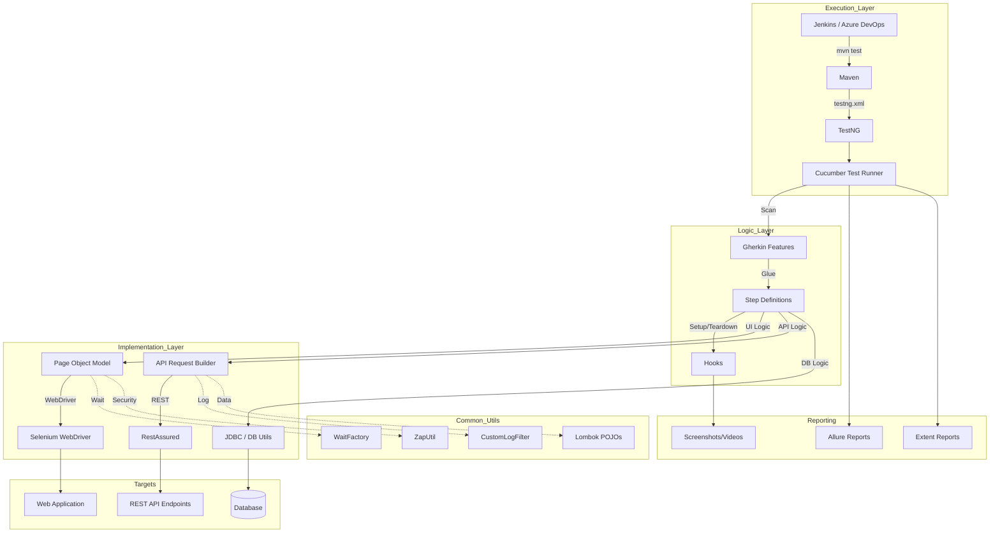
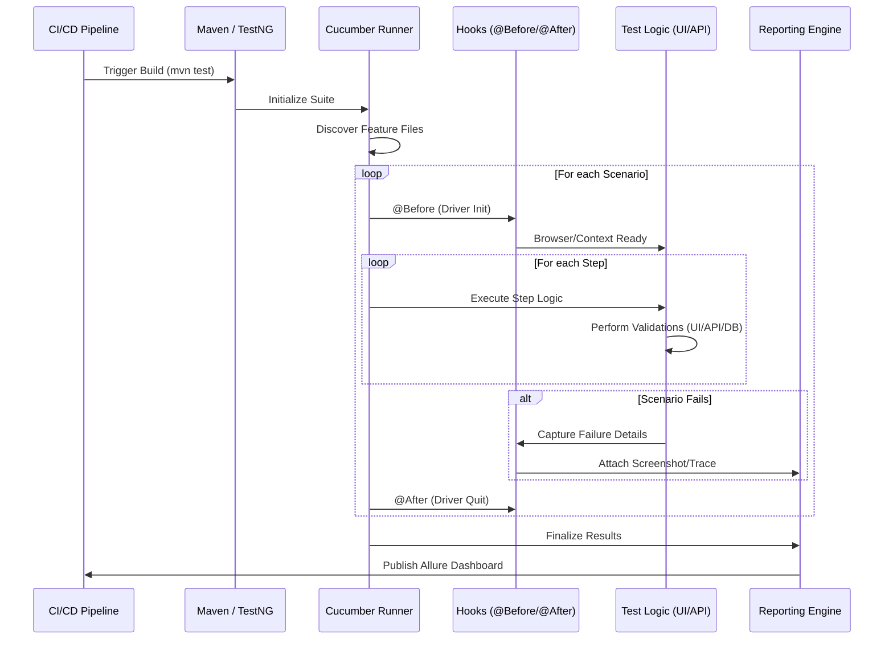

"My framework is a **Hybrid BDD Automation Suite** built on **Java 17**. The execution is typically triggered via **Maven** (CLI) or through our **CI/CD pipelines (Jenkins/Azure DevOps)**. 

The flow starts with **TestNG**, which acts as the core engine, reading the `testng.xml` suite file. TestNG initializes our **Annotation Transformer** to apply custom logic like the **Retry Analyzer** for flakiness. Since we use **Cucumber**, TestNG hands over control to the `TestRunner`, which scans the `features/` directory for Gherkin scenarios. 

For **UI tests**, we use **Selenium WebDriver** with a **ThreadLocal-based Driver Factory** to ensure thread safety during parallel execution. For **API tests**, we use **RestAssured** with custom Request Wrappers and Lombok-driven POJOs. Data is injected from global `config.properties`, JSON, or Excel. Throughout the run, **Log4j2** captures low-level logs, and **Allure** or **Extent Reports** aggregate results, screenshots, and traces into a final interactive dashboard."

---

## 2. 🏛️ High-Level Framework Architecture

---

## 3. 🔄 End-to-End Execution Flow (Sequence)

---

## 4. 📂 Folder-by-Folder Detailed Explanation

### a) Project Root Level
*   **`pom.xml`**: The cornerstone of the project. It manages 20+ enterprise dependencies including Selenium, RestAssured, Cucumber, TestNG, Lombok, and various validation libraries (AShot, Axe-core).
*   **`testng.xml`**: Defines the test suite, parallelization strategy (tests/methods), and global listeners (Allure, AnnotationTransformer).
*   **`Jenkinsfile` / `azure-pipeline.yml`**: Defines the CI/CD pipeline stages as code (Build -> Test -> Report).
*   **`Dockerfile` / `docker-compose.yml`**: Containerizes the framework and spins up a local **Selenium Grid** (Hub/Nodes) for consistent across-environment execution.

### b) `src/main/java`
*   **`base/`**: Contains `DriverFactory`. It manages the WebDriver lifecycle, supporting local execution, Selenium Grid, and Cloud providers like **BrowserStack**.
*   **`pages/`**: Implements the **Page Object Model (POM)**. Each class contains reusable locators and methods for specific web pages.
*   **`api/`**: Contains `RequestBuilder` (fluent wrappers for RestAssured) and `ResponseValidator` (assertions for status, time, and JSON schema). It also includes a `CustomLogFilter` for automatic API tracing.
*   **`models/`**: Uses **Lombok** (`@Data`, `@Builder`) to create POJO representations of API request/response bodies (e.g., `Booking.java`).
*   **`utils/`**: The 'Utility Engine'.
    *   `DBUtil`: JDBC support for MySQL/PostgreSQL.
    *   `WaitFactory`: Standardized synchronization (Explicit/Fluent waits).
    *   `RetryAnalyzer`: Logic to rerun failed tests.
    *   `VisualUtil` & `AccessibilityUtil`: Advanced validation for UI regressions and WCAG compliance.
    *   `ZapUtil`: Proxy configuration for **OWASP ZAP** security scanning.

### c) `src/test/java`
*   **`runners/`**: Contains `TestRunner.java`. This is the entry point for Cucumber, linking feature files to step definitions.
*   **`stepdefinitions/`**: The glue code. It translates Gherkin steps into Java logic, calling either Page Objects (for UI) or Request Builders (for API).
*   **`hooks/`**: Manages `@Before` and `@After` scenario logic, such as taking screenshots on failure and closing browsers.

### d) `src/test/resources`
*   **`features/`**: Business-readable Gherkin files (.feature).
*   **`schemas/`**: JSON Schema files for API contract testing.
*   **`testdata/`**: External data in JSON, Excel, or CSV formats.
*   **`config.properties`**: Global settings (URL, Browser, Timeouts, Credentials).

---

## 3. File-Level Execution Flow (Exact Sequence)

1.  **Trigger**: `mvn test` is executed.
2.  **Suite Init**: TestNG reads `testng.xml`.
3.  **Listener Load**: `AnnotationTransformer` is invoked to set the `RetryAnalyzer` for all tests.
4.  **Cucumber Start**: `TestRunner.java` starts and scans `features/`.
5.  **Hook Execution**: `@Before` hook in `Hooks.java` calls `DriverFactory.initDriver()`.
6.  **Browser Start**: `DriverFactory` checks `config.properties` and launches the appropriate browser (ThreadLocal).
7.  **Step Execution**: Cucumber executes the first step.
    *   If **UI**: Step definition calls a method in a **Page Object**.
    *   If **API**: Step definition calls `RequestBuilder` using a **Lombok Model**.
8.  **Internal Utils**: During execution, classes like `WaitFactory` (for sync) or `DBUtil` (for DB check) are called.
9.  **Logging**: `CustomLogFilter` (API) and `LoggerUtil` (General) capture every detail.
10. **Assertion**: `ResponseValidator` or TestNG `Assert` verifies the result.
11. **Scenario Teardown**: `@After` hook takes a screenshot if failed and calls `DriverFactory.quitDriver()`.
12. **Reporting**: Allure listener collects results into `target/allure-results`.

---

## 4. UI Automation Flow
*   **Pattern**: Spec -> Step Def -> Page Object (Locators) -> WebDriver Action -> Assertion.
*   **Logic**: We use the **WaitFactory** to ensure elements are ready before interaction, preventing flakiness.

---

## 5. API Automation Flow
*   **Pattern**: Spec -> Step Def -> Lombok Model (Request) -> RequestBuilder -> RestAssured -> Response -> ResponseValidator (Schema/Status).
*   **Observability**: Every API call is automatically logged via our `CustomLogFilter`.

---

## 6. Data Driven Testing Flow
*   **Static**: Using Cucumber `Examples` tables for simple scenarios.
*   **External**: `ExcelReader` or `JsonReader` utils parse complex data into `Object[][]` or `List<Map>` for consumption by Step Definitions.
*   **Dynamic**: **FakerUtil** generates random, unique data (names, emails) at runtime to avoid data collisions.

---

## 7. Parallel Execution Flow
*   **TestNG Level**: Configured in `testng.xml` via `parallel="tests"` or `parallel="methods"`.
*   **Thread Safety**: Handled by **ThreadLocal<WebDriver>** in `DriverFactory`, ensuring each thread has its own isolated browser instance.

---

## 8. CI/CD & Docker Flow
*   **Pipeline**: Jenkins pulls from Git -> Runs `mvn clean test` inside a **Docker** container.
*   **Docker Compose**: Spins up an environment containing a Selenium Hub and browser nodes, ensuring the tests run in a clean, isolated Linux container.

---

## 9. Report Generation Flow
1.  **results**: Data generated in `target/allure-results`.
2.  **Screenshots**: Failed UI tests automatically attach screenshots to the report via Hooks.
3.  **Command**: `mvn allure:serve` converts results into a rich, interactive HTML report.

---

## 10. Complete End-to-End Example (Booking Scenario)
1.  **Feature**: `Scenario: Create a booking via API and verify in Database`.
2.  **Step 1**: Step Def uses `Booking.builder()` to create a payload and calls `RequestBuilder.postRequest()`.
3.  **Step 2**: `ResponseValidator.validateStatusCode(200)`.
4.  **Step 3**: `DBUtil.establishConnection()` -> Executes `SELECT * FROM bookings` -> `Assert.assertEquals(dbResult, expected)`.
5.  **Report**: Allure shows the API request/response logs and the final database validation step as passed.
